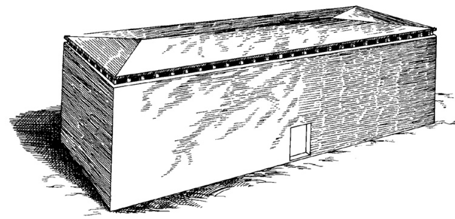

# Human-made Things in the Bible

## License Information

Human-made Things in the Bible © United Bible Societies, 2025. Adapted from: <cite>The Works of Their Hands: Man-made Things in the Bible</cite>, by Ray Pritz © 2009 United Bible Societies. This work is licensed under Creative Commons Attribution-ShareAlike 4.0 International (<a href="https://creativecommons.org/licenses/by-sa/4.0/">https://creativecommons.org/licenses/by-sa/4.0/</a>).

--------------------------------

## 标题：方舟、大船（ark, ship） (id: REALIA:8.1.3)

8\.1\.3 标题：方舟、大船（ark, ship）
===========================

经文出处
----

Hebrew 来：תֵּבָה (音译：tevah)

[GEN 6:14](https://ref.ly/Gen6:14), [GEN 6:14](https://ref.ly/Gen6:14), [GEN 6:15](https://ref.ly/Gen6:15), [GEN 6:16](https://ref.ly/Gen6:16), [GEN 6:16](https://ref.ly/Gen6:16), [GEN 6:18](https://ref.ly/Gen6:18), [GEN 6:19](https://ref.ly/Gen6:19), [GEN 7:1](https://ref.ly/Gen7:1), [GEN 7:7](https://ref.ly/Gen7:7), [GEN 7:9](https://ref.ly/Gen7:9), [GEN 7:13](https://ref.ly/Gen7:13), [GEN 7:15](https://ref.ly/Gen7:15), [GEN 7:17](https://ref.ly/Gen7:17), [GEN 7:18](https://ref.ly/Gen7:18), [GEN 7:23](https://ref.ly/Gen7:23), [GEN 8:1](https://ref.ly/Gen8:1), [GEN 8:4](https://ref.ly/Gen8:4), [GEN 8:6](https://ref.ly/Gen8:6), [GEN 8:9](https://ref.ly/Gen8:9), [GEN 8:9](https://ref.ly/Gen8:9), [GEN 8:10](https://ref.ly/Gen8:10), [GEN 8:13](https://ref.ly/Gen8:13), [GEN 8:16](https://ref.ly/Gen8:16), [GEN 8:19](https://ref.ly/Gen8:19), [GEN 9:10](https://ref.ly/Gen9:10), [GEN 9:18](https://ref.ly/Gen9:18)

Greek 希：κιβωτός (音译：kibōtos)

[MAT 24:38](https://ref.ly/Matt24:38), [LUK 17:27](https://ref.ly/Luke17:27), [HEB 11:7](https://ref.ly/Heb11:7), [1PE 3:20](https://ref.ly/1Pet3:20), [4MA 15:31](https://ref.ly/4Macc15:31)

描述
--

*艺术家笔下的挪亚方舟 (Don Ellens, The Tabernacle of Israel, Harris, Jones 1888, Public domain)*

方舟是挪亚建造的一艘大船。[GEN 6:14](https://ref.ly/Gen6:14); [GEN 6:15](https://ref.ly/Gen6:15); [GEN 6:16](https://ref.ly/Gen6:16) 描述了方舟的尺寸和材料：长135—150米（443—492英尺），宽22\.5—25米（74—82英尺），高13\.5—15米（44—49英尺）；方舟为木制，有三层甲板和一个顶。每层甲板都被分成许多房间或隔间。除了侧面有一扇门和一扇窗（大小不详）之外，方舟四围都是封闭的，看起来像是一个大木箱。

---

翻译
--

希伯来文*tevah* 和希腊文*kibōtos* 的主要意思是“盒子”或“胸膛”。显然，这两个词用来指称挪亚方舟，是因为方舟的构造为方形，并且更像是驳船而不是海船。然而，在大多数语言中，考虑到挪亚方舟的大小，将其称为“船”可能是最合适的。

翻译[GEN 6:15](https://ref.ly/Gen6:15); [GEN 6:16](https://ref.ly/Gen6:16) 中给出的挪亚方舟的尺寸时，最好使用读者能够理解的现代度量单位。GNT (Good News Translation (1992)) 的美国版使用了英尺和英寸，而其他现代语言译本（如SPCL (Spanish Common Language Version (Dios Habla Hoy)) 、FRCL (French Common Language Version (Bible en français courant)) ）则使用了公制单位。虽然[GEN 6:0](https://ref.ly/Gen6:0) 所用希伯来单位的确切长度不确定，但方舟的尺寸表明，它显然是20世纪初期之前人类所建造的最大的船。在可能的情况下，译本应反映出这是一艘非常大的船舶。例如，在英文中，“ship”（“大船”）就比“boat”（“小船”）更加合适。

* **Associated Passages:** 创世记 6:14; 创世记 6:15; 创世记 6:16; 创世记 6:18; 创世记 6:19; 创世记 7:1; 创世记 7:7; 创世记 7:9; 创世记 7:13; 创世记 7:15; 创世记 7:17; 创世记 7:18; 创世记 7:23; 创世记 8:1; 创世记 8:4; 创世记 8:6; 创世记 8:9; 创世记 8:10; 创世记 8:13; 创世记 8:16; 创世记 8:19; 创世记 9:10; 创世记 9:18; 马太福音 24:38; 路加福音 17:27; 希伯来书 11:7; 彼得前书 3:20; 玛加伯四书 15:31; 创世记 6:0

