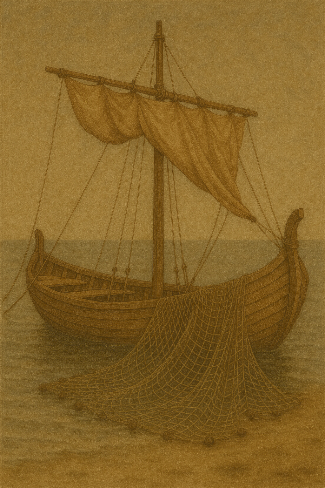

# Human-made Things in the Bible

## License Information

Human-made Things in the Bible © United Bible Societies, 2025. Adapted from: <cite>The Works of Their Hands: Man-made Things in the Bible</cite>, by Ray Pritz © 2009 United Bible Societies. This work is licensed under Creative Commons Attribution-ShareAlike 4.0 International (<a href="https://creativecommons.org/licenses/by-sa/4.0/">https://creativecommons.org/licenses/by-sa/4.0/</a>).

--------------------------------

## 标题：帆（sail） (id: REALIA:8.1.5)

8\.1\.5 标题：帆（sail）
==================

经文出处
----

Hebrew 来：נֵס (音译：nes)

[ISA 33:23](https://ref.ly/Isa33:23)

Hebrew 来：מִפְרָשׂ (音译：mifras)

[EZK 27:7](https://ref.ly/Ezek27:7)

Greek 希：ἀρτέμων (音译：artemōn)

[ACT 27:40](https://ref.ly/Acts27:40)

描述和用途
-----

帆是系在船只上方的一块布，用来兜住风，从而使船在水中行进。

---

翻译
--

在有些语言中，帆可以译为“使船移动的一块布”或“船上用来兜住风的布”。在[ACT 27:40](https://ref.ly/Acts27:40) 中，希腊文*artemōn* 可能指前帆，即一块相对较小、靠近船头的帆。

* **Associated Passages:** 以赛亚书 33:23; 以西结书 27:7; 使徒行传 27:40

* **Associated ACAI Concepts:** Sail (ID: `realia:Sail`)
