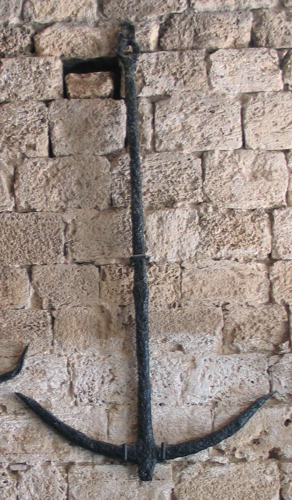
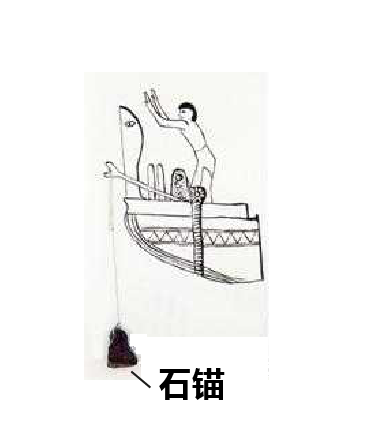

# Human-made Things in the Bible

## License Information

Human-made Things in the Bible © United Bible Societies, 2025. Adapted from: <cite>The Works of Their Hands: Man-made Things in the Bible</cite>, by Ray Pritz © 2009 United Bible Societies. This work is licensed under Creative Commons Attribution-ShareAlike 4.0 International (<a href="https://creativecommons.org/licenses/by-sa/4.0/">https://creativecommons.org/licenses/by-sa/4.0/</a>).

--------------------------------

## 标题：锚（anchor） (id: REALIA:8.1.6)

8\.1\.6 标题：锚（anchor）
====================

经文出处
----

Greek 希：ἄγκυρα (音译：agkura)

[ACT 27:29](https://ref.ly/Acts27:29), [ACT 27:30](https://ref.ly/Acts27:30), [ACT 27:40](https://ref.ly/Acts27:40), [HEB 6:19](https://ref.ly/Heb6:19)

描述和用途
-----

*铁锚 (© Bukvoed, CC BY 3\.0, via Wikimedia Commons)*

锚是一个沉重的物件，用绳子或链条与船连接在一起，并沉入水底以防止或限制船只移动。古代的锚通常是用石头做的，有时是用金属做的。

---

翻译
--

*石锚 (© Ray Pritz by United Bible Societies)*

对于住在离海岸很远的人来说，他们的语言中可能很难找到、甚至很难构想出一个表示“锚”的表达方式。在有些语言中，“锚”被译为“系在绳子上的重物，用来防止船移动”，甚或是“把船固定在一个地方的重物”。然而，如果目标读者对锚毫无所知，那就有必要用旁注来说明锚具体是什么，然后在经文中使用较简略的表达方式来翻译该词。

*有绳孔的石锚 (© Deror avi, CC BY\-SA 3\.0, via Wikimedia Commons)*

关于[HEB 6:19](https://ref.ly/Heb6:19) 中“锚”的比喻用法，参《〈希伯来书〉手册》（*A Handbook on The Letter to the Hebrews* ，第130—131页）中的详细注解。

* **Associated Passages:** 使徒行传 27:29; 使徒行传 27:30; 使徒行传 27:40; 希伯来书 6:19

