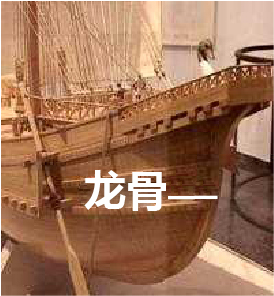

# Human-made Things in the Bible

## License Information

Human-made Things in the Bible © United Bible Societies, 2025. Adapted from: <cite>The Works of Their Hands: Man-made Things in the Bible</cite>, by Ray Pritz © 2009 United Bible Societies. This work is licensed under Creative Commons Attribution-ShareAlike 4.0 International (<a href="https://creativecommons.org/licenses/by-sa/4.0/">https://creativecommons.org/licenses/by-sa/4.0/</a>).

--------------------------------

## 标题：小船、大船（boat, ship） (id: REALIA:8.1)

8\.1 标题：小船、大船（boat, ship）
=========================

经文出处
----

Hebrew 来：אֳנִי (音译：’oni)

[1KI 9:26](https://ref.ly/1Kgs9:26), [1KI 9:27](https://ref.ly/1Kgs9:27), [1KI 10:11](https://ref.ly/1Kgs10:11), [1KI 10:22](https://ref.ly/1Kgs10:22), [1KI 10:22](https://ref.ly/1Kgs10:22), [1KI 10:22](https://ref.ly/1Kgs10:22), [ISA 33:21](https://ref.ly/Isa33:21)

Hebrew 来：אֳנִיָּה (音译：’oniyah)

[GEN 49:13](https://ref.ly/Gen49:13), [DEU 28:68](https://ref.ly/Deut28:68), [JDG 5:17](https://ref.ly/Judg5:17), [1KI 9:27](https://ref.ly/1Kgs9:27), [1KI 22:49](https://ref.ly/1Kgs22:49), [1KI 22:49](https://ref.ly/1Kgs22:49), [1KI 22:50](https://ref.ly/1Kgs22:50), [2CH 8:18](https://ref.ly/2Chr8:18), [2CH 8:18](https://ref.ly/2Chr8:18), [2CH 9:21](https://ref.ly/2Chr9:21), [2CH 9:21](https://ref.ly/2Chr9:21), [2CH 20:36](https://ref.ly/2Chr20:36), [2CH 20:36](https://ref.ly/2Chr20:36), [2CH 20:37](https://ref.ly/2Chr20:37), [JOB 9:26](https://ref.ly/Job9:26), [PSA 48:8](https://ref.ly/Ps48:8), [PSA 104:26](https://ref.ly/Ps104:26), [PSA 107:23](https://ref.ly/Ps107:23), [PRO 30:19](https://ref.ly/Prov30:19), [PRO 31:14](https://ref.ly/Prov31:14), [ISA 2:16](https://ref.ly/Isa2:16), [ISA 23:1](https://ref.ly/Isa23:1), [ISA 23:14](https://ref.ly/Isa23:14), [ISA 60:9](https://ref.ly/Isa60:9), [EZK 27:9](https://ref.ly/Ezek27:9), [EZK 27:25](https://ref.ly/Ezek27:25), [EZK 27:29](https://ref.ly/Ezek27:29), [DAN 11:40](https://ref.ly/Dan11:40), [JON 1:3](https://ref.ly/Jonah1:3), [JON 1:4](https://ref.ly/Jonah1:4), [JON 1:5](https://ref.ly/Jonah1:5)

Hebrew 来：כְּלִי, גֹּמֶא (音译：kle gome’)

[ISA 18:2](https://ref.ly/Isa18:2)

Hebrew 来：סְפִינָה (音译：sfinah)

[JON 1:5](https://ref.ly/Jonah1:5)

Hebrew 来：צִי (音译：tsi)

[NUM 24:24](https://ref.ly/Num24:24), [ISA 33:21](https://ref.ly/Isa33:21), [EZK 30:9](https://ref.ly/Ezek30:9), [DAN 11:30](https://ref.ly/Dan11:30)

Greek 希：ναυαγέω (音译：nauageō（动词）)

[2CO 11:25](https://ref.ly/2Cor11:25), [1TI 1:19](https://ref.ly/1Tim1:19)

Greek 希：ναύκληρος (音译：nauklēros)

[ACT 27:11](https://ref.ly/Acts27:11)

Greek 希：ναῦς (音译：naus)

[ACT 27:41](https://ref.ly/Acts27:41), [WIS 5:10](https://ref.ly/Wis5:10), [4MA 7:1](https://ref.ly/4Macc7:1)

Greek 希：πλοιάριον (音译：ploiarion)

[MRK 3:9](https://ref.ly/Mark3:9), [JHN 6:22](https://ref.ly/John6:22), [JHN 6:23](https://ref.ly/John6:23), [JHN 6:24](https://ref.ly/John6:24), [JHN 21:8](https://ref.ly/John21:8)

Greek 希：πλοῖον (音译：ploion)

[MAT 4:21](https://ref.ly/Matt4:21), [MAT 4:22](https://ref.ly/Matt4:22), [MAT 8:23](https://ref.ly/Matt8:23), [MAT 8:24](https://ref.ly/Matt8:24), [MAT 9:1](https://ref.ly/Matt9:1), [MAT 13:2](https://ref.ly/Matt13:2), [MAT 14:13](https://ref.ly/Matt14:13), [MAT 14:22](https://ref.ly/Matt14:22), [MAT 14:24](https://ref.ly/Matt14:24), [MAT 14:29](https://ref.ly/Matt14:29), [MAT 14:32](https://ref.ly/Matt14:32), [MAT 14:33](https://ref.ly/Matt14:33), [MAT 15:39](https://ref.ly/Matt15:39), [MRK 1:19](https://ref.ly/Mark1:19), [MRK 1:20](https://ref.ly/Mark1:20), [MRK 4:1](https://ref.ly/Mark4:1), [MRK 4:36](https://ref.ly/Mark4:36), [MRK 4:36](https://ref.ly/Mark4:36), [MRK 4:37](https://ref.ly/Mark4:37), [MRK 4:37](https://ref.ly/Mark4:37), [MRK 5:2](https://ref.ly/Mark5:2), [MRK 5:18](https://ref.ly/Mark5:18), [MRK 5:21](https://ref.ly/Mark5:21), [MRK 6:32](https://ref.ly/Mark6:32), [MRK 6:45](https://ref.ly/Mark6:45), [MRK 6:47](https://ref.ly/Mark6:47), [MRK 6:51](https://ref.ly/Mark6:51), [MRK 6:54](https://ref.ly/Mark6:54), [MRK 8:10](https://ref.ly/Mark8:10), [MRK 8:14](https://ref.ly/Mark8:14), [LUK 5:2](https://ref.ly/Luke5:2), [LUK 5:3](https://ref.ly/Luke5:3), [LUK 5:3](https://ref.ly/Luke5:3), [LUK 5:7](https://ref.ly/Luke5:7), [LUK 5:7](https://ref.ly/Luke5:7), [LUK 5:11](https://ref.ly/Luke5:11), [LUK 8:22](https://ref.ly/Luke8:22), [LUK 8:37](https://ref.ly/Luke8:37), [JHN 6:17](https://ref.ly/John6:17), [JHN 6:19](https://ref.ly/John6:19), [JHN 6:21](https://ref.ly/John6:21), [JHN 6:21](https://ref.ly/John6:21), [JHN 6:22](https://ref.ly/John6:22), [JHN 6:23](https://ref.ly/John6:23), [JHN 21:3](https://ref.ly/John21:3), [JHN 21:6](https://ref.ly/John21:6), [ACT 20:13](https://ref.ly/Acts20:13), [ACT 20:38](https://ref.ly/Acts20:38), [ACT 21:2](https://ref.ly/Acts21:2), [ACT 21:3](https://ref.ly/Acts21:3), [ACT 21:6](https://ref.ly/Acts21:6), [ACT 27:2](https://ref.ly/Acts27:2), [ACT 27:6](https://ref.ly/Acts27:6), [ACT 27:10](https://ref.ly/Acts27:10), [ACT 27:15](https://ref.ly/Acts27:15), [ACT 27:17](https://ref.ly/Acts27:17), [ACT 27:19](https://ref.ly/Acts27:19), [ACT 27:22](https://ref.ly/Acts27:22), [ACT 27:30](https://ref.ly/Acts27:30), [ACT 27:31](https://ref.ly/Acts27:31), [ACT 27:37](https://ref.ly/Acts27:37), [ACT 27:38](https://ref.ly/Acts27:38), [ACT 27:39](https://ref.ly/Acts27:39), [ACT 27:44](https://ref.ly/Acts27:44), [ACT 28:11](https://ref.ly/Acts28:11), [JAS 3:4](https://ref.ly/Jas3:4), [REV 8:9](https://ref.ly/Rev8:9), [REV 18:19](https://ref.ly/Rev18:19), [WIS 14:1](https://ref.ly/Wis14:1), [SIR 33:2](https://ref.ly/Sir33:2), [1MA 8:26](https://ref.ly/1Macc8:26), [1MA 8:28](https://ref.ly/1Macc8:28), [1MA 11:1](https://ref.ly/1Macc11:1), [1MA 13:29](https://ref.ly/1Macc13:29), [1MA 15:3](https://ref.ly/1Macc15:3), [1MA 15:14](https://ref.ly/1Macc15:14), [1MA 15:37](https://ref.ly/1Macc15:37), [3MA 4:7](https://ref.ly/3Macc4:7), [3MA 4:9](https://ref.ly/3Macc4:9)

Greek 希：σκάφη, σκάφος (音译：skafē)

[ACT 27:16](https://ref.ly/Acts27:16), [ACT 27:30](https://ref.ly/Acts27:30), [ACT 27:32](https://ref.ly/Acts27:32), [BEL 1:33](https://ref.ly/Bel1:33), [2MA 12:3](https://ref.ly/2Macc12:3), [2MA 12:6](https://ref.ly/2Macc12:6)

Greek 希：στόλος (音译：stolos)

[1MA 1:17](https://ref.ly/1Macc1:17), [2MA 12:9](https://ref.ly/2Macc12:9), [2MA 14:1](https://ref.ly/2Macc14:1), [3MA 7:17](https://ref.ly/3Macc7:17)

Greek 希：τριήρης (音译：triērēs)

[2MA 4:20](https://ref.ly/2Macc4:20)

Latin 拉：navis

[2ES 9:34](https://ref.ly/2Esd9:34), [2ES 12:42](https://ref.ly/2Esd12:42)

描述和用途
-----

*帆船 (© Free Bible Images © David Padfield)*

船是用于水上航行和运输的工具，大小不一，小至仅容得下三四个人的小船，大到能运载很多人和大量货物的远洋船舶。船只通常是木制的，不过，埃及人也用芦苇来做小船的一些零部件。船的推进方式有几种：在桅杆上挂上风帆，借助风力推动船只；较小的船只（也有一些较大的船只）使用船桨划动；在水浅的地方，可以用一根长杆推动船沿着河床或河岸移动。

---

翻译
--

*渔夫在卷起了帆的船上 (© Free Bible Images © David Padfield)*

有些时候，翻译者必须清楚区分小型渔船和大型船只。在许多文化中，人们根据有没有甲板来区分小船和大船（参[8\.1\.11 甲板、舱板 (deck)\<REALIA:8\.1\.11\>](#) ）。加利利海上的渔船可能没有甲板，然而地中海上的远航船只肯定有甲板。

翻译者要避免使用指现代远洋蒸汽动力船舶的词语；圣经中提到的所有较大的船只都是由帆或桨提供动力的；方舟除外，方舟没有推进系统。在只知道小型渔船的内陆文明中，需要将“大船”译为“在海上航行的大船”或“在海上靠帆推进的大船”。

[JOB 9:26](https://ref.ly/Job9:26) ：“蒲草船”（“Skiffs of reed”；RSV (Revised Standard Version (1952)) ）或纸莎草船是尼罗河上的船只，船舷是用纸莎草做成的，以速度快而闻名。这节经文的第一行可以译为：“我的日子过得飞快，如快速行驶的帆船。”在帆船不为人知的地区，可以使用任何航行快速的水上交通工具来进行比较；例如，“我的日子过得飞快，如同一条飞快的独木舟。”而在根本不知道船的地方，可能需要放弃船的比喻，译为“我的生命很快就结束了”，或“我生命的日子很快就结束了。”

*希腊多桨战船 (© Deutsches Museum, Munich, Germany, via Wikimedia Commons)*

[ISA 18:2](https://ref.ly/Isa18:2) ：希伯来文短语*kle gome’* 很罕见，在这里的意思是“纸莎草船”（“vessels of papyrus”；RSV (Revised Standard Version (1952)) ）或“纸莎草芦苇做成的小船”，相当于[JOB 9:26](https://ref.ly/Job9:26) 中的希伯来文短语*’oniyoth ’eveh* 。CEV (Contemporary English Version) 提供了一个脚注，“在古埃及，生长在尼罗河三角洲的纸莎草芦苇非常有名”；但是，它的译法“ships made of reeds”（“芦苇做成的大船”）会让读者觉得这是一艘很大的船。GNT (Good News Translation (1992)) 和NCV (New Century Version) 的译法“boats made of reeds”（“芦苇做成的小船”）更好；比较NJB (New Jerusalem Bible (1985)) 的“little reed\-boats”（“小芦苇船”）。

在[JON 1:5](https://ref.ly/Jonah1:5) 中，希伯来文*sfinah* 指一艘有篷和甲板的船，相当于*’oniyah* 。那么，约拿是在哪里睡觉呢？若说是在“船舱”（GNT (Good News Translation (1992)) 直译）里面，那么有可能把这艘船的构造描述的比实际情况更加复杂；该希伯来文在这里是指任何凹处或角落，就好像在洞穴（[1SA 24:4](https://ref.ly/1Sam24:4) ［《和》24:3］）或房屋（[AMO 6:10](https://ref.ly/Amos6:10) ）里面似的。约拿只是在找一个最偏僻、最舒服的地方安静地睡觉，这样他就不会被打扰。建议译作“甲板下面”（如CEV (Contemporary English Version) ），或“船底”（如FRCL (French Common Language Version (Bible en français courant)) ）。

在福音书中，希腊文*ploion* 和*ploiarion* 并没有真正的区别，虽然*ploiarion* 可以指“较小的”*ploion* 。这两个词都是指一种渔船，长约8\.5米（28英尺），宽约2\.5米（8英尺），可容纳12至15人。在《使徒行传》、[JAS 3:4](https://ref.ly/Jas3:4) 和[REV 18:17](https://ref.ly/Rev18:17); [REV 18:19](https://ref.ly/Rev18:19) 中，*ploion* 指的是一种较大、能够在广阔的大海上航行的船舶。这个词在[REV 18:17](https://ref.ly/Rev18:17); [REV 18:19](https://ref.ly/Rev18:19) 也是指这种大船，在[REV 8:9](https://ref.ly/Rev8:9) 中可能指多种不同大小的船只。

[ACT 27:16](https://ref.ly/Acts27:16); [ACT 27:30](https://ref.ly/Acts27:30); [ACT 27:32](https://ref.ly/Acts27:32) ：在这些经文中，希腊文*skafē* 指的是一种小船，通常放在一艘比较大的船只上面，供水手下锚、修理船只时使用，或者在遇到风暴时用来逃生。在一些语言中，*skafē* 相当于“划艇”或“救生船”。

在上面列出的一些经文中（如[2MA 4:20](https://ref.ly/2Macc4:20) ），该词指的是“战船”，上下文通常会表明这一点。如果目标语言有专门用词表示为战争而建造的船只，翻译者可以使用这些专门用词。但是翻译者需要注意，不要使用与时代不符、表示现代特种战舰的词语，如巡洋舰、战列舰、航空母舰等。

希伯来文*’oni* 和*tsi* 、希腊文*stolos* 指的是一大队船舶，即“船队”。

* **Associated Passages:** 列王纪上 9:26; 列王纪上 9:27; 列王纪上 10:11; 列王纪上 10:22; 以赛亚书 33:21; 创世记 49:13; 申命记 28:68; 士师记 5:17; 列王纪上 22:49; 列王纪上 22:50; 历代志下 8:18; 历代志下 9:21; 历代志下 20:36; 历代志下 20:37; 约伯记 9:26; 诗篇 48:8; 诗篇 104:26; 诗篇 107:23; 箴言 30:19; 箴言 31:14; 以赛亚书 2:16; 以赛亚书 23:1; 以赛亚书 23:14; 以赛亚书 60:9; 以西结书 27:9; 以西结书 27:25; 以西结书 27:29; 但以理书 11:40; 约拿书 1:3; 约拿书 1:4; 约拿书 1:5; 以赛亚书 18:2; 民数记 24:24; 以西结书 30:9; 但以理书 11:30; 哥林多后书 11:25; 提摩太前书 1:19; 使徒行传 27:11; 使徒行传 27:41; 智慧篇 5:10; 玛加伯四书 7:1; 马可福音 3:9; 约翰福音 6:22; 约翰福音 6:23; 约翰福音 6:24; 约翰福音 21:8; 马太福音 4:21; 马太福音 4:22; 马太福音 8:23; 马太福音 8:24; 马太福音 9:1; 马太福音 13:2; 马太福音 14:13; 马太福音 14:22; 马太福音 14:24; 马太福音 14:29; 马太福音 14:32; 马太福音 14:33; 马太福音 15:39; 马可福音 1:19; 马可福音 1:20; 马可福音 4:1; 马可福音 4:36; 马可福音 4:37; 马可福音 5:2; 马可福音 5:18; 马可福音 5:21; 马可福音 6:32; 马可福音 6:45; 马可福音 6:47; 马可福音 6:51; 马可福音 6:54; 马可福音 8:10; 马可福音 8:14; 路加福音 5:2; 路加福音 5:3; 路加福音 5:7; 路加福音 5:11; 路加福音 8:22; 路加福音 8:37; 约翰福音 6:17; 约翰福音 6:19; 约翰福音 6:21; 约翰福音 21:3; 约翰福音 21:6; 使徒行传 20:13; 使徒行传 20:38; 使徒行传 21:2; 使徒行传 21:3; 使徒行传 21:6; 使徒行传 27:2; 使徒行传 27:6; 使徒行传 27:10; 使徒行传 27:15; 使徒行传 27:17; 使徒行传 27:19; 使徒行传 27:22; 使徒行传 27:30; 使徒行传 27:31; 使徒行传 27:37; 使徒行传 27:38; 使徒行传 27:39; 使徒行传 27:44; 使徒行传 28:11; 雅各书 3:4; 启示录 8:9; 启示录 18:19; 智慧篇 14:1; 德训篇 33:2; 玛加伯上 8:26; 玛加伯上 8:28; 玛加伯上 11:1; 玛加伯上 13:29; 玛加伯上 15:3; 玛加伯上 15:14; 玛加伯上 15:37; 玛加伯三书 4:7; 玛加伯三书 4:9; 使徒行传 27:16; 使徒行传 27:32; 彼勒与大龙 1:33; 玛加伯下 12:3; 玛加伯下 12:6; 玛加伯上 1:17; 玛加伯下 12:9; 玛加伯下 14:1; 玛加伯三书 7:17; 玛加伯下 4:20; 厄斯德拉下 9:34; 厄斯德拉下 12:42; 撒母耳记上 24:4; 阿摩司书 6:10; 启示录 18:17

* **Associated ACAI Concepts:** Ship (ID: `realia:Ship`)

## 标题：箱、小舟（basket, small boat） (id: REALIA:8.1.1)

8\.1\.1 标题：箱、小舟（basket, small boat）
===================================

经文出处
----

Hebrew 来：תֵּבָה (音译：tevah)

[EXO 2:3](https://ref.ly/Exod2:3), [EXO 2:5](https://ref.ly/Exod2:5)

描述
--

*芦苇篮 (Don Ellens, The Tabernacle of Israel, Harris, Jones 1888, Public domain)*

[EXO 2:3](https://ref.ly/Exod2:3) 提到的篮子是用蒲草做的小舟。经文没有给出确切大小，但应该足以容纳一个新生的婴儿。篮子用焦油（柏油）和树脂做了防水处理，应该是抹在篮子的外面。

---

翻译
--

较早的一些英文译本将[EXO 2:3](https://ref.ly/Exod2:3); [EXO 2:5](https://ref.ly/Exod2:5) 中的希伯来文*tevah* 译为“ark”（KJV (King James Version (1611)) ，与“方舟”同），容易使读者感到迷惑。虽然经文用这个希伯来文词语（字面意为“箱子”）同时指这个小船和挪亚的大船（参[8\.1\.3 方舟、大船 (ark, ship)\<REALIA:8\.1\.3\>](#) ），但翻译者不应该用同一个词来表示这两者。

* **Associated Passages:** 出埃及记 2:3; 出埃及记 2:5

* **Associated ACAI Concepts:** Ship (ID: `realia:Ship`); Cattails (ID: `flora:Cattails`)

## 标题：筏子（raft, float） (id: REALIA:8.1.2)

8\.1\.2 标题：筏子（raft, float）
==========================

经文出处
----

Hebrew 来：דֹּבְרוֹת (音译：dovroth)

[1KI 5:23](https://ref.ly/1Kgs5:23)

Greek 希：σχεδία (音译：schedia)

[WIS 14:5](https://ref.ly/Wis14:5), [WIS 14:6](https://ref.ly/Wis14:6), [1ES 5:53](https://ref.ly/1Esd5:53)

描述和用途
-----

*一名男子在兽皮制成的充气木筏上捕鱼 (Austen Henry Layard, Nineveh and Babylon: a narrative of a second expedition to Assyria during the years 1849, 1850, and 1851, Public domain, via archive.org)*

筏子是一种漂浮在水上的交通工具，将原木或木板并排绑在一起制成，也可以用充气的动物皮来制作，如下面的插图所示。筏子可以用来运输人或货物。

---

翻译
--

虽然许多语言都有专门词语表示绑在一起做成筏子的原木，但翻译者应该避免使用专用术语。[1KI 5:23](https://ref.ly/1Kgs5:23) （《和》5:9）的中间部分可译为：“他们把原木扎在一起，让它们沿着海岸漂流”（CEV (Contemporary English Version) 直译）。这里和[1ES 5:53](https://ref.ly/1Esd5:53) 提到的筏子都不是运输工具，而是把原木从一个地方运送到另一个地方的方法。

在[WIS 14:5](https://ref.ly/Wis14:5); [WIS 14:6](https://ref.ly/Wis14:6) 中，希腊文*schedia* 一词有两种含义。第5节讲的是，人只需要一小块漂浮的木头，就能在大海上航行。第6节是回忆挪亚和他的家人（以及从他们而来的全人类）藉以得救的方舟。有些译本在两节经文中都使用了“筏子”（RSV (Revised Standard Version (1952)) 、NAB (New American Bible (1970)) 、NJB (New Jerusalem Bible (1985)) 直译）一词，因此对方舟的提指就比较模糊。NJB (New Jerusalem Bible (1985)) 在第6节添加了一个脚注，表明该处是指挪亚方舟。GNT (Good News Translation (1992)) 的译法更好一点，在两节经文中都采用了“boat”（“船”）。GNT (Good News Translation (1992)) 在[WIS 14:1–WIS 14:11](https://ref.ly/Wis14:1-Wis14:11) 的段落标题是“比较木头偶像与挪亚木船”，这就表明整段经文都与挪亚方舟有关。

* **Associated Passages:** 列王纪上 5:23; 智慧篇 14:5; 智慧篇 14:6; 厄斯德拉上 5:53; 智慧篇 14:1; 智慧篇 14:11

## 标题：方舟、大船（ark, ship） (id: REALIA:8.1.3)

8\.1\.3 标题：方舟、大船（ark, ship）
===========================

经文出处
----

Hebrew 来：תֵּבָה (音译：tevah)

[GEN 6:14](https://ref.ly/Gen6:14), [GEN 6:14](https://ref.ly/Gen6:14), [GEN 6:15](https://ref.ly/Gen6:15), [GEN 6:16](https://ref.ly/Gen6:16), [GEN 6:16](https://ref.ly/Gen6:16), [GEN 6:18](https://ref.ly/Gen6:18), [GEN 6:19](https://ref.ly/Gen6:19), [GEN 7:1](https://ref.ly/Gen7:1), [GEN 7:7](https://ref.ly/Gen7:7), [GEN 7:9](https://ref.ly/Gen7:9), [GEN 7:13](https://ref.ly/Gen7:13), [GEN 7:15](https://ref.ly/Gen7:15), [GEN 7:17](https://ref.ly/Gen7:17), [GEN 7:18](https://ref.ly/Gen7:18), [GEN 7:23](https://ref.ly/Gen7:23), [GEN 8:1](https://ref.ly/Gen8:1), [GEN 8:4](https://ref.ly/Gen8:4), [GEN 8:6](https://ref.ly/Gen8:6), [GEN 8:9](https://ref.ly/Gen8:9), [GEN 8:9](https://ref.ly/Gen8:9), [GEN 8:10](https://ref.ly/Gen8:10), [GEN 8:13](https://ref.ly/Gen8:13), [GEN 8:16](https://ref.ly/Gen8:16), [GEN 8:19](https://ref.ly/Gen8:19), [GEN 9:10](https://ref.ly/Gen9:10), [GEN 9:18](https://ref.ly/Gen9:18)

Greek 希：κιβωτός (音译：kibōtos)

[MAT 24:38](https://ref.ly/Matt24:38), [LUK 17:27](https://ref.ly/Luke17:27), [HEB 11:7](https://ref.ly/Heb11:7), [1PE 3:20](https://ref.ly/1Pet3:20), [4MA 15:31](https://ref.ly/4Macc15:31)

描述
--

*艺术家笔下的挪亚方舟 (Don Ellens, The Tabernacle of Israel, Harris, Jones 1888, Public domain)*

方舟是挪亚建造的一艘大船。[GEN 6:14](https://ref.ly/Gen6:14); [GEN 6:15](https://ref.ly/Gen6:15); [GEN 6:16](https://ref.ly/Gen6:16) 描述了方舟的尺寸和材料：长135—150米（443—492英尺），宽22\.5—25米（74—82英尺），高13\.5—15米（44—49英尺）；方舟为木制，有三层甲板和一个顶。每层甲板都被分成许多房间或隔间。除了侧面有一扇门和一扇窗（大小不详）之外，方舟四围都是封闭的，看起来像是一个大木箱。

---

翻译
--

希伯来文*tevah* 和希腊文*kibōtos* 的主要意思是“盒子”或“胸膛”。显然，这两个词用来指称挪亚方舟，是因为方舟的构造为方形，并且更像是驳船而不是海船。然而，在大多数语言中，考虑到挪亚方舟的大小，将其称为“船”可能是最合适的。

翻译[GEN 6:15](https://ref.ly/Gen6:15); [GEN 6:16](https://ref.ly/Gen6:16) 中给出的挪亚方舟的尺寸时，最好使用读者能够理解的现代度量单位。GNT (Good News Translation (1992)) 的美国版使用了英尺和英寸，而其他现代语言译本（如SPCL (Spanish Common Language Version (Dios Habla Hoy)) 、FRCL (French Common Language Version (Bible en français courant)) ）则使用了公制单位。虽然[GEN 6:0](https://ref.ly/Gen6:0) 所用希伯来单位的确切长度不确定，但方舟的尺寸表明，它显然是20世纪初期之前人类所建造的最大的船。在可能的情况下，译本应反映出这是一艘非常大的船舶。例如，在英文中，“ship”（“大船”）就比“boat”（“小船”）更加合适。

* **Associated Passages:** 创世记 6:14; 创世记 6:15; 创世记 6:16; 创世记 6:18; 创世记 6:19; 创世记 7:1; 创世记 7:7; 创世记 7:9; 创世记 7:13; 创世记 7:15; 创世记 7:17; 创世记 7:18; 创世记 7:23; 创世记 8:1; 创世记 8:4; 创世记 8:6; 创世记 8:9; 创世记 8:10; 创世记 8:13; 创世记 8:16; 创世记 8:19; 创世记 9:10; 创世记 9:18; 马太福音 24:38; 路加福音 17:27; 希伯来书 11:7; 彼得前书 3:20; 玛加伯四书 15:31; 创世记 6:0

* **Associated ACAI Concepts:** Ship (ID: `realia:Ship`)

## 标题：桅杆（mast） (id: REALIA:8.1.4)

8\.1\.4 标题：桅杆（mast）
===================

经文出处
----

Hebrew 来：חִבֵּל (音译：chibel)

[PRO 23:34](https://ref.ly/Prov23:34)

Hebrew 来：תֹּרֶן (音译：toren)

[ISA 33:23](https://ref.ly/Isa33:23), [EZK 27:5](https://ref.ly/Ezek27:5)

描述
--

桅杆是一根坚固的木杆，上面系着船帆（参[8\.1\.5 帆 (sail)\<REALIA:8\.1\.5\>](#) ）。这根杆子垂直立在船上，并且固定到船的底部。桅杆的高度和直径根据船的大小而不同。

---

翻译
--

在[PRO 23:34](https://ref.ly/Prov23:34) 中，有些译本把希伯来文*chibel* 译为“索具”（“rigging”；REB (Revised English Bible (1989)) 、HOTTP (Hebrew Old Testament Text Project (UBS)) ）。然而，在无法表达“桅杆”的语言中，可能也同样难以表达“索具”。在很难表达船的桅杆和索具的文化中，翻译者可以借鉴CEV (Contemporary English Version) 的做法，把整节经文译为：“你必感到颠簸，如同人在暴风雨吹袭的船上入睡。”

* **Associated Passages:** 箴言 23:34; 以赛亚书 33:23; 以西结书 27:5

* **Associated ACAI Concepts:** Mast (ID: `realia:Mast`)

## 标题：帆（sail） (id: REALIA:8.1.5)

8\.1\.5 标题：帆（sail）
==================

经文出处
----

Hebrew 来：נֵס (音译：nes)

[ISA 33:23](https://ref.ly/Isa33:23)

Hebrew 来：מִפְרָשׂ (音译：mifras)

[EZK 27:7](https://ref.ly/Ezek27:7)

Greek 希：ἀρτέμων (音译：artemōn)

[ACT 27:40](https://ref.ly/Acts27:40)

描述和用途
-----

帆是系在船只上方的一块布，用来兜住风，从而使船在水中行进。

---

翻译
--

在有些语言中，帆可以译为“使船移动的一块布”或“船上用来兜住风的布”。在[ACT 27:40](https://ref.ly/Acts27:40) 中，希腊文*artemōn* 可能指前帆，即一块相对较小、靠近船头的帆。

* **Associated Passages:** 以赛亚书 33:23; 以西结书 27:7; 使徒行传 27:40

* **Associated ACAI Concepts:** Sail (ID: `realia:Sail`)

## 标题：锚（anchor） (id: REALIA:8.1.6)

8\.1\.6 标题：锚（anchor）
====================

经文出处
----

Greek 希：ἄγκυρα (音译：agkura)

[ACT 27:29](https://ref.ly/Acts27:29), [ACT 27:30](https://ref.ly/Acts27:30), [ACT 27:40](https://ref.ly/Acts27:40), [HEB 6:19](https://ref.ly/Heb6:19)

描述和用途
-----

*铁锚 (© Bukvoed, CC BY 3\.0, via Wikimedia Commons)*

锚是一个沉重的物件，用绳子或链条与船连接在一起，并沉入水底以防止或限制船只移动。古代的锚通常是用石头做的，有时是用金属做的。

---

翻译
--

*石锚 (© Ray Pritz by United Bible Societies)*

对于住在离海岸很远的人来说，他们的语言中可能很难找到、甚至很难构想出一个表示“锚”的表达方式。在有些语言中，“锚”被译为“系在绳子上的重物，用来防止船移动”，甚或是“把船固定在一个地方的重物”。然而，如果目标读者对锚毫无所知，那就有必要用旁注来说明锚具体是什么，然后在经文中使用较简略的表达方式来翻译该词。

*有绳孔的石锚 (© Deror avi, CC BY\-SA 3\.0, via Wikimedia Commons)*

关于[HEB 6:19](https://ref.ly/Heb6:19) 中“锚”的比喻用法，参《〈希伯来书〉手册》（*A Handbook on The Letter to the Hebrews* ，第130—131页）中的详细注解。

* **Associated Passages:** 使徒行传 27:29; 使徒行传 27:30; 使徒行传 27:40; 希伯来书 6:19

* **Associated ACAI Concepts:** Anchor (ID: `realia:Anchor`)

## 标题：桨、船桨（oar） (id: REALIA:8.1.7)

8\.1\.7 标题：桨、船桨（oar）
====================

经文出处
----

Hebrew 来：מָשׁוֹט (音译：mashot)

[EZK 27:6](https://ref.ly/Ezek27:6), [EZK 27:29](https://ref.ly/Ezek27:29)

Hebrew 来：שַׁיִט (音译：shot)

[ISA 33:21](https://ref.ly/Isa33:21)

描述和用途
-----

*(Image generated by ChatGPT using OpenAI technology)*

当风力不足或者必须在一个狭窄的空间内操纵船只时，可以使用桨来推动船只。桨是一根长杆，其中一端有较宽的扁平面。在水中推动这个扁平面时会产生水的阻力，从而使船舶向前或向后移动。通常，桨杆中段的某个位置会与船连接在一起。对于较大的船只，通常是把桨杆穿过船身上的一个开口。参[8\.1\.8 舵桨、船舵 (steering oar, rudder)\<REALIA:8\.1\.8\>](#) 中的插图。

* **Associated Passages:** 以西结书 27:6; 以西结书 27:29; 以赛亚书 33:21

* **Associated ACAI Concepts:** Oar (ID: `realia:Oar`)

## 标题：舵桨、船舵（steering oar, rudder） (id: REALIA:8.1.8)

8\.1\.8 标题：舵桨、船舵（steering oar, rudder）
======================================

经文出处
----

Greek 希：οἴαξ (音译：oiax)

[4MA 7:3](https://ref.ly/4Macc7:3)

Greek 希：πηδάλιον (音译：pēdalion)

[ACT 27:40](https://ref.ly/Acts27:40), [JAS 3:4](https://ref.ly/Jas3:4)

描述和用途
-----

*用桨推动和驾驶的船（埃及，约公元前1981–1975年） (Metropolitan Museum of Art, Public domain, MMA)*

方向舵是船尾处的一块大木板，用来控制船的航向。舵也可以是两根长桨，在船尾或船头的两侧各有一根。船上的人左右扳动船舵或舵桨，就能控制船的航向。

---

翻译
--

古代的船只装有“舵桨”，在船头或船尾的两侧各有一根。在有些语言中，“舵桨”可以译为“船舵”或“充当舵的桨”。在其他语言中，翻译者必须使用描述性短语来表示舵桨，例如“掌舵用的大船桨”。在没有专用术语来表示“桨”或“船舵”的语言中，翻译者甚至可以译成“位于船尾、用来控制船只航向的大木块”。另外，也可以译成“控制船只航向的装置”，或“使船朝着期望方向航行的装置”。

虽然船舵可能是一块很大的木板，但与整艘船相比还是很小的。这就是[JAS 3:4](https://ref.ly/Jas3:4) 的重点：一块相对较小的木板便可以改变一艘大船的方向。

* **Associated Passages:** 玛加伯四书 7:3; 使徒行传 27:40; 雅各书 3:4

* **Associated ACAI Concepts:** Rudder (ID: `realia:Rudder`)

## 标题：龙骨（keel） (id: REALIA:8.1.9)

8\.1\.9 标题：龙骨（keel）
===================

经文出处
----

Greek 希：τρόπις (音译：tropis)

[WIS 5:10](https://ref.ly/Wis5:10)

描述和用途
-----

*龙骨 (© United Bible Societies, 2001\)*

龙骨是位于船体底部中央的纵向构件，通常略微延伸突出到船底以下，以增加船的稳定性。

---

翻译
--

即使在船为人所知的地方，一般读者也可能并不熟悉龙骨。因此，最好避免在[WIS 5:10](https://ref.ly/Wis5:10) 中使用专业术语。RSV (Revised Standard Version (1952)) 在这里的译法比较贴近字面意思，英文意为：“它驶过之后，无迹可寻，波涛里也没有龙骨的踪迹”）；然而，GNT (Good News Translation (1992)) 没有使用龙骨一词，英文意为：“它离开之后没有留下任何踪迹，甚至看不出来它曾经从那里驶过。”

* **Associated Passages:** 智慧篇 5:10

## 标题：船头饰像（figurehead） (id: REALIA:8.1.10)

8\.1\.10 标题：船头饰像（figurehead）
============================

经文出处
----

Greek 希：παράσημος (音译：parasēmos)

[ACT 28:11](https://ref.ly/Acts28:11)

描述和用途
-----

船头饰像是安装在船头的一种标识记号，通常是一个用木头雕刻的像。

---

翻译
--

[ACT 28:11](https://ref.ly/Acts28:11) 中有个短语，字面意思为“双子神的船头饰像”，然而可以译成“双子神的雕刻头像”，或“双子神的雕像”。

* **Associated Passages:** 使徒行传 28:11

* **Associated ACAI Concepts:** Emblem (ID: `realia:Emblem`)

## 标题：甲板、舱板（deck） (id: REALIA:8.1.11)

8\.1\.11 标题：甲板、舱板（deck）
=======================

经文出处
----

Hebrew 来：תַּחְתִּי (音译：tachti)

[GEN 6:16](https://ref.ly/Gen6:16)

Hebrew 来：קֶרֶשׁ (音译：qeresh)

[EZK 27:6](https://ref.ly/Ezek27:6)

Greek 希：σανίδωμα (音译：sanidōma)

[3MA 4:10](https://ref.ly/3Macc4:10)

描述
--

*(Image generated by ChatGPT using OpenAI technology)*

甲板是从船的一边延伸到另一边的平台。较大的船只可能有多层甲板。[GEN 6:0](https://ref.ly/Gen6:0) 描述的方舟有三层甲板。

---

翻译
--

船的“甲板”相当于建筑物的“楼层”，有些译本在[GEN 6:16](https://ref.ly/Gen6:16) 中使用了“楼层”（“stories”；CEV (Contemporary English Version) ）一词。GECL (German Common Language Version (Gute Nachricht Bibel)) 将这节经文的最后一个分扩展译为：“要在里面布置两层中间甲板，这样，它有三层高。”挪亚建造的那艘大船的三层甲板显然都在船的内部，因为方舟和一般的古代船只不同，它的整体结构是有顶的。

战车：参[2\.15 车、马车、战车、车辇 (chariot)\<REALIA:2\.15\>](#) 。

* **Associated Passages:** 创世记 6:16; 以西结书 27:6; 玛加伯三书 4:10; 创世记 6:0

* **Associated ACAI Concepts:** Deck (ID: `realia:Deck`)
