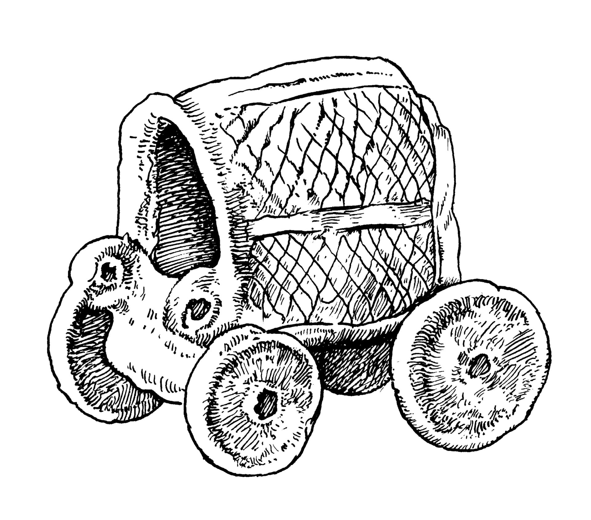

# Human-made Things in the Bible

## License Information

Human-made Things in the Bible © United Bible Societies, 2025. Adapted from: <cite>The Works of Their Hands: Man-made Things in the Bible</cite>, by Ray Pritz © 2009 United Bible Societies. This work is licensed under Creative Commons Attribution-ShareAlike 4.0 International (<a href="https://creativecommons.org/licenses/by-sa/4.0/">https://creativecommons.org/licenses/by-sa/4.0/</a>).

--------------------------------

## 标题：车辆、车（cart, wagon） (id: REALIA:8.2)

8\.2 标题：车辆、车（cart, wagon）
=========================

经文出处
----

Hebrew 来：גַּלְגַּל (音译：galgal)

[EZK 23:24](https://ref.ly/Ezek23:24), [EZK 26:10](https://ref.ly/Ezek26:10)

Hebrew 来：עֲגָלָה (音译：‘agalah)

[GEN 45:19](https://ref.ly/Gen45:19), [GEN 45:21](https://ref.ly/Gen45:21), [GEN 45:27](https://ref.ly/Gen45:27), [GEN 46:5](https://ref.ly/Gen46:5), [NUM 7:3](https://ref.ly/Num7:3), [NUM 7:3](https://ref.ly/Num7:3), [NUM 7:6](https://ref.ly/Num7:6), [NUM 7:7](https://ref.ly/Num7:7), [NUM 7:8](https://ref.ly/Num7:8), [1SA 6:7](https://ref.ly/1Sam6:7), [1SA 6:7](https://ref.ly/1Sam6:7), [1SA 6:8](https://ref.ly/1Sam6:8), [1SA 6:10](https://ref.ly/1Sam6:10), [1SA 6:11](https://ref.ly/1Sam6:11), [1SA 6:14](https://ref.ly/1Sam6:14), [1SA 6:14](https://ref.ly/1Sam6:14), [2SA 6:3](https://ref.ly/2Sam6:3), [2SA 6:3](https://ref.ly/2Sam6:3), [1CH 13:7](https://ref.ly/1Chr13:7), [1CH 13:7](https://ref.ly/1Chr13:7), [PSA 46:10](https://ref.ly/Ps46:10), [ISA 5:18](https://ref.ly/Isa5:18), [ISA 28:27](https://ref.ly/Isa28:27), [ISA 28:28](https://ref.ly/Isa28:28), [AMO 2:13](https://ref.ly/Amos2:13)

Hebrew 来：צָב, עֲגָלָה (音译：tsav, ‘egloth tsav)

[NUM 7:3](https://ref.ly/Num7:3), [NUM 7:3](https://ref.ly/Num7:3), [ISA 66:20](https://ref.ly/Isa66:20)

Greek 希：ἅμαξα (音译：hamaxa)

[JDT 15:11](https://ref.ly/Jdt15:11), [SIR 33:5](https://ref.ly/Sir33:5)

Greek 希：καρρον (音译：karron)

[1ES 5:53](https://ref.ly/1Esd5:53)

Greek 希：ῥέδη (音译：rhedē)

[REV 18:13](https://ref.ly/Rev18:13)

描述和用途
-----

*马车模型 (© Deutsche Bibelgesellschaft, Stuttgart by United Bible Societies)*

车辆是一种用于旅行或运输货物的两轮或四轮车。这种交通工具通常是木制的，由牛、驴或马等役畜牵拉。这些役畜与一根长杆连在一起，然后这根长杆固定到车的前部。车辆的上部通常会用木条交叉做成笼子的形状。

---

翻译
--

圣经中的车辆都是由役畜牵拉的，翻译者应避免使用任何由发动机驱动的车辆名称来翻译“车”。

*(Image generated by ChatGPT using OpenAI technology)*

[NUM 7:3](https://ref.ly/Num7:3) ：希伯来文短语*‘eglothtsav* 在这里的意思不确定。大多数翻译者和解经家都认为这是一种类似“篷车”（“covered wagons”；RSV (Revised Standard Version (1952)) 、REB (Revised English Bible (1989)) ）的东西。篷车的样式和上面描述的车辆相似，但是有一块布盖住车辆里面的物品。这种车辆的形状可能很像陆龟或海龟，而希伯来文*tsav* 正是指这种动物。

[EZK 23:24](https://ref.ly/Ezek23:24); [EZK 26:10](https://ref.ly/Ezek26:10) ：希伯来文*galgal* 的字面意思是“轮子”。在这两节经文的语境中，这个词显然是换喻，指有轮子的车。

[1ES 5:53](https://ref.ly/1Esd5:53) ：在这节经文中，有些希腊文抄本作*chara* （“喜乐”），这是不合理的。有一份抄本作*karron* ，意指前文提到的“车辆”。

* **Associated Passages:** 以西结书 23:24; 以西结书 26:10; 创世记 45:19; 创世记 45:21; 创世记 45:27; 创世记 46:5; 民数记 7:3; 民数记 7:6; 民数记 7:7; 民数记 7:8; 撒母耳记上 6:7; 撒母耳记上 6:8; 撒母耳记上 6:10; 撒母耳记上 6:11; 撒母耳记上 6:14; 撒母耳记下 6:3; 历代志上 13:7; 诗篇 46:10; 以赛亚书 5:18; 以赛亚书 28:27; 以赛亚书 28:28; 阿摩司书 2:13; 以赛亚书 66:20; 友弟德传 15:11; 德训篇 33:5; 厄斯德拉上 5:53; 启示录 18:13

* **Associated ACAI Concepts:** Wagon (ID: `realia:Wagon`)
