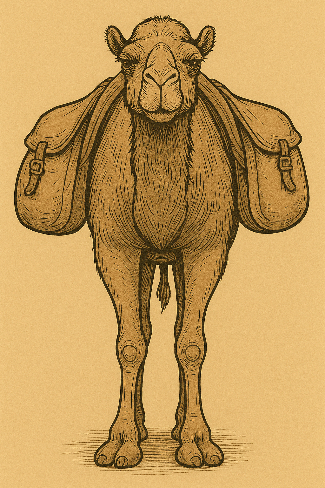

# Human-made Things in the Bible

## License Information

Human-made Things in the Bible © United Bible Societies, 2025. Adapted from: <cite>The Works of Their Hands: Man-made Things in the Bible</cite>, by Ray Pritz © 2009 United Bible Societies. This work is licensed under Creative Commons Attribution-ShareAlike 4.0 International (<a href="https://creativecommons.org/licenses/by-sa/4.0/">https://creativecommons.org/licenses/by-sa/4.0/</a>).

--------------------------------

## 标题：鞍、鞍垫（saddle, saddle cloth） (id: REALIA:8.4)

8\.4 标题：鞍、鞍垫（saddle, saddle cloth）
==================================

经文出处
----

Hebrew 来：בֶּגֶד, חֹפֶשׁ, רִכְבָּה (音译：bigde chofesh lrikbah)

[EZK 27:20](https://ref.ly/Ezek27:20)

Hebrew 来：חבשׁ (音译：chavash（动词）)

[GEN 22:3](https://ref.ly/Gen22:3), [NUM 22:21](https://ref.ly/Num22:21), [JDG 19:10](https://ref.ly/Judg19:10), [2SA 16:1](https://ref.ly/2Sam16:1), [2SA 17:23](https://ref.ly/2Sam17:23), [2SA 19:27](https://ref.ly/2Sam19:27), [1KI 2:40](https://ref.ly/1Kgs2:40), [1KI 13:13](https://ref.ly/1Kgs13:13), [1KI 13:13](https://ref.ly/1Kgs13:13), [1KI 13:23](https://ref.ly/1Kgs13:23), [1KI 13:27](https://ref.ly/1Kgs13:27), [1KI 13:27](https://ref.ly/1Kgs13:27), [2KI 4:24](https://ref.ly/2Kgs4:24)

Hebrew 来：כַּר (音译：kar)

[GEN 31:34](https://ref.ly/Gen31:34)

Hebrew 来：מַד (音译：mad)

[JDG 5:10](https://ref.ly/Judg5:10)

Hebrew 来：מֶרְכָּב (音译：merkav)

[LEV 15:9](https://ref.ly/Lev15:9)

描述和用途
-----

*(Image generated by ChatGPT using OpenAI technology)*

鞍子是放在动物的背上，以便人骑乘的座位，也可以作为运送行李的架子。鞍子可以有多种形式，既可能是一块形状特殊的木头，也可能就是一块布。

---

翻译
--

希伯来文动词*chavash* 出现的语境，通常与已经预备好或正在预备让人骑乘的动物有关。如果目标语言没有“鞍”的专门用词，[GEN 22:3](https://ref.ly/Gen22:3) 中的第二句可以译为“他备好骑乘的驴”。

*(Image generated by ChatGPT using OpenAI technology)*

[GEN 31:34](https://ref.ly/Gen31:34) ：希伯来文*kar* 仅出现在此处，确切含义不明。它的译法有很多种，包括“鞍”（“saddle”；RSV (Revised Standard Version (1952)) 、NIV (New International Version (1984)) ）、“鞍袋”（“saddlebag”；GNT (Good News Translation (1992)) ）、“她用作鞍的垫子”（“the cushion she used as a saddle” ；CEV (Contemporary English Version) ）、“（骆驼）袋”（“\[camel]bag”；REB (Revised English Bible (1989)) ）、“垫子”（“cushion”；NJB (New Jerusalem Bible (1985)) ）和“鞍篮”（GECL (German Common Language Version (Gute Nachricht Bibel)) ）。根据上下文，这显然是拉结可以坐在上面的物件，而她父亲对此也不会觉得奇怪。另一方面，她在这个物件里面（或下面）藏了一些家里的神像（参[4\.6\.1 家中的神像、家神的像 (teraphim, household idol)\<REALIA:4\.6\.1\>](#) ），因此我们可以推断这不是盖在骆驼背上的一块布。有些骆驼鞍非常精致。有时候，鞍是一个很大的篮子或轿子，人可以坐在里面；有时候，鞍是一个木制框架，放在骆驼隆起的背上。框架上面覆盖着布和毯子，以便骑得舒服，并把骑乘者的腿和骆驼的背隔开。不管拉结乘坐的是哪一种鞍，她都能很容易地找到藏匿一些小神像的地方。经文没有说拉结坐在骆驼上，而是说她坐在骆驼的鞍子上。从上下文来看，她显然是在自己的帐棚里。旅行者到达营地过夜时，通常会卸下鞍子并把它搬到帐棚里。如果鞍子是一个木制框架，那么还可以当成座位。把一个形状适合放在骆驼背上的木制框架，放在帐棚里面的地上，会占据比较大的地方。拉结显然是把神像藏在她所坐的座位下面了。

*这个鞍架让人可以骑坐在骆驼上 (© Aziz Kingrani, CC BY\-SA 4\.0, via Wikiedia Commons)*

在[LEV 15:9](https://ref.ly/Lev15:9) ，希伯来文*merkav* 可以指鞍子、布块，甚至是车辆的座位。在有些语言中，可能没有表示“鞍”的专用词语。无论如何，翻译者在这里最好像REB (Revised English Bible (1989)) 那样使用一般性的表达，整节经文的英文意为：“这个人骑牲畜时所坐的一切物件都为不洁净。”

[JDG 5:10](https://ref.ly/Judg5:10) ：关于希伯来文*mad* 的意思，参[5\.17 地毯、毯子 (carpet, rug)\<REALIA:5\.17\>](#) 中的讨论。

关于“鞍袋”，参[1\.2\.1 羊圈、羊栏 (sheep pen, sheepfold)\<REALIA:1\.2\.1\>](#) 关于希伯来文*mishpthayim* 的注解。

* **Associated Passages:** 以西结书 27:20; 创世记 22:3; 民数记 22:21; 士师记 19:10; 撒母耳记下 16:1; 撒母耳记下 17:23; 撒母耳记下 19:27; 列王纪上 2:40; 列王纪上 13:13; 列王纪上 13:23; 列王纪上 13:27; 列王纪下 4:24; 创世记 31:34; 士师记 5:10; 利未记 15:9

