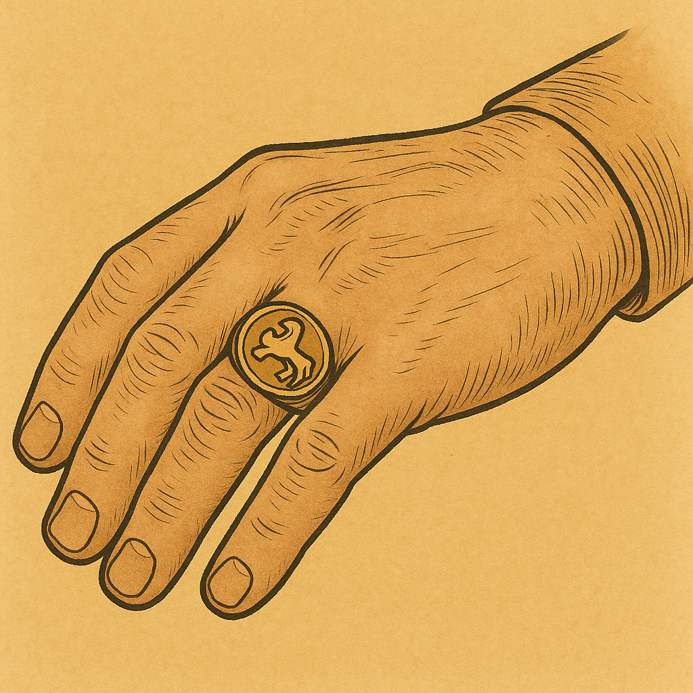

# Human-made Things in the Bible

## License Information

Human-made Things in the Bible © United Bible Societies, 2025. Adapted from: <cite>The Works of Their Hands: Man-made Things in the Bible</cite>, by Ray Pritz © 2009 United Bible Societies. This work is licensed under Creative Commons Attribution-ShareAlike 4.0 International (<a href="https://creativecommons.org/licenses/by-sa/4.0/">https://creativecommons.org/licenses/by-sa/4.0/</a>).

--------------------------------

## 标题：印、印章、印戒、打印的戒指、戒指（seal, signet ring, ring） (id: REALIA:10.2)

10\.2 标题：印、印章、印戒、打印的戒指、戒指（seal, signet ring, ring）
==================================================

经文出处
----

Hebrew 来：חתם, חוֹתָם, חוֹתֶמֶת (音译：chatham, chotham, chothemeth)

[GEN 38:18](https://ref.ly/Gen38:18), [GEN 38:25](https://ref.ly/Gen38:25), [EXO 28:11](https://ref.ly/Exod28:11), [EXO 28:21](https://ref.ly/Exod28:21), [EXO 28:36](https://ref.ly/Exod28:36), [EXO 39:6](https://ref.ly/Exod39:6), [EXO 39:14](https://ref.ly/Exod39:14), [EXO 39:30](https://ref.ly/Exod39:30), [DEU 32:34](https://ref.ly/Deut32:34), [1KI 21:8](https://ref.ly/1Kgs21:8), [1KI 21:8](https://ref.ly/1Kgs21:8), [NEH 10:1](https://ref.ly/Neh10:1), [NEH 10:2](https://ref.ly/Neh10:2), [EST 3:12](https://ref.ly/Esth3:12), [EST 8:8](https://ref.ly/Esth8:8), [EST 8:8](https://ref.ly/Esth8:8), [EST 8:10](https://ref.ly/Esth8:10), [JOB 38:14](https://ref.ly/Job38:14), [JOB 41:7](https://ref.ly/Job41:7), [SNG 8:6](https://ref.ly/Song8:6), [SNG 8:6](https://ref.ly/Song8:6), [ISA 8:16](https://ref.ly/Isa8:16), [ISA 29:11](https://ref.ly/Isa29:11), [ISA 29:11](https://ref.ly/Isa29:11), [JER 22:24](https://ref.ly/Jer22:24), [JER 32:10](https://ref.ly/Jer32:10), [JER 32:11](https://ref.ly/Jer32:11), [JER 32:14](https://ref.ly/Jer32:14), [JER 32:44](https://ref.ly/Jer32:44), [EZK 28:12](https://ref.ly/Ezek28:12), [DAN 12:4](https://ref.ly/Dan12:4), [DAN 12:9](https://ref.ly/Dan12:9), [HAG 2:23](https://ref.ly/Hag2:23)

Aramaic 兰：עִזְקָה (音译：‘izqah)

[DAN 6:18](https://ref.ly/Dan6:18)

Hebrew 来：טַבַּעַת (音译：taba‘ath)

[GEN 41:42](https://ref.ly/Gen41:42), [EXO 35:22](https://ref.ly/Exod35:22), [NUM 31:50](https://ref.ly/Num31:50), [EST 3:10](https://ref.ly/Esth3:10), [EST 3:12](https://ref.ly/Esth3:12), [EST 8:2](https://ref.ly/Esth8:2), [EST 8:8](https://ref.ly/Esth8:8), [EST 8:8](https://ref.ly/Esth8:8), [EST 8:10](https://ref.ly/Esth8:10), [ISA 3:21](https://ref.ly/Isa3:21)

Greek 希：δακτύλιος (音译：daktulios)

[LUK 15:22](https://ref.ly/Luke15:22), [TOB 1:22](https://ref.ly/Tob1:22), [JDT 10:4](https://ref.ly/Jdt10:4), [BEL 1:14](https://ref.ly/Bel1:14), [BEL 1:14](https://ref.ly/Bel1:14), [1MA 6:15](https://ref.ly/1Macc6:15)

Greek 希：σφραγίς, σφραγίζω, κατασφραγίζω (音译：sfragis, sfragizō（动词）, katasfragizō（动词）)

[MAT 27:66](https://ref.ly/Matt27:66), [JHN 3:33](https://ref.ly/John3:33), [JHN 6:27](https://ref.ly/John6:27), [ROM 4:11](https://ref.ly/Rom4:11), [1CO 9:2](https://ref.ly/1Cor9:2), [2CO 1:22](https://ref.ly/2Cor1:22), [EPH 1:13](https://ref.ly/Eph1:13), [EPH 4:30](https://ref.ly/Eph4:30), [2TI 2:19](https://ref.ly/2Tim2:19), [REV 5:1](https://ref.ly/Rev5:1), [REV 5:1](https://ref.ly/Rev5:1), [REV 5:2](https://ref.ly/Rev5:2), [REV 5:5](https://ref.ly/Rev5:5), [REV 5:9](https://ref.ly/Rev5:9), [REV 6:1](https://ref.ly/Rev6:1), [REV 6:3](https://ref.ly/Rev6:3), [REV 6:5](https://ref.ly/Rev6:5), [REV 6:7](https://ref.ly/Rev6:7), [REV 6:9](https://ref.ly/Rev6:9), [REV 6:12](https://ref.ly/Rev6:12), [REV 7:2](https://ref.ly/Rev7:2), [REV 7:3](https://ref.ly/Rev7:3), [REV 7:4](https://ref.ly/Rev7:4), [REV 7:4](https://ref.ly/Rev7:4), [REV 7:5](https://ref.ly/Rev7:5), [REV 7:8](https://ref.ly/Rev7:8), [REV 8:1](https://ref.ly/Rev8:1), [REV 9:4](https://ref.ly/Rev9:4), [REV 10:4](https://ref.ly/Rev10:4), [REV 20:3](https://ref.ly/Rev20:3), [REV 22:10](https://ref.ly/Rev22:10)

Greek 希：χρυσοδακτύλιος (音译：chrusodaktulios)

[JAS 2:2](https://ref.ly/Jas2:2)

Latin 拉：consigno（动词）

[2ES 6:5](https://ref.ly/2Esd6:5)

Latin 拉：signaculum

[2ES 7:104](https://ref.ly/2Esd7:104), [2ES 10:23](https://ref.ly/2Esd10:23)

Latin 拉：signo（动词）

[2ES 2:38](https://ref.ly/2Esd2:38), [2ES 8:53](https://ref.ly/2Esd8:53)

Latin 拉：supersignabitur

[2ES 6:20](https://ref.ly/2Esd6:20)

描述和用途
-----

*(Image generated by ChatGPT using OpenAI technology)*

印（或图章）是一个刻有文字或图案的物件，用来表示所有权、批准或封闭。这是有地位的人普遍使用的一种重要物品，象征所有权，用来在合同和其他秘密或保密文件上盖章，甚至还是个人身份的标记（参[GEN 38:18](https://ref.ly/Gen38:18) ）。印通常是圆形或椭圆形的，并且椭圆形更为常见。盖印时，把印压在新鲜的黏土上，再将黏土烧硬，或者压在热蜡上，蜡冷却后便显出压印。印可以盖在文件、信函，或者其他要封住的物件上。印本身刻的图案是反的，这样印出来的图案就是正的。除了所有者的职业、职位或地位之外，印有时还带有图像或符号。印用某种宝石做成。所有者通常随身携带着印，或者嵌在戒指上，或者用一根带子系在脖子上。

*印章戒指 (Metropolitan Museum of Art, Public domain, MMA)*

需要保密的重要信件、机密信函或法律文件都要用印封严。人们把写在蒲草纸（后来是牛皮纸和羊皮纸）上的文件卷起来、绑住，然后在打的结上面盖章。要打开文件，必须先破开印记。如果文字是写在瓦片或陶片上的，人们就会用一种黏土做成的封套将其包起来。如果内容是合同或其他法律文件，有时会在封套上刻写内容摘要，另外还可能在另一个地方保存一份文件副本（参[JER 32:14](https://ref.ly/Jer32:14) ）。

---

翻译
--

*绳上的密封印 (© Deutsche Bibelgesellschaft, Stuttgart by United Bible Societies)*

在有些语言中，“印”或“图章”最接近的对等词是印留下来的记号，例如“他名的记号”或“他所有权的标记”。此外，翻译者也可以使用一个表示“橡皮图章”的词语，只是不要明确提到橡皮或墨水。在有些经文中，翻译者可以使用“作记号的工具”之类的短语。

希伯来文*taba‘ath* 源于一个意为“盖上印记”的词根。这说明该物最初的目的就是用作图章，如上文所述。但是，戒指也是一种首饰，[EXO 35:22](https://ref.ly/Exod35:22) 和[NUM 31:50](https://ref.ly/Num31:50) 提到的戒指可能就是饰物。戒指作为饰物广为人知，但打印的戒指却较少为人所知。因此，翻译者可能有必要详细地加以描述；例如在[GEN 41:42](https://ref.ly/Gen41:42) 中，NCV (New Century Version) 把原文直译“他的戒指”的短语展开，英文意为“他那个带有王室印章的戒指”，GNT (Good News Translation (1992)) 意为“刻有王室印记的戒指”，SPCL (Spanish Common Language Version (Dios Habla Hoy)) 意为“带有公章的戒指”。在[EST 3:10](https://ref.ly/Esth3:10) ，GNT (Good News Translation (1992)) 的表达更加详细，英文意为，“他的戒指，用来在旨意上盖章以使其正式生效”。不过，有些翻译者可能更愿意把这些解释放在脚注里面。

[MAT 27:66](https://ref.ly/Matt27:66) ：没有人确切地知道这节经文中的“封了坟墓”是什么意思。有学者曾提出这样一种见解：把一根绳子拉在石头上，然后在上面盖印。还有学者认为，“封了坟墓”指的是在岩石表面和墓门石头之间填满软黏土，然后在上面盖上犹太当局的印章。因为不是所有文化都知道封印，所以这节经文的结尾也可以翻译为：“他们在石头上做了一个标记，以便知道它是否被移动过”，或“他们在石头上做了标记，禁止人移动”。

* **Associated Passages:** 创世记 38:18; 创世记 38:25; 出埃及记 28:11; 出埃及记 28:21; 出埃及记 28:36; 出埃及记 39:6; 出埃及记 39:14; 出埃及记 39:30; 申命记 32:34; 列王纪上 21:8; 尼希米记 10:1; 尼希米记 10:2; 以斯帖记 3:12; 以斯帖记 8:8; 以斯帖记 8:10; 约伯记 38:14; 约伯记 41:7; 雅歌 8:6; 以赛亚书 8:16; 以赛亚书 29:11; 耶利米书 22:24; 耶利米书 32:10; 耶利米书 32:11; 耶利米书 32:14; 耶利米书 32:44; 以西结书 28:12; 但以理书 12:4; 但以理书 12:9; 哈该书 2:23; 但以理书 6:18; 创世记 41:42; 出埃及记 35:22; 民数记 31:50; 以斯帖记 3:10; 以斯帖记 8:2; 以赛亚书 3:21; 路加福音 15:22; 多俾亚传 1:22; 友弟德传 10:4; 彼勒与大龙 1:14; 玛加伯上 6:15; 马太福音 27:66; 约翰福音 3:33; 约翰福音 6:27; 罗马书 4:11; 哥林多前书 9:2; 哥林多后书 1:22; 以弗所书 1:13; 以弗所书 4:30; 提摩太后书 2:19; 启示录 5:1; 启示录 5:2; 启示录 5:5; 启示录 5:9; 启示录 6:1; 启示录 6:3; 启示录 6:5; 启示录 6:7; 启示录 6:9; 启示录 6:12; 启示录 7:2; 启示录 7:3; 启示录 7:4; 启示录 7:5; 启示录 7:8; 启示录 8:1; 启示录 9:4; 启示录 10:4; 启示录 20:3; 启示录 22:10; 雅各书 2:2; 厄斯德拉下 6:5; 厄斯德拉下 7:104; 厄斯德拉下 10:23; 厄斯德拉下 2:38; 厄斯德拉下 8:53; 厄斯德拉下 6:20

* **Associated ACAI Concepts:** Seal (ID: `realia:Seal`)
