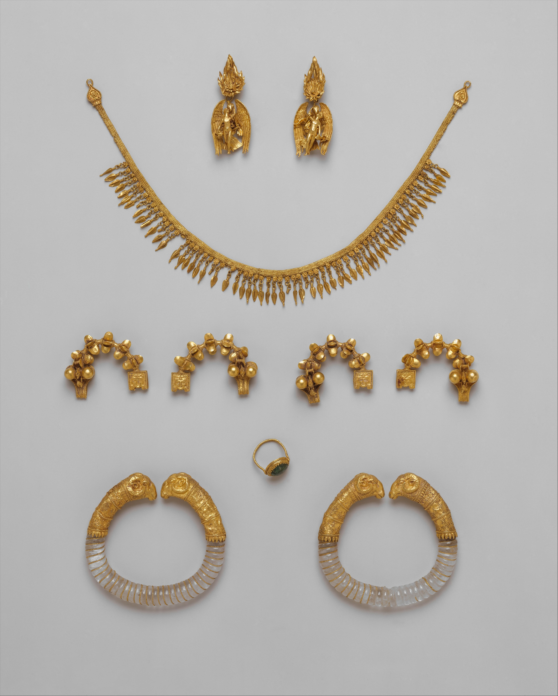

# Human-made Things in the Bible

## License Information

Human-made Things in the Bible © United Bible Societies, 2025. Adapted from: <cite>The Works of Their Hands: Man-made Things in the Bible</cite>, by Ray Pritz © 2009 United Bible Societies. This work is licensed under Creative Commons Attribution-ShareAlike 4.0 International (<a href="https://creativecommons.org/licenses/by-sa/4.0/">https://creativecommons.org/licenses/by-sa/4.0/</a>).

--------------------------------

## 标题：珠宝、首饰、饰物（jewelry, ornaments） (id: REALIA:10.5)

10\.5 标题：珠宝、首饰、饰物（jewelry, ornaments）
=====================================

经文出处
----

Hebrew 来：חֲלִי, חֶלְיָה (音译：chali, chelyah)

[PRO 25:12](https://ref.ly/Prov25:12), [SNG 7:2](https://ref.ly/Song7:2), [HOS 2:15](https://ref.ly/Hos2:15)

Hebrew 来：כְּלִי (音译：kli)

[GEN 24:53](https://ref.ly/Gen24:53), [GEN 24:53](https://ref.ly/Gen24:53), [EXO 3:22](https://ref.ly/Exod3:22), [EXO 3:22](https://ref.ly/Exod3:22), [EXO 11:2](https://ref.ly/Exod11:2), [EXO 11:2](https://ref.ly/Exod11:2), [EXO 12:35](https://ref.ly/Exod12:35), [EXO 12:35](https://ref.ly/Exod12:35), [EXO 35:22](https://ref.ly/Exod35:22), [NUM 31:50](https://ref.ly/Num31:50), [NUM 31:51](https://ref.ly/Num31:51), [PRO 20:15](https://ref.ly/Prov20:15), [ISA 61:10](https://ref.ly/Isa61:10), [EZK 16:17](https://ref.ly/Ezek16:17), [EZK 16:39](https://ref.ly/Ezek16:39), [EZK 23:26](https://ref.ly/Ezek23:26)

Hebrew 来：עֲדִי (音译：‘adi)

[EXO 33:4](https://ref.ly/Exod33:4), [EXO 33:5](https://ref.ly/Exod33:5), [EXO 33:6](https://ref.ly/Exod33:6), [2SA 1:24](https://ref.ly/2Sam1:24), [ISA 49:18](https://ref.ly/Isa49:18), [JER 2:32](https://ref.ly/Jer2:32), [JER 4:30](https://ref.ly/Jer4:30), [EZK 7:20](https://ref.ly/Ezek7:20), [EZK 16:11](https://ref.ly/Ezek16:11), [EZK 23:40](https://ref.ly/Ezek23:40)

Hebrew 来：תּוֹר (音译：tor)

[SNG 1:10](https://ref.ly/Song1:10), [SNG 1:11](https://ref.ly/Song1:11)

Greek 希：κόσμος (音译：kosmos)

[1PE 3:3](https://ref.ly/1Pet3:3), [JDT 10:4](https://ref.ly/Jdt10:4), [SIR 6:30](https://ref.ly/Sir6:30), [SIR 21:21](https://ref.ly/Sir21:21)

Greek 希：χρυσίον (音译：chrusion)

[1TI 2:9](https://ref.ly/1Tim2:9), [1PE 3:3](https://ref.ly/1Pet3:3), [REV 17:4](https://ref.ly/Rev17:4), [REV 18:16](https://ref.ly/Rev18:16), [LJE 1:9](https://ref.ly/EpJer1:9)

描述和用途
-----

*各种珠宝首饰 (Metropolitan Museum of Art, Public domain, MMA)*

珠宝是人佩戴在身体不同部位的饰品，通常由贵重的金属和宝石做成。珠宝可以佩戴的部位有头、脸、脖子、手臂和手指，以及脚踝。虽然大部分珠宝都是女性佩戴，但也有一些是男性佩戴的。

---

翻译
--

“珠宝”可以译成“使人看起来漂亮的东西”，或“某人想藉以显得具有吸引力的东西”。“黄金首饰”可以说成“用黄金做的漂亮东西”。

希伯来文*kli* 实际上是一个统称，意思是“物件”或“东西”。在上述的部分参考经文中，*kli* 通常与“金”或“装饰的”等修饰语配合使用。在这些情况下，可以将之视为一般意义上的珠宝，并简单地译为“珠宝”或“贵重物品”。

[REV 17:4](https://ref.ly/Rev17:4); [REV 18:16](https://ref.ly/Rev18:16) ：与其说那个女人“满身金饰、宝石和珍珠”（GNT (Good News Translation (1992)) 直译；[REV 17:4](https://ref.ly/Rev17:4) ），倒不如说“她戴了许多金饰、宝石和珍珠”，或“她的衣服上挂着许多金饰、宝石和珍珠”。在希腊文本中，这两节经文没有“珠宝”一词，只提到了制作珠宝的材料。CEV (Contemporary English Version) 英文意为，“她戴着用黄金、宝石和珍珠做的首饰”，这是一个很好的翻译范例。

[ISA 3:18–ISA 3:23](https://ref.ly/Isa3:18-Isa3:23)

这段经文提到20多件物品，包括珠宝和衣服。其中许多物品只在圣经中出现一次，并且确切含义不明。翻译这些经文时，有些译本并没有逐一译出每件首饰，而是使用了一个统称，同时指明佩戴的位置；例如，“到那日，我必从那些女人身上拿走她们佩戴在脚踝、头、脖子、耳朵、手臂、鼻子、手指和衣服上的所有珠宝首饰。我必除掉她们的纱巾、腰带、香水、符囊、朝服，以及一切华美的衣服、帽子和钱包”（CEV (Contemporary English Version) 直译）。

有些珠宝的起源明显与异教有联系。闪族宗教崇拜“太阳”和“月亮”，参RSV (Revised Standard Version (1952)) 在第18节中译为“headbands”（“额带”）和“crescents”（“月牙”）的希伯来文词语。第20节的“符囊”可能源自某种魔法或宗教作用。不过在[ISA 3:2](https://ref.ly/Isa3:2); [ISA 3:3](https://ref.ly/Isa3:3) 中，与异教的联系并没有受到特别的责备，同样这种联系也不是这里的重点，重点是对权力的错误认识和骄傲。这种错误认识和骄傲建立在不公义的基础之上，终将被颠覆。

瓦茨（Watts）撰写的《以赛亚书》注释中有这样一句话值得借鉴：“如今想要弄清楚这些物品都是什么，这是不可能的。……当时的时尚和现代一样变化得很快，而且时尚物品往往不是根据合理的定义来命名的。……哈特曼（Hartmann）……指出，《七十士译本》（LXX (Septuagint) ）只是简单列出了他那个时期的这类物品。自那以后，很多翻译者也是按照类似的方式来处理的”（第46页）。

下面将对列出的物品逐一进行讨论。括号中的词语分别是NRSV (New Revised Standard Version (1989)) 和GNT (Good News Translation (1992)) 对希伯来文词语的翻译。

第18节
----

*‘Akasim* （“anklets”，“脚链”；“ornaments they wear on their ankles”，“他们戴在脚踝上的饰物”）（《和》作“脚钏”，《和修》作“足饰”，《思》作“踝环”，《吕》作“脚钏”）：“脚链”指系在鞋子、腿或脚踝上的小链子或饰件。[ISA 3:16](https://ref.ly/Isa3:16) 使用了一个与之相关的希伯来文动词（译为“玎珰”）。参后文[10\.5\.2 手镯、臂镯、脚镯 (bracelet, armlet, anklet)\<REALIA:10\.5\.2\>](#) 。

*Shvisim* （“headbands”，“发带”；“\[ornaments] on their heads”，“他们头上的（饰物）”）和*saharonim* （“crescents”，“月牙”；“\[ornaments] on their necks”，“他们脖子上的（饰物）”）（《和》作“发网、月牙圈”，《和修》作“额带、月牙圈”，《思》作“圆环、月牙环”，《吕》作“发网、月牙圈”）：“发带”（后来的希伯来文也使用这个词）用金线或羊毛线做成，从头巾上面垂下来。然而，许多学者认为这个词指太阳形状的圆形饰物（即“小太阳”），并且与月亮形状的饰品“月牙”配对，这种解释更为可取。FRCL (French Common Language Version (Bible en français courant)) 把第一个词译为“发带”，但添加了脚注“或译：太阳形状的珠宝”。NCV (New Century Version) 把“月牙”译为“necklaces shaped like the moon”（“月亮形状的项链”）。GECL (German Common Language Version (Gute Nachricht Bibel)) 则译为“他们戴在脖子上的太阳和半月”。另一种可能的译法是“（像太阳和半月形状的）小吊坠／珠宝／首饰”。这些“小太阳和半月饰品”可以挂在鞋子、手、手镯、项链、头饰、衣物或所有这些地方上面，因此我们并不清楚佩戴的具体位置。考古学家发现了串着这些饰品的项链。如果把这些饰品译为挂在项链上的物品，那就不应该与“脚链”紧邻。

第19节
----

*Ntifoth* （“pendants”，“吊坠”；GNT (Good News Translation (1992)) 将其与第18节的“月牙”合并在一起）（《和》《和修》《思》作“耳环”，《吕》作“耳坠”）：“吊坠”可能是指泪珠状或水滴状饰物，因为希伯来文的词根是用来描述蜂蜜和葡萄酒等液体的，并不是表示“悬挂”的一般用词。TOB (Traduction Oecuménique de la Bible (French, 1975)) 加了注释：“字面意思为‘水滴’，很可能是珍珠。”这些“吊坠”可以串在宝石或玻璃项链上来佩戴。FRCL (French Common Language Version (Bible en français courant)) 和NCV (New Century Version) 译为“耳环”。

*Sheroth* （“bracelets”，“手镯”；“\[ornaments] on their wrists”，“她们手腕上的（饰物）”）（《和》《和修》《思》《吕》作“手镯”）：不建议使用“手镯”一词来翻译这个希伯来文词语。在后来的希伯来文中，这个词指家畜的颈带。该词可能与“链”这个词有关，在这里可能意指“项链”或“颈绳”，这样就刚好与前面的水滴状吊坠配成一对。因此，这节经文的前两个词语最好译为“吊坠和项链”或“水滴状饰物和颈绳”。

*R‘aloth* （“scarfs”，“围巾”；“veils”，“面纱”）（《和》作“蒙脸的帕子”，《和修》作“面纱”，《思》作“面纱”，《吕》作“蒙脸长披”）：这节经文的最后一个物件问题较小。希伯来文*r‘aloth* 指用来遮住脸部的布。NCV (New Century Version) 和GNT (Good News Translation (1992)) 译为“veils”（“面纱”）。参[6\.12 面纱、帕子 (veil)\<REALIA:6\.12\>](#) 。

第20节
----

*P’erim* （“headdresses”，“头饰”；“hats”，“帽子”）（《和》作“华冠”，《和修》作“头巾”，《思》作“帽巾”，《吕》作“华帽”）：“头饰”这个词的意思在英文和希伯来文中非常接近。它可能是指头上的装饰，如帽子、头巾或王冠，可能经常装饰着花朵图案。NCV (New Century Version) 译为“scarves”（“围巾”），REB (Revised English Bible (1989)) 译为“headbands”（“头巾”）。这里可以使用女人戴在头上的（漂亮）帽子或特殊带子的统称，但要注意第23节的“头饰”。NJB (New Jerusalem Bible (1985)) 译为“diadems”（“王冠”），即王后或公主佩戴的装饰性盖头。另参[6\.6 腰带、皮带(waistband, sash, belt)\<REALIA:6\.6\>](#) 。

*Ts‘adoth* （“armlets”，“臂镯”；GNT (Good News Translation (1992)) 将其和接下来的三件物品合在一起，英文意为“她们戴在手臂和腰部的魔法护身符”）（《和》、《和修》作“足链”，《思》、《吕》作“脚链”，但脚注“臂环”）：“臂镯”是戴在手臂上的一种金属装饰带，出现在[2SA 1:10](https://ref.ly/2Sam1:10) 中（参后文[10\.5\.2 手镯、臂镯、脚镯 (bracelet, armlet, anklet)\<REALIA:10\.5\.2\>](#) ）。根据学者对一些古代亚述王宫图画的解释，这些饰物可能表明所有者属于王室或统治阶级。希伯来文*ts‘adoth* 的词根意为“步伐、步调”，因此有些学者认为这些饰物最早是脚镯（NCV (New Century Version) 译为“ankle chains”，“脚链”；NJB (New Jerusalem Bible (1985)) 的译法类似）。不过，建议译为“臂镯”，因为“脚镯”的猜测性较大。按照《以赛亚书》在这里的描述，这些是女子的饰物。FRCL (French Common Language Version (Bible en français courant)) 译为“小链子”。

*Qishurim* （“sashes”，“腰带”）（《和》《和修》作“华带”，《思》作“领带”，《吕》作“珠带”）：“腰带”是指束在外衣上的带子，可能装饰有珠子。NCV (New Century Version) 使用了一个较长的描述性短语，英文意为“系在腰间的布带”。REB (Revised English Bible (1989)) 译为“necklaces”（“项链”）。（需要指出，翻译者不应该在同一个清单中重复列出相同的条目！）另参[6\.6 腰带、皮带 (waistband, sash, belt)\<REALIA:6\.6\>](#) 。

*Batey nefesh* （“perfume boxes”，“香盒”）（《和》《和修》《思》《吕》作“香盒”）：这个希伯来文词语直译作“生命之屋”，可能指装着符咒的小圆筒。TOB (Traduction Oecuménique de la Bible (French, 1975)) 解释说，这种香盒是为了给佩戴者作护身符，并提出[1SA 25:29](https://ref.ly/1Sam25:29) 为可能的参考经文。建议翻译者采纳这种解释，以“护符”（“talismans”，NJPSV (New Jewish Publication Society Version) ）作为范例，或遵循GNT (Good News Translation (1992)) 的译法。FRCL (French Common Language Version (Bible en français courant)) 有一个词可以译为“魔药”。这个物件与下一个饰品形成语义对。

*Lchashim* （“amulets”，“护身符”）（《和》《和修》《吕》作“符囊”，《思》作“符藤”）：这个希伯来文词语直译作“低声的咒语”，可能指任何人们相信带有魔力的小物件。FRCL (French Common Language Version (Bible en français courant)) 译为“好运符”。提及这些物品不是为了直接谴责异教邪术，而是揭露由财富和权力而来的骄傲。因此，这些护身符象征非道德财富的力量。

第21节
----

*Taba‘oth* （“signet rings”，“印戒”；“rings they wear on their fingers”，“他们戴在手上的戒指”）（《和》《和修》《思》《吕》作“戒指”）：正如NRSV (New Revised Standard Version (1989)) 和GNT (Good News Translation (1992)) 的译法所示，可以将这些戒指理解为印戒（NIV (New International Version (1984)) 、REB (Revised English Bible (1989)) 、NJPSV (New Jewish Publication Society Version) 、NCV (New Century Version) ），也可以简单地理解为装饰性的珠宝（GECL (German Common Language Version (Gute Nachricht Bibel)) 、SPCL (Spanish Common Language Version (Dios Habla Hoy)) 、NASB (New American Standard Bible) 、NJB (New Jerusalem Bible (1985)) ）；参[10\.2 印、印章、印戒、打印的戒指、戒指 (seal, signet ring, ring)\<REALIA:10\.2\>](#) 中的讨论。翻译者在做出决定时，需要考虑以赛亚在这里的目标读者，即“锡安的女子”（[ISA 3:16](https://ref.ly/Isa3:16) ）。因为女子不太可能戴着暗示权力的“印戒”，所以这里译为“戒指”或“指环”比较好。

*Nizmey ’af* （“nose rings”，“鼻环”；“\[rings] in their noses”，“她们鼻子上的（环）”）（《和》《和修》《思》《吕》作“鼻环”）：“鼻环”似乎是一种女子佩戴的饰物（[GEN 24:47](https://ref.ly/Gen24:47) ；[EZK 16:12](https://ref.ly/Ezek16:12) ；[HOS 2:15](https://ref.ly/Hos2:15) ［《和》2:13］）。男子可能在耳朵上戴有类似的环状物（[GEN 35:4](https://ref.ly/Gen35:4) ）。有些“鼻环”和耳环与异教的崇拜仪式有关（[GEN 35:2](https://ref.ly/Gen35:2); [GEN 35:3](https://ref.ly/Gen35:3); [GEN 35:4](https://ref.ly/Gen35:4) ）。在有些文化中，女性戴“鼻环”可能是一种奇怪的风俗。如果直译会引起误解，翻译者可以笼统地译为戴在头上的珠宝，与戴在身体其他部位的珠宝相对。参后文[10\.5\.1 耳环、鼻环 (earring, nose ring)\<REALIA:10\.5\.1\>](#) 。

第22节
----

*Machalatsoth* （“festal robes”，“节日的长袍”；“fine robes”，“上好的长袍”）（《和》《吕》作“吉服”，《和修》《思》作“礼服”）：这个希伯来文词语的意思不详，可能与“腰”这个词有关。这些衣服可能是品质上乘的长袖外套。其他可能的意思有“裙子”、“衬裙”、“内衣”和“腰布”（谢费尔［Sheffer］的建议，第546页）。不过，后面这几种意思与接下来的两个词不太相符。这里最有可能是指“上好的外套”。REB (Revised English Bible (1989)) 译为“fine dresses”（“上好的裙子”），而NCV (New Century Version) 译为“fine robes”（“上好的长袍”）。NJB (New Jerusalem Bible (1985)) 试图找到一个现代的对等词，译为“party dresses”（“派对礼服”）。另参[6\.2 外衣、外袍、披风、长袍 (outer garment, cloak, mantle, robe)\<REALIA:6\.2\>](#) 。

*Ma‘atafoth* （“mantles”，“披风”；“gowns”，“长外衣”）（《和》《和修》作“外套”，《思》作“斗蓬”，《吕》作“斗篷”）：“披风”可能是一种可以包住肩膀和头部的外衣。与下一个物品相比，披风的布料可能更加厚重。这个词在《希伯来圣经》中仅出现在此处。FRCL (French Common Language Version (Bible en français courant)) 译为“斗篷”。

*Mitpachoth* （“cloaks”，“斗篷”；“cloaks”，“斗篷”）（《和》作“云肩”，《和修》作“披肩”，《思》作“帔肩”，《吕》作“外披”）：“斗篷”是女性穿着的一种特殊外套。这个希伯来文词语也出现在[RUT 3:15](https://ref.ly/Ruth3:15) 。妇女可以用这种衣服盖住头部和肩膀。NJPSV (New Jewish Publication Society Version) 译为“shawls”（“披肩”），一种通常是女性披戴的服饰，这个译法为英文译本提供了一个很好的范例。斗篷有时候也用来携带物品，就像路得的例子那样。另参[6\.2 外衣、外袍、披风、长袍 (outer garment, cloak, mantle, robe)\<REALIA:6\.2\>](#) 。

*Charitim* （“handbags, purses”，“手袋、钱包”）（《和》作“荷包”，《和修》作“皮包”，《思》作“手袋”，《吕》作“提包”）：这节经文的最后一个物品与前面提到的衣服稍有不同。“手袋”是用来装钱或其他小件物品的袋子。这些“钱包”与披肩列在一组，可能是因为它们都可以用来装东西。参[10\.1 袋、袋子、口袋、钱袋、钱囊 (bag, sack, money bag, purse)\<REALIA:10\.1\>](#) 。

第23节
----

*Gilyonim* （“garments of gauze”，“薄纱做的衣服”；“revealing garments”，“透明的衣服”）（《和》《和修》作“手镜”，《思》作“面罩”，《吕》作“薄丝面罩”）：这个希伯来文词语可能指一种比较薄的、透光的细布，所以GNT (Good News Translation (1992)) 译为“*revealing* garments”（“*透明的* 衣服”）。有些学者认为这个词指“镜子”（“mirrors”；NCV (New Century Version) 、TOB (Traduction Oecuménique de la Bible (French, 1975)) ），并且这种镜子可以放在上节经文所述的钱包里。然而，“细布”的可能性更大。

*Sdinim* （“linen garments”，“亚麻衣服”；“linen handkerchiefs”，“亚麻手帕”）（《和》《和修》作“细麻衣”，《思》作“衬衫”，《吕》作“亚麻衬衣”）：“亚麻衣服”指亚麻布单，可用来坐卧，也可以用作窗帘，或用来缠裹身体作衣服（“围裹式服装”）。FRCL (French Common Language Version (Bible en français courant)) 译为“上好的上衣”。如果这个词可以解作一块布料，另一种可能的译法是“亚麻手帕”。另参[6\.3 衬衫、束腰长衬衫 (shirt, tunic)\<REALIA:6\.3\>](#) 。

*Tsnifoth* （“turbans”，“头巾”；“scarves”，“围巾”）（《和》作“裹头巾”，《和修》作“头饰”，《思》作“头巾”，《吕》作“华冠”）：这个希伯来文词语指女子的头巾。头巾也可以用作面纱。FRCL (French Common Language Version (Bible en français courant)) 译为“围巾”。如果上下文要求准确表达，那么可以译成“包头的细布”。但如果描述的目的只是笼统地指出这一类物品，这个译法就过于冗长了。另参[6\.7 头饰、裹头巾、头巾、帽子 (headdress, turban, hat)\<REALIA:6\.7\>](#) 。

*Rdidim* （“veils”，“面纱”；“long veils they wear on their heads”，“她们戴在头上的长面纱”）（《和》作“蒙身的帕子”，《和修》作“纱巾”，《思》作“夏衣”，《吕》作“蒙身帕子”）：这个希伯来文词语可能指一种质地优良的面纱，能遮住脸部。该词可能是指[GEN 24:65](https://ref.ly/Gen24:65) 、[GEN 38:14](https://ref.ly/Gen38:14) 和[GEN 38:19](https://ref.ly/Gen38:19) 所提到的那种面纱，但是用词不同，因此很有可能指品质更好的服装。另参[6\.12 面纱、帕子 (veil)\<REALIA:6\.12\>](#) 。

* **Associated Passages:** 箴言 25:12; 雅歌 7:2; 何西阿书 2:15; 创世记 24:53; 出埃及记 3:22; 出埃及记 11:2; 出埃及记 12:35; 出埃及记 35:22; 民数记 31:50; 民数记 31:51; 箴言 20:15; 以赛亚书 61:10; 以西结书 16:17; 以西结书 16:39; 以西结书 23:26; 出埃及记 33:4; 出埃及记 33:5; 出埃及记 33:6; 撒母耳记下 1:24; 以赛亚书 49:18; 耶利米书 2:32; 耶利米书 4:30; 以西结书 7:20; 以西结书 16:11; 以西结书 23:40; 雅歌 1:10; 雅歌 1:11; 彼得前书 3:3; 友弟德传 10:4; 德训篇 6:30; 德训篇 21:21; 提摩太前书 2:9; 启示录 17:4; 启示录 18:16; 耶利米书信 1:9; 以赛亚书 3:18; 以赛亚书 3:23; 以赛亚书 3:2; 以赛亚书 3:3; 以赛亚书 3:16; 撒母耳记下 1:10; 撒母耳记上 25:29; 创世记 24:47; 以西结书 16:12; 创世记 35:4; 创世记 35:2; 创世记 35:3; 路得记 3:15; 创世记 24:65; 创世记 38:14; 创世记 38:19

