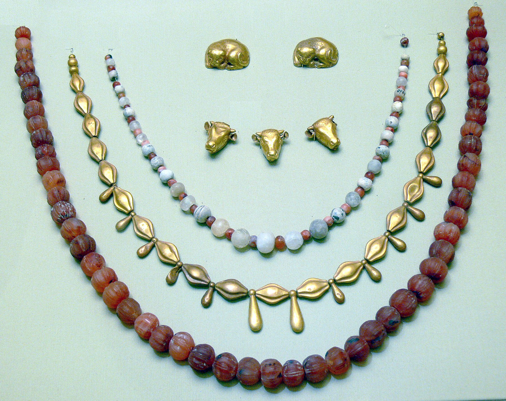

# Human-made Things in the Bible

## License Information

Human-made Things in the Bible © United Bible Societies, 2025. Adapted from: <cite>The Works of Their Hands: Man-made Things in the Bible</cite>, by Ray Pritz © 2009 United Bible Societies. This work is licensed under Creative Commons Attribution-ShareAlike 4.0 International (<a href="https://creativecommons.org/licenses/by-sa/4.0/">https://creativecommons.org/licenses/by-sa/4.0/</a>).

--------------------------------

## 标题：项链、链、带子（necklace, chain, cord） (id: REALIA:10.5.4)

10\.5\.4 标题：项链、链、带子（necklace, chain, cord）
==========================================

经文出处
----

Aramaic 兰：הַמְנִיךְ (音译：hamnik)

[DAN 5:7](https://ref.ly/Dan5:7), [DAN 5:7](https://ref.ly/Dan5:7), [DAN 5:16](https://ref.ly/Dan5:16), [DAN 5:16](https://ref.ly/Dan5:16), [DAN 5:29](https://ref.ly/Dan5:29), [DAN 5:29](https://ref.ly/Dan5:29)

Hebrew 来：חָרוּז (音译：charuzim)

[SNG 1:10](https://ref.ly/Song1:10)

Hebrew 来：כּוּמָז (音译：kumaz)

[EXO 35:22](https://ref.ly/Exod35:22), [NUM 31:50](https://ref.ly/Num31:50)

Hebrew 来：נְטִיפָה (音译：netifah)

[JDG 8:26](https://ref.ly/Judg8:26), [ISA 3:19](https://ref.ly/Isa3:19)

Hebrew 来：עֲנָק, ענק (音译：‘anaq（名词或动词）)

[JDG 8:26](https://ref.ly/Judg8:26), [PSA 73:6](https://ref.ly/Ps73:6), [PRO 1:9](https://ref.ly/Prov1:9), [SNG 4:9](https://ref.ly/Song4:9)

Hebrew 来：פָּתִיל (音译：pathil)

[GEN 38:18](https://ref.ly/Gen38:18), [GEN 38:25](https://ref.ly/Gen38:25)

Hebrew 来：רָבִיד (音译：ravid)

[GEN 41:42](https://ref.ly/Gen41:42), [EZK 16:11](https://ref.ly/Ezek16:11)

Hebrew 来：שַׂהֲרוֹן (音译：saharonim)

[JDG 8:26](https://ref.ly/Judg8:26), [ISA 3:18](https://ref.ly/Isa3:18)

Greek 希：μανιάκης (音译：maniakēs)

[1ES 3:6](https://ref.ly/1Esd3:6)

描述和用途
-----

*项链 (© Wolfgang Sauber, CC BY\-SA 3\.0, via Wikimedia Commons)*

项链是戴在脖子上作为装饰的带子、绳子或链子，通常串着珠宝或其他饰物。

---

翻译
--

[GEN 41:42](https://ref.ly/Gen41:42); [DAN 5:7](https://ref.ly/Dan5:7); [DAN 5:16](https://ref.ly/Dan5:16); [DAN 5:29](https://ref.ly/Dan5:29) ：在这些经文中，掌权者把金链赐给被擢升到高位的人。在这两处经文中，链子可能比普通的项链更粗更结实，因此最好用一个意指“链”而非装饰性细项链的词。不过，重要的是要在译文中表明荣誉或高位之意，而非奴役。在一些语言中，有特定的词语来指称戴在脖子上、代表荣誉或高位的物件。如果没有这样的词语或词语意思模糊，那么可以通过展开译文来表达荣誉的意思，例如，GNT (Good News Translation (1992)) 将[DAN 5:7](https://ref.ly/Dan5:7) 译为“chain of honor”（“荣誉的链子”）。

根据一些解经家的意见，[DAN 5:7](https://ref.ly/Dan5:7); [DAN 5:16](https://ref.ly/Dan5:16); [DAN 5:29](https://ref.ly/Dan5:29) 中的亚兰文*hamnik* 实际上并不是指链子，而是指一种不会变形的金属项圈。NAB (New American Bible (1970)) 译为“collar”（“项圈”）。在有些语言中，可以用一个动词来表示穿紫色衣服和戴金项圈这两种权柄的象征。但在另一些语言中，用两个动词来分别表示“穿”衣服和“戴”链子或项圈等饰物，会更自然一些。

[SNG 1:10](https://ref.ly/Song1:10) ：希伯来文*charuz* （复数，*charuzim* ）实际上指带孔的小珠子或宝石。用带子把这些小珠子或宝石串起来，就成了一条项链。有些译本把*charuzim* 译为“项链”（“necklaces”；NJB (New Jerusalem Bible (1985)) 、PV ），有些译本则译成做项链所用的“珠宝”（“jewels”；GNT (Good News Translation (1992)) 、NCV (New Century Version) ）或“宝石”。还有些译本结合了这两种译法：RSV (Revised Standard Version (1952)) 译为“strings of jewels”（“珠宝串”），NASB (New American Standard Bible) 译为“strings of beads”（“珠串”），CEV (Contemporary English Version) 译为“necklace of precious stones”（“宝石项链”），而SPCL (Spanish Common Language Version (Dios Habla Hoy)) 译为“珍珠项链”。

在[EXO 35:22](https://ref.ly/Exod35:22); [NUM 31:50](https://ref.ly/Num31:50) 中，希伯来文*kumaz* 的意思不确定，但显然是指某种珠宝。大多数译本都认为这是戴在脖子上的物品，可能是“项链”（“necklaces”；GNT (Good News Translation (1992)) 、GECL (German Common Language Version (Gute Nachricht Bibel)) ）或“吊坠”（“pendants”；REB (Revised English Bible (1989)) 、NJPSV (New Jewish Publication Society Version) ）。

[GEN 38:18](https://ref.ly/Gen38:18); [GEN 38:25](https://ref.ly/Gen38:25) ：在这两节经文中，希伯来文*pathil* 可能指一种戴在脖子上的带子，用来挂印戒。CEV (Contemporary English Version) 将[EXO 30:25](https://ref.ly/Exod30:25) 中的这个词译成“cord around your neck”（“戴在脖子上的带子”），这个译法很好。

关于希伯来文*netifah* 和*saharonim* ，参[10\.5 珠宝、首饰、饰物 (jewelry, ornaments)\<REALIA:10\.5\>](#) 就[ISA 3:18–ISA 3:23](https://ref.ly/Isa3:18-Isa3:23) 所做的讨论。

* **Associated Passages:** 但以理书 5:7; 但以理书 5:16; 但以理书 5:29; 雅歌 1:10; 出埃及记 35:22; 民数记 31:50; 士师记 8:26; 以赛亚书 3:19; 诗篇 73:6; 箴言 1:9; 雅歌 4:9; 创世记 38:18; 创世记 38:25; 创世记 41:42; 以西结书 16:11; 以赛亚书 3:18; 厄斯德拉上 3:6; 出埃及记 30:25; 以赛亚书 3:23

