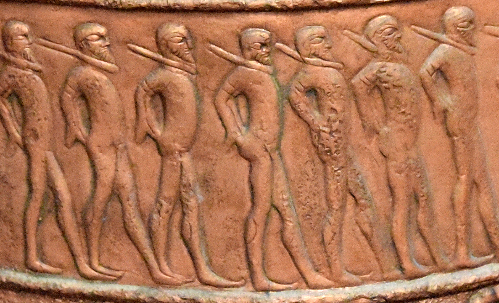

# Human-made Things in the Bible

## License Information

Human-made Things in the Bible © United Bible Societies, 2025. Adapted from: <cite>The Works of Their Hands: Man-made Things in the Bible</cite>, by Ray Pritz © 2009 United Bible Societies. This work is licensed under Creative Commons Attribution-ShareAlike 4.0 International (<a href="https://creativecommons.org/licenses/by-sa/4.0/">https://creativecommons.org/licenses/by-sa/4.0/</a>).

--------------------------------

## 標題：軛（yoke） (id: REALIA:1.1.1)

1\.1\.1 標題：軛（yoke）
==================

經文出處
----

Hebrew 來： מוֹט, מוֹטָה (音譯： mot, motah)

[LEV 26:13](https://ref.ly/Lev26:13), [ISA 58:6](https://ref.ly/Isa58:6), [ISA 58:6](https://ref.ly/Isa58:6), [ISA 58:9](https://ref.ly/Isa58:9), [JER 27:2](https://ref.ly/Jer27:2), [JER 28:10](https://ref.ly/Jer28:10), [JER 28:12](https://ref.ly/Jer28:12), [JER 28:13](https://ref.ly/Jer28:13), [JER 28:13](https://ref.ly/Jer28:13), [EZK 30:18](https://ref.ly/Ezek30:18), [EZK 34:27](https://ref.ly/Ezek34:27), [NAM 1:13](https://ref.ly/Nah1:13)

Hebrew 來： עֹל (音譯： ‘ol)

[GEN 27:40](https://ref.ly/Gen27:40), [LEV 26:13](https://ref.ly/Lev26:13), [NUM 19:2](https://ref.ly/Num19:2), [DEU 21:3](https://ref.ly/Deut21:3), [DEU 28:48](https://ref.ly/Deut28:48), [1SA 6:7](https://ref.ly/1Sam6:7), [1KI 12:4](https://ref.ly/1Kgs12:4), [1KI 12:4](https://ref.ly/1Kgs12:4), [1KI 12:11](https://ref.ly/1Kgs12:11), [1KI 12:11](https://ref.ly/1Kgs12:11), [1KI 12:14](https://ref.ly/1Kgs12:14), [1KI 12:14](https://ref.ly/1Kgs12:14), [2CH 10:4](https://ref.ly/2Chr10:4), [2CH 10:4](https://ref.ly/2Chr10:4), [2CH 10:11](https://ref.ly/2Chr10:11), [2CH 10:11](https://ref.ly/2Chr10:11), [2CH 10:14](https://ref.ly/2Chr10:14), [ISA 9:3](https://ref.ly/Isa9:3), [ISA 10:27](https://ref.ly/Isa10:27), [ISA 10:27](https://ref.ly/Isa10:27), [ISA 14:25](https://ref.ly/Isa14:25), [ISA 47:6](https://ref.ly/Isa47:6), [JER 2:20](https://ref.ly/Jer2:20), [JER 5:5](https://ref.ly/Jer5:5), [JER 27:8](https://ref.ly/Jer27:8), [JER 27:11](https://ref.ly/Jer27:11), [JER 27:12](https://ref.ly/Jer27:12), [JER 28:2](https://ref.ly/Jer28:2), [JER 28:4](https://ref.ly/Jer28:4), [JER 28:11](https://ref.ly/Jer28:11), [JER 28:14](https://ref.ly/Jer28:14), [JER 30:8](https://ref.ly/Jer30:8), [LAM 1:14](https://ref.ly/Lam1:14), [LAM 3:27](https://ref.ly/Lam3:27), [EZK 34:27](https://ref.ly/Ezek34:27), [HOS 11:4](https://ref.ly/Hos11:4)

Greek 希： βοοζύγιον (音譯： boozugion)

[SIR 26:7](https://ref.ly/Sir26:7)

Greek 希： ἑτεροζυγέω (音譯： heterozugeō)

[2CO 6:14](https://ref.ly/2Cor6:14)

Greek 希： κλοιός (音譯： kloios)

[SIR 6:24](https://ref.ly/Sir6:24), [SIR 6:29](https://ref.ly/Sir6:29), [SIR 21:25](https://ref.ly/Sir21:25)

Greek 希： ζυγός (音譯： zugos)

[MAT 11:29](https://ref.ly/Matt11:29), [MAT 11:30](https://ref.ly/Matt11:30), [ACT 15:10](https://ref.ly/Acts15:10), [GAL 5:1](https://ref.ly/Gal5:1), [1TI 6:1](https://ref.ly/1Tim6:1), [SIR 28:19](https://ref.ly/Sir28:19), [SIR 28:20](https://ref.ly/Sir28:20), [SIR 28:20](https://ref.ly/Sir28:20), [SIR 28:25](https://ref.ly/Sir28:25), [SIR 33:27](https://ref.ly/Sir33:27), [SIR 40:1](https://ref.ly/Sir40:1), [SIR 42:4](https://ref.ly/Sir42:4), [SIR 51:26](https://ref.ly/Sir51:26), [1MA 8:18](https://ref.ly/1Macc8:18), [1MA 8:31](https://ref.ly/1Macc8:31), [1MA 13:41](https://ref.ly/1Macc13:41), [3MA 4:9](https://ref.ly/3Macc4:9), [PSS 7:9](https://ref.ly/PssSol7:9), [PSS 17:30](https://ref.ly/PssSol17:30)

描述
--

軛是一根木杆或一個木架子，通常架在兩頭役畜的脖子上，將其連在一起，這樣牲畜就可以更有效率地一起拉犁、拉脫粒板、拉耙或拉車。另外也有人背的軛，但通常是給一個人使用的索具。

---

用途
--

*被枷鎖的奴隸 (© Osama Shukir Muhammed Amin FRCP(Glasg), CC BY\-SA 4\.0, via Wikimedia Commons)*

軛通過項圈固定在牲畜的脖子上，項圈是由木頭、藤條或繩子製成。軛的中間用繩索或杆子連接到需要牽拉的物件上，這樣兩頭牲畜就能並排一起牽拉。有時，人們也會把軛放在俘虜（[JER 28:10](https://ref.ly/Jer28:10) ）或奴隸的身上，以限制他們移動或防止他們逃跑。

---

翻譯
--

如果當地文化不知道或不熟悉役畜負軛，翻譯者可以將[NUM 19:2](https://ref.ly/Num19:2) （以及[DEU 21:3](https://ref.ly/Deut21:3) ）中原文字面意為「未曾負過軛的」一語譯為：「未曾乾過活的」（GNT (Good News Translation (1992)) 直譯）。

在所有新約經文和部分舊約經文中，「軛」用作比喻，象徵奴僕的服從和被奴役的狀態。在這種情況下（如：[LEV 26:13](https://ref.ly/Lev26:13) ；[ISA 10:27](https://ref.ly/Isa10:27) ；[JER 28:2](https://ref.ly/Jer28:2) ，[JER 28:14](https://ref.ly/Jer28:14) ，[JER 30:8](https://ref.ly/Jer30:8) ；[EZK 34:27](https://ref.ly/Ezek34:27) ；[NAM 1:13](https://ref.ly/Nah1:13) ；[ACT 15:10](https://ref.ly/Acts15:10) ；[GAL 5:1](https://ref.ly/Gal5:1) ；[1TI 6:1](https://ref.ly/1Tim6:1) ），翻譯者可以不按照字面意思來翻譯，而是將其喻意表達出來（[LEV 26:13](https://ref.ly/Lev26:13) 「……我打碎了壓制你們的權勢……」；GNT (Good News Translation (1992)) 直譯）。同樣，[SIR 40:1](https://ref.ly/Sir40:1) 可以譯成「……沉重的擔子壓在我們所有人身上……」（GNT (Good News Translation (1992)) 直譯）。

[LAM 5:5](https://ref.ly/Lam5:5) 中可能提到了「軛」，參《〈耶利米哀歌〉手冊》（*A Handbook on Lamentations* ）第134頁中的註解。

在[SIR 33:27](https://ref.ly/Sir33:27) 中，負軛意指戴著特製的「索具」或「項圈」。這是一種套在脖子上的繩子、皮條、藤條或木製物品，軛就連接在這個物品上面。在這節經文中，它與控制牲畜的動作有關，因此ITCL (Italian Common Language Version) 將這個詞譯為「韁繩」。在[SIR 6:24](https://ref.ly/Sir6:24); [SIR 6:29](https://ref.ly/Sir6:29) 中，*kloios* 是一個象徵。在許多語言中，可以保留鎖鏈和軛等詞語。然而，如果某種語言不允許這樣使用，那麼可以譯成「讓你的所有行為都受智慧管治」（6:24），以及「如果你讓智慧管治你，你就會保有平安，你就能掌管發生在你身上的事」（6:29）。

* **Associated Passages:** 利未記 26:13; 以賽亞書 58:6; 以賽亞書 58:9; 耶利米書 27:2; 耶利米書 28:10; 耶利米書 28:12; 耶利米書 28:13; 以西結書 30:18; 以西結書 34:27; 那鴻書 1:13; 創世記 27:40; 民數記 19:2; 申命記 21:3; 申命記 28:48; 撒母耳記上 6:7; 列王紀上 12:4; 列王紀上 12:11; 列王紀上 12:14; 歷代志下 10:4; 歷代志下 10:11; 歷代志下 10:14; 以賽亞書 9:3; 以賽亞書 10:27; 以賽亞書 14:25; 以賽亞書 47:6; 耶利米書 2:20; 耶利米書 5:5; 耶利米書 27:8; 耶利米書 27:11; 耶利米書 27:12; 耶利米書 28:2; 耶利米書 28:4; 耶利米書 28:11; 耶利米書 28:14; 耶利米書 30:8; 耶利米哀歌 1:14; 耶利米哀歌 3:27; 何西阿書 11:4; 德訓篇 26:7; 哥林多後書 6:14; 德訓篇 6:24; 德訓篇 6:29; 德訓篇 21:25; 馬太福音 11:29; 馬太福音 11:30; 使徒行傳 15:10; 加拉太書 5:1; 提摩太前書 6:1; 德訓篇 28:19; 德訓篇 28:20; 德訓篇 28:25; 德訓篇 33:27; 德訓篇 40:1; 德訓篇 42:4; 德訓篇 51:26; 瑪加伯上 8:18; 瑪加伯上 8:31; 瑪加伯上 13:41; 瑪加伯三書 4:9; 所羅門詩篇 7:9; 所羅門詩篇 17:30; 耶利米哀歌 5:5

