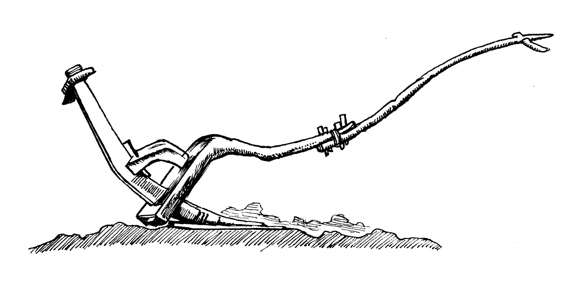

# Human-made Things in the Bible

## License Information

Human-made Things in the Bible © United Bible Societies, 2025. Adapted from: <cite>The Works of Their Hands: Man-made Things in the Bible</cite>, by Ray Pritz © 2009 United Bible Societies. This work is licensed under Creative Commons Attribution-ShareAlike 4.0 International (<a href="https://creativecommons.org/licenses/by-sa/4.0/">https://creativecommons.org/licenses/by-sa/4.0/</a>).

--------------------------------

## 標題：犁、犁頭（Plow and plowshare） (id: REALIA:1.1.5)

1\.1\.5 標題：犁、犁頭（Plow and plowshare）
===================================

經文出處
----

Hebrew 來： אֵת (音譯： ’eth)

[1SA 13:20](https://ref.ly/1Sam13:20), [1SA 13:21](https://ref.ly/1Sam13:21), [ISA 2:4](https://ref.ly/Isa2:4), [JOL 4:10](https://ref.ly/Joel4:10), [MIC 4:3](https://ref.ly/Mic4:3)

Hebrew 來： חרשׁ (音譯： charash（動詞）)

[DEU 22:10](https://ref.ly/Deut22:10), [JDG 14:18](https://ref.ly/Judg14:18), [1SA 8:12](https://ref.ly/1Sam8:12), [1KI 19:19](https://ref.ly/1Kgs19:19), [JOB 1:14](https://ref.ly/Job1:14), [JOB 4:8](https://ref.ly/Job4:8), [PSA 129:3](https://ref.ly/Ps129:3), [PSA 129:3](https://ref.ly/Ps129:3), [PRO 20:4](https://ref.ly/Prov20:4), [ISA 28:24](https://ref.ly/Isa28:24), [ISA 28:24](https://ref.ly/Isa28:24), [JER 26:18](https://ref.ly/Jer26:18), [HOS 10:11](https://ref.ly/Hos10:11), [HOS 10:13](https://ref.ly/Hos10:13), [AMO 6:12](https://ref.ly/Amos6:12), [AMO 9:13](https://ref.ly/Amos9:13), [MIC 3:12](https://ref.ly/Mic3:12)

Greek 希： ἀροτριάω (音譯： arotriaō（動詞）)

[LUK 17:7](https://ref.ly/Luke17:7), [1CO 9:10](https://ref.ly/1Cor9:10), [1CO 9:10](https://ref.ly/1Cor9:10), [SIR 6:19](https://ref.ly/Sir6:19), [SIR 7:12](https://ref.ly/Sir7:12)

Greek 希： ἄροτρον (音譯： arotron)

[LUK 9:62](https://ref.ly/Luke9:62), [SIR 38:25](https://ref.ly/Sir38:25)

描述
--

*埃及耕犁模型 (Metropolitan Museum of Art, Public domain, MMA)*

犁是一個扁平的三角形刃片（「犁頭」），由硬木或金屬製成，連接著一個把手。犁頭還有一種設計，是在木棒上面包著一個圓柱形的帶尖金屬套筒。把手上面繫著繩子或木棒，然後與軛連在一起，由一隻或多隻牲畜牽拉。

---

用途
--

犁用來破開土壤，為播種或種植幼苗做準備。撒好種子後，有時會再次翻耕土壤來蓋住種子，以免被鳥吃掉或被太陽曬死。犁頭的尖端會在地上破開一道淺溝。犁並不翻起土壤，只是破開土地表層，深度很少超過25厘米（10英吋）。犁可以由人來拉，但更多時候是用牛或驢，人走在後面指揮著牲畜，同時扶住犁以掌握方向和破土深度。

*鋤犁 (© Deutsche Bibelgesellschaft, Stuttgart by United Bible Societies)*

有學者提出，*’eth* 是一種在真正耕犁之前劃開土壤的銳利農具。

---

翻譯
--

在世界大多數地區，人們至少會知道某種類型的犁。如果當地人不知道犁，翻譯者可以使用翻土所用的某種農具作為譯詞，例如「鋤頭」。但是，如果經文講的是用牲畜耕地，就不能這樣翻譯（如[DEU 22:10](https://ref.ly/Deut22:10) ；[1KI 19:19](https://ref.ly/1Kgs19:19) ）。在[ISA 2:4](https://ref.ly/Isa2:4) 、[JOL 4:10](https://ref.ly/Joel4:10) 和[MIC 4:3](https://ref.ly/Mic4:3) 中，*’eth* 強調的是犁頭和刀在外形上很相似。如果目標語言文化不知道犁，翻譯者在這些經文中可以用其他農具來替代，不過這種農具應該可以很合理地用劍、大砍刀或彎刀改鑄而成。

希伯來文動詞*charash* 在幾處經文中是比喻用法。在[JER 26:18](https://ref.ly/Jer26:18) 和[MIC 3:12](https://ref.ly/Mic3:12) ，這個詞說的是耶路撒冷被完全毀滅；在[JOB 4:8](https://ref.ly/Job4:8) 和[HOS 10:13](https://ref.ly/Hos10:13) ，這個詞的意思是行惡將帶來惡果。關於耕犁在[PSA 129:3](https://ref.ly/Ps129:3) 中的比喻用法，參《〈詩篇〉手冊》（*A Handbook on Psalms* ）第1080頁。

* **Associated Passages:** 撒母耳記上 13:20; 撒母耳記上 13:21; 以賽亞書 2:4; 約珥書 4:10; 彌迦書 4:3; 申命記 22:10; 士師記 14:18; 撒母耳記上 8:12; 列王紀上 19:19; 約伯記 1:14; 約伯記 4:8; 詩篇 129:3; 箴言 20:4; 以賽亞書 28:24; 耶利米書 26:18; 何西阿書 10:11; 何西阿書 10:13; 阿摩司書 6:12; 阿摩司書 9:13; 彌迦書 3:12; 路加福音 17:7; 哥林多前書 9:10; 德訓篇 6:19; 德訓篇 7:12; 路加福音 9:62; 德訓篇 38:25

