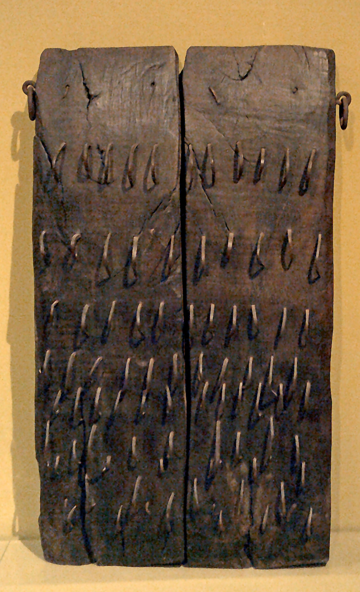
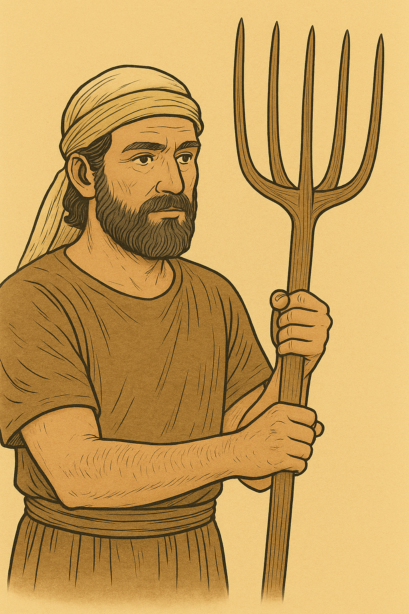

# Human-made Things in the Bible

## License Information

Human-made Things in the Bible © United Bible Societies, 2025. Adapted from: <cite>The Works of Their Hands: Man-made Things in the Bible</cite>, by Ray Pritz © 2009 United Bible Societies. This work is licensed under Creative Commons Attribution-ShareAlike 4.0 International (<a href="https://creativecommons.org/licenses/by-sa/4.0/">https://creativecommons.org/licenses/by-sa/4.0/</a>).

--------------------------------

## 標題：打穀機、脫粒板（threshing board, sledge） (id: REALIA:1.1.8.2)

1\.1\.8\.2 標題：打穀機、脫粒板（threshing board, sledge）
==============================================

經文出處
----

Hebrew 來： חָרוּץ (音譯： charuts)

[JOB 41:22](https://ref.ly/Job41:22), [ISA 28:27](https://ref.ly/Isa28:27), [ISA 41:15](https://ref.ly/Isa41:15), [AMO 1:3](https://ref.ly/Amos1:3)

Hebrew 來： מוֹרַג (音譯： morag)

[2SA 24:22](https://ref.ly/2Sam24:22), [1CH 21:23](https://ref.ly/1Chr21:23), [ISA 41:15](https://ref.ly/Isa41:15)

Hebrew 來： עֲגָלָה (音譯： ‘agalah, ‘eglah)

[ISA 28:27](https://ref.ly/Isa28:27), [ISA 28:28](https://ref.ly/Isa28:28)

描述
--

*脫粒板底部 (© Renyrt, CC BY\-SA 3\.0, via Wikimedia Commons)*

脫粒板是一個木製的平板型農具，用一塊木板或者幾塊木板並排連接而成，大小約為1\.5×1米（5×3英呎）。在板的一面鑿出一些小孔，裡面牢牢嵌入堅硬的尖石子（燧石或玄武岩）或金屬片。

---

用途
--

*鐵製脫粒板 (© CarlosVdeHabsburgo, CC BY\-SA 4\.0, via Wikimedia Commons)*

將脫粒板帶有尖石的一側朝下，用繩子套在牲畜上，然後碾過割下來的麥子。為了增加器具的重量（和效率），農夫可以站在或坐在板上面。當嵌著石頭的脫粒板碾過麥子時，麥稈與麥粒分離，麥粒與外皮分離，同時麥稈被軋碎成糠。參上面的[1\.1\.8 脫粒和揚場 (threshing and winnowing)\<REALIA:1\.1\.8\>](#) 。

---

翻譯
--

*(Image generated by ChatGPT using OpenAI technology)*

[ISA 28:27](https://ref.ly/Isa28:27); [ISA 28:28](https://ref.ly/Isa28:28) 使用了多個詞語來表示功能類似的器具。希伯來文*‘agalah* ／*‘eglah* 可能是一個裝著鋒利圓盤的打穀機，頂部有一個座位。第27節提到這種農具是為了說明：經文提到的孜然和蒔蘿種子太小了，不能像小麥和大麥等較大的穀物那樣用脫粒板來脫粒。希伯來文*charuts* 可能是指裝著鐵釘而非石子的脫粒板。第27節的*’ofan* 指的是小推車的輪子（參[8\.3 輪、車輪 (wheel)\<REALIA:8\.3\>](#) ）。

[AMO 1:3](https://ref.ly/Amos1:3) 提到「鐵的脫粒板」（RSV (Revised Standard Version (1952)) 直譯），這不是說脫粒板的平板是用鐵製成的，而是說木製平板上突出來的不是常用的石頭，而是大鐵釘。[AMO 1:3](https://ref.ly/Amos1:3) 中的這個表達可能是比喻，如果這個比喻在某種文化中會失去意義，那麼經文的後半部分可以擴展譯為，「因為他們毀滅了基列人，就像有人用裝著鐵釘的脫粒板打穀一樣。」或者也可以不使用比喻，譯成「他們野蠻、殘忍地對待基列人」（GNT (Good News Translation (1992)) 直譯）。

* **Associated Passages:** 約伯記 41:22; 以賽亞書 28:27; 以賽亞書 41:15; 阿摩司書 1:3; 撒母耳記下 24:22; 歷代志上 21:23; 以賽亞書 28:28

