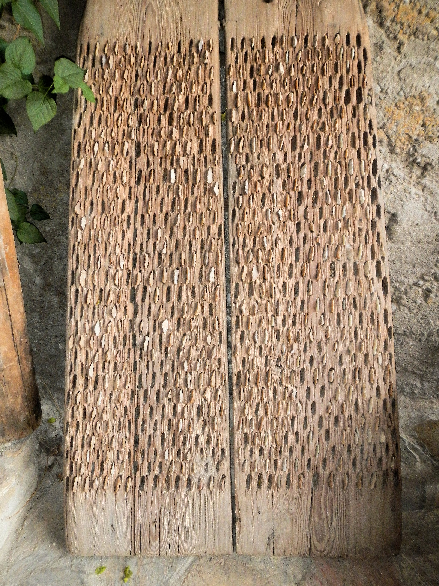

# Human-made Things in the Bible

## License Information

Human-made Things in the Bible © United Bible Societies, 2025. Adapted from: <cite>The Works of Their Hands: Man-made Things in the Bible</cite>, by Ray Pritz © 2009 United Bible Societies. This work is licensed under Creative Commons Attribution-ShareAlike 4.0 International (<a href="https://creativecommons.org/licenses/by-sa/4.0/">https://creativecommons.org/licenses/by-sa/4.0/</a>).

--------------------------------

## 標題：脫粒和揚場（threshing and winnowing） (id: REALIA:1.1.8)

1\.1\.8 標題：脫粒和揚場（threshing and winnowing）
=========================================

脫粒就是使麥粒與麥稈分離，方法是用連枷擊打，或是用牲畜踩踏，或是讓牲畜拖著脫粒板從麥稈上面壓過（參[1\.1\.8\.2 打穀機、脫粒板 (threshing board, sledge)\<REALIA:1\.1\.8\.2\>](#) ）

揚場就是用揚場木杈（參[1\.1\.8\.3 揚場木杈 (winnowing fork)\<REALIA:1\.1\.8\.3\>](#) ）或簸箕（參[1\.1\.8\.4 篩子、篩籮、簸箕 (sieve, winnowing basket)\<REALIA:1\.1\.8\.4\>](#) ）將麥稈、麥糠、麥粒和灰塵的混合物揚到風中。較重的麥粒會落在禾場的地面上或簸箕裡，而風會帶走灰塵、麥糠和麥稈。麥稈與麥穗分開後，可以作為牲畜的飼料。

以色列地區通常在下午兩點左右開始刮風，並且一直持續到深夜。揚場時的風不能太大，因此傍晚是揚場的最佳時間。

揚場的第一步是篩掉麥粒中的異物。人們會使用較淺的圓形篩籮，篩籮的底部有用藤條、皮革、樹皮、乾草等條狀物做成的網眼。

如果目標語言沒有表示揚場的詞語，翻譯者可以使用描述性的短語；例如，「把穀物中的灰塵抖出去」，「把穀物與麥糠分開」，或「把穀物與葉子分開」。

## 標題：禾場（threshing floor） (id: REALIA:1.1.8.1)

1\.1\.8\.1 標題：禾場（threshing floor）
=================================

經文出處
----

Aramaic 蘭：אִדְּרֵי (音譯： ’idar)

[DAN 2:35](https://ref.ly/Dan2:35)

Hebrew 來： גֹּרֶן (音譯： goren)

[NUM 15:20](https://ref.ly/Num15:20), [NUM 18:27](https://ref.ly/Num18:27), [NUM 18:30](https://ref.ly/Num18:30), [DEU 15:14](https://ref.ly/Deut15:14), [DEU 16:13](https://ref.ly/Deut16:13), [JDG 6:37](https://ref.ly/Judg6:37), [RUT 3:2](https://ref.ly/Ruth3:2), [RUT 3:3](https://ref.ly/Ruth3:3), [RUT 3:6](https://ref.ly/Ruth3:6), [RUT 3:14](https://ref.ly/Ruth3:14), [1SA 23:1](https://ref.ly/1Sam23:1), [2SA 24:16](https://ref.ly/2Sam24:16), [2SA 24:18](https://ref.ly/2Sam24:18), [2SA 24:21](https://ref.ly/2Sam24:21), [2SA 24:24](https://ref.ly/2Sam24:24), [1KI 22:10](https://ref.ly/1Kgs22:10), [2KI 6:27](https://ref.ly/2Kgs6:27), [1CH 21:15](https://ref.ly/1Chr21:15), [1CH 21:18](https://ref.ly/1Chr21:18), [1CH 21:21](https://ref.ly/1Chr21:21), [1CH 21:22](https://ref.ly/1Chr21:22), [1CH 21:28](https://ref.ly/1Chr21:28), [2CH 3:1](https://ref.ly/2Chr3:1), [2CH 18:9](https://ref.ly/2Chr18:9), [JOB 39:12](https://ref.ly/Job39:12), [ISA 21:10](https://ref.ly/Isa21:10), [JER 2:25](https://ref.ly/Jer2:25), [JER 51:33](https://ref.ly/Jer51:33), [HOS 9:1](https://ref.ly/Hos9:1), [HOS 9:2](https://ref.ly/Hos9:2), [HOS 13:3](https://ref.ly/Hos13:3), [JOL 2:24](https://ref.ly/Joel2:24), [MIC 4:12](https://ref.ly/Mic4:12)

Greek 希： ἅλων (音譯： halōn)

[MAT 3:12](https://ref.ly/Matt3:12), [LUK 3:17](https://ref.ly/Luke3:17)

Latin 拉： area

[2ES 4:30](https://ref.ly/2Esd4:30), [2ES 4:39](https://ref.ly/2Esd4:39), [2ES 9:17](https://ref.ly/2Esd9:17)

描述
--

*打穀場 (© Klearchos Kapoutsis, CC BY 2\.0, via Wikimedia Commons)*

禾場是一塊平坦的圓形區域，直徑約7\.5—12米（25—40英呎），通常位於種植穀物的田地附近，並且盡量選在有風吹過的高處（參[1\.1\.8\.3 揚場木杈 (winnowing fork)\<REALIA:1\.1\.8\.3\>](#) ）。禾場通常位於村莊附近，以便保護穀物。禾場可以是基岩，也可以是夯實的泥地。禾場的邊緣常會圍上石塊，將穀物圍在其中。

---

用途
--

割下麥子之後，還需要將子粒與麥稈和外殼分離。割下的麥子擺放在禾場上。麥稈和外殼與子粒分離的方法有以下幾種：（1）將脫粒板從麥子上方拖過去（參[1\.1\.8\.2 打穀機、脫粒板 (threshing board, sledge)\<REALIA:1\.1\.8\.2\>](#) ）；（2）讓牲畜在麥子上面來回踩踏；（3）用工具敲打。

---

翻譯
--

在[JER 51:33](https://ref.ly/Jer51:33) 和[MIC 4:12](https://ref.ly/Mic4:12) ，用於踹穀的禾場象徵著審判或刑罰。如果人們不知道穀物脫粒的過程，或者不明白穀物脫粒是什麼意思，那麼翻譯者可以明白表述；例如，[MIC 4:12](https://ref.ly/Mic4:12) b可以譯成，「他們沒有意識到他們已被聚集在一起受懲罰，就像穀物被運到禾場脫粒那樣」（GNT (Good News Translation (1992)) 直譯）。另外，比較《〈馬太福音〉手冊》（*A Handbook on The Gospel of Matthew* ，第70頁）關於[MAT 3:12](https://ref.ly/Matt3:12) 的另一種建議譯法：「他預備好進行審判，將好人與壞人分開，就像農夫準備用簸箕將麥子與麥糠分開；他將保證好人的安全，就像農夫將麥子放入糧倉；他必將惡人扔在永不止息的火中焚燒，就像農夫清除禾場上的糠秕，將其燒掉一樣。」

在[MAT 3:12](https://ref.ly/Matt3:12) 和[LUK 3:17](https://ref.ly/Luke3:17) ，*halōn* 一詞表示「禾場」的意思進行了引申，這裡是指仍然留在禾場上面的、已脫粒的穀物。如果將這裡原文字面意為「要揚淨他的禾場」一語譯為「他要徹底揚淨所有的穀物」，那麼經文的意思就會十分清楚。另一方面，翻譯者也可以字面解釋這兩處新約經文中*halōn* 的意思，譯為「他要揚淨他的禾場」，意即聚攏穀物並去除麥稈和麥糠。

* **Associated Passages:** 但以理書 2:35; 民數記 15:20; 民數記 18:27; 民數記 18:30; 申命記 15:14; 申命記 16:13; 士師記 6:37; 路得記 3:2; 路得記 3:3; 路得記 3:6; 路得記 3:14; 撒母耳記上 23:1; 撒母耳記下 24:16; 撒母耳記下 24:18; 撒母耳記下 24:21; 撒母耳記下 24:24; 列王紀上 22:10; 列王紀下 6:27; 歷代志上 21:15; 歷代志上 21:18; 歷代志上 21:21; 歷代志上 21:22; 歷代志上 21:28; 歷代志下 3:1; 歷代志下 18:9; 約伯記 39:12; 以賽亞書 21:10; 耶利米書 2:25; 耶利米書 51:33; 何西阿書 9:1; 何西阿書 9:2; 何西阿書 13:3; 約珥書 2:24; 彌迦書 4:12; 馬太福音 3:12; 路加福音 3:17; 厄斯德拉下 4:30; 厄斯德拉下 4:39; 厄斯德拉下 9:17

* **Associated ACAI Concepts:** Threshing Floor (ID: `realia:ThreshingFloor`)

## 標題：打穀機、脫粒板（threshing board, sledge） (id: REALIA:1.1.8.2)

1\.1\.8\.2 標題：打穀機、脫粒板（threshing board, sledge）
==============================================

經文出處
----

Hebrew 來： חָרוּץ (音譯： charuts)

[JOB 41:22](https://ref.ly/Job41:22), [ISA 28:27](https://ref.ly/Isa28:27), [ISA 41:15](https://ref.ly/Isa41:15), [AMO 1:3](https://ref.ly/Amos1:3)

Hebrew 來： מוֹרַג (音譯： morag)

[2SA 24:22](https://ref.ly/2Sam24:22), [1CH 21:23](https://ref.ly/1Chr21:23), [ISA 41:15](https://ref.ly/Isa41:15)

Hebrew 來： עֲגָלָה (音譯： ‘agalah, ‘eglah)

[ISA 28:27](https://ref.ly/Isa28:27), [ISA 28:28](https://ref.ly/Isa28:28)

描述
--

*脫粒板底部 (© Renyrt, CC BY\-SA 3\.0, via Wikimedia Commons)*

脫粒板是一個木製的平板型農具，用一塊木板或者幾塊木板並排連接而成，大小約為1\.5×1米（5×3英呎）。在板的一面鑿出一些小孔，裡面牢牢嵌入堅硬的尖石子（燧石或玄武岩）或金屬片。

---

用途
--

*鐵製脫粒板 (© CarlosVdeHabsburgo, CC BY\-SA 4\.0, via Wikimedia Commons)*

將脫粒板帶有尖石的一側朝下，用繩子套在牲畜上，然後碾過割下來的麥子。為了增加器具的重量（和效率），農夫可以站在或坐在板上面。當嵌著石頭的脫粒板碾過麥子時，麥稈與麥粒分離，麥粒與外皮分離，同時麥稈被軋碎成糠。參上面的[1\.1\.8 脫粒和揚場 (threshing and winnowing)\<REALIA:1\.1\.8\>](#) 。

---

翻譯
--

*(Image generated by ChatGPT using OpenAI technology)*

[ISA 28:27](https://ref.ly/Isa28:27); [ISA 28:28](https://ref.ly/Isa28:28) 使用了多個詞語來表示功能類似的器具。希伯來文*‘agalah* ／*‘eglah* 可能是一個裝著鋒利圓盤的打穀機，頂部有一個座位。第27節提到這種農具是為了說明：經文提到的孜然和蒔蘿種子太小了，不能像小麥和大麥等較大的穀物那樣用脫粒板來脫粒。希伯來文*charuts* 可能是指裝著鐵釘而非石子的脫粒板。第27節的*’ofan* 指的是小推車的輪子（參[8\.3 輪、車輪 (wheel)\<REALIA:8\.3\>](#) ）。

[AMO 1:3](https://ref.ly/Amos1:3) 提到「鐵的脫粒板」（RSV (Revised Standard Version (1952)) 直譯），這不是說脫粒板的平板是用鐵製成的，而是說木製平板上突出來的不是常用的石頭，而是大鐵釘。[AMO 1:3](https://ref.ly/Amos1:3) 中的這個表達可能是比喻，如果這個比喻在某種文化中會失去意義，那麼經文的後半部分可以擴展譯為，「因為他們毀滅了基列人，就像有人用裝著鐵釘的脫粒板打穀一樣。」或者也可以不使用比喻，譯成「他們野蠻、殘忍地對待基列人」（GNT (Good News Translation (1992)) 直譯）。

* **Associated Passages:** 約伯記 41:22; 以賽亞書 28:27; 以賽亞書 41:15; 阿摩司書 1:3; 撒母耳記下 24:22; 歷代志上 21:23; 以賽亞書 28:28

* **Associated ACAI Concepts:** Threshing-Sledge (ID: `realia:Threshing-sledge`)

## 標題：揚場木杈（winnowing fork） (id: REALIA:1.1.8.3)

1\.1\.8\.3 標題：揚場木杈（winnowing fork）
==================================

經文出處
----

Hebrew 來： זרה (音譯： zarah（動詞）)

[RUT 3:2](https://ref.ly/Ruth3:2), [PRO 20:8](https://ref.ly/Prov20:8), [PRO 20:26](https://ref.ly/Prov20:26), [ISA 30:24](https://ref.ly/Isa30:24), [ISA 41:16](https://ref.ly/Isa41:16), [JER 4:11](https://ref.ly/Jer4:11), [JER 15:7](https://ref.ly/Jer15:7), [JER 51:2](https://ref.ly/Jer51:2)

Hebrew 來： מִזְרֶה (音譯： mizreh)

[ISA 30:24](https://ref.ly/Isa30:24), [JER 15:7](https://ref.ly/Jer15:7)

Hebrew 來： רַחַת (音譯： rachath)

[ISA 30:24](https://ref.ly/Isa30:24)

Greek 希： λικμάω (音譯： likmaō（動詞）)

[SIR 5:9](https://ref.ly/Sir5:9)

Greek 希： πτύον (音譯： ptuon)

[MAT 3:12](https://ref.ly/Matt3:12), [LUK 3:17](https://ref.ly/Luke3:17)

描述
--

*(Image generated by ChatGPT using OpenAI technology)*

揚場木杈是一種木製的叉狀工具，有五到七個齒，用來將脫粒後的穀物扔向空中，這樣風就可以把麥子與麥稈、麥糠分離開來。

---

用途
--

參[1\.1\.8 脫粒和揚場 (threshing and winnowing)\<REALIA:1\.1\.8\>](#) 。

---

翻譯
--

*簸箕叉用於分離穀物和糠 (© Deutsche Bibelgesellschaft, Stuttgart by United Bible Societies)*

如果目標語言沒有表示「揚場木杈」的詞語，那麼翻譯者可以採用描述性的短語；例如，「用來把脫粒後的穀物扔向空中，好讓麥糠被風吹走的工具」。

希伯來文動詞*zarah* 的字面意思是「分散」，在聖經中指多種動作，包括揚場。

*木鏟，可能用於簸穀（水彩和石墨畫，阿奇湯普森（Archie Thompson），1938年） (National Gallery of Art, CC0, via Wikimedia Commons)*

希伯來文*rachath* 在聖經中只出現一次（[ISA 30:24](https://ref.ly/Isa30:24) ），其含義不明；可能是指一種木製工具，在長柄上固定一個長而扁平的刃片，就像是一把鐵鍬，但是用木頭製成。這節經文提到了兩種工具，用於揚場的不同步驟。經文的要點是：即使是給動物吃的食物，也進行了仔細的處理。有些譯本依循《七十士譯本》，因而不需要譯出工具的名稱；例如，「為你耕地的牛和驢也必吃最好的穀物」（CEV (Contemporary English Version) 直譯）。

在[SIR 5:9](https://ref.ly/Sir5:9) ，揚場用在一句諺語中。原文字面意為「不要在颳每一種風時都揚場，不要每一條路都走」，NRSV (New Revised Standard Version (1989)) 採用了直譯。但是，GNT (Good News Translation (1992)) 重新組織第9節和第10節的結構（將順序顛倒），這樣諺語的意思變成：「不要試圖取悅所有人，或同意人們所說的一切話。」

* **Associated Passages:** 路得記 3:2; 箴言 20:8; 箴言 20:26; 以賽亞書 30:24; 以賽亞書 41:16; 耶利米書 4:11; 耶利米書 15:7; 耶利米書 51:2; 德訓篇 5:9; 馬太福音 3:12; 路加福音 3:17

* **Associated ACAI Concepts:** Winnowing Fork (ID: `realia:WinnowingFork`)

## 標題：篩子、篩籮、簸箕（sieve, winnowing basket） (id: REALIA:1.1.8.4)

1\.1\.8\.4 標題：篩子、篩籮、簸箕（sieve, winnowing basket）
===============================================

經文出處
----

Hebrew 來： כְּבָרָה (音譯： kvarah)

[AMO 9:9](https://ref.ly/Amos9:9)

Hebrew 來： נָפָה (音譯： nafah)

[ISA 30:28](https://ref.ly/Isa30:28)

Hebrew 來： נוף (音譯： nuf)

[ISA 30:28](https://ref.ly/Isa30:28)

Greek 希： κόσκινον (音譯： koskinon)

[SIR 27:4](https://ref.ly/Sir27:4)

Greek 希： σινιάζω (音譯： siniazō（動詞）)

[LUK 22:31](https://ref.ly/Luke22:31)

描述
--

*用於分離穀物和糠的篩筐或篩網 (© Israel Government Press Office)*

揚場的第二個步驟是用淺而平的圓形篩子過篩穀物。篩子的底部有網眼，是用乾草、繩索、樹皮條或蘆葦編成。網眼的大小根據需要而定。

---

翻譯
--

有些語言可能會用不同的詞語來表示不同的篩子，如過濾穀物等乾貨的篩子，以及讓液體通過但是擋住固體物質的篩子。在上述所有經文中，這個詞指的都是第一種篩子。

[ISA 30:28](https://ref.ly/Isa30:28) ：這節經文的語境是在描述列國所受的刑罰和毀滅，該刑罰和毀滅在本節的第三行被比作來回搖晃篩子中的東西：「要用毀滅的篩子篩淨列國」（NRSV (New Revised Standard Version (1989)) 意同）。GECL (German Common Language Version (Gute Nachricht Bibel)) 將這一行中的四個希伯來文詞語擴展譯為：「他在篩子中震動列國，將它們扔出去，就像毫無價值的糠秕。」在有些語言中，即使這樣擴譯也仍然不能讓人充分理解，因此最好不要使用篩子的比喻。GNT (Good News Translation (1992)) 在這裡沒有使用篩子的比喻，在後續經文中也沒有使用在牲畜嘴裡放嚼環的比喻，而是將兩者合併，英文直譯作：「它［風］掃除列國，毀滅並終結它們的邪惡計謀。」我們查閱的幾乎所有譯本都力圖保留篩子的比喻。希伯來文*nafah* 可能是指一種比較細密的篩子，非常適合過濾麵粉等物。

*婦女用篩子篩穀物 (© Deutsche Bibelgesellschaft, Stuttgart by United Bible Societies)*

[AMO 9:9](https://ref.ly/Amos9:9) ：這裡表示篩子的希伯來文詞語可能指的是一種網眼比較大的篩子，麥子會漏下去，石頭則留在篩子裡面。泥水匠也使用類似的篩子，將較大的石頭與砂漿所用的細砂分開。因此，這裡的畫面可能是在篩穀物或沙子。翻譯者選擇哪個畫面其實並不重要，因為重點是沒有一塊石頭能穿過篩子漏下去。它們都會被擋住，然後被扔掉。

上帝命令以色列的仇敵這樣對待以色列：以色列人中沒有一個罪人能逃脫懲罰，就像沒有石頭能穿過篩子。因此，經文可以這樣翻譯，「我會搖動／篩濾以色列人，就像人過篩沙子（或譯：穀物），沒有一塊石子能穿過篩子掉到地上。我必搖晃／篩濾他們，除去其中的惡人。」

雖然[LUK 22:31](https://ref.ly/Luke22:31) 沒有提到「篩子」這個實物，但是提到了篩濾的動作。有些語言在翻譯這一句時，加上完成這個動作的工具會更加自然；比較ITCL (Italian Common Language Version) ，「……讓你們全部通過一個篩子，就像篩出穀物那樣。」

* **Associated Passages:** 阿摩司書 9:9; 以賽亞書 30:28; 德訓篇 27:4; 路加福音 22:31

* **Associated ACAI Concepts:** Sieve (ID: `realia:Sieve`)
