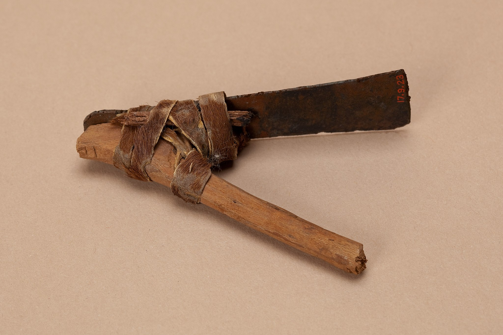

# Human-made Things in the Bible

## License Information

Human-made Things in the Bible © United Bible Societies, 2025. Adapted from: <cite>The Works of Their Hands: Man-made Things in the Bible</cite>, by Ray Pritz © 2009 United Bible Societies. This work is licensed under Creative Commons Attribution-ShareAlike 4.0 International (<a href="https://creativecommons.org/licenses/by-sa/4.0/">https://creativecommons.org/licenses/by-sa/4.0/</a>).

--------------------------------

## 標題：斧頭、錛（axe, adze） (id: REALIA:1.1.9.3)

1\.1\.9\.3 標題：斧頭、錛（axe, adze）
=============================

經文出處
----

Hebrew 來： בַּרְזֶל (音譯： barzel)

[DEU 19:5](https://ref.ly/Deut19:5), [2KI 6:5](https://ref.ly/2Kgs6:5), [2KI 6:6](https://ref.ly/2Kgs6:6), [ISA 10:34](https://ref.ly/Isa10:34)

Hebrew 來： גַּרְזֶן (音譯： garzen)

[DEU 19:5](https://ref.ly/Deut19:5), [DEU 20:19](https://ref.ly/Deut20:19), [1KI 6:7](https://ref.ly/1Kgs6:7), [ISA 10:15](https://ref.ly/Isa10:15)

Hebrew 來： מַעֲצָד (音譯： ma‘atsad)

[JER 10:3](https://ref.ly/Jer10:3)

Hebrew 來： קַרְדֹּם (音譯： qardom)

[JDG 9:48](https://ref.ly/Judg9:48), [1SA 13:20](https://ref.ly/1Sam13:20), [1SA 13:21](https://ref.ly/1Sam13:21), [PSA 74:5](https://ref.ly/Ps74:5), [JER 46:22](https://ref.ly/Jer46:22)

Greek 希： ἀξίνη (音譯： axinē)

[MAT 3:10](https://ref.ly/Matt3:10), [LUK 3:9](https://ref.ly/Luke3:9)

Greek 希： πέλεκυς (音譯： pelekus)

[LJE 1:13](https://ref.ly/EpJer1:13)

描述
--

*木柄錛 (Metropolitan Museum of Art, CC0, via Wikimedia Commons)*

斧或錛是一種帶有鋒利金屬刃的工具，金屬頭固定在一根木柄上，約為一個男子手臂的長度。木柄通常會牢牢楔入金屬頭上的一個孔內，孔和刃分別位於金屬頭的兩端，若用繩子纏繞金屬頭和手柄，可使其更加牢固。斧（*garzen* ）的刃與手柄平行，而錛（*qardom* ）的刃則垂直於手柄。

---

用途
--

*敘利亞和伊朗的各種青銅套筒斧頭和錛頭（公元前2–1千年，聖安東尼奧藝術博物館（San Antonio Museum of Art），近東藏品） (© Zereshk, CC BY\-SA 3\.0, via Wikimedia Commons)*

這種工具用來砍伐樹木和木本植物，將其劈成小塊，也是木匠用來砍削木材的工具之一。

---

翻譯
--

[LJE 1:13](https://ref.ly/EpJer1:13) 中提到的「斧子」很可能是一種武器而非手工工具。雖然斧子的形狀一般是相同的，但有些語言會用不同的詞語表示用來工作的斧子和用作武器的斧子。另外，翻譯者也可以比較寬泛地翻譯這節經文的前半部分，例如譯成「有時候他們拿著武器」。

* **Associated Passages:** 申命記 19:5; 列王紀下 6:5; 列王紀下 6:6; 以賽亞書 10:34; 申命記 20:19; 列王紀上 6:7; 以賽亞書 10:15; 耶利米書 10:3; 士師記 9:48; 撒母耳記上 13:20; 撒母耳記上 13:21; 詩篇 74:5; 耶利米書 46:22; 馬太福音 3:10; 路加福音 3:9; 耶利米書信 1:13

