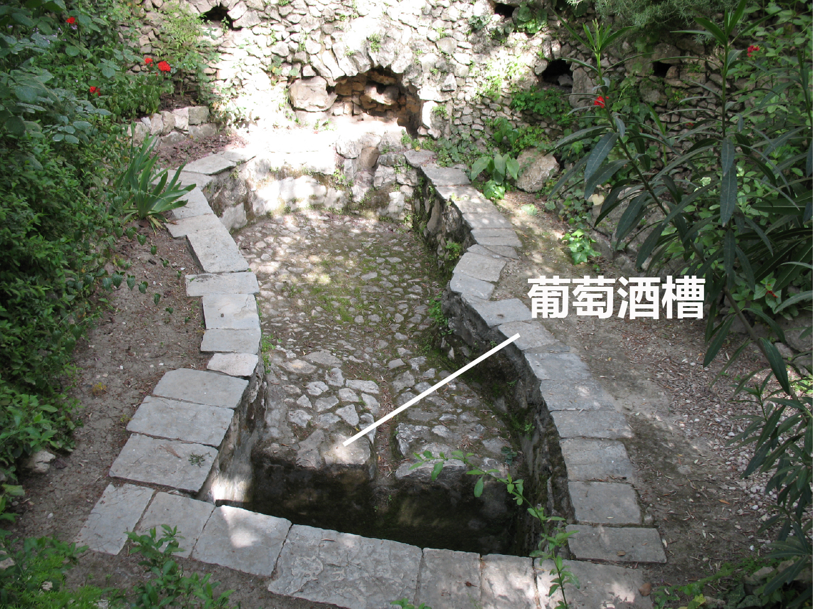

# Human-made Things in the Bible

## License Information

Human-made Things in the Bible © United Bible Societies, 2025. Adapted from: <cite>The Works of Their Hands: Man-made Things in the Bible</cite>, by Ray Pritz © 2009 United Bible Societies. This work is licensed under Creative Commons Attribution-ShareAlike 4.0 International (<a href="https://creativecommons.org/licenses/by-sa/4.0/">https://creativecommons.org/licenses/by-sa/4.0/</a>).

--------------------------------

## 標題：榨酒池、壓酒池（wine press） (id: REALIA:1.1.10)

1\.1\.10 標題：榨酒池、壓酒池（wine press）
===============================

經文出處
----

Hebrew 來： גַּת (音譯： gath)

[JDG 6:11](https://ref.ly/Judg6:11), [NEH 13:15](https://ref.ly/Neh13:15), [ISA 63:2](https://ref.ly/Isa63:2), [LAM 1:15](https://ref.ly/Lam1:15), [JOL 4:13](https://ref.ly/Joel4:13)

Hebrew 來： יֶקֶב (音譯： yeqev)

[NUM 18:27](https://ref.ly/Num18:27), [NUM 18:30](https://ref.ly/Num18:30), [DEU 15:14](https://ref.ly/Deut15:14), [DEU 16:13](https://ref.ly/Deut16:13), [JDG 7:25](https://ref.ly/Judg7:25), [2KI 6:27](https://ref.ly/2Kgs6:27), [JOB 24:11](https://ref.ly/Job24:11), [PRO 3:10](https://ref.ly/Prov3:10), [ISA 5:2](https://ref.ly/Isa5:2), [ISA 16:10](https://ref.ly/Isa16:10), [JER 48:33](https://ref.ly/Jer48:33), [HOS 9:2](https://ref.ly/Hos9:2), [JOL 2:24](https://ref.ly/Joel2:24), [JOL 4:13](https://ref.ly/Joel4:13), [HAG 2:16](https://ref.ly/Hag2:16), [ZEC 14:10](https://ref.ly/Zech14:10)

Hebrew 來： פּוּרָה (音譯： purah)

[ISA 63:3](https://ref.ly/Isa63:3)

Greek 希： ληνός (音譯： lēnos)

[MAT 21:33](https://ref.ly/Matt21:33), [REV 14:19](https://ref.ly/Rev14:19), [REV 14:20](https://ref.ly/Rev14:20), [REV 14:20](https://ref.ly/Rev14:20), [REV 19:15](https://ref.ly/Rev19:15), [SIR 33:17](https://ref.ly/Sir33:17)

Greek 希： ὑπολήνιον (音譯： hupolēnion)

[MRK 12:1](https://ref.ly/Mark12:1)

[MRK 12:1](https://ref.ly/Mark12:1) 中的希臘文*hupolēnion* 指的是葡萄酒槽／桶。

描述和用途
-----

*站在壓酒池中的男子 (© James Emery \- Wikimedia Commons)*

壓酒池是人們壓榨葡萄汁的地方，壓出來的葡萄汁用來釀製葡萄酒（參[9\.1 酒、葡萄酒 (wine)\<REALIA:9\.1\>](#) ）、葡萄醋和葡萄蜜。古時的壓酒池裡面有很大的踩踏平臺，人們在這個平臺上面踩碎葡萄以取得葡萄汁。根據具體地形，壓酒池可能比下圖所示的更大更淺。踩踏平臺下方會放置（或從岩石中鑿出來）一個槽或桶，讓剛剛壓出來的葡萄汁流進去。

---

翻譯
--

希伯來文*gath* 通常指踩踏平臺或整個壓汁設施，*yeqev* 指裝葡萄汁的桶。

「壓酒池」的對等描述可作：「壓出葡萄汁的地方」或「擠出葡萄汁的地方」（PV 在[MRK 12:1](https://ref.ly/Mark12:1) 中的處理類似）。SPCL (Spanish Common Language Version (Dios Habla Hoy)) 譯作「釀製葡萄酒的地方」（[JDG 6:11](https://ref.ly/Judg6:11) ）。「葡萄酒槽」可以使用描述性的短語，如「收集葡萄汁的地方」。

希伯來文*purah* 可指榨出來的葡萄汁的度量單位，或指在壓酒池中壓出葡萄汁的活動。在[ISA 63:3](https://ref.ly/Isa63:3) 中，大多數譯本都將這個詞譯為「壓酒池」。對於這節經文的第一行，NJPSV (New Jewish Publication Society Version) 的譯法更加準確，英文直譯作「我獨自踹盡葡萄。」GNT (Good News Translation (1992)) 直譯作「我像踹葡萄一樣踐踏列國」，CEV (Contemporary English Version) 直譯作「我獨自踹葡萄！」這些都是很好的譯法。

希臘文*lēnos* 的意思是凹處、洞、槽或坑。壓榨葡萄的整個過程需要使用多個這樣的凹處；一個凹處（在以色列地是一個平臺）用來放置葡萄以將其踩碎，還有一個或多個凹處用來接葡萄汁。*Lēnos* 可指其中任何一個凹處，通常可以譯為「壓碎葡萄的坑」（CEV (Contemporary English Version) 直譯；[MAT 21:33](https://ref.ly/Matt21:33) ）。

[MAT 21:33](https://ref.ly/Matt21:33) 使用了希臘文*lēnos* ，而平行經文[MRK 12:1](https://ref.ly/Mark12:1) 則使用了一個不同的希臘文詞語（*hupolēnion* ），這個詞是指*lēnos* 下面的一個坑，即「葡萄汁收集坑」，葡萄汁從上面踩碎葡萄的平臺流進這個坑裡面。（馬可這裡似乎依循《七十士譯本》對於《以賽亞書》5:2的理解，然而沒有採用《七十士譯本》的用詞。）很多譯本對這兩個詞採用了同樣的譯法，通常是「壓酒池」或對等詞。有些譯本（TOB (Traduction Oecuménique de la Bible (French, 1975)) 、NJB (New Jerusalem Bible (1985)) 、NRSV (New Revised Standard Version (1989)) 、NIV (New International Version (1984)) 、NASB (New American Standard Bible) ）在《馬可福音》中使用了不同的詞語或表達；例如，「壓酒池下面的大桶」（NASB (New American Standard Bible) 直譯）。

* **Associated Passages:** 士師記 6:11; 尼希米記 13:15; 以賽亞書 63:2; 耶利米哀歌 1:15; 約珥書 4:13; 民數記 18:27; 民數記 18:30; 申命記 15:14; 申命記 16:13; 士師記 7:25; 列王紀下 6:27; 約伯記 24:11; 箴言 3:10; 以賽亞書 5:2; 以賽亞書 16:10; 耶利米書 48:33; 何西阿書 9:2; 約珥書 2:24; 哈該書 2:16; 撒迦利亞書 14:10; 以賽亞書 63:3; 馬太福音 21:33; 啟示錄 14:19; 啟示錄 14:20; 啟示錄 19:15; 德訓篇 33:17; 馬可福音 12:1

* **Associated ACAI Concepts:** Winepress (ID: `realia:Winepress`); Must (ID: `realia:Must`)
