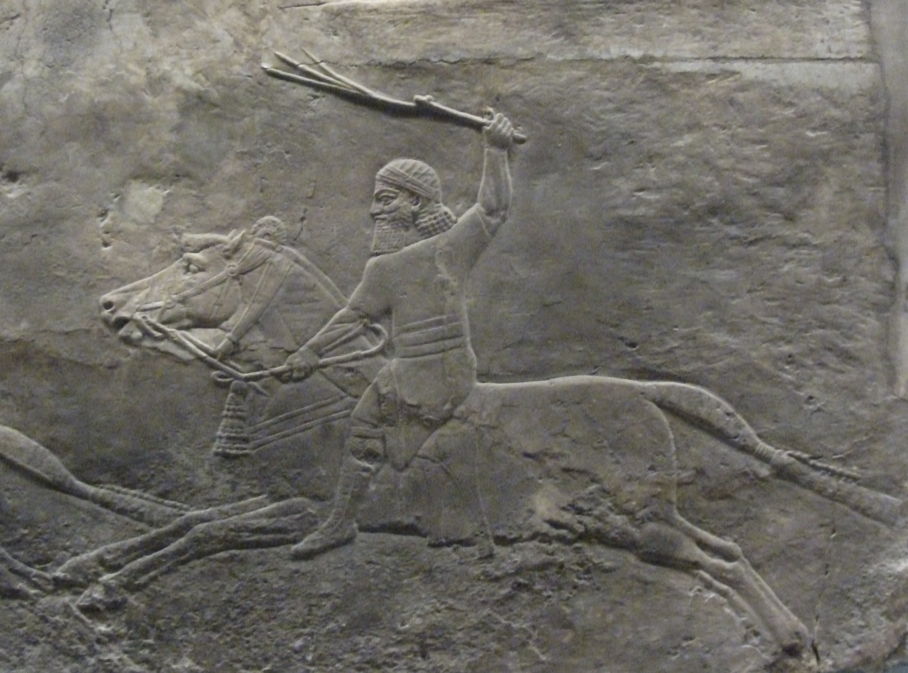
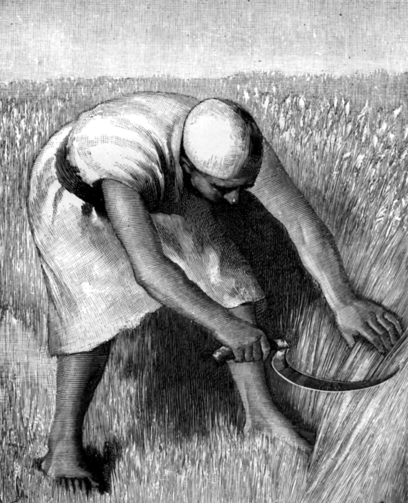
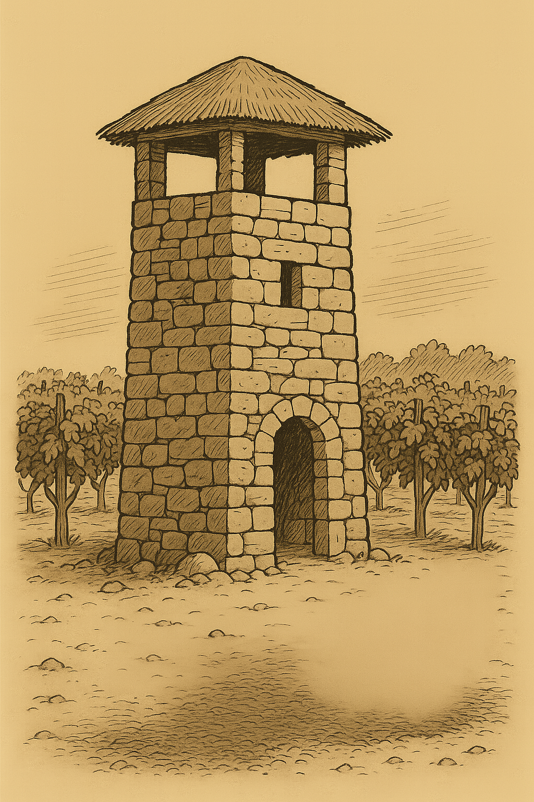

# Human-made Things in the Bible

## License Information

Human-made Things in the Bible © United Bible Societies, 2025. Adapted from: <cite>The Works of Their Hands: Man-made Things in the Bible</cite>, by Ray Pritz © 2009 United Bible Societies. This work is licensed under Creative Commons Attribution-ShareAlike 4.0 International (<a href="https://creativecommons.org/licenses/by-sa/4.0/">https://creativecommons.org/licenses/by-sa/4.0/</a>).

--------------------------------

## 標題：農業（agriculture and farming） (id: REALIA:1.1)

1\.1 標題：農業（agriculture and farming）
===================================

## 標題：軛（yoke） (id: REALIA:1.1.1)

1\.1\.1 標題：軛（yoke）
==================

經文出處
----

Hebrew 來： מוֹט, מוֹטָה (音譯： mot, motah)

[LEV 26:13](https://ref.ly/Lev26:13), [ISA 58:6](https://ref.ly/Isa58:6), [ISA 58:6](https://ref.ly/Isa58:6), [ISA 58:9](https://ref.ly/Isa58:9), [JER 27:2](https://ref.ly/Jer27:2), [JER 28:10](https://ref.ly/Jer28:10), [JER 28:12](https://ref.ly/Jer28:12), [JER 28:13](https://ref.ly/Jer28:13), [JER 28:13](https://ref.ly/Jer28:13), [EZK 30:18](https://ref.ly/Ezek30:18), [EZK 34:27](https://ref.ly/Ezek34:27), [NAM 1:13](https://ref.ly/Nah1:13)

Hebrew 來： עֹל (音譯： ‘ol)

[GEN 27:40](https://ref.ly/Gen27:40), [LEV 26:13](https://ref.ly/Lev26:13), [NUM 19:2](https://ref.ly/Num19:2), [DEU 21:3](https://ref.ly/Deut21:3), [DEU 28:48](https://ref.ly/Deut28:48), [1SA 6:7](https://ref.ly/1Sam6:7), [1KI 12:4](https://ref.ly/1Kgs12:4), [1KI 12:4](https://ref.ly/1Kgs12:4), [1KI 12:11](https://ref.ly/1Kgs12:11), [1KI 12:11](https://ref.ly/1Kgs12:11), [1KI 12:14](https://ref.ly/1Kgs12:14), [1KI 12:14](https://ref.ly/1Kgs12:14), [2CH 10:4](https://ref.ly/2Chr10:4), [2CH 10:4](https://ref.ly/2Chr10:4), [2CH 10:11](https://ref.ly/2Chr10:11), [2CH 10:11](https://ref.ly/2Chr10:11), [2CH 10:14](https://ref.ly/2Chr10:14), [ISA 9:3](https://ref.ly/Isa9:3), [ISA 10:27](https://ref.ly/Isa10:27), [ISA 10:27](https://ref.ly/Isa10:27), [ISA 14:25](https://ref.ly/Isa14:25), [ISA 47:6](https://ref.ly/Isa47:6), [JER 2:20](https://ref.ly/Jer2:20), [JER 5:5](https://ref.ly/Jer5:5), [JER 27:8](https://ref.ly/Jer27:8), [JER 27:11](https://ref.ly/Jer27:11), [JER 27:12](https://ref.ly/Jer27:12), [JER 28:2](https://ref.ly/Jer28:2), [JER 28:4](https://ref.ly/Jer28:4), [JER 28:11](https://ref.ly/Jer28:11), [JER 28:14](https://ref.ly/Jer28:14), [JER 30:8](https://ref.ly/Jer30:8), [LAM 1:14](https://ref.ly/Lam1:14), [LAM 3:27](https://ref.ly/Lam3:27), [EZK 34:27](https://ref.ly/Ezek34:27), [HOS 11:4](https://ref.ly/Hos11:4)

Greek 希： βοοζύγιον (音譯： boozugion)

[SIR 26:7](https://ref.ly/Sir26:7)

Greek 希： ἑτεροζυγέω (音譯： heterozugeō)

[2CO 6:14](https://ref.ly/2Cor6:14)

Greek 希： κλοιός (音譯： kloios)

[SIR 6:24](https://ref.ly/Sir6:24), [SIR 6:29](https://ref.ly/Sir6:29), [SIR 21:25](https://ref.ly/Sir21:25)

Greek 希： ζυγός (音譯： zugos)

[MAT 11:29](https://ref.ly/Matt11:29), [MAT 11:30](https://ref.ly/Matt11:30), [ACT 15:10](https://ref.ly/Acts15:10), [GAL 5:1](https://ref.ly/Gal5:1), [1TI 6:1](https://ref.ly/1Tim6:1), [SIR 28:19](https://ref.ly/Sir28:19), [SIR 28:20](https://ref.ly/Sir28:20), [SIR 28:20](https://ref.ly/Sir28:20), [SIR 28:25](https://ref.ly/Sir28:25), [SIR 33:27](https://ref.ly/Sir33:27), [SIR 40:1](https://ref.ly/Sir40:1), [SIR 42:4](https://ref.ly/Sir42:4), [SIR 51:26](https://ref.ly/Sir51:26), [1MA 8:18](https://ref.ly/1Macc8:18), [1MA 8:31](https://ref.ly/1Macc8:31), [1MA 13:41](https://ref.ly/1Macc13:41), [3MA 4:9](https://ref.ly/3Macc4:9), [PSS 7:9](https://ref.ly/PssSol7:9), [PSS 17:30](https://ref.ly/PssSol17:30)

描述
--

軛是一根木杆或一個木架子，通常架在兩頭役畜的脖子上，將其連在一起，這樣牲畜就可以更有效率地一起拉犁、拉脫粒板、拉耙或拉車。另外也有人背的軛，但通常是給一個人使用的索具。

---

用途
--

*被枷鎖的奴隸 (© Osama Shukir Muhammed Amin FRCP(Glasg), CC BY\-SA 4\.0, via Wikimedia Commons)*

軛通過項圈固定在牲畜的脖子上，項圈是由木頭、藤條或繩子製成。軛的中間用繩索或杆子連接到需要牽拉的物件上，這樣兩頭牲畜就能並排一起牽拉。有時，人們也會把軛放在俘虜（[JER 28:10](https://ref.ly/Jer28:10) ）或奴隸的身上，以限制他們移動或防止他們逃跑。

---

翻譯
--

如果當地文化不知道或不熟悉役畜負軛，翻譯者可以將[NUM 19:2](https://ref.ly/Num19:2) （以及[DEU 21:3](https://ref.ly/Deut21:3) ）中原文字面意為「未曾負過軛的」一語譯為：「未曾乾過活的」（GNT (Good News Translation (1992)) 直譯）。

在所有新約經文和部分舊約經文中，「軛」用作比喻，象徵奴僕的服從和被奴役的狀態。在這種情況下（如：[LEV 26:13](https://ref.ly/Lev26:13) ；[ISA 10:27](https://ref.ly/Isa10:27) ；[JER 28:2](https://ref.ly/Jer28:2) ，[JER 28:14](https://ref.ly/Jer28:14) ，[JER 30:8](https://ref.ly/Jer30:8) ；[EZK 34:27](https://ref.ly/Ezek34:27) ；[NAM 1:13](https://ref.ly/Nah1:13) ；[ACT 15:10](https://ref.ly/Acts15:10) ；[GAL 5:1](https://ref.ly/Gal5:1) ；[1TI 6:1](https://ref.ly/1Tim6:1) ），翻譯者可以不按照字面意思來翻譯，而是將其喻意表達出來（[LEV 26:13](https://ref.ly/Lev26:13) 「……我打碎了壓制你們的權勢……」；GNT (Good News Translation (1992)) 直譯）。同樣，[SIR 40:1](https://ref.ly/Sir40:1) 可以譯成「……沉重的擔子壓在我們所有人身上……」（GNT (Good News Translation (1992)) 直譯）。

[LAM 5:5](https://ref.ly/Lam5:5) 中可能提到了「軛」，參《〈耶利米哀歌〉手冊》（*A Handbook on Lamentations* ）第134頁中的註解。

在[SIR 33:27](https://ref.ly/Sir33:27) 中，負軛意指戴著特製的「索具」或「項圈」。這是一種套在脖子上的繩子、皮條、藤條或木製物品，軛就連接在這個物品上面。在這節經文中，它與控制牲畜的動作有關，因此ITCL (Italian Common Language Version) 將這個詞譯為「韁繩」。在[SIR 6:24](https://ref.ly/Sir6:24); [SIR 6:29](https://ref.ly/Sir6:29) 中，*kloios* 是一個象徵。在許多語言中，可以保留鎖鏈和軛等詞語。然而，如果某種語言不允許這樣使用，那麼可以譯成「讓你的所有行為都受智慧管治」（6:24），以及「如果你讓智慧管治你，你就會保有平安，你就能掌管發生在你身上的事」（6:29）。

* **Associated Passages:** 利未記 26:13; 以賽亞書 58:6; 以賽亞書 58:9; 耶利米書 27:2; 耶利米書 28:10; 耶利米書 28:12; 耶利米書 28:13; 以西結書 30:18; 以西結書 34:27; 那鴻書 1:13; 創世記 27:40; 民數記 19:2; 申命記 21:3; 申命記 28:48; 撒母耳記上 6:7; 列王紀上 12:4; 列王紀上 12:11; 列王紀上 12:14; 歷代志下 10:4; 歷代志下 10:11; 歷代志下 10:14; 以賽亞書 9:3; 以賽亞書 10:27; 以賽亞書 14:25; 以賽亞書 47:6; 耶利米書 2:20; 耶利米書 5:5; 耶利米書 27:8; 耶利米書 27:11; 耶利米書 27:12; 耶利米書 28:2; 耶利米書 28:4; 耶利米書 28:11; 耶利米書 28:14; 耶利米書 30:8; 耶利米哀歌 1:14; 耶利米哀歌 3:27; 何西阿書 11:4; 德訓篇 26:7; 哥林多後書 6:14; 德訓篇 6:24; 德訓篇 6:29; 德訓篇 21:25; 馬太福音 11:29; 馬太福音 11:30; 使徒行傳 15:10; 加拉太書 5:1; 提摩太前書 6:1; 德訓篇 28:19; 德訓篇 28:20; 德訓篇 28:25; 德訓篇 33:27; 德訓篇 40:1; 德訓篇 42:4; 德訓篇 51:26; 瑪加伯上 8:18; 瑪加伯上 8:31; 瑪加伯上 13:41; 瑪加伯三書 4:9; 所羅門詩篇 7:9; 所羅門詩篇 17:30; 耶利米哀歌 5:5

* **Associated ACAI Concepts:** Yoke (ID: `realia:Yoke`)

## 標題：刺棒、尖头棒（goad） (id: REALIA:1.1.2)

1\.1\.2 標題：刺棒、尖头棒（goad）
=======================

經文出處
----

Hebrew 來： דָּרְבָן (音譯： darvan)

[1SA 13:21](https://ref.ly/1Sam13:21), [ECC 12:11](https://ref.ly/Eccl12:11)

Hebrew 來： מַלְמַד (音譯： malmad)

[JDG 3:31](https://ref.ly/Judg3:31)

Greek 希： κέντρον (音譯： kentron)

[ACT 26:14](https://ref.ly/Acts26:14), [SIR 38:25](https://ref.ly/Sir38:25), [4MA 14:19](https://ref.ly/4Macc14:19), [PSS 16:4](https://ref.ly/PssSol16:4)

描述
--

*(© Unknown \- Wikimedia Commons)*

刺棒是一根棒子，有時帶一個金屬尖頭（*darvan* ），用來驅趕役畜或綿羊等。刺棒必須足夠長，這樣人們從站立的地方就能戳到動物，因此通常為1—2米（3—6英呎）長。

---

用途
--

如果拉著車輛或其他東西的牲畜不肯出力，或是走錯方向，驅趕的人就可以用刺棒的尖端戳刺牲畜的臀部，疼痛會迫使牲畜更加賣力或改變方向。

---

翻譯
--

如果當地人不知道役畜，[JDG 3:31](https://ref.ly/Judg3:31) 中「趕牛的棍子」可以翻譯成「尖頭棒」或「帶金屬尖頭的杆子」。[ECC 12:11](https://ref.ly/Eccl12:11) 可以擴展翻譯如下：「智慧人的話語就像牧羊人用來引導羊群的尖頭棒……」（GNT (Good News Translation (1992)) 直譯；GECL (German Common Language Version (Gute Nachricht Bibel)) 的譯文類似），或「有經驗之人的言語就像激動心靈的棒子……」（FRCL (French Common Language Version (Bible en français courant)) 直譯）。另外也可以譯成，「智慧人的話語銳利而精闢……」（DUCL (Dutch Common Language Version) 直譯）。

[ACT 26:14](https://ref.ly/Acts26:14) ：這是新約中唯一出現這個詞的地方，出現在短語「用腳踢刺棒」中，意思是抗拒權柄以致自己遭受傷害或痛苦，在反抗某人或某個命令時導致自己受到傷損。這節經文的後半部分也可譯成，「掃羅，你為什麼逼迫我？你的反抗會讓你自己受傷。」

在[SIR 38:25](https://ref.ly/Sir38:25) 中，重點是工人所做的事，因此沒有必要找到一個詞來翻譯這件物品；例如，翻譯者可以譯成，「當農夫唯一的願望就是趕牛耕地，……他怎能獲得知識呢？」（GNT (Good News Translation (1992)) 直譯），也可以譯成，「當農夫唯一的願望就是在牛想要停下來的時候驅趕牠們繼續往前走，……他怎能獲得知識呢？」

* **Associated Passages:** 撒母耳記上 13:21; 傳道書 12:11; 士師記 3:31; 使徒行傳 26:14; 德訓篇 38:25; 瑪加伯四書 14:19; 所羅門詩篇 16:4

* **Associated ACAI Concepts:** Goad (ID: `realia:Goad`)

## 標題：鞭子（whip, scourge） (id: REALIA:1.1.3)

1\.1\.3 標題：鞭子（whip, scourge）
============================

經文出處
----

Hebrew 來： שׁוֹט, שֹׁטֵט (音譯： shot, shotet)

[JOS 23:13](https://ref.ly/Josh23:13), [1KI 12:11](https://ref.ly/1Kgs12:11), [1KI 12:14](https://ref.ly/1Kgs12:14), [2CH 10:11](https://ref.ly/2Chr10:11), [2CH 10:14](https://ref.ly/2Chr10:14), [JOB 5:21](https://ref.ly/Job5:21), [JOB 9:23](https://ref.ly/Job9:23), [PRO 26:3](https://ref.ly/Prov26:3), [ISA 10:26](https://ref.ly/Isa10:26), [ISA 28:15](https://ref.ly/Isa28:15), [ISA 28:18](https://ref.ly/Isa28:18), [NAM 3:2](https://ref.ly/Nah3:2)

Greek 希： μαστιγόω, μαστίζω, μάστιξ (音譯： mastigoō（動詞）, mastizō（動詞）, mastix)

[MAT 10:17](https://ref.ly/Matt10:17), [MAT 20:19](https://ref.ly/Matt20:19), [MAT 23:34](https://ref.ly/Matt23:34), [MRK 10:34](https://ref.ly/Mark10:34), [LUK 18:33](https://ref.ly/Luke18:33), [JHN 19:1](https://ref.ly/John19:1), [ACT 22:24](https://ref.ly/Acts22:24), [ACT 22:25](https://ref.ly/Acts22:25), [HEB 11:36](https://ref.ly/Heb11:36), [HEB 12:6](https://ref.ly/Heb12:6), [TOB 13:16](https://ref.ly/Tob13:16), [JDT 8:27](https://ref.ly/Jdt8:27), [WIS 5:11](https://ref.ly/Wis5:11), [WIS 12:22](https://ref.ly/Wis12:22), [WIS 16:16](https://ref.ly/Wis16:16), [SIR 30:14](https://ref.ly/Sir30:14), [SIR 23:2](https://ref.ly/Sir23:2), [SIR 23:11](https://ref.ly/Sir23:11), [SIR 26:6](https://ref.ly/Sir26:6), [SIR 28:17](https://ref.ly/Sir28:17), [SIR 30:1](https://ref.ly/Sir30:1), [SIR 39:28](https://ref.ly/Sir39:28), [SIR 40:9](https://ref.ly/Sir40:9), [SIR 22:6](https://ref.ly/Sir22:6), [2MA 3:26](https://ref.ly/2Macc3:26), [2MA 3:34](https://ref.ly/2Macc3:34), [2MA 3:38](https://ref.ly/2Macc3:38), [2MA 5:18](https://ref.ly/2Macc5:18), [2MA 6:30](https://ref.ly/2Macc6:30), [3MA 2:21](https://ref.ly/3Macc2:21)

Greek 希： φραγέλλιον, φραγελλόω (音譯： fragellion, fragelloō（動詞）)

[MAT 27:26](https://ref.ly/Matt27:26), [MRK 15:15](https://ref.ly/Mark15:15), [JHN 2:15](https://ref.ly/John2:15)

Latin 拉： flagellum

[2ES 16:20](https://ref.ly/2Esd16:20), [2ES 16:21](https://ref.ly/2Esd16:21)

描述
--

*拿著鞭子的男人 (© Clyde L. Cheney \- Wikimedia Commons)*

鞭子是用一根或數根鞭條做成的工具，鞭條末端可能會有加重的尖頭。鞭條通常是用皮革做的，加重的尖頭由金屬製成，以增強抽打的力量，從而增加刑罰的嚴厲程度。

---

用途
--

*拿著鞭子的士兵 (© Johnbod, CC BY\-SA 4\.0, via Wikimedia Commons)*

對役畜使用鞭子是為了讓其走得更快，這可以通過抽打，或者通過甩鞭來達到；甩鞭時，鞭梢發出的破空聲會使牲畜害怕。驅趕牲畜的鞭子通常沒有加重的尖端。在嚴厲懲罰人的時候，會使用帶尖頭的鞭子（參[DEU 25:2](https://ref.ly/Deut25:2); [DEU 25:3](https://ref.ly/Deut25:3) ）。

---

翻譯
--

當「鞭子」一詞用作比喻時，譯文通常不必出現這個詞語，直接表達出這個詞的喻義即可；例如，對於[JOB 5:21](https://ref.ly/Job5:21) 中原文字面意為「你必被隱藏，不受舌頭的鞭打」這個分句，RSV (Revised Standard Version (1952)) 採用直譯，然而也可以譯為「上帝會拯救你不受毀謗的傷害」（GNT (Good News Translation (1992)) 直譯）。

[PRO 26:3](https://ref.ly/Prov26:3) ：對於原文字面意為「給馬用的鞭子」這個短語，RSV (Revised Standard Version (1952)) 採用了直譯，然而最好使用一個動詞來描述該動作，例如，「你必須用鞭子抽打馬」（GNT (Good News Translation (1992)) 英文直譯）。

* **Associated Passages:** 約書亞記 23:13; 列王紀上 12:11; 列王紀上 12:14; 歷代志下 10:11; 歷代志下 10:14; 約伯記 5:21; 約伯記 9:23; 箴言 26:3; 以賽亞書 10:26; 以賽亞書 28:15; 以賽亞書 28:18; 那鴻書 3:2; 馬太福音 10:17; 馬太福音 20:19; 馬太福音 23:34; 馬可福音 10:34; 路加福音 18:33; 約翰福音 19:1; 使徒行傳 22:24; 使徒行傳 22:25; 希伯來書 11:36; 希伯來書 12:6; 多俾亞傳 13:16; 友弟德傳 8:27; 智慧篇 5:11; 智慧篇 12:22; 智慧篇 16:16; 德訓篇 30:14; 德訓篇 23:2; 德訓篇 23:11; 德訓篇 26:6; 德訓篇 28:17; 德訓篇 30:1; 德訓篇 39:28; 德訓篇 40:9; 德訓篇 22:6; 瑪加伯下 3:26; 瑪加伯下 3:34; 瑪加伯下 3:38; 瑪加伯下 5:18; 瑪加伯下 6:30; 瑪加伯三書 2:21; 馬太福音 27:26; 馬可福音 15:15; 約翰福音 2:15; 厄斯德拉下 16:20; 厄斯德拉下 16:21; 申命記 25:2; 申命記 25:3

* **Associated ACAI Concepts:** Whip (ID: `realia:Whip`)

## 標題：籠頭（muzzle） (id: REALIA:1.1.4)

1\.1\.4 標題：籠頭（muzzle）
=====================

經文出處
----

Hebrew 來： חסם (音譯： chasam（動詞）)

[DEU 25:4](https://ref.ly/Deut25:4)

Hebrew 來： מַחְסוֹם (音譯： machsom)

[PSA 39:2](https://ref.ly/Ps39:2)

Greek 希： φιμός (音譯： fimos)

[SIR 20:29](https://ref.ly/Sir20:29), [SUS 1:60](https://ref.ly/Sus1:60)

Greek 希： φιμόω (音譯： fimoō（動詞）)

[1TI 5:18](https://ref.ly/1Tim5:18), [4MA 1:35](https://ref.ly/4Macc1:35)

Greek 希： κημόω (音譯： kēmoō（動詞）)

[1CO 9:9](https://ref.ly/1Cor9:9)

描述和用途
-----

*戴嘴套的牛進行穀物脫粒 (Matson Collection, Library of Congress, Public domain)*

籠頭是放在牲畜嘴上面或周圈的防護裝置，以防止牲畜撕咬或吃東西。籠頭是用繩子或皮條做成的網狀物件，這樣既不妨礙牲畜呼吸，又能阻止牠們吃東西。

---

翻譯
--

新約兩次提及這個詞都是在引用[DEU 25:4](https://ref.ly/Deut25:4) （其中[1TI 5:18](https://ref.ly/1Tim5:18) 依循《七十士譯本》，[1CO 9:9](https://ref.ly/1Cor9:9) 用的是對應的動詞）。有些語言可能需要使用描述性的語句來表達「籠住牛的嘴」，例如，「綁住牛的嘴，不讓牠吃東西」，或「蓋住牛的嘴，使牠不能吃東西」。在[PSA 39:2](https://ref.ly/Ps39:2) （《和》39:1），原文字面意為「我要用嚼環護住我的口」一句，可以譯成「我會保持沉默」，或「我一句話也不說」（GNT (Good News Translation (1992)) 英文直譯）。

* **Associated Passages:** 申命記 25:4; 詩篇 39:2; 德訓篇 20:29; 蘇撒拿傳 1:60; 提摩太前書 5:18; 瑪加伯四書 1:35; 哥林多前書 9:9

* **Associated ACAI Concepts:** To Muzzle (ID: `realia:ToMuzzle`)

## 標題：犁、犁頭（Plow and plowshare） (id: REALIA:1.1.5)

1\.1\.5 標題：犁、犁頭（Plow and plowshare）
===================================

經文出處
----

Hebrew 來： אֵת (音譯： ’eth)

[1SA 13:20](https://ref.ly/1Sam13:20), [1SA 13:21](https://ref.ly/1Sam13:21), [ISA 2:4](https://ref.ly/Isa2:4), [JOL 4:10](https://ref.ly/Joel4:10), [MIC 4:3](https://ref.ly/Mic4:3)

Hebrew 來： חרשׁ (音譯： charash（動詞）)

[DEU 22:10](https://ref.ly/Deut22:10), [JDG 14:18](https://ref.ly/Judg14:18), [1SA 8:12](https://ref.ly/1Sam8:12), [1KI 19:19](https://ref.ly/1Kgs19:19), [JOB 1:14](https://ref.ly/Job1:14), [JOB 4:8](https://ref.ly/Job4:8), [PSA 129:3](https://ref.ly/Ps129:3), [PSA 129:3](https://ref.ly/Ps129:3), [PRO 20:4](https://ref.ly/Prov20:4), [ISA 28:24](https://ref.ly/Isa28:24), [ISA 28:24](https://ref.ly/Isa28:24), [JER 26:18](https://ref.ly/Jer26:18), [HOS 10:11](https://ref.ly/Hos10:11), [HOS 10:13](https://ref.ly/Hos10:13), [AMO 6:12](https://ref.ly/Amos6:12), [AMO 9:13](https://ref.ly/Amos9:13), [MIC 3:12](https://ref.ly/Mic3:12)

Greek 希： ἀροτριάω (音譯： arotriaō（動詞）)

[LUK 17:7](https://ref.ly/Luke17:7), [1CO 9:10](https://ref.ly/1Cor9:10), [1CO 9:10](https://ref.ly/1Cor9:10), [SIR 6:19](https://ref.ly/Sir6:19), [SIR 7:12](https://ref.ly/Sir7:12)

Greek 希： ἄροτρον (音譯： arotron)

[LUK 9:62](https://ref.ly/Luke9:62), [SIR 38:25](https://ref.ly/Sir38:25)

描述
--

*埃及耕犁模型 (Metropolitan Museum of Art, Public domain, MMA)*

犁是一個扁平的三角形刃片（「犁頭」），由硬木或金屬製成，連接著一個把手。犁頭還有一種設計，是在木棒上面包著一個圓柱形的帶尖金屬套筒。把手上面繫著繩子或木棒，然後與軛連在一起，由一隻或多隻牲畜牽拉。

---

用途
--

犁用來破開土壤，為播種或種植幼苗做準備。撒好種子後，有時會再次翻耕土壤來蓋住種子，以免被鳥吃掉或被太陽曬死。犁頭的尖端會在地上破開一道淺溝。犁並不翻起土壤，只是破開土地表層，深度很少超過25厘米（10英吋）。犁可以由人來拉，但更多時候是用牛或驢，人走在後面指揮著牲畜，同時扶住犁以掌握方向和破土深度。

*鋤犁 (© Deutsche Bibelgesellschaft, Stuttgart by United Bible Societies)*

有學者提出，*’eth* 是一種在真正耕犁之前劃開土壤的銳利農具。

---

翻譯
--

在世界大多數地區，人們至少會知道某種類型的犁。如果當地人不知道犁，翻譯者可以使用翻土所用的某種農具作為譯詞，例如「鋤頭」。但是，如果經文講的是用牲畜耕地，就不能這樣翻譯（如[DEU 22:10](https://ref.ly/Deut22:10) ；[1KI 19:19](https://ref.ly/1Kgs19:19) ）。在[ISA 2:4](https://ref.ly/Isa2:4) 、[JOL 4:10](https://ref.ly/Joel4:10) 和[MIC 4:3](https://ref.ly/Mic4:3) 中，*’eth* 強調的是犁頭和刀在外形上很相似。如果目標語言文化不知道犁，翻譯者在這些經文中可以用其他農具來替代，不過這種農具應該可以很合理地用劍、大砍刀或彎刀改鑄而成。

希伯來文動詞*charash* 在幾處經文中是比喻用法。在[JER 26:18](https://ref.ly/Jer26:18) 和[MIC 3:12](https://ref.ly/Mic3:12) ，這個詞說的是耶路撒冷被完全毀滅；在[JOB 4:8](https://ref.ly/Job4:8) 和[HOS 10:13](https://ref.ly/Hos10:13) ，這個詞的意思是行惡將帶來惡果。關於耕犁在[PSA 129:3](https://ref.ly/Ps129:3) 中的比喻用法，參《〈詩篇〉手冊》（*A Handbook on Psalms* ）第1080頁。

* **Associated Passages:** 撒母耳記上 13:20; 撒母耳記上 13:21; 以賽亞書 2:4; 約珥書 4:10; 彌迦書 4:3; 申命記 22:10; 士師記 14:18; 撒母耳記上 8:12; 列王紀上 19:19; 約伯記 1:14; 約伯記 4:8; 詩篇 129:3; 箴言 20:4; 以賽亞書 28:24; 耶利米書 26:18; 何西阿書 10:11; 何西阿書 10:13; 阿摩司書 6:12; 阿摩司書 9:13; 彌迦書 3:12; 路加福音 17:7; 哥林多前書 9:10; 德訓篇 6:19; 德訓篇 7:12; 路加福音 9:62; 德訓篇 38:25

## 標題：鐮刀（sickle） (id: REALIA:1.1.6)

1\.1\.6 標題：鐮刀（sickle）
=====================

經文出處
----

Hebrew 來： חֶרְמֵשׁ (音譯： chermesh)

[DEU 16:9](https://ref.ly/Deut16:9), [DEU 23:26](https://ref.ly/Deut23:26)

Hebrew 來： מַגָּל (音譯： magal)

[JER 50:16](https://ref.ly/Jer50:16), [JOL 4:13](https://ref.ly/Joel4:13)

Greek 希： δρέπανον (音譯： drepanon)

[MRK 4:29](https://ref.ly/Mark4:29), [REV 14:14](https://ref.ly/Rev14:14), [REV 14:15](https://ref.ly/Rev14:15), [REV 14:16](https://ref.ly/Rev14:16), [REV 14:17](https://ref.ly/Rev14:17), [REV 14:18](https://ref.ly/Rev14:18), [REV 14:18](https://ref.ly/Rev14:18), [REV 14:19](https://ref.ly/Rev14:19)

描述
--

*男子用鐮刀割穀物 (The Pictorial New Testament, The Religious Tract Society 1881, Public domain)*

鐮刀是一種比較大的弧形刀具，裝有一個較短的木柄（15—20厘米或6—8英吋），用來割下成熟了的穀物。

---

用途
--

*鐮刀 (© Juan R. Lascorz, CC BY\-SA 3\.0, via Wikimedia Commons)*

使用者將鐮刀貼近地面、以圓弧動作揮舞，將草或麥子割下。使用短柄鐮刀貼近地面工作時，人需要彎下腰來；如果使用長柄鐮刀，則可以站著工作（另參[2\.15\.1 車輪彎刀（戰車武器）（scythe \[chariot weapon]）\<REALIA:2\.15\.1\>](#) ）。

---

翻譯
--

如果目標語言中沒有「鐮刀」一詞，翻譯者可使用描述性的短語，如「用來割麥子的彎刀」、「收割鈎」，或「收割用的大砍刀」。在[REV 14:0](https://ref.ly/Rev14:0) ，鐮刀出現在若干慣用語中，這可能會讓讀者感到困惑。例如，[REV 14:15](https://ref.ly/Rev14:15) 不應按照原文字面譯成「伸進去你的鐮刀，收割吧」（RSV (Revised Standard Version (1952)) 採用直譯），而是應該譯成「用你的鐮刀收割莊稼吧」（GNT (Good News Translation (1992)) 英文直譯），這樣會更清楚。古代以色列人不使用長柄鐮刀。如果翻譯者必須在短柄鐮刀和長柄鐮刀之間做出選擇，則前者更為準確。

* **Associated Passages:** 申命記 16:9; 申命記 23:26; 耶利米書 50:16; 約珥書 4:13; 馬可福音 4:29; 啟示錄 14:14; 啟示錄 14:15; 啟示錄 14:16; 啟示錄 14:17; 啟示錄 14:18; 啟示錄 14:19; 啟示錄 14:0

* **Associated ACAI Concepts:** Sickle (ID: `realia:Sickle`)

## 標題：捆、禾捆（sheaf） (id: REALIA:1.1.7)

1\.1\.7 標題：捆、禾捆（sheaf）
======================

經文出處
----

Hebrew 來： אֲלֻמָּה (音譯： ’alumah)

[GEN 37:7](https://ref.ly/Gen37:7), [GEN 37:7](https://ref.ly/Gen37:7), [GEN 37:7](https://ref.ly/Gen37:7), [GEN 37:7](https://ref.ly/Gen37:7), [PSA 126:6](https://ref.ly/Ps126:6)

Hebrew 來： עָמִיר (音譯： ‘amir)

[JER 9:21](https://ref.ly/Jer9:21), [AMO 2:13](https://ref.ly/Amos2:13), [MIC 4:12](https://ref.ly/Mic4:12), [ZEC 12:6](https://ref.ly/Zech12:6)

Hebrew 來： עמר (音譯： ‘imer（動詞）)

[PSA 129:7](https://ref.ly/Ps129:7)

Hebrew 來： עֹמֶר (音譯： ‘omer)

[LEV 23:12](https://ref.ly/Lev23:12), [LEV 23:15](https://ref.ly/Lev23:15), [DEU 24:19](https://ref.ly/Deut24:19), [RUT 2:7](https://ref.ly/Ruth2:7), [RUT 2:15](https://ref.ly/Ruth2:15), [JOB 24:10](https://ref.ly/Job24:10)

Greek 希： δράγμα (音譯： dragma)

[JDT 8:3](https://ref.ly/Jdt8:3)

描述
--

*收穫的穀穗 ( Jakub Hałun © Wikimedia Commons)*

禾捆是將收割下來的農作物的稈和穗子捆在一起而形成的束，通常就用農作物的稈來捆扎。

---

用途
--

收割穀物時，可以用鐮刀貼近地面將其割下來（參[1\.1\.6 鐮刀 (sickle)\<REALIA:1\.1\.6\>](#) ），或者用手拔出來。然後，把許多穀物的稈攏成束，在中間將其捆扎起來，成為一捆。如果這些禾捆不是立即搬走，那麼可以豎立在地上，以免穗子接觸潮濕的地面。把禾捆聚攏到一起後，就可以送去禾場（參[1\.1\.8\.1 禾場 (threshing floor)\<REALIA:1\.1\.8\.1\>](#) ）。

---

翻譯
--

在翻譯「禾捆」一詞時，翻譯者可以使用描述性的短語，例如「一束收穫的穀物」。在有些文化中，人們並不知道將穀物捆成捆的做法。有些語言可能必須採用「捆在一起的穀物」這類短語來表達。有些經文需要具體指明是哪種穀物。有時，翻譯者需要將「禾捆」寬泛地翻譯成「莊稼」（“harvest”，如GNT (Good News Translation (1992)) 的[PSA 126:6](https://ref.ly/Ps126:6) ；比較GNT (Good News Translation (1992)) 在[JOB 24:10](https://ref.ly/Job24:10) 中的譯詞，“wheat”「小麥」），甚至譯成「穀物」（“grain”，如GNT (Good News Translation (1992)) 的[AMO 2:13](https://ref.ly/Amos2:13) 和[MIC 4:12](https://ref.ly/Mic4:12) ）。GNT (Good News Translation (1992)) 在比較寬泛的意義上翻譯「禾捆」的另一處經文是[JDT 8:3](https://ref.ly/Jdt8:3) 。這節經文的原文直譯為：「當他站在那裡，監督那些在田間捆禾捆的人的時候」，RSV (Revised Standard Version (1952)) 採用了直譯，但GNT (Good News Translation (1992)) 英文直譯作「在地裡監督農民的時候」。

實際上，希伯來文*‘amir* 和*‘omer* 是指放在田邊的許多禾捆形成的堆，還沒有被送到禾場，因此[AMO 2:13](https://ref.ly/Amos2:13) 的重點是在穀物的總重量。

* **Associated Passages:** 創世記 37:7; 詩篇 126:6; 耶利米書 9:21; 阿摩司書 2:13; 彌迦書 4:12; 撒迦利亞書 12:6; 詩篇 129:7; 利未記 23:12; 利未記 23:15; 申命記 24:19; 路得記 2:7; 路得記 2:15; 約伯記 24:10; 友弟德傳 8:3

* **Associated ACAI Concepts:** Sheaf (ID: `realia:Sheaf`); Sickle (ID: `realia:Sickle`)

## 標題：脫粒和揚場（threshing and winnowing） (id: REALIA:1.1.8)

1\.1\.8 標題：脫粒和揚場（threshing and winnowing）
=========================================

脫粒就是使麥粒與麥稈分離，方法是用連枷擊打，或是用牲畜踩踏，或是讓牲畜拖著脫粒板從麥稈上面壓過（參[1\.1\.8\.2 打穀機、脫粒板 (threshing board, sledge)\<REALIA:1\.1\.8\.2\>](#) ）

揚場就是用揚場木杈（參[1\.1\.8\.3 揚場木杈 (winnowing fork)\<REALIA:1\.1\.8\.3\>](#) ）或簸箕（參[1\.1\.8\.4 篩子、篩籮、簸箕 (sieve, winnowing basket)\<REALIA:1\.1\.8\.4\>](#) ）將麥稈、麥糠、麥粒和灰塵的混合物揚到風中。較重的麥粒會落在禾場的地面上或簸箕裡，而風會帶走灰塵、麥糠和麥稈。麥稈與麥穗分開後，可以作為牲畜的飼料。

以色列地區通常在下午兩點左右開始刮風，並且一直持續到深夜。揚場時的風不能太大，因此傍晚是揚場的最佳時間。

揚場的第一步是篩掉麥粒中的異物。人們會使用較淺的圓形篩籮，篩籮的底部有用藤條、皮革、樹皮、乾草等條狀物做成的網眼。

如果目標語言沒有表示揚場的詞語，翻譯者可以使用描述性的短語；例如，「把穀物中的灰塵抖出去」，「把穀物與麥糠分開」，或「把穀物與葉子分開」。

## 標題：禾場（threshing floor） (id: REALIA:1.1.8.1)

1\.1\.8\.1 標題：禾場（threshing floor）
=================================

經文出處
----

Aramaic 蘭：אִדְּרֵי (音譯： ’idar)

[DAN 2:35](https://ref.ly/Dan2:35)

Hebrew 來： גֹּרֶן (音譯： goren)

[NUM 15:20](https://ref.ly/Num15:20), [NUM 18:27](https://ref.ly/Num18:27), [NUM 18:30](https://ref.ly/Num18:30), [DEU 15:14](https://ref.ly/Deut15:14), [DEU 16:13](https://ref.ly/Deut16:13), [JDG 6:37](https://ref.ly/Judg6:37), [RUT 3:2](https://ref.ly/Ruth3:2), [RUT 3:3](https://ref.ly/Ruth3:3), [RUT 3:6](https://ref.ly/Ruth3:6), [RUT 3:14](https://ref.ly/Ruth3:14), [1SA 23:1](https://ref.ly/1Sam23:1), [2SA 24:16](https://ref.ly/2Sam24:16), [2SA 24:18](https://ref.ly/2Sam24:18), [2SA 24:21](https://ref.ly/2Sam24:21), [2SA 24:24](https://ref.ly/2Sam24:24), [1KI 22:10](https://ref.ly/1Kgs22:10), [2KI 6:27](https://ref.ly/2Kgs6:27), [1CH 21:15](https://ref.ly/1Chr21:15), [1CH 21:18](https://ref.ly/1Chr21:18), [1CH 21:21](https://ref.ly/1Chr21:21), [1CH 21:22](https://ref.ly/1Chr21:22), [1CH 21:28](https://ref.ly/1Chr21:28), [2CH 3:1](https://ref.ly/2Chr3:1), [2CH 18:9](https://ref.ly/2Chr18:9), [JOB 39:12](https://ref.ly/Job39:12), [ISA 21:10](https://ref.ly/Isa21:10), [JER 2:25](https://ref.ly/Jer2:25), [JER 51:33](https://ref.ly/Jer51:33), [HOS 9:1](https://ref.ly/Hos9:1), [HOS 9:2](https://ref.ly/Hos9:2), [HOS 13:3](https://ref.ly/Hos13:3), [JOL 2:24](https://ref.ly/Joel2:24), [MIC 4:12](https://ref.ly/Mic4:12)

Greek 希： ἅλων (音譯： halōn)

[MAT 3:12](https://ref.ly/Matt3:12), [LUK 3:17](https://ref.ly/Luke3:17)

Latin 拉： area

[2ES 4:30](https://ref.ly/2Esd4:30), [2ES 4:39](https://ref.ly/2Esd4:39), [2ES 9:17](https://ref.ly/2Esd9:17)

描述
--

*打穀場 (© Klearchos Kapoutsis, CC BY 2\.0, via Wikimedia Commons)*

禾場是一塊平坦的圓形區域，直徑約7\.5—12米（25—40英呎），通常位於種植穀物的田地附近，並且盡量選在有風吹過的高處（參[1\.1\.8\.3 揚場木杈 (winnowing fork)\<REALIA:1\.1\.8\.3\>](#) ）。禾場通常位於村莊附近，以便保護穀物。禾場可以是基岩，也可以是夯實的泥地。禾場的邊緣常會圍上石塊，將穀物圍在其中。

---

用途
--

割下麥子之後，還需要將子粒與麥稈和外殼分離。割下的麥子擺放在禾場上。麥稈和外殼與子粒分離的方法有以下幾種：（1）將脫粒板從麥子上方拖過去（參[1\.1\.8\.2 打穀機、脫粒板 (threshing board, sledge)\<REALIA:1\.1\.8\.2\>](#) ）；（2）讓牲畜在麥子上面來回踩踏；（3）用工具敲打。

---

翻譯
--

在[JER 51:33](https://ref.ly/Jer51:33) 和[MIC 4:12](https://ref.ly/Mic4:12) ，用於踹穀的禾場象徵著審判或刑罰。如果人們不知道穀物脫粒的過程，或者不明白穀物脫粒是什麼意思，那麼翻譯者可以明白表述；例如，[MIC 4:12](https://ref.ly/Mic4:12) b可以譯成，「他們沒有意識到他們已被聚集在一起受懲罰，就像穀物被運到禾場脫粒那樣」（GNT (Good News Translation (1992)) 直譯）。另外，比較《〈馬太福音〉手冊》（*A Handbook on The Gospel of Matthew* ，第70頁）關於[MAT 3:12](https://ref.ly/Matt3:12) 的另一種建議譯法：「他預備好進行審判，將好人與壞人分開，就像農夫準備用簸箕將麥子與麥糠分開；他將保證好人的安全，就像農夫將麥子放入糧倉；他必將惡人扔在永不止息的火中焚燒，就像農夫清除禾場上的糠秕，將其燒掉一樣。」

在[MAT 3:12](https://ref.ly/Matt3:12) 和[LUK 3:17](https://ref.ly/Luke3:17) ，*halōn* 一詞表示「禾場」的意思進行了引申，這裡是指仍然留在禾場上面的、已脫粒的穀物。如果將這裡原文字面意為「要揚淨他的禾場」一語譯為「他要徹底揚淨所有的穀物」，那麼經文的意思就會十分清楚。另一方面，翻譯者也可以字面解釋這兩處新約經文中*halōn* 的意思，譯為「他要揚淨他的禾場」，意即聚攏穀物並去除麥稈和麥糠。

* **Associated Passages:** 但以理書 2:35; 民數記 15:20; 民數記 18:27; 民數記 18:30; 申命記 15:14; 申命記 16:13; 士師記 6:37; 路得記 3:2; 路得記 3:3; 路得記 3:6; 路得記 3:14; 撒母耳記上 23:1; 撒母耳記下 24:16; 撒母耳記下 24:18; 撒母耳記下 24:21; 撒母耳記下 24:24; 列王紀上 22:10; 列王紀下 6:27; 歷代志上 21:15; 歷代志上 21:18; 歷代志上 21:21; 歷代志上 21:22; 歷代志上 21:28; 歷代志下 3:1; 歷代志下 18:9; 約伯記 39:12; 以賽亞書 21:10; 耶利米書 2:25; 耶利米書 51:33; 何西阿書 9:1; 何西阿書 9:2; 何西阿書 13:3; 約珥書 2:24; 彌迦書 4:12; 馬太福音 3:12; 路加福音 3:17; 厄斯德拉下 4:30; 厄斯德拉下 4:39; 厄斯德拉下 9:17

* **Associated ACAI Concepts:** Threshing Floor (ID: `realia:ThreshingFloor`)

## 標題：打穀機、脫粒板（threshing board, sledge） (id: REALIA:1.1.8.2)

1\.1\.8\.2 標題：打穀機、脫粒板（threshing board, sledge）
==============================================

經文出處
----

Hebrew 來： חָרוּץ (音譯： charuts)

[JOB 41:22](https://ref.ly/Job41:22), [ISA 28:27](https://ref.ly/Isa28:27), [ISA 41:15](https://ref.ly/Isa41:15), [AMO 1:3](https://ref.ly/Amos1:3)

Hebrew 來： מוֹרַג (音譯： morag)

[2SA 24:22](https://ref.ly/2Sam24:22), [1CH 21:23](https://ref.ly/1Chr21:23), [ISA 41:15](https://ref.ly/Isa41:15)

Hebrew 來： עֲגָלָה (音譯： ‘agalah, ‘eglah)

[ISA 28:27](https://ref.ly/Isa28:27), [ISA 28:28](https://ref.ly/Isa28:28)

描述
--

*脫粒板底部 (© Renyrt, CC BY\-SA 3\.0, via Wikimedia Commons)*

脫粒板是一個木製的平板型農具，用一塊木板或者幾塊木板並排連接而成，大小約為1\.5×1米（5×3英呎）。在板的一面鑿出一些小孔，裡面牢牢嵌入堅硬的尖石子（燧石或玄武岩）或金屬片。

---

用途
--

*鐵製脫粒板 (© CarlosVdeHabsburgo, CC BY\-SA 4\.0, via Wikimedia Commons)*

將脫粒板帶有尖石的一側朝下，用繩子套在牲畜上，然後碾過割下來的麥子。為了增加器具的重量（和效率），農夫可以站在或坐在板上面。當嵌著石頭的脫粒板碾過麥子時，麥稈與麥粒分離，麥粒與外皮分離，同時麥稈被軋碎成糠。參上面的[1\.1\.8 脫粒和揚場 (threshing and winnowing)\<REALIA:1\.1\.8\>](#) 。

---

翻譯
--

*(Image generated by ChatGPT using OpenAI technology)*

[ISA 28:27](https://ref.ly/Isa28:27); [ISA 28:28](https://ref.ly/Isa28:28) 使用了多個詞語來表示功能類似的器具。希伯來文*‘agalah* ／*‘eglah* 可能是一個裝著鋒利圓盤的打穀機，頂部有一個座位。第27節提到這種農具是為了說明：經文提到的孜然和蒔蘿種子太小了，不能像小麥和大麥等較大的穀物那樣用脫粒板來脫粒。希伯來文*charuts* 可能是指裝著鐵釘而非石子的脫粒板。第27節的*’ofan* 指的是小推車的輪子（參[8\.3 輪、車輪 (wheel)\<REALIA:8\.3\>](#) ）。

[AMO 1:3](https://ref.ly/Amos1:3) 提到「鐵的脫粒板」（RSV (Revised Standard Version (1952)) 直譯），這不是說脫粒板的平板是用鐵製成的，而是說木製平板上突出來的不是常用的石頭，而是大鐵釘。[AMO 1:3](https://ref.ly/Amos1:3) 中的這個表達可能是比喻，如果這個比喻在某種文化中會失去意義，那麼經文的後半部分可以擴展譯為，「因為他們毀滅了基列人，就像有人用裝著鐵釘的脫粒板打穀一樣。」或者也可以不使用比喻，譯成「他們野蠻、殘忍地對待基列人」（GNT (Good News Translation (1992)) 直譯）。

* **Associated Passages:** 約伯記 41:22; 以賽亞書 28:27; 以賽亞書 41:15; 阿摩司書 1:3; 撒母耳記下 24:22; 歷代志上 21:23; 以賽亞書 28:28

* **Associated ACAI Concepts:** Threshing-Sledge (ID: `realia:Threshing-sledge`)

## 標題：揚場木杈（winnowing fork） (id: REALIA:1.1.8.3)

1\.1\.8\.3 標題：揚場木杈（winnowing fork）
==================================

經文出處
----

Hebrew 來： זרה (音譯： zarah（動詞）)

[RUT 3:2](https://ref.ly/Ruth3:2), [PRO 20:8](https://ref.ly/Prov20:8), [PRO 20:26](https://ref.ly/Prov20:26), [ISA 30:24](https://ref.ly/Isa30:24), [ISA 41:16](https://ref.ly/Isa41:16), [JER 4:11](https://ref.ly/Jer4:11), [JER 15:7](https://ref.ly/Jer15:7), [JER 51:2](https://ref.ly/Jer51:2)

Hebrew 來： מִזְרֶה (音譯： mizreh)

[ISA 30:24](https://ref.ly/Isa30:24), [JER 15:7](https://ref.ly/Jer15:7)

Hebrew 來： רַחַת (音譯： rachath)

[ISA 30:24](https://ref.ly/Isa30:24)

Greek 希： λικμάω (音譯： likmaō（動詞）)

[SIR 5:9](https://ref.ly/Sir5:9)

Greek 希： πτύον (音譯： ptuon)

[MAT 3:12](https://ref.ly/Matt3:12), [LUK 3:17](https://ref.ly/Luke3:17)

描述
--

*(Image generated by ChatGPT using OpenAI technology)*

揚場木杈是一種木製的叉狀工具，有五到七個齒，用來將脫粒後的穀物扔向空中，這樣風就可以把麥子與麥稈、麥糠分離開來。

---

用途
--

參[1\.1\.8 脫粒和揚場 (threshing and winnowing)\<REALIA:1\.1\.8\>](#) 。

---

翻譯
--

*簸箕叉用於分離穀物和糠 (© Deutsche Bibelgesellschaft, Stuttgart by United Bible Societies)*

如果目標語言沒有表示「揚場木杈」的詞語，那麼翻譯者可以採用描述性的短語；例如，「用來把脫粒後的穀物扔向空中，好讓麥糠被風吹走的工具」。

希伯來文動詞*zarah* 的字面意思是「分散」，在聖經中指多種動作，包括揚場。

*木鏟，可能用於簸穀（水彩和石墨畫，阿奇湯普森（Archie Thompson），1938年） (National Gallery of Art, CC0, via Wikimedia Commons)*

希伯來文*rachath* 在聖經中只出現一次（[ISA 30:24](https://ref.ly/Isa30:24) ），其含義不明；可能是指一種木製工具，在長柄上固定一個長而扁平的刃片，就像是一把鐵鍬，但是用木頭製成。這節經文提到了兩種工具，用於揚場的不同步驟。經文的要點是：即使是給動物吃的食物，也進行了仔細的處理。有些譯本依循《七十士譯本》，因而不需要譯出工具的名稱；例如，「為你耕地的牛和驢也必吃最好的穀物」（CEV (Contemporary English Version) 直譯）。

在[SIR 5:9](https://ref.ly/Sir5:9) ，揚場用在一句諺語中。原文字面意為「不要在颳每一種風時都揚場，不要每一條路都走」，NRSV (New Revised Standard Version (1989)) 採用了直譯。但是，GNT (Good News Translation (1992)) 重新組織第9節和第10節的結構（將順序顛倒），這樣諺語的意思變成：「不要試圖取悅所有人，或同意人們所說的一切話。」

* **Associated Passages:** 路得記 3:2; 箴言 20:8; 箴言 20:26; 以賽亞書 30:24; 以賽亞書 41:16; 耶利米書 4:11; 耶利米書 15:7; 耶利米書 51:2; 德訓篇 5:9; 馬太福音 3:12; 路加福音 3:17

* **Associated ACAI Concepts:** Winnowing Fork (ID: `realia:WinnowingFork`)

## 標題：篩子、篩籮、簸箕（sieve, winnowing basket） (id: REALIA:1.1.8.4)

1\.1\.8\.4 標題：篩子、篩籮、簸箕（sieve, winnowing basket）
===============================================

經文出處
----

Hebrew 來： כְּבָרָה (音譯： kvarah)

[AMO 9:9](https://ref.ly/Amos9:9)

Hebrew 來： נָפָה (音譯： nafah)

[ISA 30:28](https://ref.ly/Isa30:28)

Hebrew 來： נוף (音譯： nuf)

[ISA 30:28](https://ref.ly/Isa30:28)

Greek 希： κόσκινον (音譯： koskinon)

[SIR 27:4](https://ref.ly/Sir27:4)

Greek 希： σινιάζω (音譯： siniazō（動詞）)

[LUK 22:31](https://ref.ly/Luke22:31)

描述
--

*用於分離穀物和糠的篩筐或篩網 (© Israel Government Press Office)*

揚場的第二個步驟是用淺而平的圓形篩子過篩穀物。篩子的底部有網眼，是用乾草、繩索、樹皮條或蘆葦編成。網眼的大小根據需要而定。

---

翻譯
--

有些語言可能會用不同的詞語來表示不同的篩子，如過濾穀物等乾貨的篩子，以及讓液體通過但是擋住固體物質的篩子。在上述所有經文中，這個詞指的都是第一種篩子。

[ISA 30:28](https://ref.ly/Isa30:28) ：這節經文的語境是在描述列國所受的刑罰和毀滅，該刑罰和毀滅在本節的第三行被比作來回搖晃篩子中的東西：「要用毀滅的篩子篩淨列國」（NRSV (New Revised Standard Version (1989)) 意同）。GECL (German Common Language Version (Gute Nachricht Bibel)) 將這一行中的四個希伯來文詞語擴展譯為：「他在篩子中震動列國，將它們扔出去，就像毫無價值的糠秕。」在有些語言中，即使這樣擴譯也仍然不能讓人充分理解，因此最好不要使用篩子的比喻。GNT (Good News Translation (1992)) 在這裡沒有使用篩子的比喻，在後續經文中也沒有使用在牲畜嘴裡放嚼環的比喻，而是將兩者合併，英文直譯作：「它［風］掃除列國，毀滅並終結它們的邪惡計謀。」我們查閱的幾乎所有譯本都力圖保留篩子的比喻。希伯來文*nafah* 可能是指一種比較細密的篩子，非常適合過濾麵粉等物。

*婦女用篩子篩穀物 (© Deutsche Bibelgesellschaft, Stuttgart by United Bible Societies)*

[AMO 9:9](https://ref.ly/Amos9:9) ：這裡表示篩子的希伯來文詞語可能指的是一種網眼比較大的篩子，麥子會漏下去，石頭則留在篩子裡面。泥水匠也使用類似的篩子，將較大的石頭與砂漿所用的細砂分開。因此，這裡的畫面可能是在篩穀物或沙子。翻譯者選擇哪個畫面其實並不重要，因為重點是沒有一塊石頭能穿過篩子漏下去。它們都會被擋住，然後被扔掉。

上帝命令以色列的仇敵這樣對待以色列：以色列人中沒有一個罪人能逃脫懲罰，就像沒有石頭能穿過篩子。因此，經文可以這樣翻譯，「我會搖動／篩濾以色列人，就像人過篩沙子（或譯：穀物），沒有一塊石子能穿過篩子掉到地上。我必搖晃／篩濾他們，除去其中的惡人。」

雖然[LUK 22:31](https://ref.ly/Luke22:31) 沒有提到「篩子」這個實物，但是提到了篩濾的動作。有些語言在翻譯這一句時，加上完成這個動作的工具會更加自然；比較ITCL (Italian Common Language Version) ，「……讓你們全部通過一個篩子，就像篩出穀物那樣。」

* **Associated Passages:** 阿摩司書 9:9; 以賽亞書 30:28; 德訓篇 27:4; 路加福音 22:31

* **Associated ACAI Concepts:** Sieve (ID: `realia:Sieve`)

## 標題：鐵器、鐵製工具（iron tools） (id: REALIA:1.1.9)

1\.1\.9 標題：鐵器、鐵製工具（iron tools）
==============================

[1SA 13:20](https://ref.ly/1Sam13:20); [1SA 13:21](https://ref.ly/1Sam13:21) 給翻譯者帶來一個很特別的問題；這裡的希伯來文本有些含糊，根據具體的解釋，不同譯本可能會列出五到七種不同的工具。下述討論依據RSV (Revised Standard Version (1952)) 的翻譯順序：

「犁」（“Plowshare”；*macharesheth* ）：有些解經家認為，清單中的第一個詞語是一個統稱，意思是「犁地的工具」。後面的詞語是幾種工具，包括*machareshah* ；在希伯來文中，*machareshah* 與*macharesheth* 的輔音完全相同，只有加上表示元音的點之後才能區別開來。然而，該解釋僅僅只是一種猜測。

「鶴嘴鋤」（“Mattock”；*’eth* ）：這個詞可能是指「犁」（參[1\.1\.5 犁、犁頭 (Plow and plowshare)\<REALIA:1\.1\.5\>](#) ），雖然古時的鶴嘴鋤（一種鋤頭）已被發現。

「斧」（“Axe”；*qardom* ）：《七十士譯本》也將這個詞譯為「斧」（希臘文*axinē* ）。更準確地說，這可能是一種類似斧頭的工具，刃部與手柄垂直。這種工具可以像鋤頭那樣鬆土，或者像錛那樣砍削木頭（參[1\.1\.9\.3 斧頭、錛 (axe, adze)\<REALIA:1\.1\.9\.3\>](#) ）。

「鐮」（“Sickle”；*machareshah* ）：RSV (Revised Standard Version (1952)) 再次按照《七十士譯本》將這個詞譯為“sickle”（「鐮刀」；參[1\.1\.6 鐮刀 (sickle)\<REALIA:1\.1\.6\>](#) ）。然而，另一位古代的翻譯者將該詞譯為一種用來鬆土和除草的小型花園鋤頭。本手冊傾向於後面這種解法（參[1\.1\.9\.1 鋤頭 (hoe)\<REALIA:1\.1\.9\.1\>](#) ）。

「價錢是一個pim」（*haptsirah fim* ）：參[11\.1\.3 三分之二舍客勒（pim）\<REALIA:11\.1\.3\>](#) 中關於*pim* 的討論。

「三分之一舍客勒」（*shlosh qilshon* ）：這個希伯來文短語的含義不明。許多譯本認為這是第二個（並且較低的）價格，是磨利這些工具中兩種較小工具的費用。這樣翻譯需要假定希伯來文本中的字母順序已被顛倒（參《希伯來文舊約文本項目初步和中期報告》，HOTTP (Hebrew Old Testament Text Project (UBS)) ）。許多解經家和翻譯者認為這裡提到的是另一種農具，一種帶木柄的三齒耙或叉子。如果這是耙子，那麼就是用它來把散落一地的枝葉攏在一起。不過它更有可能是一個叉子，叉齒需要經常磨尖。這種叉子用來叉起枝葉堆。

「尖頭棒」（“Goad”；*darvan* ）：參[1\.1\.2 刺棒、尖头棒 (goad)\<REALIA:1\.1\.2\>](#) 。

這段經文要表達的要點是：以色列人被迫把他們用鈍了的農具帶到非利士人那裡去磨利。如果目標語言沒有表示這幾種農具的對應詞語，翻譯者可以用一般性的說法來表達這個意思，第20—21節可以這樣翻譯：「以色列人不得不去非利士人那裡磨快他們的鐵製農具。不同農具的價格不同。」另外也可以譯成：「以色列人不得不去非利士人那裡把他們已經用鈍的鐵製農具磨快。不同農具的價格不同。」另參《〈撒母耳記〉手冊》（*A Handbook on the First and Second Books of Samuel* ）第267—269頁對於這段經文的註解。

* **Associated Passages:** 撒母耳記上 13:20; 撒母耳記上 13:21

* **Associated ACAI Concepts:** Mattock (ID: `realia:Mattock`)

## 標題：鋤頭（hoe） (id: REALIA:1.1.9.1)

1\.1\.9\.1 標題：鋤頭（hoe）
=====================

經文出處
----

Hebrew 來： מַחֲרֵשָׁה (音譯： machareshah)

[1SA 13:20](https://ref.ly/1Sam13:20), [1SA 13:20](https://ref.ly/1Sam13:20), [1SA 13:21](https://ref.ly/1Sam13:21)

Hebrew 來： מַעְדֵּר (音譯： ma‘der)

[ISA 7:25](https://ref.ly/Isa7:25)

描述
--

*使用鋤頭的男人 (Metropolitan Museum of Art, CC0, MMA)*

鋤頭是一個扁平的金屬刃片，寬10—20厘米（4—8英吋），安裝在木柄上，刃片與鋤柄成直角。左圖所示是沒有木柄的鋤頭刃片。

---

用途
--

這種工具用來鬆土，更多是除草。

---

翻譯
--

*鋤頭刀片（羅馬式） (© Giovanni Dall'Orto, Attribution, via Wikimedia Commons)*

參[1\.1\.9 鐵器、鐵製工具 (iron tools)\<REALIA:1\.1\.9\>](#) 中對[1SA 13:20](https://ref.ly/1Sam13:20); [1SA 13:21](https://ref.ly/1Sam13:21) 的註解。

* **Associated Passages:** 撒母耳記上 13:20; 撒母耳記上 13:21; 以賽亞書 7:25

* **Associated ACAI Concepts:** Hoe (ID: `realia:Hoe`)

## 標題：叉（fork） (id: REALIA:1.1.9.2)

1\.1\.9\.2 標題：叉（fork）
=====================

經文出處
----

Hebrew 來： שְׁלֹשׁ קִלְּשֹׁון (音譯： shlosh qilshon)

[1SA 13:21](https://ref.ly/1Sam13:21)

描述
--

*鋤頭刀片（羅馬式） (© Giovanni Dall'Orto, Attribution, via Wikimedia Commons)*

叉是由鐵製叉頭和一根木柄組成，鐵頭有兩個或三個尖齒，連接在木柄的末端，總長約1—1\.3米（3—4英呎）。

---

用途
--

農夫和在田地裡做工的人用叉子來叉起枝葉堆。

---

翻譯
--

參閱上面關於[1SA 13:20](https://ref.ly/1Sam13:20); [1SA 13:21](https://ref.ly/1Sam13:21) 的討論。

* **Associated Passages:** 撒母耳記上 13:21; 撒母耳記上 13:20

* **Associated ACAI Concepts:** Fork (ID: `realia:Fork.2`)

## 標題：斧頭、錛（axe, adze） (id: REALIA:1.1.9.3)

1\.1\.9\.3 標題：斧頭、錛（axe, adze）
=============================

經文出處
----

Hebrew 來： בַּרְזֶל (音譯： barzel)

[DEU 19:5](https://ref.ly/Deut19:5), [2KI 6:5](https://ref.ly/2Kgs6:5), [2KI 6:6](https://ref.ly/2Kgs6:6), [ISA 10:34](https://ref.ly/Isa10:34)

Hebrew 來： גַּרְזֶן (音譯： garzen)

[DEU 19:5](https://ref.ly/Deut19:5), [DEU 20:19](https://ref.ly/Deut20:19), [1KI 6:7](https://ref.ly/1Kgs6:7), [ISA 10:15](https://ref.ly/Isa10:15)

Hebrew 來： מַעֲצָד (音譯： ma‘atsad)

[JER 10:3](https://ref.ly/Jer10:3)

Hebrew 來： קַרְדֹּם (音譯： qardom)

[JDG 9:48](https://ref.ly/Judg9:48), [1SA 13:20](https://ref.ly/1Sam13:20), [1SA 13:21](https://ref.ly/1Sam13:21), [PSA 74:5](https://ref.ly/Ps74:5), [JER 46:22](https://ref.ly/Jer46:22)

Greek 希： ἀξίνη (音譯： axinē)

[MAT 3:10](https://ref.ly/Matt3:10), [LUK 3:9](https://ref.ly/Luke3:9)

Greek 希： πέλεκυς (音譯： pelekus)

[LJE 1:13](https://ref.ly/EpJer1:13)

描述
--

*木柄錛 (Metropolitan Museum of Art, CC0, via Wikimedia Commons)*

斧或錛是一種帶有鋒利金屬刃的工具，金屬頭固定在一根木柄上，約為一個男子手臂的長度。木柄通常會牢牢楔入金屬頭上的一個孔內，孔和刃分別位於金屬頭的兩端，若用繩子纏繞金屬頭和手柄，可使其更加牢固。斧（*garzen* ）的刃與手柄平行，而錛（*qardom* ）的刃則垂直於手柄。

---

用途
--

*敘利亞和伊朗的各種青銅套筒斧頭和錛頭（公元前2–1千年，聖安東尼奧藝術博物館（San Antonio Museum of Art），近東藏品） (© Zereshk, CC BY\-SA 3\.0, via Wikimedia Commons)*

這種工具用來砍伐樹木和木本植物，將其劈成小塊，也是木匠用來砍削木材的工具之一。

---

翻譯
--

[LJE 1:13](https://ref.ly/EpJer1:13) 中提到的「斧子」很可能是一種武器而非手工工具。雖然斧子的形狀一般是相同的，但有些語言會用不同的詞語表示用來工作的斧子和用作武器的斧子。另外，翻譯者也可以比較寬泛地翻譯這節經文的前半部分，例如譯成「有時候他們拿著武器」。

* **Associated Passages:** 申命記 19:5; 列王紀下 6:5; 列王紀下 6:6; 以賽亞書 10:34; 申命記 20:19; 列王紀上 6:7; 以賽亞書 10:15; 耶利米書 10:3; 士師記 9:48; 撒母耳記上 13:20; 撒母耳記上 13:21; 詩篇 74:5; 耶利米書 46:22; 馬太福音 3:10; 路加福音 3:9; 耶利米書信 1:13

* **Associated ACAI Concepts:** Axe (ID: `realia:Axe`)

## 標題：修枝刀（pruning knife） (id: REALIA:1.1.9.4)

1\.1\.9\.4 標題：修枝刀（pruning knife）
================================

經文出處
----

Hebrew 來： מַזְמֵרָה (音譯： mazmerah)

[ISA 2:4](https://ref.ly/Isa2:4), [ISA 18:5](https://ref.ly/Isa18:5), [JOL 4:10](https://ref.ly/Joel4:10), [MIC 4:3](https://ref.ly/Mic4:3)

描述
--

*修剪鉤 (Lax1, Public domain, via Wikimedia Commons)*

修枝刀是一把刀或金屬刃片，有時會固定在一根長木柄上。

---

用途
--

修枝就是剪掉或剪短不結果子的枝子，使樹木能夠更好地結果。

---

翻譯
--

除[ISA 18:5](https://ref.ly/Isa18:5) 之外，所有相關經文都是講到將長矛改鑄成修枝刀或者相反。如果當地文化沒有金屬犁和修枝刀等農具，翻譯者需要對這個比喻做出一些調整。經文的要點是，戰爭和流血的武器將被和平與繁榮的工具所取代（[JOL 4:10](https://ref.ly/Joel4:10) 則相反）。如果某個地區不使用鐵製工具，翻譯者可能無法保留武器被製成農具的意思。在這種情況下，翻譯者可以簡單地說：人們將摧毀武器，轉而製造農具。

* **Associated Passages:** 以賽亞書 2:4; 以賽亞書 18:5; 約珥書 4:10; 彌迦書 4:3

* **Associated ACAI Concepts:** Pruning Knife (ID: `realia:PruningKnife`)

## 標題：榨酒池、壓酒池（wine press） (id: REALIA:1.1.10)

1\.1\.10 標題：榨酒池、壓酒池（wine press）
===============================

經文出處
----

Hebrew 來： גַּת (音譯： gath)

[JDG 6:11](https://ref.ly/Judg6:11), [NEH 13:15](https://ref.ly/Neh13:15), [ISA 63:2](https://ref.ly/Isa63:2), [LAM 1:15](https://ref.ly/Lam1:15), [JOL 4:13](https://ref.ly/Joel4:13)

Hebrew 來： יֶקֶב (音譯： yeqev)

[NUM 18:27](https://ref.ly/Num18:27), [NUM 18:30](https://ref.ly/Num18:30), [DEU 15:14](https://ref.ly/Deut15:14), [DEU 16:13](https://ref.ly/Deut16:13), [JDG 7:25](https://ref.ly/Judg7:25), [2KI 6:27](https://ref.ly/2Kgs6:27), [JOB 24:11](https://ref.ly/Job24:11), [PRO 3:10](https://ref.ly/Prov3:10), [ISA 5:2](https://ref.ly/Isa5:2), [ISA 16:10](https://ref.ly/Isa16:10), [JER 48:33](https://ref.ly/Jer48:33), [HOS 9:2](https://ref.ly/Hos9:2), [JOL 2:24](https://ref.ly/Joel2:24), [JOL 4:13](https://ref.ly/Joel4:13), [HAG 2:16](https://ref.ly/Hag2:16), [ZEC 14:10](https://ref.ly/Zech14:10)

Hebrew 來： פּוּרָה (音譯： purah)

[ISA 63:3](https://ref.ly/Isa63:3)

Greek 希： ληνός (音譯： lēnos)

[MAT 21:33](https://ref.ly/Matt21:33), [REV 14:19](https://ref.ly/Rev14:19), [REV 14:20](https://ref.ly/Rev14:20), [REV 14:20](https://ref.ly/Rev14:20), [REV 19:15](https://ref.ly/Rev19:15), [SIR 33:17](https://ref.ly/Sir33:17)

Greek 希： ὑπολήνιον (音譯： hupolēnion)

[MRK 12:1](https://ref.ly/Mark12:1)

[MRK 12:1](https://ref.ly/Mark12:1) 中的希臘文*hupolēnion* 指的是葡萄酒槽／桶。

描述和用途
-----

*站在壓酒池中的男子 (© James Emery \- Wikimedia Commons)*

壓酒池是人們壓榨葡萄汁的地方，壓出來的葡萄汁用來釀製葡萄酒（參[9\.1 酒、葡萄酒 (wine)\<REALIA:9\.1\>](#) ）、葡萄醋和葡萄蜜。古時的壓酒池裡面有很大的踩踏平臺，人們在這個平臺上面踩碎葡萄以取得葡萄汁。根據具體地形，壓酒池可能比下圖所示的更大更淺。踩踏平臺下方會放置（或從岩石中鑿出來）一個槽或桶，讓剛剛壓出來的葡萄汁流進去。

---

翻譯
--

希伯來文*gath* 通常指踩踏平臺或整個壓汁設施，*yeqev* 指裝葡萄汁的桶。

「壓酒池」的對等描述可作：「壓出葡萄汁的地方」或「擠出葡萄汁的地方」（PV 在[MRK 12:1](https://ref.ly/Mark12:1) 中的處理類似）。SPCL (Spanish Common Language Version (Dios Habla Hoy)) 譯作「釀製葡萄酒的地方」（[JDG 6:11](https://ref.ly/Judg6:11) ）。「葡萄酒槽」可以使用描述性的短語，如「收集葡萄汁的地方」。

希伯來文*purah* 可指榨出來的葡萄汁的度量單位，或指在壓酒池中壓出葡萄汁的活動。在[ISA 63:3](https://ref.ly/Isa63:3) 中，大多數譯本都將這個詞譯為「壓酒池」。對於這節經文的第一行，NJPSV (New Jewish Publication Society Version) 的譯法更加準確，英文直譯作「我獨自踹盡葡萄。」GNT (Good News Translation (1992)) 直譯作「我像踹葡萄一樣踐踏列國」，CEV (Contemporary English Version) 直譯作「我獨自踹葡萄！」這些都是很好的譯法。

希臘文*lēnos* 的意思是凹處、洞、槽或坑。壓榨葡萄的整個過程需要使用多個這樣的凹處；一個凹處（在以色列地是一個平臺）用來放置葡萄以將其踩碎，還有一個或多個凹處用來接葡萄汁。*Lēnos* 可指其中任何一個凹處，通常可以譯為「壓碎葡萄的坑」（CEV (Contemporary English Version) 直譯；[MAT 21:33](https://ref.ly/Matt21:33) ）。

[MAT 21:33](https://ref.ly/Matt21:33) 使用了希臘文*lēnos* ，而平行經文[MRK 12:1](https://ref.ly/Mark12:1) 則使用了一個不同的希臘文詞語（*hupolēnion* ），這個詞是指*lēnos* 下面的一個坑，即「葡萄汁收集坑」，葡萄汁從上面踩碎葡萄的平臺流進這個坑裡面。（馬可這裡似乎依循《七十士譯本》對於《以賽亞書》5:2的理解，然而沒有採用《七十士譯本》的用詞。）很多譯本對這兩個詞採用了同樣的譯法，通常是「壓酒池」或對等詞。有些譯本（TOB (Traduction Oecuménique de la Bible (French, 1975)) 、NJB (New Jerusalem Bible (1985)) 、NRSV (New Revised Standard Version (1989)) 、NIV (New International Version (1984)) 、NASB (New American Standard Bible) ）在《馬可福音》中使用了不同的詞語或表達；例如，「壓酒池下面的大桶」（NASB (New American Standard Bible) 直譯）。

* **Associated Passages:** 士師記 6:11; 尼希米記 13:15; 以賽亞書 63:2; 耶利米哀歌 1:15; 約珥書 4:13; 民數記 18:27; 民數記 18:30; 申命記 15:14; 申命記 16:13; 士師記 7:25; 列王紀下 6:27; 約伯記 24:11; 箴言 3:10; 以賽亞書 5:2; 以賽亞書 16:10; 耶利米書 48:33; 何西阿書 9:2; 約珥書 2:24; 哈該書 2:16; 撒迦利亞書 14:10; 以賽亞書 63:3; 馬太福音 21:33; 啟示錄 14:19; 啟示錄 14:20; 啟示錄 19:15; 德訓篇 33:17; 馬可福音 12:1

* **Associated ACAI Concepts:** Winepress (ID: `realia:Winepress`); Must (ID: `realia:Must`)

## 標題：瞭望樓（watchtower） (id: REALIA:1.1.11)

1\.1\.11 標題：瞭望樓（watchtower）
===========================

經文出處
----

Hebrew 來： מִגְדָּל (音譯： migdal)

[GEN 35:21](https://ref.ly/Gen35:21), [2CH 26:10](https://ref.ly/2Chr26:10), [ISA 5:2](https://ref.ly/Isa5:2), [MIC 4:8](https://ref.ly/Mic4:8)

Greek 希： πύργος (音譯： purgos)

[MAT 21:33](https://ref.ly/Matt21:33), [MRK 12:1](https://ref.ly/Mark12:1), [LUK 14:28](https://ref.ly/Luke14:28)

描述和用途
-----

瞭望樓是由石頭建造的建築物，通常為長方形，有時是圓形，一般建在葡萄園內部或附近的高地上。瞭望樓高2—5米（6—16英呎），可以通過梯子或臺階爬上去。在葡萄收穫期間，葡萄園的主人、家人或僕人通常會在瞭望樓上過夜，以防動物或盜賊偷吃葡萄。另外，人們也會建造類似的塔樓來看守其他財產，如羊群等。

---

翻譯
--

英文基本上使用相同的表達來描述農夫田地中的這種建築，以及城牆上的瞭望點（參[3\.13\.3\.3 瞭望塔、塔樓、塔 (watchtower, tower)\<REALIA:3\.13\.3\.3\>](#) ）。然而，在有些語言中，這兩種建築可能會有非常不同的說法。在部分經文中（如[1CH 27:25](https://ref.ly/1Chr27:25) ；[2CH 26:10](https://ref.ly/2Chr26:10) ；[SIR 37:14](https://ref.ly/Sir37:14) ），翻譯者並不能根據上下文確定該詞指的是哪種類型的塔；[GEN 35:21](https://ref.ly/Gen35:21) 和[MIC 4:8](https://ref.ly/Mic4:8) 指的可能是其中任何一種，甚至可能是地名。

翻譯者也可以使用描述性短語來翻譯「瞭望樓」，如「看守葡萄園的塔」（PV ；[MAT 21:33](https://ref.ly/Matt21:33) ）。

* **Associated Passages:** 創世記 35:21; 歷代志下 26:10; 以賽亞書 5:2; 彌迦書 4:8; 馬太福音 21:33; 馬可福音 12:1; 路加福音 14:28; 歷代志上 27:25; 德訓篇 37:14

* **Associated ACAI Concepts:** Tower (ID: `realia:Tower`); Watch-Tower (ID: `realia:Watch-tower`)

## 標題：灌溉水渠、運河（irrigation channel, canal） (id: REALIA:1.1.12)

1\.1\.12 標題：灌溉水渠、運河（irrigation channel, canal）
==============================================

經文出處
----

Hebrew 來： יְאֹר (音譯： y’or)

[EXO 7:19](https://ref.ly/Exod7:19), [EXO 8:1](https://ref.ly/Exod8:1)

Hebrew 來： נָהָר (音譯： nahar)

[ISA 19:6](https://ref.ly/Isa19:6)

Greek 希： διῶρυξ (音譯： diōrux)

[SIR 24:30](https://ref.ly/Sir24:30), [SIR 24:31](https://ref.ly/Sir24:31)

Greek 希： ὑδραγωγός (音譯： udragōgos)

[SIR 24:30](https://ref.ly/Sir24:30)

描述和用途
-----

*從瓦迪凱爾特（Wadi Kelt）到耶利哥的灌溉管道 (© Bukvoed, CC BY 4\.0, via Wikimedia Commons)*

灌溉水渠是在岩石上鑿出來或者在地上挖出來的小水道，把水從河流等較大的水源引到種植莊稼的田地裡面。[SIR 24:30](https://ref.ly/Sir24:30) 描述了灌溉水渠的作用：「我如從河裡引出來的水道，我如通到樂園的水渠」（《思》）。在澆灌園子時，把水從較大的水渠引到若干條較小的水渠，然後送到園子的各處；這個系統利用重力來輸送水。

---

翻譯
--

希伯來文*y’or* 通常指的是尼羅河。但是，大多數譯本都同意這個詞在[EXO 7:19](https://ref.ly/Exod7:19) 和[EXO 8:1](https://ref.ly/Exod8:1) （《和》8:5）中是指「灌溉用運河」。同樣，希伯來文*nahar* 通常表示「一條河」，但這個詞在[ISA 19:6](https://ref.ly/Isa19:6) 的希伯來文本中為複數，大多數譯本將這個詞譯為「運河」（“canals”，RSV (Revised Standard Version (1952)) ）或「渠道」（“channels”，NJPSV (New Jewish Publication Society Version) ）。

* **Associated Passages:** 出埃及記 7:19; 出埃及記 8:1; 以賽亞書 19:6; 德訓篇 24:30; 德訓篇 24:31

