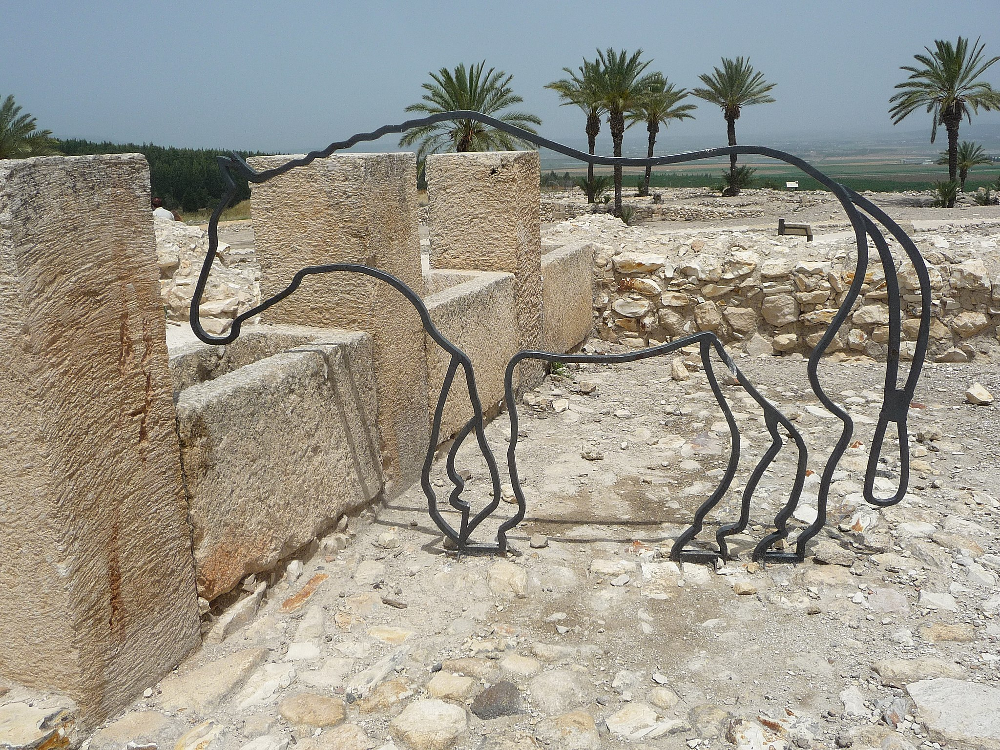

# Human-made Things in the Bible

## License Information

Human-made Things in the Bible © United Bible Societies, 2025. Adapted from: <cite>The Works of Their Hands: Man-made Things in the Bible</cite>, by Ray Pritz © 2009 United Bible Societies. This work is licensed under Creative Commons Attribution-ShareAlike 4.0 International (<a href="https://creativecommons.org/licenses/by-sa/4.0/">https://creativecommons.org/licenses/by-sa/4.0/</a>).

--------------------------------

## 標題：馬槽、食槽、飼料槽、飼料箱（manger, feed trough, feedbox） (id: REALIA:1.2.3)

1\.2\.3 標題：馬槽、食槽、飼料槽、飼料箱（manger, feed trough, feedbox）
======================================================

經文出處
----

Hebrew 來： אֵבוּס (音譯： ’evus)

[JOB 39:9](https://ref.ly/Job39:9), [PRO 14:4](https://ref.ly/Prov14:4), [ISA 1:3](https://ref.ly/Isa1:3)

Greek 希： φάτνη (音譯： fatnē)

[LUK 2:7](https://ref.ly/Luke2:7), [LUK 2:12](https://ref.ly/Luke2:12), [LUK 2:16](https://ref.ly/Luke2:16)

描述和用途
-----

*米吉多馬廄中的飼料和水槽 (© Immanuel Giel, CC BY\-SA 4\.0, via Wikimedia Commons)*

食槽是一個由石頭或木頭做成的槽，是牲畜吃食的地方，甚至可能是一個露天的場地。

---

翻譯
--

有些語言區分了多種餵食器具。「飼料槽」或「食槽」通常是指相對較大的箱子或架子，裡面裝著乾草，牲畜是站著吃食的；「飼料箱」要小得多，通常盛著穀物。我們無法確切知道[LUK 2:7](https://ref.ly/Luke2:7) 所記嬰孩耶穌是被放在哪種槽裡，但是飼料箱或馬槽可能比較適合放置嬰兒。

* **Associated Passages:** 約伯記 39:9; 箴言 14:4; 以賽亞書 1:3; 路加福音 2:7; 路加福音 2:12; 路加福音 2:16

