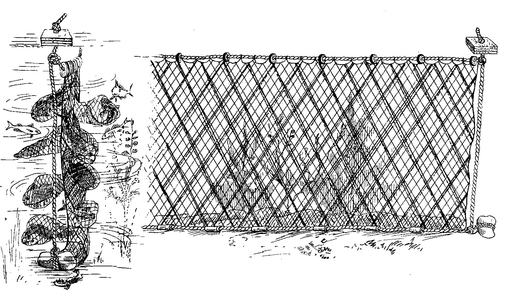

# Human-made Things in the Bible

## License Information

Human-made Things in the Bible © United Bible Societies, 2025. Adapted from: <cite>The Works of Their Hands: Man-made Things in the Bible</cite>, by Ray Pritz © 2009 United Bible Societies. This work is licensed under Creative Commons Attribution-ShareAlike 4.0 International (<a href="https://creativecommons.org/licenses/by-sa/4.0/">https://creativecommons.org/licenses/by-sa/4.0/</a>).

--------------------------------

## 標題：網、陷阱網（net, trammel net） (id: REALIA:1.3.1.3)

1\.3\.1\.3 標題：網、陷阱網（net, trammel net）
=====================================

經文出處
----

Hebrew 來： מָצוֹד (音譯： matsod（另參)

[JOB 19:6](https://ref.ly/Job19:6), [ECC 7:26](https://ref.ly/Eccl7:26)

Hebrew 來： מְצוֹדָה (音譯： mtsodah)

[ECC 9:12](https://ref.ly/Eccl9:12)

Greek 希： δίκτυον (音譯： diktuon)

[MAT 4:20](https://ref.ly/Matt4:20), [MAT 4:21](https://ref.ly/Matt4:21), [MRK 1:18](https://ref.ly/Mark1:18), [MRK 1:19](https://ref.ly/Mark1:19), [LUK 5:2](https://ref.ly/Luke5:2), [LUK 5:4](https://ref.ly/Luke5:4), [LUK 5:5](https://ref.ly/Luke5:5), [LUK 5:6](https://ref.ly/Luke5:6)

描述
--

*在束縛網裡的魚 (Lindsay G. Thompson, University of Washington, CC0, via Wikimedia Commons)*

陷阱網由兩層或三層網組成，通常是中間一張網眼較小的內網，夾在兩張網眼較大的外網中間。

---

用途
--

與拖網相似，陷阱網垂直放入水中，通過浮在水面上的浮子和底部帶有重物的繩索來固定位置。魚會通過外網游到裡面較細的內網（1），然後推著內網穿過另一側的外網（2），這樣魚就被卡在網袋裡面退不回去了（3）。拖網在張開之後會馬上收網；然而陷阱網不一樣，需要撒在水中幾個小時，等待魚卡在網袋裡面。

---

翻譯
--

希伯來文*matsod* 和*mtsodah* 可能泛指「網」，包括漁網和打獵用的網。

在[MAT 4:20](https://ref.ly/Matt4:20); [MAT 4:21](https://ref.ly/Matt4:21) 、[MRK 1:18](https://ref.ly/Mark1:18); [MRK 1:19](https://ref.ly/Mark1:19) 和[LUK 5:2](https://ref.ly/Luke5:2); [LUK 5:4](https://ref.ly/Luke5:4); [LUK 5:5](https://ref.ly/Luke5:5); [LUK 5:6](https://ref.ly/Luke5:6) 中，希臘文*diktuon* 可能指的是拖網（[1\.3\.1\.2 拖網、圍網 (dragnet, seine)\<REALIA:1\.3\.1\.2\>](#) ），不過這個詞的複數形式又表明它很可能是指陷阱網，因為陷阱網是由多層網組成的。如果目標語言不要求區分各種網，翻譯者可以使用「網」的統稱。

* **Associated Passages:** 約伯記 19:6; 傳道書 7:26; 傳道書 9:12; 馬太福音 4:20; 馬太福音 4:21; 馬可福音 1:18; 馬可福音 1:19; 路加福音 5:2; 路加福音 5:4; 路加福音 5:5; 路加福音 5:6

