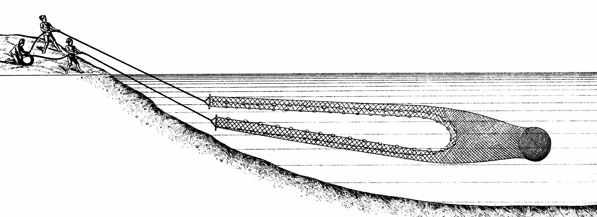
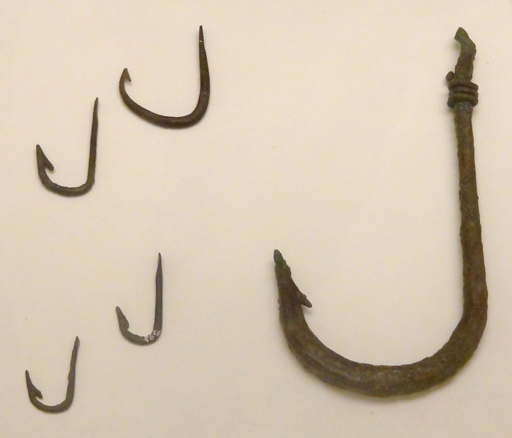

# Human-made Things in the Bible

## License Information

Human-made Things in the Bible © United Bible Societies, 2025. Adapted from: <cite>The Works of Their Hands: Man-made Things in the Bible</cite>, by Ray Pritz © 2009 United Bible Societies. This work is licensed under Creative Commons Attribution-ShareAlike 4.0 International (<a href="https://creativecommons.org/licenses/by-sa/4.0/">https://creativecommons.org/licenses/by-sa/4.0/</a>).

--------------------------------

## 標題：漁業（fishing） (id: REALIA:1.3)

1\.3 標題：漁業（fishing）
===================

小船：參[8\.1 小船、大船 (boat, ship)\<REALIA:8\.1\>](#) 。

## 標題：漁網(nets) (id: REALIA:1.3.1)

1\.3\.1 標題：漁網(nets)
===================

## 標題：手拋網（casting net） (id: REALIA:1.3.1.1)

1\.3\.1\.1 標題：手拋網（casting net）
==============================

經文出處
----

Hebrew 來： מִכְמָר, מִכְמֶרֶת, מִכְמֹרֶת (音譯： mikmor, mikmereth, mikmoreth)

[PSA 141:10](https://ref.ly/Ps141:10), [ISA 19:8](https://ref.ly/Isa19:8), [HAB 1:15](https://ref.ly/Hab1:15), [HAB 1:16](https://ref.ly/Hab1:16)

Hebrew 來： רֶשֶׁת (音譯： resheth)

[EZK 32:3](https://ref.ly/Ezek32:3)

Greek 希： ἀμφιβάλλω, ἀμφίβληστρον (音譯： amfiballō（動詞）, amfiblēstron)

[MAT 4:18](https://ref.ly/Matt4:18), [MRK 1:16](https://ref.ly/Mark1:16)

Greek 希： δίκτυον (音譯： diktuon)

[JHN 21:6](https://ref.ly/John21:6), [JHN 21:8](https://ref.ly/John21:8), [JHN 21:11](https://ref.ly/John21:11), [JHN 21:11](https://ref.ly/John21:11)

描述
--

*漁夫從船上撒網 (© Free Bible Images © David Padfield)*

手拋網是一種圓形的網，邊緣有重物和拉繩，直徑約6—7\.5米（20—25英呎）。

---

用途
--

*漁夫拉起用網撈獲的魚 (© Free Bible Images © David Padfield)*

漁夫在岸邊或船上抓住繩子，以弧形動作將網揮撒出去，這個動作使漁網充分展開後才落在水面上，重物使漁網下沉到水底，將魚罩住。然後，漁夫拉拽繩子把網收緊，最後把網拉入船中。

---

翻譯
--

翻譯者沒有必要為了在目標語言中充分翻譯「手拋網」這個詞，而絞盡腦汁地表達出這種撒網方式的所有細節。重點是說明這種網是被拋出去的，而不是以拖拉的方式使用。有些語言沒有表示各種漁網的詞語，那麼可以用「網」這個統稱。

希伯來文*resheth* 通常用來指捕捉野獸或鳥類的網（參[1\.4\.2 網、網羅 (net)\<REALIA:1\.4\.2\>](#) ）。在[EZK 32:3](https://ref.ly/Ezek32:3) 中，這個詞與希伯來文*cherem* 平行使用；*cherem* 意指「拖網」（參[1\.3\.1\.2 拖網、圍網 (dragnet, seine)\<REALIA:1\.3\.1\.2\>](#) ）。與*resheth* 相關的希伯來文動詞的意思是「投擲」或「展開」，這個動作與手拋網有關，因此這裡包含了這個希伯來文詞語。大多數譯本都認為這節經文的語境是釣魚而不是狩獵。但是，多數譯本選擇使用「網」的統稱，而沒有嘗試指明是哪種類型的漁網。

*正在拉網的人 (George Louis Faber, Public domain, via Wikimedia Commons)*

[HAB 1:15](https://ref.ly/Hab1:15); [HAB 1:16](https://ref.ly/Hab1:16) ：這兩節經文中出現了兩個表示網的詞語（關於另一種網的討論，參[1\.3\.1\.2 拖網、圍網 (dragnet, seine)\<REALIA:1\.3\.1\.2\>](#) ）。如果目標文化對於不同種類的漁網非常熟悉，翻譯者可以毫不費力地翻譯這些詞。如果不是，那麼最好使用一個統稱來翻譯這兩種漁網（GNT (Good News Translation (1992)) 譯作“nets”「網」）。

[JHN 21:3](https://ref.ly/John21:3) ：當彼得說「我打魚去」（GNT (Good News Translation (1992)) 直譯），有些語言需要明確說明打魚的方式；例如，彼得是使用魚鈎魚線，還是用陷阱，還是用網。聖經時期最常見的捕魚方法是用網，並且這裡就是這個意思。

* **Associated Passages:** 詩篇 141:10; 以賽亞書 19:8; 哈巴谷書 1:15; 哈巴谷書 1:16; 以西結書 32:3; 馬太福音 4:18; 馬可福音 1:16; 約翰福音 21:6; 約翰福音 21:8; 約翰福音 21:11; 約翰福音 21:3

* **Associated ACAI Concepts:** Casting Net (ID: `realia:CastingNet`)

## 標題：拖網、圍網（dragnet, seine） (id: REALIA:1.3.1.2)

1\.3\.1\.2 標題：拖網、圍網（dragnet, seine）
===================================

經文出處
----

Hebrew 來： חֵרֶם (音譯： cherem)

[EZK 26:5](https://ref.ly/Ezek26:5), [EZK 26:14](https://ref.ly/Ezek26:14), [EZK 32:3](https://ref.ly/Ezek32:3), [EZK 47:10](https://ref.ly/Ezek47:10), [HAB 1:15](https://ref.ly/Hab1:15), [HAB 1:16](https://ref.ly/Hab1:16), [HAB 1:17](https://ref.ly/Hab1:17)

Greek 希： σαγήνη (音譯： sagēnē)

[MAT 13:47](https://ref.ly/Matt13:47)

描述
--

拖網是垂直懸掛在水中的一張很長的網，上邊緣有浮子，下邊緣有重物。

---

用途
--

拖網由船上或岸邊的人拉拽收網。在拖網的兩端都被拉到船上或岸上之後，所圍區域裡面的魚就被困住。

---

翻譯
--

在不要求區分各種漁網的語言中，可以使用表示「網」的統稱。

在[MAT 13:47](https://ref.ly/Matt13:47) ，網的實際樣式並不是很重要。重要的是網非常大，能夠網住許多不同種類的魚。

[HAB 1:15](https://ref.ly/Hab1:15); [HAB 1:16](https://ref.ly/Hab1:16); [HAB 1:17](https://ref.ly/Hab1:17) ：參[1\.3\.1\.1 手拋網 (casting net)\<REALIA:1\.3\.1\.1\>](#) 中的註解。

* **Associated Passages:** 以西結書 26:5; 以西結書 26:14; 以西結書 32:3; 以西結書 47:10; 哈巴谷書 1:15; 哈巴谷書 1:16; 哈巴谷書 1:17; 馬太福音 13:47

* **Associated ACAI Concepts:** Dragnet (ID: `realia:Dragnet`); Net (ID: `realia:Net`)

## 標題：網、陷阱網（net, trammel net） (id: REALIA:1.3.1.3)

1\.3\.1\.3 標題：網、陷阱網（net, trammel net）
=====================================

經文出處
----

Hebrew 來： מָצוֹד (音譯： matsod（另參)

[JOB 19:6](https://ref.ly/Job19:6), [ECC 7:26](https://ref.ly/Eccl7:26)

Hebrew 來： מְצוֹדָה (音譯： mtsodah)

[ECC 9:12](https://ref.ly/Eccl9:12)

Greek 希： δίκτυον (音譯： diktuon)

[MAT 4:20](https://ref.ly/Matt4:20), [MAT 4:21](https://ref.ly/Matt4:21), [MRK 1:18](https://ref.ly/Mark1:18), [MRK 1:19](https://ref.ly/Mark1:19), [LUK 5:2](https://ref.ly/Luke5:2), [LUK 5:4](https://ref.ly/Luke5:4), [LUK 5:5](https://ref.ly/Luke5:5), [LUK 5:6](https://ref.ly/Luke5:6)

描述
--

*在束縛網裡的魚 (Lindsay G. Thompson, University of Washington, CC0, via Wikimedia Commons)*

陷阱網由兩層或三層網組成，通常是中間一張網眼較小的內網，夾在兩張網眼較大的外網中間。

---

用途
--

與拖網相似，陷阱網垂直放入水中，通過浮在水面上的浮子和底部帶有重物的繩索來固定位置。魚會通過外網游到裡面較細的內網（1），然後推著內網穿過另一側的外網（2），這樣魚就被卡在網袋裡面退不回去了（3）。拖網在張開之後會馬上收網；然而陷阱網不一樣，需要撒在水中幾個小時，等待魚卡在網袋裡面。

---

翻譯
--

希伯來文*matsod* 和*mtsodah* 可能泛指「網」，包括漁網和打獵用的網。

在[MAT 4:20](https://ref.ly/Matt4:20); [MAT 4:21](https://ref.ly/Matt4:21) 、[MRK 1:18](https://ref.ly/Mark1:18); [MRK 1:19](https://ref.ly/Mark1:19) 和[LUK 5:2](https://ref.ly/Luke5:2); [LUK 5:4](https://ref.ly/Luke5:4); [LUK 5:5](https://ref.ly/Luke5:5); [LUK 5:6](https://ref.ly/Luke5:6) 中，希臘文*diktuon* 可能指的是拖網（[1\.3\.1\.2 拖網、圍網 (dragnet, seine)\<REALIA:1\.3\.1\.2\>](#) ），不過這個詞的複數形式又表明它很可能是指陷阱網，因為陷阱網是由多層網組成的。如果目標語言不要求區分各種網，翻譯者可以使用「網」的統稱。

* **Associated Passages:** 約伯記 19:6; 傳道書 7:26; 傳道書 9:12; 馬太福音 4:20; 馬太福音 4:21; 馬可福音 1:18; 馬可福音 1:19; 路加福音 5:2; 路加福音 5:4; 路加福音 5:5; 路加福音 5:6

## 標題：鈎（hook） (id: REALIA:1.3.2)

1\.3\.2 標題：鈎（hook）
==================

經文出處
----

Hebrew 來： סִירָה, דּוּגָה (音譯： sir dugah)

[AMO 4:2](https://ref.ly/Amos4:2)

Hebrew 來： צֵן (音譯： tsinah)

[AMO 4:2](https://ref.ly/Amos4:2)

Greek 希： ἄγκιστρον (音譯： agkistron)

[MAT 17:27](https://ref.ly/Matt17:27)

描述
--

*金屬魚鉤 (© Olaf Tausch, CC BY 3\.0, via Wikimedia Commons)*

魚鈎是個小的彎鈎，用金屬、骨頭，甚至結實的荊棘製成（事實上，[AMO 4:2](https://ref.ly/Amos4:2) 中的希伯來文*sir* 的意思是「荊棘」）。魚鈎的一頭很尖，通常尖頭後面還有個倒刺。魚鈎的另一頭有個環或彎，可以繫上魚線。

---

用途
--

魚鈎要穿上誘餌來吸引魚。魚鈎繫上魚線後投到水裡。魚吞下誘餌後，就被鈎在魚鈎上了。

---

翻譯
--

按字面翻譯[MAT 17:27](https://ref.ly/Matt17:27) 可能會使人產生誤解，因為字面上只有鈎子被扔進水中。有些語言可能需要明確說明文字隱含的意思，通過擴展翻譯指出投入水中的東西是一條帶有餌鈎的線，以避免讀者誤解。

* **Associated Passages:** 阿摩司書 4:2; 馬太福音 17:27

* **Associated ACAI Concepts:** Fishhook (ID: `realia:Fishhook`)

## 標題：魚叉（fishing spear, harpoon） (id: REALIA:1.3.3)

1\.3\.3 標題：魚叉（fishing spear, harpoon）
=====================================

經文出處
----

Hebrew 來： חָח, חוֹחַ (音譯： chach, choach)

[2KI 19:28](https://ref.ly/2Kgs19:28), [2CH 33:11](https://ref.ly/2Chr33:11), [JOB 40:26](https://ref.ly/Job40:26), [ISA 37:29](https://ref.ly/Isa37:29), [EZK 19:4](https://ref.ly/Ezek19:4), [EZK 19:9](https://ref.ly/Ezek19:9), [EZK 29:4](https://ref.ly/Ezek29:4), [EZK 38:4](https://ref.ly/Ezek38:4)

Hebrew 來： חַכָּה (音譯： chakah)

[JOB 40:25](https://ref.ly/Job40:25), [ISA 19:8](https://ref.ly/Isa19:8), [HAB 1:15](https://ref.ly/Hab1:15)

Hebrew 來： מַסָּע (音譯： masa‘)

[JOB 41:18](https://ref.ly/Job41:18)

Hebrew 來： שֻׂכָּה (音譯： sukah)

[JOB 40:31](https://ref.ly/Job40:31)

Hebrew 來： צִלְצָל (音譯： tsiltsal)

[JOB 40:31](https://ref.ly/Job40:31)

描述
--

*捕魚叉的尖頭（青銅或銅合金，埃及，約公元前1550–1070年） (Metropolitan Museum of Art, Public domain)*

魚叉是一根約有一人高的木杆，一端套上用金屬或骨頭做成的、帶倒刺的尖頭，另一端很可能會繫上一根繩子，這樣投擲者就可以把投出去的魚叉再拉回來。

---

用途
--

漁夫瞄準魚或其他水生動物，然後用力擲出魚叉。倒鈎可防止叉頭從獵物身上脫落。連接在叉頭另一端的繩子使投擲者能夠快速收回魚叉，準備再次投擲，或者防止受傷的獵物拖著魚叉游走。

---

翻譯
--

《〈約伯記〉手冊》（*A Handbook on The Book of Job* ）指出，[JOB 40:26](https://ref.ly/Job40:26) （《和》41:2）中的希伯來文*choach* 指的是一種鈎子，但這個鈎子「比前一節中的魚鈎大得多」（第752頁）。這個詞最常出現在與對待囚犯有關的描述中，這也是[JOB 40:25](https://ref.ly/Job40:25); [JOB 40:31](https://ref.ly/Job40:31) （《和》41:1，7）用在力威亞探身上的涵義。

在[JOB 41:18](https://ref.ly/Job41:18) （《和》41:26），希伯來文*masa'* 的含義並不確定。從上下文來看，很明顯這是一種用來捕獵大型動物的武器，也許是投擲武器。希伯來文本在這節經文的末尾有三個單詞，CEV (Contemporary English Version) 將這三個詞語簡單地統譯為“spear”（「矛」）。*Masa'* 一詞最常譯為「飛鏢」（“dart”；RSV (Revised Standard Version (1952)) 、NIV (New International Version (1984)) 、NASB (New American Standard Bible) 、NCV (New Century Version) 、REB (Revised English Bible (1989)) ），不過也有譯本譯為「飛彈」（“missile”；NJPSV (New Jewish Publication Society Version) ）、「投槍」（“javelin”；NJB (New Jerusalem Bible (1985)) ）和「箭」（“arrow”；GNT (Good News Translation (1992)) ）。儘管英文單詞“dart”（「飛鏢」）在現代譯本中十分常見，但是對那些並不熟悉《欽定本聖經》或莎士比亞英文的現代讀者來說，這個詞僅僅指在遊戲中投擲的小而尖的羽毛飛鏢。

* **Associated Passages:** 列王紀下 19:28; 歷代志下 33:11; 約伯記 40:26; 以賽亞書 37:29; 以西結書 19:4; 以西結書 19:9; 以西結書 29:4; 以西結書 38:4; 約伯記 40:25; 以賽亞書 19:8; 哈巴谷書 1:15; 約伯記 41:18; 約伯記 40:31

* **Associated ACAI Concepts:** Harpoon (ID: `realia:Harpoon`)
