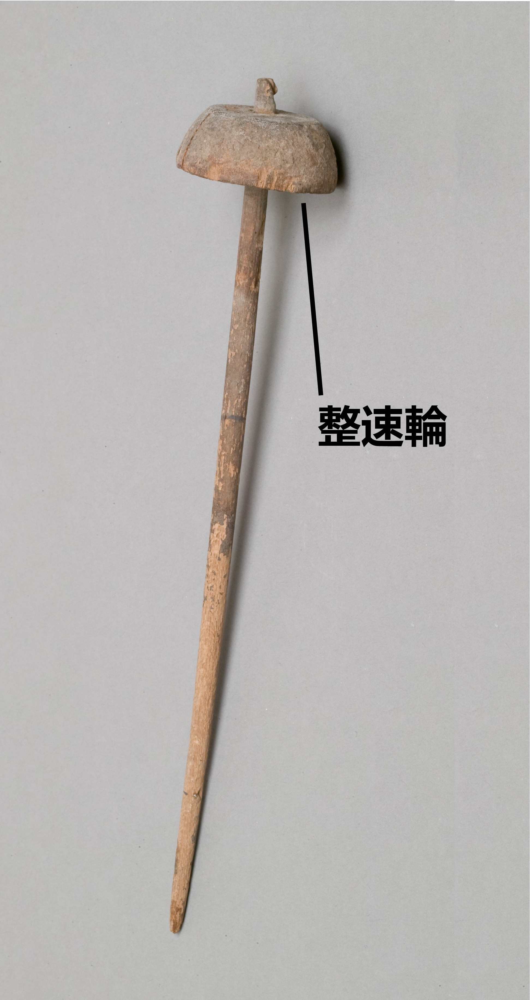

# Human-made Things in the Bible

## License Information

Human-made Things in the Bible © United Bible Societies, 2025. Adapted from: <cite>The Works of Their Hands: Man-made Things in the Bible</cite>, by Ray Pritz © 2009 United Bible Societies. This work is licensed under Creative Commons Attribution-ShareAlike 4.0 International (<a href="https://creativecommons.org/licenses/by-sa/4.0/">https://creativecommons.org/licenses/by-sa/4.0/</a>).

--------------------------------

## 標題：紡錘（spindle） (id: REALIA:1.5.3.2)

1\.5\.3\.2 標題：紡錘（spindle）
=========================

經文出處
----

### **紡錘** ：

Hebrew 來： כִּישׁוֹר (音譯： kishor)

[PRO 31:19](https://ref.ly/Prov31:19)

Hebrew 來： פֶּלֶךְ (音譯： pelek)

[2SA 3:29](https://ref.ly/2Sam3:29), [PRO 31:19](https://ref.ly/Prov31:19)

**整速輪** ：

描述和用途
-----

*使用紡錘的女子 (Metropolitan Museum of Art, CC0, MMA)*

在拉出纖維後，將纖維的一端固定到紡錘上，紡錘是一根長橢圓形的短棒，頂部有一個重物（整速輪）。將紡錘懸吊在空中並旋轉，就可將附著的纖維紡成線。線越紡越長，繞在紡錘的中部，直到所有纖維都被拉出並紡成線。

藉由紡錘的旋轉，即可得到結實的「紡製線」。表示這種紡製或加撚線的希伯來文為*shazar* （總是以*moshzar* 的詞形出現），見於[PRO 31:19](https://ref.ly/Prov31:19) ，[EXO 26:31](https://ref.ly/Exod26:31) ，[EXO 26:36](https://ref.ly/Exod26:36) ，[EXO 27:9](https://ref.ly/Exod27:9) ，[EXO 27:16](https://ref.ly/Exod27:16) ，[EXO 27:18](https://ref.ly/Exod27:18) ，[EXO 28:6](https://ref.ly/Exod28:6) ，[EXO 28:8](https://ref.ly/Exod28:8) ，[EXO 28:15](https://ref.ly/Exod28:15) ，[EXO 36:8](https://ref.ly/Exod36:8) ，[EXO 36:35](https://ref.ly/Exod36:35) ，[EXO 36:37](https://ref.ly/Exod36:37) ，[EXO 38:9](https://ref.ly/Exod38:9) ，[EXO 38:16](https://ref.ly/Exod38:16) ，[EXO 38:18](https://ref.ly/Exod38:18) ，[EXO 39:2](https://ref.ly/Exod39:2) ，[EXO 39:5](https://ref.ly/Exod39:5) ，[EXO 39:8](https://ref.ly/Exod39:8) ，[EXO 39:24](https://ref.ly/Exod39:24) ，[EXO 39:28](https://ref.ly/Exod39:28); [EXO 39:29](https://ref.ly/Exod39:29) ；在[SIR 45:10](https://ref.ly/Sir45:10) 中是希臘文*klōthō* 。

---

翻譯
--

*使用紡錘的女子 (© Rita Willaert, CC BY 2\.0, via Wikimedia Commons)*

[PRO 31:19](https://ref.ly/Prov31:19) ：這節經文的原文字面意為，「她伸手拿捲線桿，她的手把住紡錘」，RSV (Revised Standard Version (1952)) 採用了直譯。但是，對於大多數現代文化中的讀者來說，這樣翻譯沒有傳遞出多少信息。通俗譯本一般只描述女子的活動，而不提到她使用的具體工具。GNT (Good News Translation (1992)) 英文直譯作，「她紡自己的線，織自己的布」。NCV (New Century Version) 更進一步，描述了紡線的動作，英文直譯作「她用手做線，並編織自己的布料」。CEV (Contemporary English Version) 試圖進一步簡化這節經文，譯成「她紡自己的布料」，但這可能太過了。人不是直接「紡」出布料的，即使讀者知道線是如何紡出來的，也不能這樣翻譯。

* **Associated Passages:** 箴言 31:19; 撒母耳記下 3:29; 出埃及記 26:31; 出埃及記 26:36; 出埃及記 27:9; 出埃及記 27:16; 出埃及記 27:18; 出埃及記 28:6; 出埃及記 28:8; 出埃及記 28:15; 出埃及記 36:8; 出埃及記 36:35; 出埃及記 36:37; 出埃及記 38:9; 出埃及記 38:16; 出埃及記 38:18; 出埃及記 39:2; 出埃及記 39:5; 出埃及記 39:8; 出埃及記 39:24; 出埃及記 39:28; 出埃及記 39:29; 德訓篇 45:10

