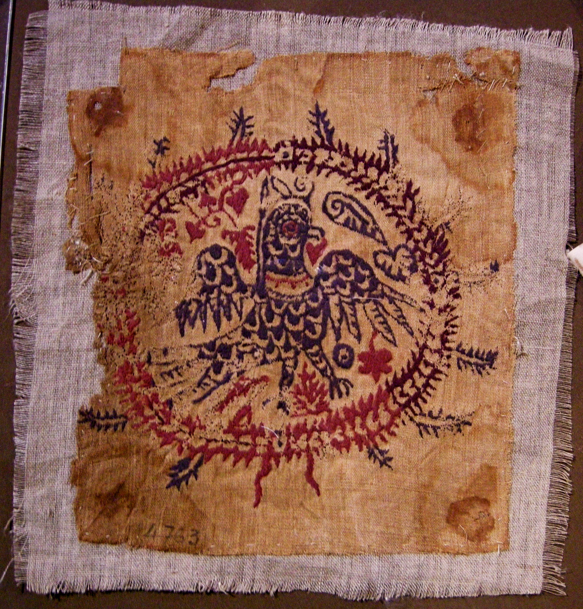

# Human-made Things in the Bible

## License Information

Human-made Things in the Bible © United Bible Societies, 2025. Adapted from: <cite>The Works of Their Hands: Man-made Things in the Bible</cite>, by Ray Pritz © 2009 United Bible Societies. This work is licensed under Creative Commons Attribution-ShareAlike 4.0 International (<a href="https://creativecommons.org/licenses/by-sa/4.0/">https://creativecommons.org/licenses/by-sa/4.0/</a>).

--------------------------------

## 標題：繡花布、刺繡作品（embroidered cloth, needlework） (id: REALIA:1.5.3.11)

1\.5\.3\.11 標題：繡花布、刺繡作品（embroidered cloth, needlework）
======================================================

經文出處
----

Hebrew 來： מַעֲשֶׂה, רקם (音譯： ma‘aseh roqem)

[EXO 26:36](https://ref.ly/Exod26:36), [EXO 27:16](https://ref.ly/Exod27:16), [EXO 28:39](https://ref.ly/Exod28:39), [EXO 36:37](https://ref.ly/Exod36:37), [EXO 38:18](https://ref.ly/Exod38:18), [EXO 39:29](https://ref.ly/Exod39:29)

Hebrew 來： רִקְמָה (音譯： riqmah)

[JDG 5:30](https://ref.ly/Judg5:30), [JDG 5:30](https://ref.ly/Judg5:30), [PSA 45:15](https://ref.ly/Ps45:15), [EZK 16:10](https://ref.ly/Ezek16:10), [EZK 16:13](https://ref.ly/Ezek16:13), [EZK 16:18](https://ref.ly/Ezek16:18), [EZK 26:16](https://ref.ly/Ezek26:16), [EZK 27:7](https://ref.ly/Ezek27:7), [EZK 27:16](https://ref.ly/Ezek27:16), [EZK 27:24](https://ref.ly/Ezek27:24)

Greek 希： ποικιλτής (音譯： poikiltēs)

[SIR 45:10](https://ref.ly/Sir45:10)

描述
--

*帶有羊毛刺繡的亞麻布 (© EgyArt, via Wikimedia Commons)*

繡花布是用手工縫紉出裝飾圖案的布。繡花布需要花費許多手工，因此比較昂貴。

---

翻譯
--

如果目標語言沒有「刺繡」一詞，翻譯者可以使用描述性的表達；例如，「擅長縫紉的人要在上面縫出圖案」（NCV (New Century Version) 直譯；[EXO 26:36](https://ref.ly/Exod26:36) ），「上面縫著圖案的細麻布」（NCV (New Century Version) 直譯；[EZK 27:7](https://ref.ly/Ezek27:7) ）。如果這種描述性的表達也很困難，翻譯者可以簡單地說是「華美的細麻布」或「帶裝飾的布」。

* **Associated Passages:** 出埃及記 26:36; 出埃及記 27:16; 出埃及記 28:39; 出埃及記 36:37; 出埃及記 38:18; 出埃及記 39:29; 士師記 5:30; 詩篇 45:15; 以西結書 16:10; 以西結書 16:13; 以西結書 16:18; 以西結書 26:16; 以西結書 27:7; 以西結書 27:16; 以西結書 27:24; 德訓篇 45:10

