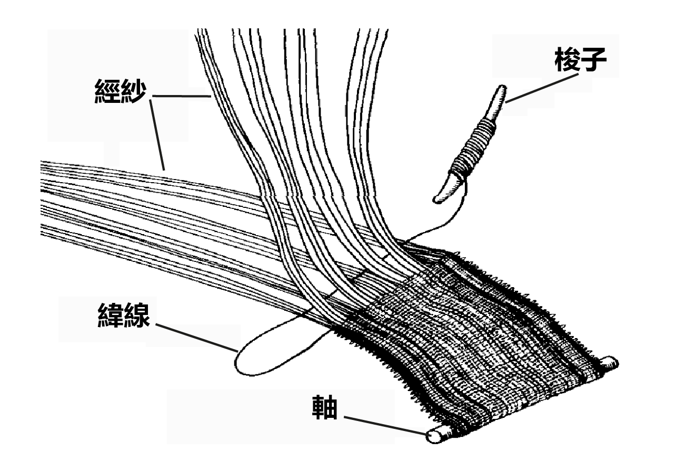
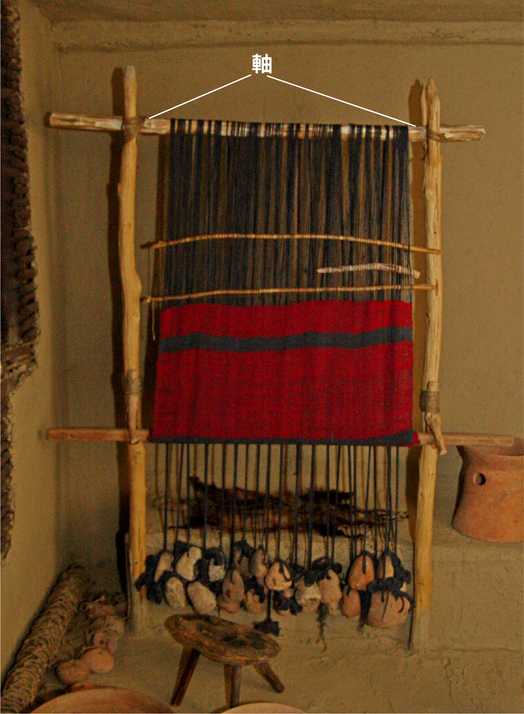

# Human-made Things in the Bible

## License Information

Human-made Things in the Bible © United Bible Societies, 2025. Adapted from: <cite>The Works of Their Hands: Man-made Things in the Bible</cite>, by Ray Pritz © 2009 United Bible Societies. This work is licensed under Creative Commons Attribution-ShareAlike 4.0 International (<a href="https://creativecommons.org/licenses/by-sa/4.0/">https://creativecommons.org/licenses/by-sa/4.0/</a>).

--------------------------------

## 標題：布料生產（cloth manufacture） (id: REALIA:1.5.3)

1\.5\.3 標題：布料生產（cloth manufacture）
==================================

織布是製作布料的藝術。首先，把纖維紡成線。將一團纖維附著在一個短的尖木（**紡錘** ）上，然後轉動紡錘，同時拉出纖維成為細線。這樣，紡出的線就纏繞在紡錘上。在紡好線之後，將其成直角相互交織。**織機** 就是以這種方式編織布料的設備。在臥式織機中，將一排紗線繞在一個粗木軸上，然後繫在另一個木軸上。這些線（稱為經紗）稍微分開並保持繃緊狀態，從經線側面插入另一根線（稱為緯線），先是放在第一根經線的上方，然後再插入下一根經線的下方。如此反覆，直到緯線穿過所有的經線。為了快速完成這個動作，織布人會把緯線固定在一塊小的扁平木頭或骨頭上，稱為**梭子** 。帶著緯紗的梭子連續不斷地來回穿過經紗，形成經緯交織的布料。

## 標題：線、繩、紗（thread, string, yarn） (id: REALIA:1.5.3.1)

1\.5\.3\.1 標題：線、繩、紗（thread, string, yarn）
=========================================

經文出處
----

Hebrew 來： חוּט (音譯： chut)

[GEN 14:23](https://ref.ly/Gen14:23), [JOS 2:18](https://ref.ly/Josh2:18), [JDG 16:12](https://ref.ly/Judg16:12), [ECC 4:12](https://ref.ly/Eccl4:12), [SNG 4:3](https://ref.ly/Song4:3)

Hebrew 來： פָּתִיל (音譯： pathil)

[GEN 38:18](https://ref.ly/Gen38:18), [GEN 38:25](https://ref.ly/Gen38:25), [EXO 28:28](https://ref.ly/Exod28:28), [EXO 28:37](https://ref.ly/Exod28:37), [EXO 39:3](https://ref.ly/Exod39:3), [EXO 39:21](https://ref.ly/Exod39:21), [EXO 39:31](https://ref.ly/Exod39:31), [NUM 15:38](https://ref.ly/Num15:38), [NUM 19:15](https://ref.ly/Num19:15), [JDG 16:9](https://ref.ly/Judg16:9), [EZK 40:3](https://ref.ly/Ezek40:3)

描述
--

*一根繩子 (Image generated by ChatGPT using OpenAI technology)*

將纖維在紡錘上旋轉扭繞，就可製成編織所用的線或紗線（參[1\.5\.3 布料生產 (cloth manufacture)\<REALIA:1\.5\.3\>](#) ）。以這種方式製造的單股線不是特別結實，但是把許多條這種細股線交織在一起而製成的布料就非常結實，可做許多用途。另參[1\.14 繩、帶 (rope, cord)\<REALIA:1\.14\>](#) 。

---

翻譯
--

「線」與「帶子」或「繩子」之間的根本區別在於其構造，而不是粗細。或者說，繩子是由兩根或多根單股線扭絞或編織而成。這裡列出了所有出現希伯來文*pathil* 的經文，但是在其中一兩處，翻譯者可能會認為這個詞是指較粗的帶子。

在[EXO 39:3](https://ref.ly/Exod39:3) 中，希伯來文*pathil* 是指用金子做成的細「線」（“threads”；RSV (Revised Standard Version (1952)) 、CEV (Contemporary English Version) ）或「縷」（“strands”；NIV (New International Version (1984)) ）。有些語言可能有一個專門用詞來表示這種由金屬製成的「細絲」。

* **Associated Passages:** 創世記 14:23; 約書亞記 2:18; 士師記 16:12; 傳道書 4:12; 雅歌 4:3; 創世記 38:18; 創世記 38:25; 出埃及記 28:28; 出埃及記 28:37; 出埃及記 39:3; 出埃及記 39:21; 出埃及記 39:31; 民數記 15:38; 民數記 19:15; 士師記 16:9; 以西結書 40:3

* **Associated ACAI Concepts:** Thread (ID: `realia:Thread`); Measuring Reed (ID: `realia:MeasuringReed`)

## 標題：紡錘（spindle） (id: REALIA:1.5.3.2)

1\.5\.3\.2 標題：紡錘（spindle）
=========================

經文出處
----

### **紡錘** ：

Hebrew 來： כִּישׁוֹר (音譯： kishor)

[PRO 31:19](https://ref.ly/Prov31:19)

Hebrew 來： פֶּלֶךְ (音譯： pelek)

[2SA 3:29](https://ref.ly/2Sam3:29), [PRO 31:19](https://ref.ly/Prov31:19)

**整速輪** ：

描述和用途
-----

*使用紡錘的女子 (Metropolitan Museum of Art, CC0, MMA)*

在拉出纖維後，將纖維的一端固定到紡錘上，紡錘是一根長橢圓形的短棒，頂部有一個重物（整速輪）。將紡錘懸吊在空中並旋轉，就可將附著的纖維紡成線。線越紡越長，繞在紡錘的中部，直到所有纖維都被拉出並紡成線。

藉由紡錘的旋轉，即可得到結實的「紡製線」。表示這種紡製或加撚線的希伯來文為*shazar* （總是以*moshzar* 的詞形出現），見於[PRO 31:19](https://ref.ly/Prov31:19) ，[EXO 26:31](https://ref.ly/Exod26:31) ，[EXO 26:36](https://ref.ly/Exod26:36) ，[EXO 27:9](https://ref.ly/Exod27:9) ，[EXO 27:16](https://ref.ly/Exod27:16) ，[EXO 27:18](https://ref.ly/Exod27:18) ，[EXO 28:6](https://ref.ly/Exod28:6) ，[EXO 28:8](https://ref.ly/Exod28:8) ，[EXO 28:15](https://ref.ly/Exod28:15) ，[EXO 36:8](https://ref.ly/Exod36:8) ，[EXO 36:35](https://ref.ly/Exod36:35) ，[EXO 36:37](https://ref.ly/Exod36:37) ，[EXO 38:9](https://ref.ly/Exod38:9) ，[EXO 38:16](https://ref.ly/Exod38:16) ，[EXO 38:18](https://ref.ly/Exod38:18) ，[EXO 39:2](https://ref.ly/Exod39:2) ，[EXO 39:5](https://ref.ly/Exod39:5) ，[EXO 39:8](https://ref.ly/Exod39:8) ，[EXO 39:24](https://ref.ly/Exod39:24) ，[EXO 39:28](https://ref.ly/Exod39:28); [EXO 39:29](https://ref.ly/Exod39:29) ；在[SIR 45:10](https://ref.ly/Sir45:10) 中是希臘文*klōthō* 。

---

翻譯
--

*使用紡錘的女子 (© Rita Willaert, CC BY 2\.0, via Wikimedia Commons)*

[PRO 31:19](https://ref.ly/Prov31:19) ：這節經文的原文字面意為，「她伸手拿捲線桿，她的手把住紡錘」，RSV (Revised Standard Version (1952)) 採用了直譯。但是，對於大多數現代文化中的讀者來說，這樣翻譯沒有傳遞出多少信息。通俗譯本一般只描述女子的活動，而不提到她使用的具體工具。GNT (Good News Translation (1992)) 英文直譯作，「她紡自己的線，織自己的布」。NCV (New Century Version) 更進一步，描述了紡線的動作，英文直譯作「她用手做線，並編織自己的布料」。CEV (Contemporary English Version) 試圖進一步簡化這節經文，譯成「她紡自己的布料」，但這可能太過了。人不是直接「紡」出布料的，即使讀者知道線是如何紡出來的，也不能這樣翻譯。

* **Associated Passages:** 箴言 31:19; 撒母耳記下 3:29; 出埃及記 26:31; 出埃及記 26:36; 出埃及記 27:9; 出埃及記 27:16; 出埃及記 27:18; 出埃及記 28:6; 出埃及記 28:8; 出埃及記 28:15; 出埃及記 36:8; 出埃及記 36:35; 出埃及記 36:37; 出埃及記 38:9; 出埃及記 38:16; 出埃及記 38:18; 出埃及記 39:2; 出埃及記 39:5; 出埃及記 39:8; 出埃及記 39:24; 出埃及記 39:28; 出埃及記 39:29; 德訓篇 45:10

* **Associated ACAI Concepts:** Spindle (ID: `realia:Spindle`)

## 標題：織布機的軸（weaver’s beam） (id: REALIA:1.5.3.3)

1\.5\.3\.3 標題：織布機的軸（weaver’s beam）
==================================

經文出處
----

Hebrew 來： מָנוֹר, ארג (音譯： mnor ’orgim)

[1SA 17:7](https://ref.ly/1Sam17:7), [2SA 21:19](https://ref.ly/2Sam21:19), [1CH 11:23](https://ref.ly/1Chr11:23), [1CH 20:5](https://ref.ly/1Chr20:5)

Greek 希： ἱστός (音譯： histos)

[ODA 11:12](https://ref.ly/Odes11:12)

描述
--

*立式織機 (© CristianChirita, CC BY\-SA 3\.0, via Wikimedia Commons)*

織布機的軸是一根直徑約5—6厘米（2—2\.5英吋）的木桿，長度不一。經線纏繞在這根軸上；布料越織越長，就直接捲在這根軸上面。

---

用途
--

參[1\.5\.3 布料生產 (cloth manufacture)\<REALIA:1\.5\.3\>](#) 。

---

翻譯
--

舊約提到這個物件，用來突出巨人的槍桿非常粗。考慮到手工織布機在現今的西方英語國家已經鮮為人知，所以[1SA 17:7](https://ref.ly/1Sam17:7) 可以不提及織布機的軸，譯成「他的矛極其大……」（CEV (Contemporary English Version) 直譯）。在手工織布並不常見的地方，翻譯者可以採取這種翻譯方式。另一種譯法是：「他的長矛有普通長矛的兩倍粗……。」

在[ODA 11:12](https://ref.ly/Odes11:12) 中，希臘文*histos* 可以指軸或整臺織布機。翻譯者通常沒有必要直譯這個詞，可以參考「她編織好的一件成品」（NRSV (New Revised Standard Version (1989)) 直譯），或「做好的工作」（NJB (New Jerusalem Bible (1985)) 直譯）。

* **Associated Passages:** 撒母耳記上 17:7; 撒母耳記下 21:19; 歷代志上 11:23; 歷代志上 20:5; 頌歌 11:12

* **Associated ACAI Concepts:** Weavers Beam (ID: `realia:WeaversBeam`); Spear (ID: `realia:Spear`)

## 標題：梭（shuttle） (id: REALIA:1.5.3.4)

1\.5\.3\.4 標題：梭（shuttle）
========================

經文出處
----

Hebrew 來： אֶרֶג (音譯： ’ereg)

[JDG 16:14](https://ref.ly/Judg16:14), [JOB 7:6](https://ref.ly/Job7:6)

描述和用途
-----

梭子是把「緯線」（「橫線」）從織布機的一側牽引到另一側的小工具。梭子在織布機的「經線」之間快速穿過，將上面繫著的緯線拉直。經線在緯線的上方和下方將其壓緊，從而固定住緯線。這樣，布就又增加了一根線。熟練的織布工能夠讓梭子不停地來回穿越，很快地增加緯線，直到織成一整匹布。參[1\.5\.3 布料生產 (cloth manufacture)\<REALIA:1\.5\.3\>](#) 和那裡的插圖。

---

翻譯
--

[JDG 16:13](https://ref.ly/Judg16:13); [JDG 16:14](https://ref.ly/Judg16:14) 記載，參孫在睡夢中被驚醒後，他扯碎了大利拉為了編織他的頭髮而臨時架設的織機的所有部件，包括「針」、「梭」和「織物」。大利拉已經把參孫的頭髮編織到這些部件裡面。有些譯本將這裡的*’ereg* 譯為「織布機」（“loom”，RSV (Revised Standard Version (1952)) 、NIV (New International Version (1984)) ），這種譯法並不準確。

[JOB 7:6](https://ref.ly/Job7:6) 將一天比作梭子的一次快速穿越。

* **Associated Passages:** 士師記 16:14; 約伯記 7:6; 士師記 16:13

* **Associated ACAI Concepts:** Shuttle (ID: `realia:Shuttle`)

## 標題：壓桿、壓條、針（beater, batten, pin） (id: REALIA:1.5.3.5)

1\.5\.3\.5 標題：壓桿、壓條、針（beater, batten, pin）
==========================================

經文出處
----

Hebrew 來： יָתֵד (音譯： yathed)

[JDG 16:14](https://ref.ly/Judg16:14), [JDG 16:14](https://ref.ly/Judg16:14)

描述 和翻譯
------

在[JDG 16:14](https://ref.ly/Judg16:14) 中，希伯來文*yathed* 出現了兩次，學者對這個詞有多種理解。大利拉可能試圖用帳棚橛將參孫的頭髮固定在地上，這是該詞的一般含義（參[3\.2\.2 帳棚橛、帳棚樁 (tent peg, stake)\<REALIA:3\.2\.2\>](#) ）。然而，*yathed* 在這裡似乎更有可能指的是大利拉所用織布機的一部分。一種可能是：這是牆上用來掛豎線的釘子。這種可能性見於CEV (Contemporary English Version) 的譯文，英文直譯作：「參孫睡著的時候，大利拉把他的辮子編到織布機上的線裡面，然後將織布機釘在牆上。然後她喊道，『參孫，非利士人來捉你了！』參孫醒了過來，將織布機從地裡的柱子和牆裡的釘子上拽下來，然後他又把頭髮從織好的布裡面拉出來。」也許最有可能的是，*yathed* 這裡指的是一種用來將緯線向下壓緊的桿（緯線與參孫的頭髮織在一起）。這種理解反映在RSV (Revised Standard Version (1952)) 的翻譯中，英文直譯作：「在他睡覺的時候，大利拉把他的七條發綹織在布裡面。她用針把頭髮壓緊，然後對他說，『參孫，非利士人來捉你了！』但他從睡夢中醒來，把針、織機和布全部扯碎。」

* **Associated Passages:** 士師記 16:14

## 標題：編織或針織材料（woven or knitted material） (id: REALIA:1.5.3.6)

1\.5\.3\.6 標題：編織或針織材料（woven or knitted material）
================================================

經文出處
----

Hebrew 來： דַּלָּה (音譯： dalah)

[ISA 38:12](https://ref.ly/Isa38:12)

Hebrew 來： עֵרֶב (音譯： ‘erev)

[EXO 12:38](https://ref.ly/Exod12:38), [LEV 13:48](https://ref.ly/Lev13:48), [LEV 13:49](https://ref.ly/Lev13:49), [LEV 13:51](https://ref.ly/Lev13:51), [LEV 13:52](https://ref.ly/Lev13:52), [LEV 13:53](https://ref.ly/Lev13:53), [LEV 13:56](https://ref.ly/Lev13:56), [LEV 13:57](https://ref.ly/Lev13:57), [LEV 13:58](https://ref.ly/Lev13:58), [LEV 13:59](https://ref.ly/Lev13:59), [NEH 13:3](https://ref.ly/Neh13:3), [JER 25:20](https://ref.ly/Jer25:20), [JER 50:37](https://ref.ly/Jer50:37), [EZK 30:5](https://ref.ly/Ezek30:5)

Hebrew 來： שְׁתִי (音譯： shthi)

[LEV 13:48](https://ref.ly/Lev13:48), [LEV 13:49](https://ref.ly/Lev13:49), [LEV 13:51](https://ref.ly/Lev13:51), [LEV 13:52](https://ref.ly/Lev13:52), [LEV 13:53](https://ref.ly/Lev13:53), [LEV 13:56](https://ref.ly/Lev13:56), [LEV 13:57](https://ref.ly/Lev13:57), [LEV 13:58](https://ref.ly/Lev13:58), [LEV 13:59](https://ref.ly/Lev13:59), [ECC 10:17](https://ref.ly/Eccl10:17)

描述和用途
-----

*編織布 (Source unknown)*

See [1\.5\.3 Cloth manufacture\<REALIA:1\.5\.3\>](#) 參[1\.5\.3 布料生產 (cloth manufacture)\<REALIA:1\.5\.3\>](#) 。

---

翻譯
--

以下內容改寫自《〈利未記〉手冊》（*A Handbook on Leviticus* ，第200頁）對[LEV 13:48](https://ref.ly/Lev13:48) 的註解：KJV (King James Version (1611)) 和RSV (Revised Standard Version (1952)) 等較早的譯本將希伯來文*shthi* 和*‘erev* 譯為“warp”（「經線」）和“woof”（「緯線」），這兩個詞在現代希伯來文中也是相同的含義。這種譯法表示布料上的線具有不同的方向。但是，這不太可能是經文的意思。很難明白為什麼一個方向上的線受到霉爛的影響，然而與其成直角的其他線卻不受影響。發霉部分需要撕去的要求也沒有道理（第56節），因為這樣做會破壞整件衣服。這些詞的含義可能是「編織或針織材料」（NAB (New American Bible (1970)) 、TOB (Traduction Oecuménique de la Bible (French, 1975)) 、NIV (New International Version (1984)) 直譯；AT (American Translation (Goodspeed, 1935)) 的譯文類似），不過這種解釋並不確定。GNT (Good News Translation (1992)) 將其簡化，英文直譯為「（衣服的）一塊」，但是翻譯者應該盡量避免這種簡化。

在[ISA 38:12](https://ref.ly/Isa38:12) ，希西家哀嘆他的壽命會縮短。他用了織布的比喻，說他的生命就像布料沿著織布機的經線（豎線）被剪斷。

* **Associated Passages:** 以賽亞書 38:12; 出埃及記 12:38; 利未記 13:48; 利未記 13:49; 利未記 13:51; 利未記 13:52; 利未記 13:53; 利未記 13:56; 利未記 13:57; 利未記 13:58; 利未記 13:59; 尼希米記 13:3; 耶利米書 25:20; 耶利米書 50:37; 以西結書 30:5; 傳道書 10:17

* **Associated ACAI Concepts:** Woven or Knitted Material (ID: `realia:WovenOrKnittedMaterial`)

## 標題：麻、亞麻、細麻布（linen） (id: REALIA:1.5.3.7)

1\.5\.3\.7 標題：麻、亞麻、細麻布（linen）
=============================

經文出處
----

Hebrew 來： אֵטוּן (音譯： ’etun)

[PRO 7:16](https://ref.ly/Prov7:16)

Hebrew 來： בַּד (音譯： bad)

[EXO 28:42](https://ref.ly/Exod28:42), [EXO 39:28](https://ref.ly/Exod39:28), [LEV 6:3](https://ref.ly/Lev6:3), [LEV 6:3](https://ref.ly/Lev6:3), [LEV 16:4](https://ref.ly/Lev16:4), [LEV 16:4](https://ref.ly/Lev16:4), [LEV 16:4](https://ref.ly/Lev16:4), [LEV 16:4](https://ref.ly/Lev16:4), [LEV 16:23](https://ref.ly/Lev16:23), [LEV 16:32](https://ref.ly/Lev16:32), [1SA 2:18](https://ref.ly/1Sam2:18), [1SA 22:18](https://ref.ly/1Sam22:18), [2SA 6:14](https://ref.ly/2Sam6:14), [1CH 15:27](https://ref.ly/1Chr15:27), [EZK 9:3](https://ref.ly/Ezek9:3), [EZK 9:3](https://ref.ly/Ezek9:3), [EZK 9:11](https://ref.ly/Ezek9:11), [EZK 10:2](https://ref.ly/Ezek10:2), [EZK 10:6](https://ref.ly/Ezek10:6), [EZK 10:7](https://ref.ly/Ezek10:7), [DAN 10:5](https://ref.ly/Dan10:5), [DAN 12:6](https://ref.ly/Dan12:6), [DAN 12:7](https://ref.ly/Dan12:7)

Hebrew 來： בּוּץ (音譯： buts)

[1CH 4:21](https://ref.ly/1Chr4:21), [1CH 15:27](https://ref.ly/1Chr15:27), [2CH 2:13](https://ref.ly/2Chr2:13), [2CH 3:14](https://ref.ly/2Chr3:14), [2CH 5:12](https://ref.ly/2Chr5:12), [EST 1:6](https://ref.ly/Esth1:6), [EST 8:15](https://ref.ly/Esth8:15), [EZK 27:16](https://ref.ly/Ezek27:16)

Hebrew סָדִין (音譯：sadin（參)

[JDG 14:12](https://ref.ly/Judg14:12), [JDG 14:13](https://ref.ly/Judg14:13), [PRO 31:24](https://ref.ly/Prov31:24), [ISA 3:23](https://ref.ly/Isa3:23)

Hebrew 來： פֵּשֶׁת (音譯： pishteh)

[LEV 13:48](https://ref.ly/Lev13:48), [LEV 13:52](https://ref.ly/Lev13:52), [LEV 13:59](https://ref.ly/Lev13:59), [DEU 22:11](https://ref.ly/Deut22:11), [JER 13:1](https://ref.ly/Jer13:1), [EZK 44:17](https://ref.ly/Ezek44:17), [EZK 44:18](https://ref.ly/Ezek44:18), [EZK 44:18](https://ref.ly/Ezek44:18)

Hebrew 來： שֵׁשׁ (音譯： shesh)

[GEN 41:42](https://ref.ly/Gen41:42), [EXO 25:4](https://ref.ly/Exod25:4), [EXO 26:1](https://ref.ly/Exod26:1), [EXO 26:31](https://ref.ly/Exod26:31), [EXO 26:36](https://ref.ly/Exod26:36), [EXO 27:9](https://ref.ly/Exod27:9), [EXO 27:16](https://ref.ly/Exod27:16), [EXO 27:18](https://ref.ly/Exod27:18), [EXO 28:6](https://ref.ly/Exod28:6), [EXO 28:8](https://ref.ly/Exod28:8), [EXO 28:15](https://ref.ly/Exod28:15), [EXO 28:39](https://ref.ly/Exod28:39), [EXO 28:39](https://ref.ly/Exod28:39), [EXO 35:6](https://ref.ly/Exod35:6), [EXO 35:23](https://ref.ly/Exod35:23), [EXO 35:25](https://ref.ly/Exod35:25), [EXO 35:35](https://ref.ly/Exod35:35), [EXO 36:8](https://ref.ly/Exod36:8), [EXO 36:35](https://ref.ly/Exod36:35), [EXO 36:37](https://ref.ly/Exod36:37), [EXO 38:9](https://ref.ly/Exod38:9), [EXO 38:16](https://ref.ly/Exod38:16), [EXO 38:18](https://ref.ly/Exod38:18), [EXO 38:23](https://ref.ly/Exod38:23), [EXO 39:3](https://ref.ly/Exod39:3), [EXO 39:5](https://ref.ly/Exod39:5), [EXO 39:8](https://ref.ly/Exod39:8), [EXO 39:27](https://ref.ly/Exod39:27), [EXO 39:28](https://ref.ly/Exod39:28), [EXO 39:28](https://ref.ly/Exod39:28), [EXO 39:28](https://ref.ly/Exod39:28), [EXO 39:29](https://ref.ly/Exod39:29), [PRO 31:22](https://ref.ly/Prov31:22), [EZK 16:10](https://ref.ly/Ezek16:10), [EZK 16:13](https://ref.ly/Ezek16:13), [EZK 27:7](https://ref.ly/Ezek27:7)

Greek 希： βύσσινος (音譯： bussinos)

[REV 18:12](https://ref.ly/Rev18:12), [REV 18:16](https://ref.ly/Rev18:16), [REV 19:8](https://ref.ly/Rev19:8), [REV 19:8](https://ref.ly/Rev19:8), [REV 19:14](https://ref.ly/Rev19:14), [1ES 3:6](https://ref.ly/1Esd3:6)

Greek 希： βύσσος (音譯： bussos)

[LUK 16:19](https://ref.ly/Luke16:19)

Greek 希： λίνον, λινοῦς (音譯： linon, linous)

[REV 15:6](https://ref.ly/Rev15:6), [JDT 16:8](https://ref.ly/Jdt16:8)

Greek 希： ὀθόνιον (音譯： othonion)

[LUK 24:12](https://ref.ly/Luke24:12), [JHN 19:40](https://ref.ly/John19:40), [JHN 20:5](https://ref.ly/John20:5), [JHN 20:6](https://ref.ly/John20:6), [JHN 20:7](https://ref.ly/John20:7)

Greek 希： σινδών (音譯： sindōn)

[MAT 27:59](https://ref.ly/Matt27:59), [MRK 14:51](https://ref.ly/Mark14:51), [MRK 14:52](https://ref.ly/Mark14:52), [MRK 15:46](https://ref.ly/Mark15:46), [MRK 15:46](https://ref.ly/Mark15:46), [LUK 23:53](https://ref.ly/Luke23:53)

描述
--

*(Image generated by ChatGPT using OpenAI technology)*

細麻布是由亞麻植物的莖製成的優質布料，非常結實和涼快。

---

用途
--

以色列大多數的亞麻都是從埃及進口，用於製造多種商品。聖經中提到了床罩、船帆、祭司聖服、帳幕器具、葬衣和其他東西。另參《聖經中的植物和樹木》（*Plants and Trees in the Bible* ）中的[5\.1\.7 亞麻（亞麻布）（flax \[linen]）\<FLORA:5\.1\.7\>](#) 。

---

翻譯
--

許多語言沒有「亞麻」一詞，翻譯者雖然可以借用外來語，但是在許多情況下，譯文最重要的是突出布料的質量，而不在於原材料是什麼。因此，許多翻譯者使用了「細密的（白）布」或「好布」等短語。在有些語境中，可以將其譯成「由一種植物的纖維製成的布」。翻譯者可能需要添加腳註來予以解釋。

在幾處經文中，細麻布的重要特點是：與其他布料相比，人不大容易出汗（參[EXO 39:27](https://ref.ly/Exod39:27); [EXO 39:28](https://ref.ly/Exod39:28); [EXO 39:29](https://ref.ly/Exod39:29) ；[LEV 6:10](https://ref.ly/Lev6:10) ［《和》6:3］，[LEV 16:4](https://ref.ly/Lev16:4) ；[EZK 44:17](https://ref.ly/Ezek44:17); [EZK 44:18](https://ref.ly/Ezek44:18) ）。如果當地人不知道亞麻布，翻譯者應選擇具有類似特點的布料作為替代。

在[MAT 27:59](https://ref.ly/Matt27:59) 、[MRK 15:46](https://ref.ly/Mark15:46) 和[LUK 23:53](https://ref.ly/Luke23:53) 中，希臘文*sindōn* 是指纏裹耶穌的身體以便安葬的布料。[LUK 24:12](https://ref.ly/Luke24:12) 、[JHN 19:40](https://ref.ly/John19:40) 和[JHN 20:5](https://ref.ly/John20:5); [JHN 20:6](https://ref.ly/John20:6); [JHN 20:7](https://ref.ly/John20:7) 中的希臘文*othonion* 也是這個意思。如果某種語言有專門的詞語表示這種「安葬用布」或「裹屍布」，就應該使用該詞。

* **Associated Passages:** 箴言 7:16; 出埃及記 28:42; 出埃及記 39:28; 利未記 6:3; 利未記 16:4; 利未記 16:23; 利未記 16:32; 撒母耳記上 2:18; 撒母耳記上 22:18; 撒母耳記下 6:14; 歷代志上 15:27; 以西結書 9:3; 以西結書 9:11; 以西結書 10:2; 以西結書 10:6; 以西結書 10:7; 但以理書 10:5; 但以理書 12:6; 但以理書 12:7; 歷代志上 4:21; 歷代志下 2:13; 歷代志下 3:14; 歷代志下 5:12; 以斯帖記 1:6; 以斯帖記 8:15; 以西結書 27:16; 士師記 14:12; 士師記 14:13; 箴言 31:24; 以賽亞書 3:23; 利未記 13:48; 利未記 13:52; 利未記 13:59; 申命記 22:11; 耶利米書 13:1; 以西結書 44:17; 以西結書 44:18; 創世記 41:42; 出埃及記 25:4; 出埃及記 26:1; 出埃及記 26:31; 出埃及記 26:36; 出埃及記 27:9; 出埃及記 27:16; 出埃及記 27:18; 出埃及記 28:6; 出埃及記 28:8; 出埃及記 28:15; 出埃及記 28:39; 出埃及記 35:6; 出埃及記 35:23; 出埃及記 35:25; 出埃及記 35:35; 出埃及記 36:8; 出埃及記 36:35; 出埃及記 36:37; 出埃及記 38:9; 出埃及記 38:16; 出埃及記 38:18; 出埃及記 38:23; 出埃及記 39:3; 出埃及記 39:5; 出埃及記 39:8; 出埃及記 39:27; 出埃及記 39:29; 箴言 31:22; 以西結書 16:10; 以西結書 16:13; 以西結書 27:7; 啟示錄 18:12; 啟示錄 18:16; 啟示錄 19:8; 啟示錄 19:14; 厄斯德拉上 3:6; 路加福音 16:19; 啟示錄 15:6; 友弟德傳 16:8; 路加福音 24:12; 約翰福音 19:40; 約翰福音 20:5; 約翰福音 20:6; 約翰福音 20:7; 馬太福音 27:59; 馬可福音 14:51; 馬可福音 14:52; 馬可福音 15:46; 路加福音 23:53; 利未記 6:10

* **Associated ACAI Concepts:** Linen (ID: `realia:Linen`)

## 標題：毛、羊毛（wool） (id: REALIA:1.5.3.8)

1\.5\.3\.8 標題：毛、羊毛（wool）
========================

經文出處
----

Hebrew 來： צֶמֶר (音譯： tsemer)

[LEV 13:48](https://ref.ly/Lev13:48), [LEV 13:52](https://ref.ly/Lev13:52), [LEV 13:59](https://ref.ly/Lev13:59), [DEU 22:11](https://ref.ly/Deut22:11), [ISA 51:8](https://ref.ly/Isa51:8), [EZK 44:17](https://ref.ly/Ezek44:17)

Greek 希： ἔριον (音譯： erion)

[HEB 9:19](https://ref.ly/Heb9:19)

描述
--

毛是綿羊和某些其他動物的波浪形毛髮，質地柔軟，可編織成布並做成衣服。

---

翻譯
--

在有些語言中，翻譯者可能需要將「羊毛」譯為「用綿羊的毛製成的布料」。

* **Associated Passages:** 利未記 13:48; 利未記 13:52; 利未記 13:59; 申命記 22:11; 以賽亞書 51:8; 以西結書 44:17; 希伯來書 9:19

* **Associated ACAI Concepts:** Wool (ID: `realia:Wool`)

## 標題：絲綢、綢緞、精緻衣料（silk） (id: REALIA:1.5.3.9)

1\.5\.3\.9 標題：絲綢、綢緞、精緻衣料（silk）
==============================

經文出處
----

Hebrew 來： מֶשִׁי (音譯： meshi)

[EZK 16:10](https://ref.ly/Ezek16:10), [EZK 16:13](https://ref.ly/Ezek16:13)

Greek 希： σιρικόν (音譯： sirikon)

[REV 18:12](https://ref.ly/Rev18:12)

描述
--

絲綢是一種精細、昂貴的布料，由蠶繭抽出的蠶絲織成。

---

翻譯
--

對於[EZK 16:10](https://ref.ly/Ezek16:10); [EZK 16:13](https://ref.ly/Ezek16:13) 中希伯來文*meshi* 的譯法，各譯本和註釋書的意見不一。傳統的翻譯是「絲綢」（“silk”），並且現今仍有許多譯本依循這種譯法（KJV (King James Version (1611)) 、RSV (Revised Standard Version (1952)) 、GNT (Good News Translation (1992)) 、NCV (New Century Version) ）。其他譯本認為這在以西結的時期不大可能，因為當時絲綢在中東還不為人所知。有人提出，這個詞是指女子戴著的一種面紗，遮住她的臉不讓別人看到，但是她可以看到外面。通常，不接受「絲綢」為正確譯法的譯本會選擇一個比較一般性的詞語。比較「最昂貴的長袍」（“most expensive robes”；CEV (Contemporary English Version) ），「華美的織物」（“rich fabric”；NRSV (New Revised Standard Version (1989)) ），「漂亮的編織長袍」（GECL (German Common Language Version (Gute Nachricht Bibel)) ），「昂貴的布料」（TOB (Traduction Oecuménique de la Bible (French, 1975)) ），以及「細麻布」（“fine linen”；REB (Revised English Bible (1989)) ）。

在主後1世紀的背景下，[REV 18:12](https://ref.ly/Rev18:12) 很可能是指絲綢。然而，從這節經文的語境來看，我們無法確定希臘文*sirikos* 只是指絲綢料子，還是指絲綢做成的衣服。

* **Associated Passages:** 以西結書 16:10; 以西結書 16:13; 啟示錄 18:12

* **Associated ACAI Concepts:** Silk (ID: `realia:Silk`)

## 標題：紫色布（purple cloth） (id: REALIA:1.5.3.10)

1\.5\.3\.10 標題：紫色布（purple cloth）
================================

經文出處
----

Hebrew 來： אַרְגְּוָן (音譯： ’argewan)

[2CH 2:6](https://ref.ly/2Chr2:6), [DAN 5:7](https://ref.ly/Dan5:7), [DAN 5:16](https://ref.ly/Dan5:16), [DAN 5:29](https://ref.ly/Dan5:29)

Hebrew 來： אַרְגָּמָן (音譯： ’argaman)

[EXO 25:4](https://ref.ly/Exod25:4), [EXO 26:1](https://ref.ly/Exod26:1), [EXO 26:31](https://ref.ly/Exod26:31), [EXO 26:36](https://ref.ly/Exod26:36), [EXO 27:16](https://ref.ly/Exod27:16), [EXO 28:6](https://ref.ly/Exod28:6), [EXO 28:8](https://ref.ly/Exod28:8), [EXO 28:15](https://ref.ly/Exod28:15), [EXO 28:33](https://ref.ly/Exod28:33), [EXO 35:6](https://ref.ly/Exod35:6), [EXO 35:23](https://ref.ly/Exod35:23), [EXO 35:25](https://ref.ly/Exod35:25), [EXO 35:35](https://ref.ly/Exod35:35), [EXO 36:8](https://ref.ly/Exod36:8), [EXO 36:35](https://ref.ly/Exod36:35), [EXO 36:37](https://ref.ly/Exod36:37), [EXO 38:18](https://ref.ly/Exod38:18), [EXO 38:23](https://ref.ly/Exod38:23), [EXO 39:3](https://ref.ly/Exod39:3), [EXO 39:8](https://ref.ly/Exod39:8), [EXO 39:24](https://ref.ly/Exod39:24), [EXO 39:29](https://ref.ly/Exod39:29), [NUM 4:13](https://ref.ly/Num4:13), [JDG 8:26](https://ref.ly/Judg8:26), [2CH 2:13](https://ref.ly/2Chr2:13), [2CH 3:14](https://ref.ly/2Chr3:14), [EST 1:6](https://ref.ly/Esth1:6), [EST 8:15](https://ref.ly/Esth8:15), [PRO 31:22](https://ref.ly/Prov31:22), [SNG 3:10](https://ref.ly/Song3:10), [SNG 7:6](https://ref.ly/Song7:6), [JER 10:9](https://ref.ly/Jer10:9), [EZK 27:7](https://ref.ly/Ezek27:7), [EZK 27:16](https://ref.ly/Ezek27:16)

Hebrew 來： חָמוּץ (音譯： chamuts)

[ISA 63:1](https://ref.ly/Isa63:1)

Hebrew 來： כַּרְמִיל (音譯： karmil)

[2CH 2:6](https://ref.ly/2Chr2:6), [2CH 2:13](https://ref.ly/2Chr2:13), [2CH 3:14](https://ref.ly/2Chr3:14)

Hebrew 來： שָׁנִי (音譯： shani)

[GEN 38:28](https://ref.ly/Gen38:28), [GEN 38:30](https://ref.ly/Gen38:30), [JOS 2:18](https://ref.ly/Josh2:18), [JOS 2:21](https://ref.ly/Josh2:21), [2SA 1:24](https://ref.ly/2Sam1:24), [PRO 31:21](https://ref.ly/Prov31:21), [SNG 4:3](https://ref.ly/Song4:3), [ISA 1:18](https://ref.ly/Isa1:18), [JER 4:30](https://ref.ly/Jer4:30)

Hebrew 來： תלע (音譯： tala‘)

[NAM 2:4](https://ref.ly/Nah2:4)

Hebrew 來： תּוֹלָע (音譯： tola‘)

[ISA 1:18](https://ref.ly/Isa1:18), [LAM 4:5](https://ref.ly/Lam4:5)

Hebrew 來： תּוֹלַעַת, שָׁנִי (音譯： tola‘ath shani, shni tola‘ath)

[EXO 25:4](https://ref.ly/Exod25:4), [EXO 26:1](https://ref.ly/Exod26:1), [EXO 26:31](https://ref.ly/Exod26:31), [EXO 26:36](https://ref.ly/Exod26:36), [EXO 27:16](https://ref.ly/Exod27:16), [EXO 28:6](https://ref.ly/Exod28:6), [EXO 28:6](https://ref.ly/Exod28:6), [EXO 28:8](https://ref.ly/Exod28:8), [EXO 28:15](https://ref.ly/Exod28:15), [EXO 28:33](https://ref.ly/Exod28:33), [EXO 35:6](https://ref.ly/Exod35:6), [EXO 35:23](https://ref.ly/Exod35:23), [EXO 35:25](https://ref.ly/Exod35:25), [EXO 35:35](https://ref.ly/Exod35:35), [EXO 36:8](https://ref.ly/Exod36:8), [EXO 36:35](https://ref.ly/Exod36:35), [EXO 36:37](https://ref.ly/Exod36:37), [EXO 38:18](https://ref.ly/Exod38:18), [EXO 38:23](https://ref.ly/Exod38:23), [EXO 39:3](https://ref.ly/Exod39:3), [EXO 39:3](https://ref.ly/Exod39:3), [EXO 39:5](https://ref.ly/Exod39:5), [EXO 39:8](https://ref.ly/Exod39:8), [EXO 39:24](https://ref.ly/Exod39:24), [EXO 39:29](https://ref.ly/Exod39:29), [LEV 14:4](https://ref.ly/Lev14:4), [LEV 14:6](https://ref.ly/Lev14:6), [LEV 14:49](https://ref.ly/Lev14:49), [LEV 14:51](https://ref.ly/Lev14:51), [LEV 14:52](https://ref.ly/Lev14:52), [NUM 4:8](https://ref.ly/Num4:8), [NUM 19:6](https://ref.ly/Num19:6)

Hebrew 來： תְּכֵלֶת (音譯： tekeleth)

[EXO 25:4](https://ref.ly/Exod25:4), [EXO 26:1](https://ref.ly/Exod26:1), [EXO 26:4](https://ref.ly/Exod26:4), [EXO 26:31](https://ref.ly/Exod26:31), [EXO 26:36](https://ref.ly/Exod26:36), [EXO 27:16](https://ref.ly/Exod27:16), [EXO 28:6](https://ref.ly/Exod28:6), [EXO 28:8](https://ref.ly/Exod28:8), [EXO 28:15](https://ref.ly/Exod28:15), [EXO 28:28](https://ref.ly/Exod28:28), [EXO 28:31](https://ref.ly/Exod28:31), [EXO 28:33](https://ref.ly/Exod28:33), [EXO 28:37](https://ref.ly/Exod28:37), [EXO 38:18](https://ref.ly/Exod38:18), [EXO 38:23](https://ref.ly/Exod38:23), [EXO 39:3](https://ref.ly/Exod39:3), [EXO 39:5](https://ref.ly/Exod39:5), [EXO 39:8](https://ref.ly/Exod39:8), [EXO 39:22](https://ref.ly/Exod39:22), [EXO 39:24](https://ref.ly/Exod39:24), [EXO 39:29](https://ref.ly/Exod39:29), [EXO 39:31](https://ref.ly/Exod39:31), [NUM 4:7](https://ref.ly/Num4:7), [NUM 4:9](https://ref.ly/Num4:9), [NUM 4:11](https://ref.ly/Num4:11), [NUM 4:12](https://ref.ly/Num4:12), [NUM 15:38](https://ref.ly/Num15:38), [2CH 2:6](https://ref.ly/2Chr2:6), [2CH 3:14](https://ref.ly/2Chr3:14), [EST 1:6](https://ref.ly/Esth1:6), [EST 8:15](https://ref.ly/Esth8:15), [JER 10:9](https://ref.ly/Jer10:9), [EZK 23:6](https://ref.ly/Ezek23:6), [EZK 27:7](https://ref.ly/Ezek27:7), [EZK 27:24](https://ref.ly/Ezek27:24)

Greek 希： κόκκινος (音譯： kokkinos)

[MAT 27:28](https://ref.ly/Matt27:28), [HEB 9:19](https://ref.ly/Heb9:19), [REV 17:4](https://ref.ly/Rev17:4), [REV 18:12](https://ref.ly/Rev18:12), [REV 18:16](https://ref.ly/Rev18:16)

Greek 希： κόκκος (音譯： kokkos)

[SIR 45:10](https://ref.ly/Sir45:10)

Greek 希： πορφύρα (音譯： porfura)

[MRK 15:17](https://ref.ly/Mark15:17), [MRK 15:20](https://ref.ly/Mark15:20), [LUK 16:19](https://ref.ly/Luke16:19), [REV 18:12](https://ref.ly/Rev18:12), [JDT 10:21](https://ref.ly/Jdt10:21), [SIR 45:10](https://ref.ly/Sir45:10), [LJE 1:71](https://ref.ly/EpJer1:71), [1MA 4:23](https://ref.ly/1Macc4:23), [1MA 8:14](https://ref.ly/1Macc8:14), [1MA 10:20](https://ref.ly/1Macc10:20), [1MA 10:62](https://ref.ly/1Macc10:62), [1MA 10:64](https://ref.ly/1Macc10:64), [1MA 11:58](https://ref.ly/1Macc11:58), [1MA 14:43](https://ref.ly/1Macc14:43), [1MA 14:44](https://ref.ly/1Macc14:44), [2MA 4:38](https://ref.ly/2Macc4:38), [1ES 3:6](https://ref.ly/1Esd3:6)

Greek 希： πορφυροῦς (音譯： porfurous)

[JHN 19:2](https://ref.ly/John19:2), [JHN 19:5](https://ref.ly/John19:5), [REV 17:4](https://ref.ly/Rev17:4), [REV 18:16](https://ref.ly/Rev18:16), [LJE 1:11](https://ref.ly/EpJer1:11)

Greek 希： πορφυρόπωλις (音譯： porfuropōlis)

[ACT 16:14](https://ref.ly/Acts16:14)

Greek 希： ὑακίνθινος (音譯： huakinthinos)

[SIR 6:30](https://ref.ly/Sir6:30), [SIR 40:4](https://ref.ly/Sir40:4)

Greek 希： ὑάκινθος (音譯： huakinthos)

[SIR 45:10](https://ref.ly/Sir45:10), [1MA 4:23](https://ref.ly/1Macc4:23)

描述
--

紫色布是一種紫紅色的布料，用幾種天然材料進行染色。染料的主要來源是骨螺。另一個來源（希伯來文詞語的詞根是*tla‘* ）是一種小蠕蟲。染色後可能會得到多種顏色，從深紅色到紫色到藍色。（參[1\.5\.3\.14 染料 (dye)\<REALIA:1\.5\.3\.14\>](#) 。）

---

用途
--

紫色染料的原材料相對有限，並且染色工藝比較複雜，因此紫色布料非常昂貴，只有君王和最富有的家族才能使用。隨著時間的推移，這種顏色逐漸與王室聯繫起來。不過，一直到聖經時期過去幾個世紀之後，才有實際立法禁止王室以外的人穿紫色衣服。

---

翻譯
--

有些語言沒有專門表示紫紅色的詞語，因為這種顏色有時被歸類為藍色，有時候與黑色相關。有時可能被描述為「暗紅色」甚或「藍紅色」。但是，在所有語言中，將某種顏色與當地的某種花、鳥或其他東西的顏色做比較，可以相對準確地表明顏色。

《出埃及記》的許多經文同時提到這個色系內的三種顏色（如[EXO 25:4](https://ref.ly/Exod25:4) ）。許多譯本都譯成「藍色」、「紫色」和「朱紅色／紅色」。翻譯者應該盡量在這個範圍內找出三種顏色。《〈出埃及記〉手冊》（*A Handbook on Exodus* ，第582頁）對[EXO 25:4](https://ref.ly/Exod25:4) 提出了下述很有幫助的註解：「區分這三種顏色可能很難，或者它們是紅色和藍色混合而得的所有顏色。**藍色** 和**紫色** 這兩個詞的差異似乎是：第一個帶有更多的藍色，而第二個帶有更多的紅色。但這兩種顏色都是紫色。NJB (New Jerusalem Bible (1985)) 將這兩個詞語翻譯為“violet\-purple”（『紫羅蘭色』）和“red\-purple”（『紅紫色』）。」關於翻譯紫色的建議，參《〈馬可福音〉手冊》（*A Handbook on The Gospel of Mark* ）第482頁。

在許多提到紫色布的經文中，重要的不是顏色，而是這種顏色的布料所暗示的高貴身分。翻譯者可能更傾向於清楚表達這個信息。例如，[1MA 10:64](https://ref.ly/1Macc10:64) 的原文字面譯為「看到他身披紫色」，RSV (Revised Standard Version (1952)) 採用了直譯，而GNT (Good News Translation (1992)) 譯為“saw him clothed in royal robes”（「看到他身著王袍」）。

如果需要指明是哪種布料被染成紫色，翻譯者應該盡可能選擇一種暗示高位或尊貴身分的布料。

* **Associated Passages:** 歷代志下 2:6; 但以理書 5:7; 但以理書 5:16; 但以理書 5:29; 出埃及記 25:4; 出埃及記 26:1; 出埃及記 26:31; 出埃及記 26:36; 出埃及記 27:16; 出埃及記 28:6; 出埃及記 28:8; 出埃及記 28:15; 出埃及記 28:33; 出埃及記 35:6; 出埃及記 35:23; 出埃及記 35:25; 出埃及記 35:35; 出埃及記 36:8; 出埃及記 36:35; 出埃及記 36:37; 出埃及記 38:18; 出埃及記 38:23; 出埃及記 39:3; 出埃及記 39:8; 出埃及記 39:24; 出埃及記 39:29; 民數記 4:13; 士師記 8:26; 歷代志下 2:13; 歷代志下 3:14; 以斯帖記 1:6; 以斯帖記 8:15; 箴言 31:22; 雅歌 3:10; 雅歌 7:6; 耶利米書 10:9; 以西結書 27:7; 以西結書 27:16; 以賽亞書 63:1; 創世記 38:28; 創世記 38:30; 約書亞記 2:18; 約書亞記 2:21; 撒母耳記下 1:24; 箴言 31:21; 雅歌 4:3; 以賽亞書 1:18; 耶利米書 4:30; 那鴻書 2:4; 耶利米哀歌 4:5; 出埃及記 39:5; 利未記 14:4; 利未記 14:6; 利未記 14:49; 利未記 14:51; 利未記 14:52; 民數記 4:8; 民數記 19:6; 出埃及記 26:4; 出埃及記 28:28; 出埃及記 28:31; 出埃及記 28:37; 出埃及記 39:22; 出埃及記 39:31; 民數記 4:7; 民數記 4:9; 民數記 4:11; 民數記 4:12; 民數記 15:38; 以西結書 23:6; 以西結書 27:24; 馬太福音 27:28; 希伯來書 9:19; 啟示錄 17:4; 啟示錄 18:12; 啟示錄 18:16; 德訓篇 45:10; 馬可福音 15:17; 馬可福音 15:20; 路加福音 16:19; 友弟德傳 10:21; 耶利米書信 1:71; 瑪加伯上 4:23; 瑪加伯上 8:14; 瑪加伯上 10:20; 瑪加伯上 10:62; 瑪加伯上 10:64; 瑪加伯上 11:58; 瑪加伯上 14:43; 瑪加伯上 14:44; 瑪加伯下 4:38; 厄斯德拉上 3:6; 約翰福音 19:2; 約翰福音 19:5; 耶利米書信 1:11; 使徒行傳 16:14; 德訓篇 6:30; 德訓篇 40:4

* **Associated ACAI Concepts:** Purple Cloth (ID: `realia:PurpleCloth`); Linen (ID: `realia:Linen`)

## 標題：繡花布、刺繡作品（embroidered cloth, needlework） (id: REALIA:1.5.3.11)

1\.5\.3\.11 標題：繡花布、刺繡作品（embroidered cloth, needlework）
======================================================

經文出處
----

Hebrew 來： מַעֲשֶׂה, רקם (音譯： ma‘aseh roqem)

[EXO 26:36](https://ref.ly/Exod26:36), [EXO 27:16](https://ref.ly/Exod27:16), [EXO 28:39](https://ref.ly/Exod28:39), [EXO 36:37](https://ref.ly/Exod36:37), [EXO 38:18](https://ref.ly/Exod38:18), [EXO 39:29](https://ref.ly/Exod39:29)

Hebrew 來： רִקְמָה (音譯： riqmah)

[JDG 5:30](https://ref.ly/Judg5:30), [JDG 5:30](https://ref.ly/Judg5:30), [PSA 45:15](https://ref.ly/Ps45:15), [EZK 16:10](https://ref.ly/Ezek16:10), [EZK 16:13](https://ref.ly/Ezek16:13), [EZK 16:18](https://ref.ly/Ezek16:18), [EZK 26:16](https://ref.ly/Ezek26:16), [EZK 27:7](https://ref.ly/Ezek27:7), [EZK 27:16](https://ref.ly/Ezek27:16), [EZK 27:24](https://ref.ly/Ezek27:24)

Greek 希： ποικιλτής (音譯： poikiltēs)

[SIR 45:10](https://ref.ly/Sir45:10)

描述
--

*帶有羊毛刺繡的亞麻布 (© EgyArt, via Wikimedia Commons)*

繡花布是用手工縫紉出裝飾圖案的布。繡花布需要花費許多手工，因此比較昂貴。

---

翻譯
--

如果目標語言沒有「刺繡」一詞，翻譯者可以使用描述性的表達；例如，「擅長縫紉的人要在上面縫出圖案」（NCV (New Century Version) 直譯；[EXO 26:36](https://ref.ly/Exod26:36) ），「上面縫著圖案的細麻布」（NCV (New Century Version) 直譯；[EZK 27:7](https://ref.ly/Ezek27:7) ）。如果這種描述性的表達也很困難，翻譯者可以簡單地說是「華美的細麻布」或「帶裝飾的布」。

* **Associated Passages:** 出埃及記 26:36; 出埃及記 27:16; 出埃及記 28:39; 出埃及記 36:37; 出埃及記 38:18; 出埃及記 39:29; 士師記 5:30; 詩篇 45:15; 以西結書 16:10; 以西結書 16:13; 以西結書 16:18; 以西結書 26:16; 以西結書 27:7; 以西結書 27:16; 以西結書 27:24; 德訓篇 45:10

* **Associated ACAI Concepts:** Embroidered Cloth (ID: `realia:EmbroideredCloth`)

## 標題：補丁（patch） (id: REALIA:1.5.3.12)

1\.5\.3\.12 標題：補丁（patch）
========================

經文出處
----

Hebrew 來： תלא (音譯： tala’（動詞）)

[JOS 9:5](https://ref.ly/Josh9:5)

Greek 希： ἐπίβλημα (音譯： epiblēma)

[MAT 9:16](https://ref.ly/Matt9:16), [MRK 2:21](https://ref.ly/Mark2:21), [LUK 5:36](https://ref.ly/Luke5:36), [LUK 5:36](https://ref.ly/Luke5:36)

Greek 希： πλήρωμα (音譯： plērōma)

[MAT 9:16](https://ref.ly/Matt9:16), [MRK 2:21](https://ref.ly/Mark2:21)

Greek 希： ῥάκος (音譯： rhakos)

[MAT 9:16](https://ref.ly/Matt9:16), [MRK 2:21](https://ref.ly/Mark2:21)

描述和用途
-----

*縫在舊水皮上的補丁 (Gary Todd, Israel Museum, CC0, via Wikimedia Commons)*

補丁是縫在衣服或鞋子上的一塊布或皮革，用來修補破洞或裂口。

---

翻譯
--

[JOS 9:5](https://ref.ly/Josh9:5) ：基遍使者的鞋子被多次「補過」，即用皮革修補。

[MAT 9:16](https://ref.ly/Matt9:16) 和[MRK 2:21](https://ref.ly/Mark2:21) ：「沒有人用新布塊補綴舊衣服」（GNT (Good News Translation (1992)) 直譯），這話在某些社會中是荒謬的或難以置信的，因為人們通常就是用新布塊來縫補舊衣服，有時甚至會補到難以分辨最初布料的地步。然而，常譯為「新布」的希臘文短語*rhakous agnafou* 的字面意思是「沒有縮水的布」，意即還沒有洗過，因此還沒有縮水的布（DUCL (Dutch Common Language Version) 「還沒有縮水的補丁」；RSV (Revised Standard Version (1952)) 、REB (Revised English Bible (1989)) 、NJB (New Jerusalem Bible (1985)) 的譯法類似）。

* **Associated Passages:** 約書亞記 9:5; 馬太福音 9:16; 馬可福音 2:21; 路加福音 5:36

* **Associated ACAI Concepts:** Patch (ID: `realia:Patch`)

## 標題：細麻布、大布（linen cloth, sheet） (id: REALIA:1.5.3.13)

1\.5\.3\.13 標題：細麻布、大布（linen cloth, sheet）
=========================================

經文出處
----

Greek 希： ὀθόνη (音譯： othonē)

[ACT 10:11](https://ref.ly/Acts10:11), [ACT 11:5](https://ref.ly/Acts11:5)

描述
--

這個詞所指的大布通常是用細麻布做的（參[1\.5\.3\.7 麻、亞麻、細麻布 (linen)\<REALIA:1\.5\.3\.7\>](#) ）。

---

翻譯
--

希臘文*othonē* 是細麻布的泛稱，有多種用途，包括人當作衣服來裹住自己的布，或是船帆。《使徒行傳》記載這塊布很大，有四個角，可以容納很多的動物。在翻譯時，通常不需要指出這塊「布」是用亞麻製成的。

* **Associated Passages:** 使徒行傳 10:11; 使徒行傳 11:5

* **Associated ACAI Concepts:** Linen Cloth (ID: `realia:LinenCloth`)

## 標題：染料（dye） (id: REALIA:1.5.3.14)

1\.5\.3\.14 標題：染料（dye）
======================

經文出處
----

Hebrew 來： אדם (音譯： m’adam)

[EXO 25:5](https://ref.ly/Exod25:5), [EXO 26:14](https://ref.ly/Exod26:14), [EXO 35:7](https://ref.ly/Exod35:7), [EXO 35:23](https://ref.ly/Exod35:23), [EXO 36:19](https://ref.ly/Exod36:19), [EXO 39:34](https://ref.ly/Exod39:34)

Hebrew 來： צֶבַע (音譯： tseva‘)

[JDG 5:30](https://ref.ly/Judg5:30), [JDG 5:30](https://ref.ly/Judg5:30), [JDG 5:30](https://ref.ly/Judg5:30)

描述和用途
-----

染料用來給多種物品著色，特別是紡織品。染料常提取自礦物質、植物、昆蟲（例如，所有基於希伯來文詞根*tla‘* 的染料都來自一種小蠕蟲），以及海洋動物（特別是某些軟體動物）。

---

翻譯
--

翻譯者和解經家對希伯來文*m’adam* 的確切含義有不同的意見。大多數人認為這個詞的意思是，成年公羊的皮或綿羊皮被「染成紅色」（“colored red”，GNT (Good News Translation (1992)) 、NIV (New International Version (1984)) 、NJB (New Jerusalem Bible (1985)) ）或「上成紅色」（FRCL (French Common Language Version (Bible en français courant)) 、PV ）；這個詞總是用來修飾這兩種皮革。但是，RSV (Revised Standard Version (1952)) 、CEV (Contemporary English Version) 和REB (Revised English Bible (1989)) 將其譯作“tanned”（「鞣製」；參[1\.13 皮革 (leather)\<REALIA:1\.13\>](#) ）。

* **Associated Passages:** 出埃及記 25:5; 出埃及記 26:14; 出埃及記 35:7; 出埃及記 35:23; 出埃及記 36:19; 出埃及記 39:34; 士師記 5:30

