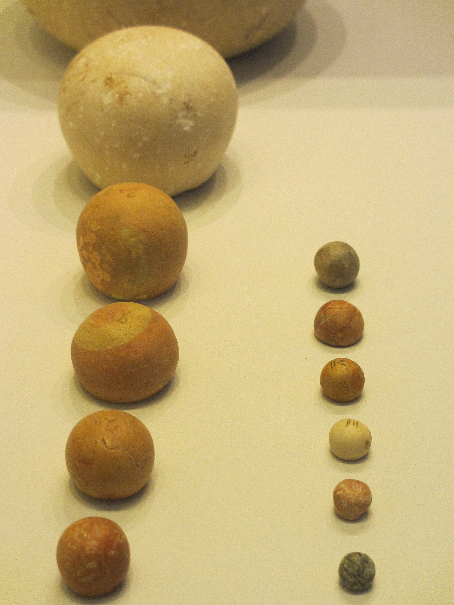

# Human-made Things in the Bible

## License Information

Human-made Things in the Bible © United Bible Societies, 2025. Adapted from: <cite>The Works of Their Hands: Man-made Things in the Bible</cite>, by Ray Pritz © 2009 United Bible Societies. This work is licensed under Creative Commons Attribution-ShareAlike 4.0 International (<a href="https://creativecommons.org/licenses/by-sa/4.0/">https://creativecommons.org/licenses/by-sa/4.0/</a>).

--------------------------------

## 標題：石法碼（stone weights） (id: REALIA:1.6.2)

1\.6\.2 標題：石法碼（stone weights）
=============================

經文出處
----

Hebrew 來： אֶבֶן (音譯： ’even)

[LEV 19:36](https://ref.ly/Lev19:36), [DEU 25:13](https://ref.ly/Deut25:13), [DEU 25:13](https://ref.ly/Deut25:13), [DEU 25:15](https://ref.ly/Deut25:15), [2SA 14:26](https://ref.ly/2Sam14:26), [PRO 11:1](https://ref.ly/Prov11:1), [PRO 16:11](https://ref.ly/Prov16:11), [PRO 20:10](https://ref.ly/Prov20:10), [PRO 20:10](https://ref.ly/Prov20:10), [PRO 20:23](https://ref.ly/Prov20:23), [PRO 20:23](https://ref.ly/Prov20:23), [MIC 6:11](https://ref.ly/Mic6:11)

Greek 希： σταθμίον (音譯： stathmion)

[SIR 42:4](https://ref.ly/Sir42:4)

描述和用途
-----

*石頭法碼 (© Chamberi, CC BY\-SA 3\.0, via Wikimedia Commons)*

人們使用不同尺寸和重量的石頭來使天平達到平衡，以此來確定所售商品的價格（參[1\.6\.1 天平 (balance scales)\<REALIA:1\.6\.1\>](#) ）。這些石頭上面通常標有重量。

---

翻譯
--

在上面提到的大多數經文中，法碼是確定某物應付款項的一種方法；意思是說，它們是完成商業交易的工具。因此，有些經文只需要暗示出法碼即可；例如，[PRO 16:11](https://ref.ly/Prov16:11) 可譯成「我們做生意時欺騙人，耶和華不喜悅這事」（CEV (Contemporary English Version) 直譯）。

雖然希伯來文*’even* 的字面意思是「石頭」，但在上面列出的經文中，翻譯者如果決定指出實際的物品，通常最好將*’even* 譯為「法碼」。

* **Associated Passages:** 利未記 19:36; 申命記 25:13; 申命記 25:15; 撒母耳記下 14:26; 箴言 11:1; 箴言 16:11; 箴言 20:10; 箴言 20:23; 彌迦書 6:11; 德訓篇 42:4

