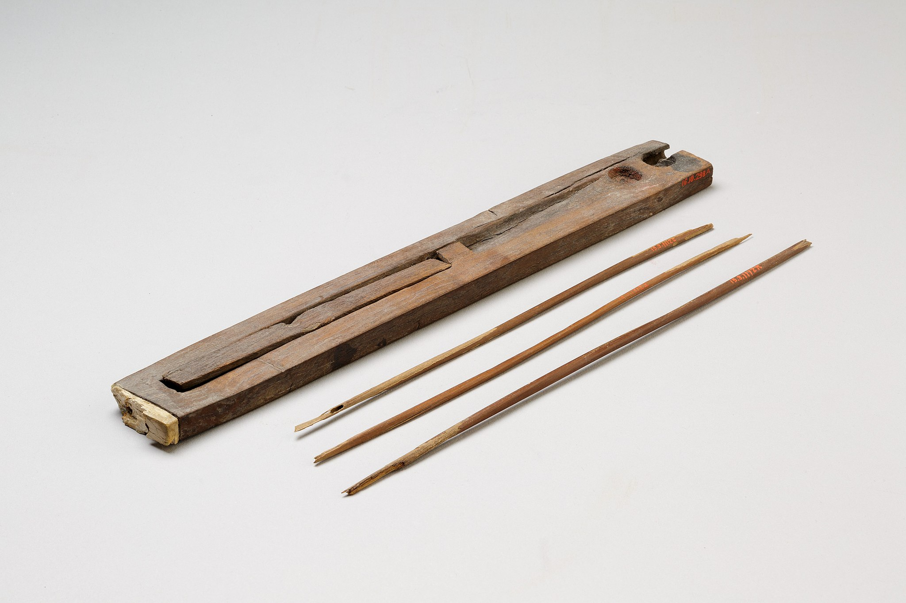
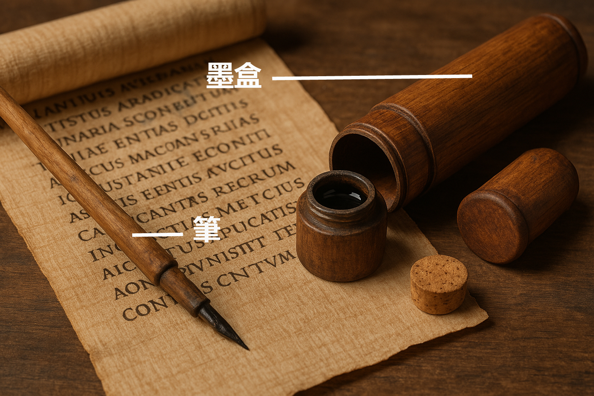

# Human-made Things in the Bible

## License Information

Human-made Things in the Bible © United Bible Societies, 2025. Adapted from: <cite>The Works of Their Hands: Man-made Things in the Bible</cite>, by Ray Pritz © 2009 United Bible Societies. This work is licensed under Creative Commons Attribution-ShareAlike 4.0 International (<a href="https://creativecommons.org/licenses/by-sa/4.0/">https://creativecommons.org/licenses/by-sa/4.0/</a>).

--------------------------------

## 標題：墨盒（writing case） (id: REALIA:1.7.4)

1\.7\.4 標題：墨盒（writing case）
===========================

經文出處
----

Hebrew 來： קֶסֶת, סֹפֵר (音譯： qeseth, qeseth sofer)

[EZK 9:2](https://ref.ly/Ezek9:2), [EZK 9:3](https://ref.ly/Ezek9:3), [EZK 9:11](https://ref.ly/Ezek9:11)

描述
--

*盒中的筆（木，象牙，顏料，約公元前1635–1458年，第二中期\-新王國時期早期（Second Intermediate Period–Early New Kingdom），埃及，底比斯（Thebes），阿薩西夫（Asasif）） (Metropolitan Museum of Art, CC0, via Wikimedia Commons)*

墨盒是一個通常用木頭做成的小盒子，用來裝幾支筆（[1\.7\.2 墨 (ink)\<REALIA:1\.7\.2\>](#) ），有時會放一塊乾墨（[1\.7\.4 墨盒 (writing case)\<REALIA:1\.7\.4\>](#) ）。盒子裡面除了幾支蘆葦筆之外，還有寫字時用來調配墨水的容器。通常，人們會把墨盒掛在腰帶上。有時，調配墨水的容器形狀就像調色板，有兩個圓形凹陷，用來放兩種顏色的墨塊。這個容器可以用繩子掛在身上。

---

翻譯
--

*墨盒和筆 (Image generated by ChatGPT using OpenAI technology)*

在許多語言中，與「墨盒」最接近的對等詞是「鉛筆盒」，但這可能聽起來與時代不符。翻譯者也可以使用描述性的短語，例如，「裝筆的小盒子」或「裝著書寫用具的小盒子」。

* **Associated Passages:** 以西結書 9:2; 以西結書 9:3; 以西結書 9:11

* **Associated ACAI Concepts:** Writing Case (ID: `realia:WritingCase`); Linen (ID: `realia:Linen`)
