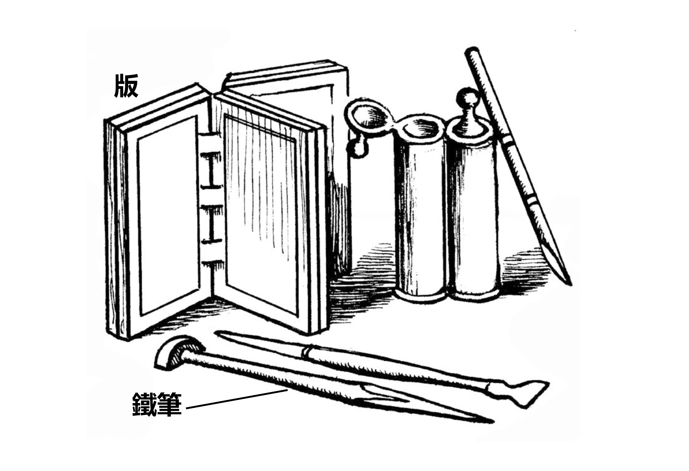

# Human-made Things in the Bible

## License Information

Human-made Things in the Bible © United Bible Societies, 2025. Adapted from: <cite>The Works of Their Hands: Man-made Things in the Bible</cite>, by Ray Pritz © 2009 United Bible Societies. This work is licensed under Creative Commons Attribution-ShareAlike 4.0 International (<a href="https://creativecommons.org/licenses/by-sa/4.0/">https://creativecommons.org/licenses/by-sa/4.0/</a>).

--------------------------------

## 標題：鐵筆（stylus） (id: REALIA:1.7.5)

1\.7\.5 標題：鐵筆（stylus）
=====================

經文出處
----

Hebrew 來： חֶרֶט (音譯： cheret)

[ISA 8:1](https://ref.ly/Isa8:1)

Hebrew 來： עֵט, בַּרְזֶל (音譯： ‘et barzel)

[JOB 19:24](https://ref.ly/Job19:24), [JER 17:1](https://ref.ly/Jer17:1)

描述和用途
-----

*版和鐵筆 (© Deutsche Bibelgesellschaft, Stuttgart by United Bible Societies)*

鐵筆是一個銳利的小鐵塊。

人們用手握著鐵筆，用銳利的筆尖在石頭或金屬上刻出文字或圖畫。

---

翻譯
--

關於[JOB 19:24](https://ref.ly/Job19:24) 提到的物品究竟是用鐵製成的雕刻工具，還是在上面進行雕刻的鐵片，我們尚不清楚。HOTTP (Hebrew Old Testament Text Project (UBS)) 認為這節經文前半部分的意思是「在鐵版和鉛版上」，或是「用鐵筆和鉛」（意思是把熔化的鉛倒在銘文的凹處）。

[ISA 8:1](https://ref.ly/Isa8:1) 中的希伯來文短語*cheret'enosh* 一直存在很多爭議。有些譯本選擇保留所用的工具（“man’s pen”「人的筆」，KJV (King James Version (1611)) ；“ordinary pen”「普通筆」，NIV (New International Version (1984)) ；“ordinary stylus”「普通鐵筆」，NJB (New Jerusalem Bible (1985)) ），其他譯本則優先關注寫下來的字（“common characters”「普通的字」，RSV (Revised Standard Version (1952)) ；“big clear letters”「大而清晰的文字」，CEV (Contemporary English Version) ；“clearly write”「清楚地寫」，NLT (New Living Translation) ）。

* **Associated Passages:** 以賽亞書 8:1; 約伯記 19:24; 耶利米書 17:1

