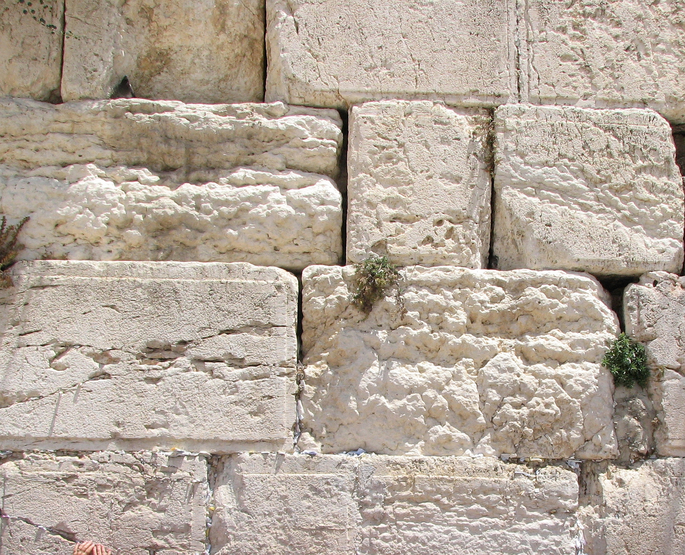

# Human-made Things in the Bible

## License Information

Human-made Things in the Bible © United Bible Societies, 2025. Adapted from: <cite>The Works of Their Hands: Man-made Things in the Bible</cite>, by Ray Pritz © 2009 United Bible Societies. This work is licensed under Creative Commons Attribution-ShareAlike 4.0 International (<a href="https://creativecommons.org/licenses/by-sa/4.0/">https://creativecommons.org/licenses/by-sa/4.0/</a>).

--------------------------------

## 標題：建築用方石（squared stones for building） (id: REALIA:1.8.4)

1\.8\.4 標題：建築用方石（squared stones for building）
=============================================

經文出處
----

Hebrew 來： אֶבֶן, גָּזִית (音譯： gazith, ’even gazith)

[EXO 20:25](https://ref.ly/Exod20:25), [1KI 5:31](https://ref.ly/1Kgs5:31), [1KI 6:36](https://ref.ly/1Kgs6:36), [1KI 7:9](https://ref.ly/1Kgs7:9), [1KI 7:11](https://ref.ly/1Kgs7:11), [1KI 7:12](https://ref.ly/1Kgs7:12), [1CH 22:2](https://ref.ly/1Chr22:2), [ISA 9:9](https://ref.ly/Isa9:9), [LAM 3:9](https://ref.ly/Lam3:9), [EZK 40:42](https://ref.ly/Ezek40:42), [AMO 5:11](https://ref.ly/Amos5:11)

Greek 希： λίθος, λαξεύω (音譯： lithos lelaxeumenos)

[JDT 1:2](https://ref.ly/Jdt1:2)

Greek 希： λίθος, ξυστός (音譯： lithos xustos)

[1ES 6:8](https://ref.ly/1Esd6:8), [1ES 6:24](https://ref.ly/1Esd6:24)

Greek 希： λίθος, τετράποδος (音譯： lithos tetrapodos)

[1MA 10:11](https://ref.ly/1Macc10:11)

描述和用途
-----

*耶路撒冷西牆的希律時期方形石塊 (© Gilabrand, CC BY 3\.0, via Wikimedia Commons)*

方石是切成方形的石塊，使其能夠堆砌起來，建成牆或建築物。這些石頭通常從基岩中開採。

---

翻譯
--

建築用石的大小差別很大，從一個人可以搬起來的石頭，一直到長達幾米、重達數十噸的大石頭都有。翻譯者應避免使用表示磚塊或小石塊的詞語，可以說「非常大的、切成方塊的石頭」。

*天花板，牆壁和牆頂裝飾 (© Ray Pritz by United Bible Societies)*

[1KI 7:9](https://ref.ly/1Kgs7:9) ：這節經文描述了前後都修鑿整齊的建築石材。這些石材用來建造每一面牆壁，從底部到頂部。對於牆的頂部，希伯來文本使用了*tfachoth* 一詞，通常譯為「屋簷」（“eaves”；GNT (Good News Translation (1992)) 、NIV (New International Version (1984)) ）或「壓頂板」（“coping”；RSV (Revised Standard Version (1952)) 、REB (Revised English Bible (1989)) ）。許多語言沒有這些建築術語，或者不為人熟知（如日常英文中不太常用“eaves”和“coping”）。然而，最近有學者提出，*tfachoth* 實際上是牆頂的一種裝飾，就像是在天花板和牆壁之間有兩個或三個倒置的臺階。

一般來說，翻譯者不必使用準確的建築術語來翻譯這種不確定的詞語；整節經文可以像CEV (Contemporary English Version) 那樣翻譯，英文直譯為：「從地基一直到頂部，這些建築物和庭院所用的石頭，都是品質最好的，並準確切割成所需要的大小，然後用鋸子將每一面都鋸齊。」或者借鑒NCV (New Century Version) ，英文直譯為：「所有這些建築物都是用貴重的石塊建成。先把石塊準確切割成型。然後用鋸修整正面和背面。從建築物的地基到牆壁的頂部，都使用了這種貴重的石塊。甚至庭院也是用石塊建成的。」

*搬運建築石材的人 (Image generated by ChatGPT using OpenAI technology)*

[EZK 40:42](https://ref.ly/Ezek40:42) 中提到的「桌子」（希伯來文*shulchan* ）是用石頭做成的。參[4\.3\.6 預備祭牲的桌子 (tables for preparing sacrificial victims)\<REALIA:4\.3\.6\>](#) 中的討論。

* **Associated Passages:** 出埃及記 20:25; 列王紀上 5:31; 列王紀上 6:36; 列王紀上 7:9; 列王紀上 7:11; 列王紀上 7:12; 歷代志上 22:2; 以賽亞書 9:9; 耶利米哀歌 3:9; 以西結書 40:42; 阿摩司書 5:11; 友弟德傳 1:2; 厄斯德拉上 6:8; 厄斯德拉上 6:24; 瑪加伯上 10:11

## 標題：線鋸、鋸（Stone plane, saw） (id: REALIA:1.8.4.1)

1\.8\.4\.1 標題：線鋸、鋸（Stone plane, saw）
====================================

經文出處
----

Hebrew 來： מְגֵרָה (音譯： mgerah)

[2SA 12:31](https://ref.ly/2Sam12:31), [1KI 7:9](https://ref.ly/1Kgs7:9), [1CH 20:3](https://ref.ly/1Chr20:3), [1CH 20:3](https://ref.ly/1Chr20:3)

描述
--

線鋸／鋸是製備建築石材所用的工具。

---

翻譯
--

[2SA 12:31](https://ref.ly/2Sam12:31) ：關於這節經文描述的活動具體是什麼，學者的意見有分歧，不同譯本的翻譯反映出此一現象。這節經文可以理解為：大衛用各種器具折磨或殺死拉巴的居民，包括使用鋸（KJV (King James Version (1611)) 、NASB (New American Standard Bible) ）。然而，大多數現代譯本認為經文的意思是大衛迫使他們使用這些器具做工；例如，「他還把城裡的人拉出來，強迫他們用鋸、鐵耙、鐵斧工作……」（NCV (New Century Version) 直譯）。這是首選的解釋。雖然學者對平行經文（不完全相同）[1CH 20:3](https://ref.ly/1Chr20:3) 的爭論更為複雜，但大多數譯本在兩處的譯文都是相同的。

現在看來，將希伯來文*mgerah* 譯為「鋸」可能是不準確的。考古人員沒有發現那個時期的人們使用鋸來開採或切割石頭。已發現的許多建築用石材確實進行了精細的修整，但這些石頭上並沒有鋸子留下的痕跡。有人提出，*mgerah* 是一種沉重的金屬工具，具有很寬的粗糙表面，就像銼刀一樣。人們使用這種工具沿著石頭表面反覆推拉，直到把石頭磨得非常光滑。這是一項非常費力的苦工，可能是由俘虜或奴隸做的（參巴爾凱，第32—37頁）。

* **Associated Passages:** 撒母耳記下 12:31; 列王紀上 7:9; 歷代志上 20:3

* **Associated ACAI Concepts:** Stone Plane (ID: `realia:StonePlane`)
