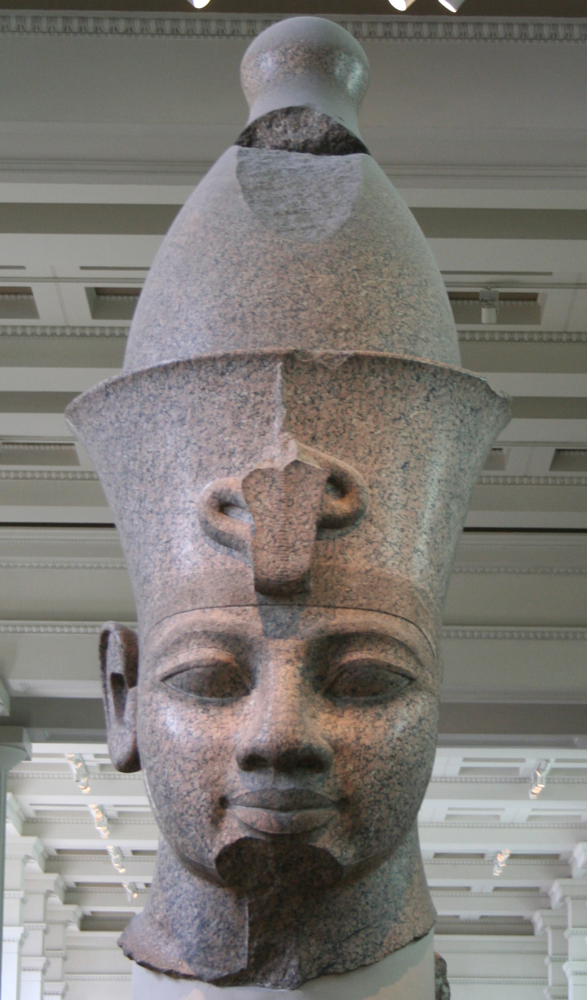

# Human-made Things in the Bible

## License Information

Human-made Things in the Bible © United Bible Societies, 2025. Adapted from: <cite>The Works of Their Hands: Man-made Things in the Bible</cite>, by Ray Pritz © 2009 United Bible Societies. This work is licensed under Creative Commons Attribution-ShareAlike 4.0 International (<a href="https://creativecommons.org/licenses/by-sa/4.0/">https://creativecommons.org/licenses/by-sa/4.0/</a>).

--------------------------------

## 標題：王權（royalty） (id: REALIA:1.10)

1\.10 標題：王權（royalty）
====================

## 標題：寶座、王位（throne） (id: REALIA:1.10.1)

1\.10\.1 標題：寶座、王位（throne）
=========================

經文出處
----

Hebrew 來： כִּסֵּא (音譯： kise’, kiseh)

[GEN 41:40](https://ref.ly/Gen41:40), [EXO 11:5](https://ref.ly/Exod11:5), [EXO 12:29](https://ref.ly/Exod12:29), [DEU 17:18](https://ref.ly/Deut17:18), [JDG 3:20](https://ref.ly/Judg3:20), [1SA 2:8](https://ref.ly/1Sam2:8), [2SA 3:10](https://ref.ly/2Sam3:10), [2SA 7:13](https://ref.ly/2Sam7:13), [2SA 7:16](https://ref.ly/2Sam7:16), [2SA 14:9](https://ref.ly/2Sam14:9), [1KI 1:13](https://ref.ly/1Kgs1:13), [1KI 1:17](https://ref.ly/1Kgs1:17), [1KI 1:20](https://ref.ly/1Kgs1:20), [1KI 1:24](https://ref.ly/1Kgs1:24), [1KI 1:27](https://ref.ly/1Kgs1:27), [1KI 1:30](https://ref.ly/1Kgs1:30), [1KI 1:35](https://ref.ly/1Kgs1:35), [1KI 1:37](https://ref.ly/1Kgs1:37), [1KI 1:37](https://ref.ly/1Kgs1:37), [1KI 1:46](https://ref.ly/1Kgs1:46), [1KI 1:47](https://ref.ly/1Kgs1:47), [1KI 1:47](https://ref.ly/1Kgs1:47), [1KI 1:48](https://ref.ly/1Kgs1:48), [1KI 2:4](https://ref.ly/1Kgs2:4), [1KI 2:12](https://ref.ly/1Kgs2:12), [1KI 2:19](https://ref.ly/1Kgs2:19), [1KI 2:19](https://ref.ly/1Kgs2:19), [1KI 2:24](https://ref.ly/1Kgs2:24), [1KI 2:33](https://ref.ly/1Kgs2:33), [1KI 2:45](https://ref.ly/1Kgs2:45), [1KI 3:6](https://ref.ly/1Kgs3:6), [1KI 5:19](https://ref.ly/1Kgs5:19), [1KI 7:7](https://ref.ly/1Kgs7:7), [1KI 8:20](https://ref.ly/1Kgs8:20), [1KI 8:25](https://ref.ly/1Kgs8:25), [1KI 9:5](https://ref.ly/1Kgs9:5), [1KI 9:5](https://ref.ly/1Kgs9:5), [1KI 10:9](https://ref.ly/1Kgs10:9), [1KI 10:18](https://ref.ly/1Kgs10:18), [1KI 10:19](https://ref.ly/1Kgs10:19), [1KI 10:19](https://ref.ly/1Kgs10:19), [1KI 16:11](https://ref.ly/1Kgs16:11), [1KI 22:10](https://ref.ly/1Kgs22:10), [1KI 22:19](https://ref.ly/1Kgs22:19), [2KI 10:3](https://ref.ly/2Kgs10:3), [2KI 10:30](https://ref.ly/2Kgs10:30), [2KI 11:19](https://ref.ly/2Kgs11:19), [2KI 13:13](https://ref.ly/2Kgs13:13), [2KI 15:12](https://ref.ly/2Kgs15:12), [2KI 25:28](https://ref.ly/2Kgs25:28), [2KI 25:28](https://ref.ly/2Kgs25:28), [1CH 17:12](https://ref.ly/1Chr17:12), [1CH 17:14](https://ref.ly/1Chr17:14), [1CH 22:10](https://ref.ly/1Chr22:10), [1CH 28:5](https://ref.ly/1Chr28:5), [1CH 29:23](https://ref.ly/1Chr29:23), [2CH 6:10](https://ref.ly/2Chr6:10), [2CH 6:16](https://ref.ly/2Chr6:16), [2CH 7:18](https://ref.ly/2Chr7:18), [2CH 9:8](https://ref.ly/2Chr9:8), [2CH 9:17](https://ref.ly/2Chr9:17), [2CH 9:18](https://ref.ly/2Chr9:18), [2CH 9:18](https://ref.ly/2Chr9:18), [2CH 18:9](https://ref.ly/2Chr18:9), [2CH 18:18](https://ref.ly/2Chr18:18), [2CH 23:20](https://ref.ly/2Chr23:20), [EST 1:2](https://ref.ly/Esth1:2), [EST 5:1](https://ref.ly/Esth5:1), [JOB 26:9](https://ref.ly/Job26:9), [JOB 36:7](https://ref.ly/Job36:7), [PSA 9:5](https://ref.ly/Ps9:5), [PSA 9:8](https://ref.ly/Ps9:8), [PSA 11:4](https://ref.ly/Ps11:4), [PSA 45:7](https://ref.ly/Ps45:7), [PSA 47:9](https://ref.ly/Ps47:9), [PSA 89:5](https://ref.ly/Ps89:5), [PSA 89:15](https://ref.ly/Ps89:15), [PSA 89:30](https://ref.ly/Ps89:30), [PSA 89:37](https://ref.ly/Ps89:37), [PSA 89:45](https://ref.ly/Ps89:45), [PSA 93:2](https://ref.ly/Ps93:2), [PSA 94:20](https://ref.ly/Ps94:20), [PSA 97:2](https://ref.ly/Ps97:2), [PSA 103:19](https://ref.ly/Ps103:19), [PSA 122:5](https://ref.ly/Ps122:5), [PSA 122:5](https://ref.ly/Ps122:5), [PSA 132:11](https://ref.ly/Ps132:11), [PRO 16:12](https://ref.ly/Prov16:12), [PRO 20:8](https://ref.ly/Prov20:8), [PRO 20:28](https://ref.ly/Prov20:28), [PRO 25:5](https://ref.ly/Prov25:5), [PRO 29:14](https://ref.ly/Prov29:14), [ISA 6:1](https://ref.ly/Isa6:1), [ISA 9:6](https://ref.ly/Isa9:6), [ISA 14:9](https://ref.ly/Isa14:9), [ISA 14:13](https://ref.ly/Isa14:13), [ISA 16:5](https://ref.ly/Isa16:5), [ISA 22:23](https://ref.ly/Isa22:23), [ISA 47:1](https://ref.ly/Isa47:1), [ISA 66:1](https://ref.ly/Isa66:1), [JER 1:15](https://ref.ly/Jer1:15), [JER 3:17](https://ref.ly/Jer3:17), [JER 13:13](https://ref.ly/Jer13:13), [JER 14:21](https://ref.ly/Jer14:21), [JER 17:12](https://ref.ly/Jer17:12), [JER 17:25](https://ref.ly/Jer17:25), [JER 22:2](https://ref.ly/Jer22:2), [JER 22:4](https://ref.ly/Jer22:4), [JER 22:30](https://ref.ly/Jer22:30), [JER 29:16](https://ref.ly/Jer29:16), [JER 33:17](https://ref.ly/Jer33:17), [JER 33:21](https://ref.ly/Jer33:21), [JER 36:30](https://ref.ly/Jer36:30), [JER 43:10](https://ref.ly/Jer43:10), [JER 49:38](https://ref.ly/Jer49:38), [JER 52:32](https://ref.ly/Jer52:32), [JER 52:32](https://ref.ly/Jer52:32), [LAM 5:19](https://ref.ly/Lam5:19), [EZK 1:26](https://ref.ly/Ezek1:26), [EZK 1:26](https://ref.ly/Ezek1:26), [EZK 10:1](https://ref.ly/Ezek10:1), [EZK 26:16](https://ref.ly/Ezek26:16), [EZK 43:7](https://ref.ly/Ezek43:7), [JON 3:6](https://ref.ly/Jonah3:6), [HAG 2:22](https://ref.ly/Hag2:22), [ZEC 6:13](https://ref.ly/Zech6:13), [ZEC 6:13](https://ref.ly/Zech6:13)

Aramaic 蘭：כָּרְסֵא (音譯： korse’)

[DAN 5:20](https://ref.ly/Dan5:20), [DAN 7:9](https://ref.ly/Dan7:9), [DAN 7:9](https://ref.ly/Dan7:9)

Greek 希： δίφρος (音譯： difros)

[JDT 11:19](https://ref.ly/Jdt11:19)

Greek 希： θρόνος (音譯： thronos)

[GEN 41:40](https://ref.ly/Gen41:40), [EXO 11:5](https://ref.ly/Exod11:5), [EXO 12:29](https://ref.ly/Exod12:29), [JDG 3:20](https://ref.ly/Judg3:20), [1SA 2:8](https://ref.ly/1Sam2:8), [2SA 3:10](https://ref.ly/2Sam3:10), [2SA 7:13](https://ref.ly/2Sam7:13), [2SA 7:16](https://ref.ly/2Sam7:16), [2SA 14:9](https://ref.ly/2Sam14:9), [1KI 1:13](https://ref.ly/1Kgs1:13), [1KI 1:17](https://ref.ly/1Kgs1:17), [1KI 1:20](https://ref.ly/1Kgs1:20), [1KI 1:24](https://ref.ly/1Kgs1:24), [1KI 1:27](https://ref.ly/1Kgs1:27), [1KI 1:30](https://ref.ly/1Kgs1:30), [1KI 1:35](https://ref.ly/1Kgs1:35), [1KI 1:37](https://ref.ly/1Kgs1:37), [1KI 1:37](https://ref.ly/1Kgs1:37), [1KI 1:46](https://ref.ly/1Kgs1:46), [1KI 1:47](https://ref.ly/1Kgs1:47), [1KI 1:47](https://ref.ly/1Kgs1:47), [1KI 1:48](https://ref.ly/1Kgs1:48), [1KI 2:4](https://ref.ly/1Kgs2:4), [1KI 2:12](https://ref.ly/1Kgs2:12), [1KI 2:19](https://ref.ly/1Kgs2:19), [1KI 2:19](https://ref.ly/1Kgs2:19), [1KI 2:24](https://ref.ly/1Kgs2:24), [1KI 2:33](https://ref.ly/1Kgs2:33), [1KI 2:45](https://ref.ly/1Kgs2:45), [1KI 3:6](https://ref.ly/1Kgs3:6), [1KI 5:19](https://ref.ly/1Kgs5:19), [1KI 7:44](https://ref.ly/1Kgs7:44), [1KI 8:20](https://ref.ly/1Kgs8:20), [1KI 8:25](https://ref.ly/1Kgs8:25), [1KI 9:5](https://ref.ly/1Kgs9:5), [1KI 10:9](https://ref.ly/1Kgs10:9), [1KI 10:18](https://ref.ly/1Kgs10:18), [1KI 10:19](https://ref.ly/1Kgs10:19), [1KI 10:19](https://ref.ly/1Kgs10:19), [1KI 16:11](https://ref.ly/1Kgs16:11), [1KI 22:10](https://ref.ly/1Kgs22:10), [1KI 22:19](https://ref.ly/1Kgs22:19), [2KI 10:3](https://ref.ly/2Kgs10:3), [2KI 10:30](https://ref.ly/2Kgs10:30), [2KI 11:19](https://ref.ly/2Kgs11:19), [2KI 13:13](https://ref.ly/2Kgs13:13), [2KI 15:12](https://ref.ly/2Kgs15:12), [2KI 25:28](https://ref.ly/2Kgs25:28), [2KI 25:28](https://ref.ly/2Kgs25:28), [1CH 17:12](https://ref.ly/1Chr17:12), [1CH 17:14](https://ref.ly/1Chr17:14), [1CH 22:10](https://ref.ly/1Chr22:10), [1CH 28:5](https://ref.ly/1Chr28:5), [1CH 29:23](https://ref.ly/1Chr29:23), [2CH 6:10](https://ref.ly/2Chr6:10), [2CH 6:16](https://ref.ly/2Chr6:16), [2CH 7:18](https://ref.ly/2Chr7:18), [2CH 9:8](https://ref.ly/2Chr9:8), [2CH 9:17](https://ref.ly/2Chr9:17), [2CH 9:18](https://ref.ly/2Chr9:18), [2CH 9:18](https://ref.ly/2Chr9:18), [2CH 18:9](https://ref.ly/2Chr18:9), [2CH 18:18](https://ref.ly/2Chr18:18), [2CH 23:20](https://ref.ly/2Chr23:20), [JOB 12:18](https://ref.ly/Job12:18), [JOB 26:9](https://ref.ly/Job26:9), [JOB 36:7](https://ref.ly/Job36:7), [PSA 9:5](https://ref.ly/Ps9:5), [PSA 9:8](https://ref.ly/Ps9:8), [PSA 10:4](https://ref.ly/Ps10:4), [PSA 44:7](https://ref.ly/Ps44:7), [PSA 46:9](https://ref.ly/Ps46:9), [PSA 88:5](https://ref.ly/Ps88:5), [PSA 88:15](https://ref.ly/Ps88:15), [PSA 88:30](https://ref.ly/Ps88:30), [PSA 88:37](https://ref.ly/Ps88:37), [PSA 88:45](https://ref.ly/Ps88:45), [PSA 92:2](https://ref.ly/Ps92:2), [PSA 93:20](https://ref.ly/Ps93:20), [PSA 96:2](https://ref.ly/Ps96:2), [PSA 102:19](https://ref.ly/Ps102:19), [PSA 121:5](https://ref.ly/Ps121:5), [PSA 121:5](https://ref.ly/Ps121:5), [PSA 131:11](https://ref.ly/Ps131:11), [PSA 131:12](https://ref.ly/Ps131:12), [PRO 8:27](https://ref.ly/Prov8:27), [PRO 11:16](https://ref.ly/Prov11:16), [PRO 12:23](https://ref.ly/Prov12:23), [PRO 16:12](https://ref.ly/Prov16:12), [PRO 20:8](https://ref.ly/Prov20:8), [PRO 20:28](https://ref.ly/Prov20:28), [PRO 25:5](https://ref.ly/Prov25:5), [PRO 29:14](https://ref.ly/Prov29:14), [ISA 6:1](https://ref.ly/Isa6:1), [ISA 9:6](https://ref.ly/Isa9:6), [ISA 14:9](https://ref.ly/Isa14:9), [ISA 14:13](https://ref.ly/Isa14:13), [ISA 16:5](https://ref.ly/Isa16:5), [ISA 22:23](https://ref.ly/Isa22:23), [ISA 66:1](https://ref.ly/Isa66:1), [JER 1:15](https://ref.ly/Jer1:15), [JER 3:17](https://ref.ly/Jer3:17), [JER 13:13](https://ref.ly/Jer13:13), [JER 14:21](https://ref.ly/Jer14:21), [JER 17:12](https://ref.ly/Jer17:12), [JER 17:25](https://ref.ly/Jer17:25), [JER 22:2](https://ref.ly/Jer22:2), [JER 22:4](https://ref.ly/Jer22:4), [JER 22:30](https://ref.ly/Jer22:30), [JER 25:18](https://ref.ly/Jer25:18), [JER 43:30](https://ref.ly/Jer43:30), [JER 50:10](https://ref.ly/Jer50:10), [JER 52:32](https://ref.ly/Jer52:32), [JER 52:32](https://ref.ly/Jer52:32), [LAM 5:19](https://ref.ly/Lam5:19), [EZK 1:26](https://ref.ly/Ezek1:26), [EZK 1:26](https://ref.ly/Ezek1:26), [EZK 10:1](https://ref.ly/Ezek10:1), [EZK 26:16](https://ref.ly/Ezek26:16), [EZK 43:7](https://ref.ly/Ezek43:7), [DAN 3:54](https://ref.ly/Dan3:54), [DAN 5:20](https://ref.ly/Dan5:20), [DAN 7:9](https://ref.ly/Dan7:9), [DAN 7:9](https://ref.ly/Dan7:9), [JON 3:6](https://ref.ly/Jonah3:6), [HAG 2:22](https://ref.ly/Hag2:22), [ZEC 6:13](https://ref.ly/Zech6:13), [MAT 5:34](https://ref.ly/Matt5:34), [MAT 19:28](https://ref.ly/Matt19:28), [MAT 19:28](https://ref.ly/Matt19:28), [MAT 23:22](https://ref.ly/Matt23:22), [MAT 25:31](https://ref.ly/Matt25:31), [LUK 1:32](https://ref.ly/Luke1:32), [LUK 1:52](https://ref.ly/Luke1:52), [LUK 22:30](https://ref.ly/Luke22:30), [ACT 2:30](https://ref.ly/Acts2:30), [ACT 7:49](https://ref.ly/Acts7:49), [COL 1:16](https://ref.ly/Col1:16), [HEB 1:8](https://ref.ly/Heb1:8), [HEB 4:16](https://ref.ly/Heb4:16), [HEB 8:1](https://ref.ly/Heb8:1), [HEB 12:2](https://ref.ly/Heb12:2), [REV 1:4](https://ref.ly/Rev1:4), [REV 2:13](https://ref.ly/Rev2:13), [REV 3:21](https://ref.ly/Rev3:21), [REV 3:21](https://ref.ly/Rev3:21), [REV 4:2](https://ref.ly/Rev4:2), [REV 4:2](https://ref.ly/Rev4:2), [REV 4:3](https://ref.ly/Rev4:3), [REV 4:4](https://ref.ly/Rev4:4), [REV 4:4](https://ref.ly/Rev4:4), [REV 4:4](https://ref.ly/Rev4:4), [REV 4:5](https://ref.ly/Rev4:5), [REV 4:5](https://ref.ly/Rev4:5), [REV 4:6](https://ref.ly/Rev4:6), [REV 4:6](https://ref.ly/Rev4:6), [REV 4:6](https://ref.ly/Rev4:6), [REV 4:9](https://ref.ly/Rev4:9), [REV 4:10](https://ref.ly/Rev4:10), [REV 4:10](https://ref.ly/Rev4:10), [REV 5:1](https://ref.ly/Rev5:1), [REV 5:6](https://ref.ly/Rev5:6), [REV 5:7](https://ref.ly/Rev5:7), [REV 5:11](https://ref.ly/Rev5:11), [REV 5:13](https://ref.ly/Rev5:13), [REV 6:16](https://ref.ly/Rev6:16), [REV 7:9](https://ref.ly/Rev7:9), [REV 7:10](https://ref.ly/Rev7:10), [REV 7:11](https://ref.ly/Rev7:11), [REV 7:11](https://ref.ly/Rev7:11), [REV 7:15](https://ref.ly/Rev7:15), [REV 7:15](https://ref.ly/Rev7:15), [REV 7:17](https://ref.ly/Rev7:17), [REV 8:3](https://ref.ly/Rev8:3), [REV 11:16](https://ref.ly/Rev11:16), [REV 12:5](https://ref.ly/Rev12:5), [REV 13:2](https://ref.ly/Rev13:2), [REV 14:3](https://ref.ly/Rev14:3), [REV 16:10](https://ref.ly/Rev16:10), [REV 16:17](https://ref.ly/Rev16:17), [REV 19:4](https://ref.ly/Rev19:4), [REV 19:5](https://ref.ly/Rev19:5), [REV 20:4](https://ref.ly/Rev20:4), [REV 20:11](https://ref.ly/Rev20:11), [REV 20:12](https://ref.ly/Rev20:12), [REV 21:3](https://ref.ly/Rev21:3), [REV 21:5](https://ref.ly/Rev21:5), [REV 22:1](https://ref.ly/Rev22:1), [REV 22:3](https://ref.ly/Rev22:3), [JDT 1:12](https://ref.ly/Jdt1:12), [JDT 9:3](https://ref.ly/Jdt9:3), [ESG 5:1](https://ref.ly/EsthGr5:1), [ESG 5:1](https://ref.ly/EsthGr5:1), [ESG 8:12](https://ref.ly/EsthGr8:12), [WIS 5:23](https://ref.ly/Wis5:23), [WIS 6:21](https://ref.ly/Wis6:21), [WIS 7:8](https://ref.ly/Wis7:8), [WIS 9:4](https://ref.ly/Wis9:4), [WIS 9:10](https://ref.ly/Wis9:10), [WIS 9:12](https://ref.ly/Wis9:12), [WIS 18:15](https://ref.ly/Wis18:15), [SIR 1:8](https://ref.ly/Sir1:8), [SIR 10:14](https://ref.ly/Sir10:14), [SIR 24:4](https://ref.ly/Sir24:4), [SIR 40:3](https://ref.ly/Sir40:3), [SIR 47:11](https://ref.ly/Sir47:11), [BAR 5:6](https://ref.ly/Bar5:6), [1MA 2:57](https://ref.ly/1Macc2:57), [1MA 7:4](https://ref.ly/1Macc7:4), [1MA 10:52](https://ref.ly/1Macc10:52), [1MA 10:53](https://ref.ly/1Macc10:53), [1MA 10:55](https://ref.ly/1Macc10:55), [1MA 11:52](https://ref.ly/1Macc11:52), [4MA 17:18](https://ref.ly/4Macc17:18), [ODA 3:8](https://ref.ly/Odes3:8), [PSS 2:19](https://ref.ly/PssSol2:19), [PSS 17:6](https://ref.ly/PssSol17:6)

Latin 拉： thronus

[2ES 8:21](https://ref.ly/2Esd8:21)

描述
--

*大流士坐在波斯波利斯（Persepolis）王座上的浮雕 (© درفش کاویانی, CC BY\-SA 3\.0, via Wikimedia Commons)*

寶座是一個相對較大且非常精緻的座位，統治者坐在上面。寶座可由石頭或木頭製成，甚至可能是用貴重金屬和象牙等其他材料製成，通常有靠背，兩側有扶手。[1KI 10:19](https://ref.ly/1Kgs10:19); [1KI 10:20](https://ref.ly/1Kgs10:20) 和[2CH 9:18](https://ref.ly/2Chr9:18); [2CH 9:19](https://ref.ly/2Chr9:19) 記載，所羅門的寶座比周圍的地面要高，需要通過臺階走上去。參[3\.1\.7 樓梯、臺階、階梯 (stairs, steps)\<REALIA:3\.1\.7\>](#) 。

---

用途
--

*由下埃及的蠍形冠和上埃及的瓶形冠合成的雙疊冠冕 (© Einsamer Schütze, via Wikimedia Commons)*

在正式的場合，統治者坐在寶座上，接待外國要人、宣佈審判，或者製定和宣佈國家的重大決策。

---

翻譯
--

「寶座」可以譯為「大椅子」、「重要的座位」或「王的椅子」。另一方面，當經文描述「寶座」為審判或做決定的地方時，可譯為「統治者發佈命令時坐的座位」、「統治者做決定時坐的座位」，或「審判座」。

希臘文*thronos* 單單指寶座，但希伯來文*kise'* 和*kiseh* 是表示座位的一般用詞（參[5\.9 椅子、座位 (chair, seat)\<REALIA:5\.9\>](#) ）。在講到君王的座位時，這兩個希伯來文詞語的正確譯法就是「寶座」。

* **Associated Passages:** 創世記 41:40; 出埃及記 11:5; 出埃及記 12:29; 申命記 17:18; 士師記 3:20; 撒母耳記上 2:8; 撒母耳記下 3:10; 撒母耳記下 7:13; 撒母耳記下 7:16; 撒母耳記下 14:9; 列王紀上 1:13; 列王紀上 1:17; 列王紀上 1:20; 列王紀上 1:24; 列王紀上 1:27; 列王紀上 1:30; 列王紀上 1:35; 列王紀上 1:37; 列王紀上 1:46; 列王紀上 1:47; 列王紀上 1:48; 列王紀上 2:4; 列王紀上 2:12; 列王紀上 2:19; 列王紀上 2:24; 列王紀上 2:33; 列王紀上 2:45; 列王紀上 3:6; 列王紀上 5:19; 列王紀上 7:7; 列王紀上 8:20; 列王紀上 8:25; 列王紀上 9:5; 列王紀上 10:9; 列王紀上 10:18; 列王紀上 10:19; 列王紀上 16:11; 列王紀上 22:10; 列王紀上 22:19; 列王紀下 10:3; 列王紀下 10:30; 列王紀下 11:19; 列王紀下 13:13; 列王紀下 15:12; 列王紀下 25:28; 歷代志上 17:12; 歷代志上 17:14; 歷代志上 22:10; 歷代志上 28:5; 歷代志上 29:23; 歷代志下 6:10; 歷代志下 6:16; 歷代志下 7:18; 歷代志下 9:8; 歷代志下 9:17; 歷代志下 9:18; 歷代志下 18:9; 歷代志下 18:18; 歷代志下 23:20; 以斯帖記 1:2; 以斯帖記 5:1; 約伯記 26:9; 約伯記 36:7; 詩篇 9:5; 詩篇 9:8; 詩篇 11:4; 詩篇 45:7; 詩篇 47:9; 詩篇 89:5; 詩篇 89:15; 詩篇 89:30; 詩篇 89:37; 詩篇 89:45; 詩篇 93:2; 詩篇 94:20; 詩篇 97:2; 詩篇 103:19; 詩篇 122:5; 詩篇 132:11; 箴言 16:12; 箴言 20:8; 箴言 20:28; 箴言 25:5; 箴言 29:14; 以賽亞書 6:1; 以賽亞書 9:6; 以賽亞書 14:9; 以賽亞書 14:13; 以賽亞書 16:5; 以賽亞書 22:23; 以賽亞書 47:1; 以賽亞書 66:1; 耶利米書 1:15; 耶利米書 3:17; 耶利米書 13:13; 耶利米書 14:21; 耶利米書 17:12; 耶利米書 17:25; 耶利米書 22:2; 耶利米書 22:4; 耶利米書 22:30; 耶利米書 29:16; 耶利米書 33:17; 耶利米書 33:21; 耶利米書 36:30; 耶利米書 43:10; 耶利米書 49:38; 耶利米書 52:32; 耶利米哀歌 5:19; 以西結書 1:26; 以西結書 10:1; 以西結書 26:16; 以西結書 43:7; 約拿書 3:6; 哈該書 2:22; 撒迦利亞書 6:13; 但以理書 5:20; 但以理書 7:9; 友弟德傳 11:19; 列王紀上 7:44; 約伯記 12:18; 詩篇 10:4; 詩篇 44:7; 詩篇 46:9; 詩篇 88:5; 詩篇 88:15; 詩篇 88:30; 詩篇 88:37; 詩篇 88:45; 詩篇 92:2; 詩篇 93:20; 詩篇 96:2; 詩篇 102:19; 詩篇 121:5; 詩篇 131:11; 詩篇 131:12; 箴言 8:27; 箴言 11:16; 箴言 12:23; 耶利米書 25:18; 耶利米書 43:30; 耶利米書 50:10; 但以理書 3:54; 馬太福音 5:34; 馬太福音 19:28; 馬太福音 23:22; 馬太福音 25:31; 路加福音 1:32; 路加福音 1:52; 路加福音 22:30; 使徒行傳 2:30; 使徒行傳 7:49; 歌羅西書 1:16; 希伯來書 1:8; 希伯來書 4:16; 希伯來書 8:1; 希伯來書 12:2; 啟示錄 1:4; 啟示錄 2:13; 啟示錄 3:21; 啟示錄 4:2; 啟示錄 4:3; 啟示錄 4:4; 啟示錄 4:5; 啟示錄 4:6; 啟示錄 4:9; 啟示錄 4:10; 啟示錄 5:1; 啟示錄 5:6; 啟示錄 5:7; 啟示錄 5:11; 啟示錄 5:13; 啟示錄 6:16; 啟示錄 7:9; 啟示錄 7:10; 啟示錄 7:11; 啟示錄 7:15; 啟示錄 7:17; 啟示錄 8:3; 啟示錄 11:16; 啟示錄 12:5; 啟示錄 13:2; 啟示錄 14:3; 啟示錄 16:10; 啟示錄 16:17; 啟示錄 19:4; 啟示錄 19:5; 啟示錄 20:4; 啟示錄 20:11; 啟示錄 20:12; 啟示錄 21:3; 啟示錄 21:5; 啟示錄 22:1; 啟示錄 22:3; 友弟德傳 1:12; 友弟德傳 9:3; 以斯帖記補篇 5:1; 以斯帖記補篇 8:12; 智慧篇 5:23; 智慧篇 6:21; 智慧篇 7:8; 智慧篇 9:4; 智慧篇 9:10; 智慧篇 9:12; 智慧篇 18:15; 德訓篇 1:8; 德訓篇 10:14; 德訓篇 24:4; 德訓篇 40:3; 德訓篇 47:11; 巴路克 5:6; 瑪加伯上 2:57; 瑪加伯上 7:4; 瑪加伯上 10:52; 瑪加伯上 10:53; 瑪加伯上 10:55; 瑪加伯上 11:52; 瑪加伯四書 17:18; 頌歌 3:8; 所羅門詩篇 2:19; 所羅門詩篇 17:6; 厄斯德拉下 8:21; 列王紀上 10:20; 歷代志下 9:19

* **Associated ACAI Concepts:** Throne (ID: `realia:Throne`); Hall of the Throne (ID: `place:HallOfTheThrone`)

## 標題：冠冕、王冠（crown） (id: REALIA:1.10.2)

1\.10\.2 標題：冠冕、王冠（crown）
========================

經文出處
----

Hebrew 來： כֶּתֶר (音譯： kether)

[EST 1:11](https://ref.ly/Esth1:11), [EST 2:17](https://ref.ly/Esth2:17), [EST 6:8](https://ref.ly/Esth6:8)

Hebrew 來： נֵזֶר (音譯： nezer)

[2SA 1:10](https://ref.ly/2Sam1:10), [2KI 11:12](https://ref.ly/2Kgs11:12), [2CH 23:11](https://ref.ly/2Chr23:11), [PSA 89:40](https://ref.ly/Ps89:40), [PSA 132:18](https://ref.ly/Ps132:18), [PRO 27:24](https://ref.ly/Prov27:24), [ZEC 9:16](https://ref.ly/Zech9:16)

Hebrew 來： עטר (音譯： ‘atar（動詞）)

[PSA 8:6](https://ref.ly/Ps8:6), [SNG 3:11](https://ref.ly/Song3:11)

Hebrew 來： עֲטָרָה (音譯： ‘atarah)

[2SA 12:30](https://ref.ly/2Sam12:30), [1CH 20:2](https://ref.ly/1Chr20:2), [EST 8:15](https://ref.ly/Esth8:15), [PSA 21:4](https://ref.ly/Ps21:4), [SNG 3:11](https://ref.ly/Song3:11), [JER 13:18](https://ref.ly/Jer13:18), [EZK 16:12](https://ref.ly/Ezek16:12), [EZK 21:31](https://ref.ly/Ezek21:31), [ZEC 6:11](https://ref.ly/Zech6:11), [ZEC 6:14](https://ref.ly/Zech6:14)

Greek 希： διάδημα (音譯： diadēma)

[ISA 62:3](https://ref.ly/Isa62:3), [REV 12:3](https://ref.ly/Rev12:3), [REV 13:1](https://ref.ly/Rev13:1), [REV 19:12](https://ref.ly/Rev19:12), [ESG 1:11](https://ref.ly/EsthGr1:11), [ESG 2:17](https://ref.ly/EsthGr2:17), [ESG 8:15](https://ref.ly/EsthGr8:15), [WIS 5:16](https://ref.ly/Wis5:16), [WIS 18:24](https://ref.ly/Wis18:24), [SIR 11:5](https://ref.ly/Sir11:5), [SIR 47:6](https://ref.ly/Sir47:6), [1MA 1:9](https://ref.ly/1Macc1:9), [1MA 6:15](https://ref.ly/1Macc6:15), [1MA 8:14](https://ref.ly/1Macc8:14), [1MA 11:13](https://ref.ly/1Macc11:13), [1MA 11:13](https://ref.ly/1Macc11:13), [1MA 11:54](https://ref.ly/1Macc11:54), [1MA 12:39](https://ref.ly/1Macc12:39), [1MA 13:32](https://ref.ly/1Macc13:32), [1ES 4:30](https://ref.ly/1Esd4:30)

Greek 希： στέφανος, στεφανόω (音譯： stefanos, stefanoō（動詞）)

[MAT 27:29](https://ref.ly/Matt27:29), [MRK 15:17](https://ref.ly/Mark15:17), [JHN 19:2](https://ref.ly/John19:2), [JHN 19:5](https://ref.ly/John19:5), [HEB 2:7](https://ref.ly/Heb2:7), [HEB 2:9](https://ref.ly/Heb2:9), [REV 4:4](https://ref.ly/Rev4:4), [REV 4:10](https://ref.ly/Rev4:10), [REV 6:2](https://ref.ly/Rev6:2), [REV 9:7](https://ref.ly/Rev9:7), [REV 12:1](https://ref.ly/Rev12:1), [REV 14:14](https://ref.ly/Rev14:14), [SIR 40:4](https://ref.ly/Sir40:4), [SIR 45:12](https://ref.ly/Sir45:12), [1MA 10:20](https://ref.ly/1Macc10:20), [1MA 10:29](https://ref.ly/1Macc10:29), [1MA 11:35](https://ref.ly/1Macc11:35), [1MA 13:37](https://ref.ly/1Macc13:37), [1MA 13:39](https://ref.ly/1Macc13:39), [2MA 14:4](https://ref.ly/2Macc14:4)

描述和用途
-----

*戴王冠的國王 (© CNG Wikimedia Commons)*

王冠是國王或王后佩戴的一種頭飾，作為王室的標誌。

---

翻譯
--

「王冠」可以描述為：「他／她權力的象徵，戴在他／她的頭上」。

*耶穌戴著荊棘冠冕的頭像 (© Sgconlaw \- Wikimedia Commons)*

在有些經文中，王冠只是作為國王或王后地位的象徵。如果有些文化是用其他象徵物來表示王室（或最高領袖）的地位，則可以用那些象徵來替代「王冠」。舉例來說，[EST 2:17](https://ref.ly/Esth2:17) 可以譯為，「他把皇家的印賜給她，立她為王后，代替瓦實提。」同樣，[PSA 21:4](https://ref.ly/Ps21:4) （《和》21:3）可譯為，「你把他安放在酋長的凳子上」或「你立他為首領」。

在有些經文中（[JOB 19:9](https://ref.ly/Job19:9); [JOB 31:36](https://ref.ly/Job31:36); [PRO 12:4](https://ref.ly/Prov12:4); [PRO 16:31](https://ref.ly/Prov16:31); [PRO 17:6](https://ref.ly/Prov17:6); [LAM 5:16](https://ref.ly/Lam5:16) ），很難根據上下文清楚確定希伯來文*'atarah* 是指王冠還是花環（參[6\.8 花環、王冠 (wreath, crown)\<REALIA:6\.8\>](#) ）。

[1MA 11:13](https://ref.ly/1Macc11:13) 原文字面意為：「然後，多利買進入安提阿，並戴上亞細亞王冠。因此，他把兩個王冠放在他的頭上，即埃及王冠和亞細亞王冠。」RSV (Revised Standard Version (1952)) 採用了直譯。然而，這種字面翻譯可能會讓讀者聯想到一幅相當愚蠢的畫面。當然，冠冕只是代表多利買在這兩個地區擁有統治權。CEV (Contemporary English Version) 避免了讀者以為那個國王正在努力平衡他頭上戴著的兩個王冠的滑稽場面，英文直譯為：「多利買進入安提阿城，在那裡他為自己加冕，成為敘利亞和埃及的王。」然而，CEV (Contemporary English Version) 的譯法可能會讓讀者誤以為他是同時成為敘利亞和埃及的國王的。所以，也許這樣翻譯更好：「多利買進入安提阿城，在那裡他把自己加冕為王。這意味著他現在同時統治著埃及和敘利亞。」

翻譯者需要注意，戴在耶穌頭上的「荊棘冠冕」是一個用荊棘枝子做成的花環（[MAT 27:29](https://ref.ly/Matt27:29); [MRK 15:17](https://ref.ly/Mark15:17); [JHN 19:2](https://ref.ly/John19:2); [JHN 19:5](https://ref.ly/John19:5) ）。這件事可以描述為：「在他的頭上放上一圈荊棘」，或「將帶刺的枝子編成花環（或譯：環），戴在他的頭上。」

關於*stefanos* 意指花環，參[6\.8 花環、王冠 (wreath, crown)\<REALIA:6\.8\>](#) 。

* **Associated Passages:** 以斯帖記 1:11; 以斯帖記 2:17; 以斯帖記 6:8; 撒母耳記下 1:10; 列王紀下 11:12; 歷代志下 23:11; 詩篇 89:40; 詩篇 132:18; 箴言 27:24; 撒迦利亞書 9:16; 詩篇 8:6; 雅歌 3:11; 撒母耳記下 12:30; 歷代志上 20:2; 以斯帖記 8:15; 詩篇 21:4; 耶利米書 13:18; 以西結書 16:12; 以西結書 21:31; 撒迦利亞書 6:11; 撒迦利亞書 6:14; 以賽亞書 62:3; 啟示錄 12:3; 啟示錄 13:1; 啟示錄 19:12; 以斯帖記補篇 1:11; 以斯帖記補篇 2:17; 以斯帖記補篇 8:15; 智慧篇 5:16; 智慧篇 18:24; 德訓篇 11:5; 德訓篇 47:6; 瑪加伯上 1:9; 瑪加伯上 6:15; 瑪加伯上 8:14; 瑪加伯上 11:13; 瑪加伯上 11:54; 瑪加伯上 12:39; 瑪加伯上 13:32; 厄斯德拉上 4:30; 馬太福音 27:29; 馬可福音 15:17; 約翰福音 19:2; 約翰福音 19:5; 希伯來書 2:7; 希伯來書 2:9; 啟示錄 4:4; 啟示錄 4:10; 啟示錄 6:2; 啟示錄 9:7; 啟示錄 12:1; 啟示錄 14:14; 德訓篇 40:4; 德訓篇 45:12; 瑪加伯上 10:20; 瑪加伯上 10:29; 瑪加伯上 11:35; 瑪加伯上 13:37; 瑪加伯上 13:39; 瑪加伯下 14:4; 約伯記 19:9; 約伯記 31:36; 箴言 12:4; 箴言 16:31; 箴言 17:6; 耶利米哀歌 5:16

* **Associated ACAI Concepts:** Crown (ID: `realia:Crown`); Crown (ID: `realia:Crown.2`)

## 標題：權杖（scepter） (id: REALIA:1.10.3)

1\.10\.3 標題：權杖（scepter）
=======================

經文出處
----

Hebrew 來： חקק (音譯： mchoqeq)

[GEN 49:10](https://ref.ly/Gen49:10), [NUM 21:18](https://ref.ly/Num21:18), [PSA 60:9](https://ref.ly/Ps60:9), [PSA 108:9](https://ref.ly/Ps108:9)

Hebrew 來： מַטֶּה (音譯： mateh)

[PSA 110:2](https://ref.ly/Ps110:2), [JER 48:17](https://ref.ly/Jer48:17)

Hebrew 來： מַקֵּל (音譯： maqel)

[JER 48:17](https://ref.ly/Jer48:17)

Hebrew 來： שֵׁבֶט (音譯： shevet)

[GEN 49:10](https://ref.ly/Gen49:10), [NUM 24:17](https://ref.ly/Num24:17), [JDG 5:14](https://ref.ly/Judg5:14), [PSA 45:7](https://ref.ly/Ps45:7), [PSA 45:7](https://ref.ly/Ps45:7), [PSA 125:3](https://ref.ly/Ps125:3), [ISA 14:5](https://ref.ly/Isa14:5), [EZK 19:11](https://ref.ly/Ezek19:11), [EZK 19:14](https://ref.ly/Ezek19:14), [AMO 1:5](https://ref.ly/Amos1:5), [AMO 1:8](https://ref.ly/Amos1:8), [ZEC 10:11](https://ref.ly/Zech10:11)

Hebrew 來： שַׁרְבִיט (音譯： sharvit)

[EST 4:11](https://ref.ly/Esth4:11), [EST 5:2](https://ref.ly/Esth5:2), [EST 5:2](https://ref.ly/Esth5:2), [EST 8:4](https://ref.ly/Esth8:4)

Greek 希： ῥάβδος (音譯： rhabdos)

[HEB 1:8](https://ref.ly/Heb1:8), [HEB 1:8](https://ref.ly/Heb1:8), [ESG 5:2](https://ref.ly/EsthGr5:2)

Greek 希： σκῆπτρον (音譯： skēptron)

[ESG 4:17](https://ref.ly/EsthGr4:17), [WIS 6:21](https://ref.ly/Wis6:21), [WIS 7:8](https://ref.ly/Wis7:8), [WIS 10:14](https://ref.ly/Wis10:14), [SIR 35:21](https://ref.ly/Sir35:21), [LJE 1:12](https://ref.ly/EpJer1:12)

描述和用途
-----

*權杖的頭 (Gary Todd, Israel Museum, CC0, via Wikimedia Commons)*

權杖是一根帶有裝飾的杖，通常至少有一部分是由貴金屬製成，象徵著統治者的權柄。統治者在行使某些職權時，會手握權杖。另參[1\.2\.4 竿、木棍、牧羊杖 (rod, club, shepherd’s staff)\<REALIA:1\.2\.4\>](#) 。

---

翻譯
--

如果目標語言是用與首領相關的某個物品（如手杖、凳子或權杖）作為象徵，那麼在譯文中就可以使用這種象徵；例如，[PSA 45:7](https://ref.ly/Ps45:7) （《和》45:6）可以譯為，「你的儀杖表明你公正地統治你的百姓。」

在[JER 48:17](https://ref.ly/Jer48:17) 中，希伯來文*mateh* 和*maqel* 是平行關係。然而，翻譯者並不一定要用兩個相似的詞語來再現這種平行關係；例如，這節經文的後半部分可譯成，「那大能的杖和榮耀的棍竟然折斷了」（RSV (Revised Standard Version (1952)) 直譯）；或「它強大的統治已被打破；它的榮耀和力量已不復存在」（GNT (Good News Translation (1992)) 直譯）。這節經文是個比喻，所以這裡的重點不是權杖這個實物，而是在權柄。

* **Associated Passages:** 創世記 49:10; 民數記 21:18; 詩篇 60:9; 詩篇 108:9; 詩篇 110:2; 耶利米書 48:17; 民數記 24:17; 士師記 5:14; 詩篇 45:7; 詩篇 125:3; 以賽亞書 14:5; 以西結書 19:11; 以西結書 19:14; 阿摩司書 1:5; 阿摩司書 1:8; 撒迦利亞書 10:11; 以斯帖記 4:11; 以斯帖記 5:2; 以斯帖記 8:4; 希伯來書 1:8; 以斯帖記補篇 5:2; 以斯帖記補篇 4:17; 智慧篇 6:21; 智慧篇 7:8; 智慧篇 10:14; 德訓篇 35:21; 耶利米書信 1:12

* **Associated ACAI Concepts:** Rod (ID: `realia:Rod`); Staff (ID: `realia:Staff`)

## 標題：盛膏油的角、盛膏油的瓶（anointing horn, anointing flask） (id: REALIA:1.10.4)

1\.10\.4 標題：盛膏油的角、盛膏油的瓶（anointing horn, anointing flask）
========================================================

經文出處
----

Hebrew 來： שֶׁמֶן (音譯： pak shemen)

[1SA 10:1](https://ref.ly/1Sam10:1), [2KI 9:1](https://ref.ly/2Kgs9:1), [2KI 9:3](https://ref.ly/2Kgs9:3)

Hebrew 來： קֶרֶן (音譯： qeren)

[1SA 16:1](https://ref.ly/1Sam16:1), [1SA 16:13](https://ref.ly/1Sam16:13), [1KI 1:39](https://ref.ly/1Kgs1:39)

描述
--

*公羊的角 (© Olve Utne, CC BY\-SA 2\.5, via Wikimedia Commons)*

盛膏油的角／瓶是用來盛裝橄欖油的小容器，由動物的角或其他材料製成。角通常需要挖空。

---

用途
--

君王或祭司任命儀式需要將橄欖油倒在他的頭上（參[1\.10\.5 膏油 (anointing oil)\<REALIA:1\.10\.5\>](#) ）。油裝在盛膏油的角／瓶中，在需用時倒出來，只有在這種特殊的儀式中才會以這種方式使用膏油。

---

翻譯
--

希伯來文*qeren* 是指動物的角，而*pak* 只是暗指某種容器，例如小瓶、長頸瓶或窄頸瓶。NCV (New Century Version) 將[1SA 16:1](https://ref.ly/1Sam16:1) 中的*qeren* 譯為“container”（「容器」）。選定的譯詞應該是指一種容量較小，並且可以從中倒出液體的容器，並且可以封上口。

* **Associated Passages:** 撒母耳記上 10:1; 列王紀下 9:1; 列王紀下 9:3; 撒母耳記上 16:1; 撒母耳記上 16:13; 列王紀上 1:39

* **Associated ACAI Concepts:** Anointing Flask (ID: `realia:AnointingFlask`); Anointing Oil (ID: `realia:AnointingOil`)

## 標題：膏油（anointing oil） (id: REALIA:1.10.5)

1\.10\.5 標題：膏油（anointing oil）
=============================

經文出處
----

Hebrew 來： יִצְהָר (音譯： yitshar)

[ZEC 4:14](https://ref.ly/Zech4:14)

Hebrew 來： שֶׁמֶן, מִשְׁחָה (音譯： shemen mishchah)

[EXO 25:6](https://ref.ly/Exod25:6), [EXO 29:7](https://ref.ly/Exod29:7), [EXO 29:21](https://ref.ly/Exod29:21), [EXO 30:25](https://ref.ly/Exod30:25), [EXO 30:25](https://ref.ly/Exod30:25), [EXO 30:31](https://ref.ly/Exod30:31), [EXO 31:11](https://ref.ly/Exod31:11), [EXO 35:8](https://ref.ly/Exod35:8), [EXO 35:15](https://ref.ly/Exod35:15), [EXO 35:28](https://ref.ly/Exod35:28), [EXO 37:29](https://ref.ly/Exod37:29), [EXO 39:38](https://ref.ly/Exod39:38), [EXO 40:9](https://ref.ly/Exod40:9), [LEV 8:2](https://ref.ly/Lev8:2), [LEV 8:10](https://ref.ly/Lev8:10), [LEV 8:12](https://ref.ly/Lev8:12), [LEV 8:30](https://ref.ly/Lev8:30), [LEV 10:7](https://ref.ly/Lev10:7), [LEV 21:10](https://ref.ly/Lev21:10), [LEV 21:12](https://ref.ly/Lev21:12), [NUM 4:16](https://ref.ly/Num4:16)

Greek 希： ἔλαιον (音譯： elaion)

[LUK 7:46](https://ref.ly/Luke7:46), [HEB 1:9](https://ref.ly/Heb1:9), [SIR 45:15](https://ref.ly/Sir45:15), [PSA 151:4](https://ref.ly/Ps151:4)

描述和用途
-----

在君王被分別為聖履行職分時，會用純橄欖油膏抹他們，有時候先知也會受膏抹。

在[EXO 30:23](https://ref.ly/Exod30:23); [EXO 30:24](https://ref.ly/Exod30:24); [EXO 30:25](https://ref.ly/Exod30:25); [EXO 30:26](https://ref.ly/Exod30:26); [EXO 30:27](https://ref.ly/Exod30:27); [EXO 30:28](https://ref.ly/Exod30:28); [EXO 30:29](https://ref.ly/Exod30:29); [EXO 30:30](https://ref.ly/Exod30:30); [EXO 30:31](https://ref.ly/Exod30:31); [EXO 30:32](https://ref.ly/Exod30:32); [EXO 30:33](https://ref.ly/Exod30:33) 中，上帝指示以色列人製作特殊的香膏油。這種膏油用來膏抹祭司、帳幕，以及裡面的器具，將其全部分別為「聖」。聖膏油是以橄欖油為主，並加入多種香料。

另參[1\.15\.1 油、油膏 (oil, ointment)\<REALIA:1\.15\.1\>](#) 和[9\.3 橄欖油 (olive oil)\<REALIA:9\.3\>](#) 。

---

翻譯
--

膏抹君王主要是一個宗教行為，而不是政治行為。

* **Associated Passages:** 撒迦利亞書 4:14; 出埃及記 25:6; 出埃及記 29:7; 出埃及記 29:21; 出埃及記 30:25; 出埃及記 30:31; 出埃及記 31:11; 出埃及記 35:8; 出埃及記 35:15; 出埃及記 35:28; 出埃及記 37:29; 出埃及記 39:38; 出埃及記 40:9; 利未記 8:2; 利未記 8:10; 利未記 8:12; 利未記 8:30; 利未記 10:7; 利未記 21:10; 利未記 21:12; 民數記 4:16; 路加福音 7:46; 希伯來書 1:9; 德訓篇 45:15; 詩篇 151:4; 出埃及記 30:23; 出埃及記 30:24; 出埃及記 30:26; 出埃及記 30:27; 出埃及記 30:28; 出埃及記 30:29; 出埃及記 30:30; 出埃及記 30:32; 出埃及記 30:33

* **Associated ACAI Concepts:** Anointing Oil (ID: `realia:AnointingOil`)
