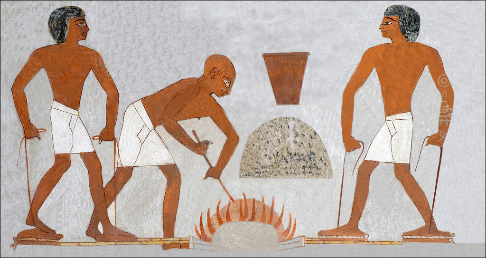

# Human-made Things in the Bible

## License Information

Human-made Things in the Bible © United Bible Societies, 2025. Adapted from: <cite>The Works of Their Hands: Man-made Things in the Bible</cite>, by Ray Pritz © 2009 United Bible Societies. This work is licensed under Creative Commons Attribution-ShareAlike 4.0 International (<a href="https://creativecommons.org/licenses/by-sa/4.0/">https://creativecommons.org/licenses/by-sa/4.0/</a>).

--------------------------------

## 標題：風箱（bellows） (id: REALIA:1.11.1.1)

1\.11\.1\.1 標題：風箱（bellows）
==========================

經文出處
----

Hebrew 來： מַפּוּחַ (音譯： mapuach)

[JER 6:29](https://ref.ly/Jer6:29)

Greek 希： ζώπυρον, πῦρ (音譯： zōpuron tou puros)

[4MA 8:13](https://ref.ly/4Macc8:13)

描述
--

*由工人操作的風箱 (© Le plombier du désert, CC BY\-SA 4\.0, via Wikimedia Commons)*

當需要極高溫度的時候，例如冶煉礦石，通常會用風箱將空氣吹入火爐底部。有一種風箱是由兩個垂直的圓柱體組成，上面覆蓋著厚皮革。操作的人站在這些圓柱體上，用皮帶將皮革拉起，然後用腳將其踩下，以產生強大的空氣流，通過管道吹入到爐內。

---

翻譯
--

現今，有很多英文讀者不熟悉風箱的結構或操作，所以幾種英文通俗譯本在[JER 6:29](https://ref.ly/Jer6:29) 中沒有使用這個詞，而是將這節經文的第一行譯為「用風煽動火焰，使其變得更熱」（NCV (New Century Version) 直譯），「爐子猛烈地燃燒」（GNT (Good News Translation (1992)) 直譯），或「在熾熱的火爐中」（CEV (Contemporary English Version) 直譯）。

* **Associated Passages:** 耶利米書 6:29; 瑪加伯四書 8:13

