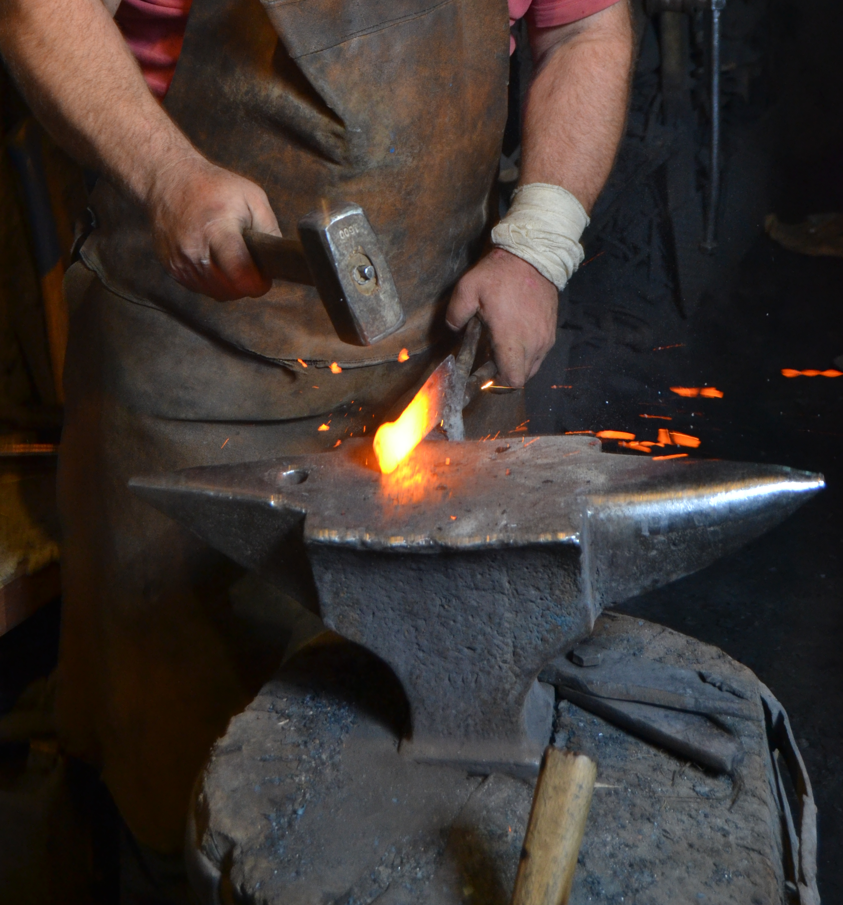

# Human-made Things in the Bible

## License Information

Human-made Things in the Bible © United Bible Societies, 2025. Adapted from: <cite>The Works of Their Hands: Man-made Things in the Bible</cite>, by Ray Pritz © 2009 United Bible Societies. This work is licensed under Creative Commons Attribution-ShareAlike 4.0 International (<a href="https://creativecommons.org/licenses/by-sa/4.0/">https://creativecommons.org/licenses/by-sa/4.0/</a>).

--------------------------------

## 標題：鐵砧（anvil） (id: REALIA:1.11.2)

1\.11\.2 標題：鐵砧（anvil）
=====================

經文出處
----

Hebrew 來： פַּעַם (音譯： pa‘am)

[ISA 41:7](https://ref.ly/Isa41:7)

Greek 希： ἄκμων (音譯： akmōn)

[SIR 38:28](https://ref.ly/Sir38:28)

描述和用途
-----

*現代鐵砧 (© MikiNikoloski, CC BY\-SA 3\.0, via Wikimedia Commons)*

鐵砧是一塊沉重的金屬，在錘擊和塑形其他金屬物件時，作為下方支撐的底座。

---

翻譯
--

在[ISA 41:7](https://ref.ly/Isa41:7) 中，希伯來文短語*holem pa‘am* 的含義不確定，因此各譯本的譯法不一。這個短語的基本意思似乎與用錘子擊打有關，由此產生出幾種解釋：「把它釘在一起的人」（GNT (Good News Translation (1992)) 直譯），「使金屬成型的人」（NCV (New Century Version) 直譯），「擊打鐵砧的人」（NRSV (New Revised Standard Version (1989)) 直譯；NIV (New International Version (1984)) 的譯法類似）。CEV (Contemporary English Version) 譯作“other workers”（「其他工人」），並添加了一個腳註，說明這處希伯來文本很難理解。

如果沒有「鐵砧」的對等詞，翻譯者可將[SIR 38:28](https://ref.ly/Sir38:28) 譯成「正在幹活的鐵匠也是一樣」。

火鉗、火剪：參[4\.4\.3 燈剪、蠟剪、剪子、火鉗、火剪 (tongs)\<REALIA:4\.4\.3\>](#) 。

* **Associated Passages:** 以賽亞書 41:7; 德訓篇 38:28

