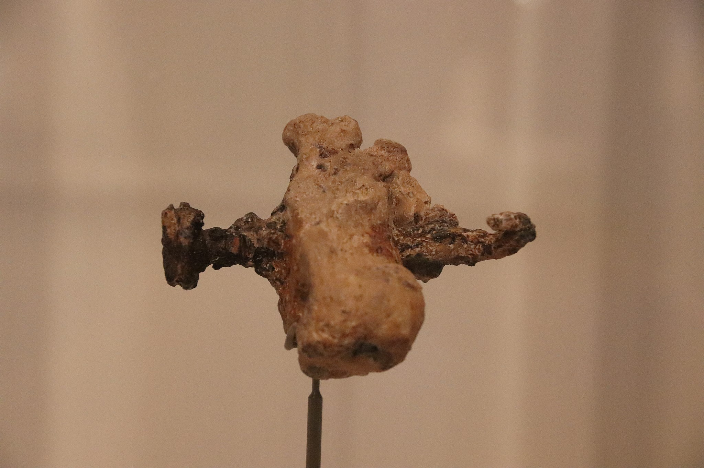

# Human-made Things in the Bible

## License Information

Human-made Things in the Bible © United Bible Societies, 2025. Adapted from: <cite>The Works of Their Hands: Man-made Things in the Bible</cite>, by Ray Pritz © 2009 United Bible Societies. This work is licensed under Creative Commons Attribution-ShareAlike 4.0 International (<a href="https://creativecommons.org/licenses/by-sa/4.0/">https://creativecommons.org/licenses/by-sa/4.0/</a>).

--------------------------------

## 標題：釘子、長釘（nail, spike） (id: REALIA:1.12.2)

1\.12\.2 標題：釘子、長釘（nail, spike）
==============================

經文出處
----

Hebrew 來： מַסְמֵר (音譯： masmer)

[1CH 22:3](https://ref.ly/1Chr22:3), [2CH 3:9](https://ref.ly/2Chr3:9), [ISA 41:7](https://ref.ly/Isa41:7), [JER 10:4](https://ref.ly/Jer10:4)

Hebrew 來： מַשְׂמֵרָה (音譯： masmerah)

[ECC 12:11](https://ref.ly/Eccl12:11)

Greek 希： ἧλος (音譯： hēlos)

[JHN 20:25](https://ref.ly/John20:25), [JHN 20:25](https://ref.ly/John20:25)

描述
--

*踝骨上的釘子 (Gary Todd, Israel Museum, CC0, via Wikimedia Commons)*

釘子是一個細金屬件（通常是鐵的），一頭非常尖銳。它與現代釘子的作用大致相同，可以把木頭固定在一起或者固定到地上。

釘十字架所用的長釘是一個非常粗的尖頭鐵釘，長約20厘米（8英吋），大約有男子的手指那麼粗。1968年，考古發掘出土了一個被釘十字架的人的遺骸，仍有一個金屬長釘嵌在踝關節處，從側面橫穿而過。

---

翻譯
--

有些語言區分了相對較小的釘子和較大的長釘。在談到釘十字架時，所用的詞語應是後者，另外[1CH 22:3](https://ref.ly/1Chr22:3) 所記大門上使用的釘子也應該用後面這個詞。譯詞所指的長釘應該要足夠堅固，兩三個這種釘子就能夠承受一個人的體重。

*羅馬時期的鐵釘 (© Takkk, CC BY\-SA 3\.0, via Wikimedia Commons)*

[2CH 3:9](https://ref.ly/2Chr3:9) 中提到的釘子是用金子製成，大小差別很大。

* **Associated Passages:** 歷代志上 22:3; 歷代志下 3:9; 以賽亞書 41:7; 耶利米書 10:4; 傳道書 12:11; 約翰福音 20:25

