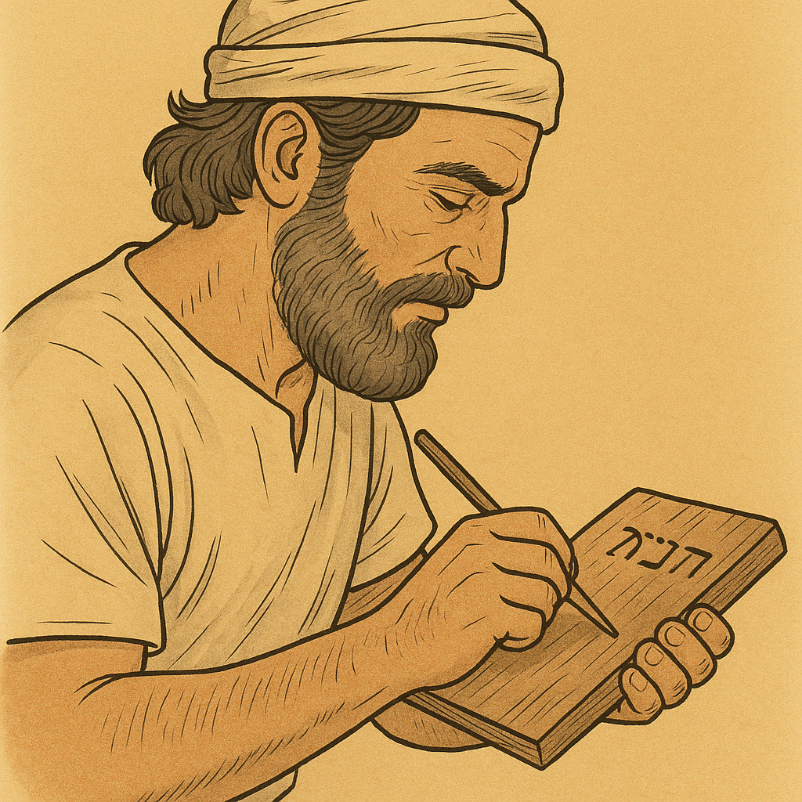

# Human-made Things in the Bible

## License Information

Human-made Things in the Bible © United Bible Societies, 2025. Adapted from: <cite>The Works of Their Hands: Man-made Things in the Bible</cite>, by Ray Pritz © 2009 United Bible Societies. This work is licensed under Creative Commons Attribution-ShareAlike 4.0 International (<a href="https://creativecommons.org/licenses/by-sa/4.0/">https://creativecommons.org/licenses/by-sa/4.0/</a>).

--------------------------------

## 標題：鐵筆、記號筆（stylus, marker） (id: REALIA:1.12.6)

1\.12\.6 標題：鐵筆、記號筆（stylus, marker）
==================================

經文出處
----

Hebrew 來： שֶׂרֶד (音譯： sered)

[ISA 44:13](https://ref.ly/Isa44:13)

描述和用途
-----

*(Image generated by ChatGPT using OpenAI technology)*

鐵筆是一種用來在木頭上做出標記的工具。木匠使用鐵筆劃出他想要製作出來的形狀。

---

翻譯
--

[ISA 44:13](https://ref.ly/Isa44:13) ：希伯來文*sered* 可以指兩種不同的工具，不過兩者的功能相同。一種可能是在木頭上刻出標記的尖頭工具（“stylus”「鐵筆」，NRSV (New Revised Standard Version (1989)) ）；另一種可能是紅色的軟石頭，類似於粉筆，木匠可以用它在木頭上做標記（“chalk”「粉筆」，GNT (Good News Translation (1992)) ；“red chalk”「紅色粉筆」，NASB (New American Standard Bible) ；“marker”「記號筆」，NIV (New International Version (1984)) ）。CEV (Contemporary English Version) 譯作“then draws an outline”（「然後劃出一個輪廓」），雖然沒有明確提到這種工具，但卻清楚地表達出本節第二個分句的意思。另參[1\.12\.3 鑿子、鉋子 (chisel, plane)\<REALIA:1\.12\.3\>](#) 中的註解。

* **Associated Passages:** 以賽亞書 44:13

