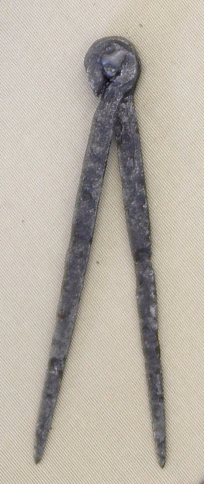

# Human-made Things in the Bible

## License Information

Human-made Things in the Bible © United Bible Societies, 2025. Adapted from: <cite>The Works of Their Hands: Man-made Things in the Bible</cite>, by Ray Pritz © 2009 United Bible Societies. This work is licensed under Creative Commons Attribution-ShareAlike 4.0 International (<a href="https://creativecommons.org/licenses/by-sa/4.0/">https://creativecommons.org/licenses/by-sa/4.0/</a>).

--------------------------------

## 標題：圓規、畫圓工具（compass, circle instrument） (id: REALIA:1.12.7)

1\.12\.7 標題：圓規、畫圓工具（compass, circle instrument）
===============================================

經文出處
----

Hebrew 來： מְחוּגָה (音譯： mchugah)

[ISA 44:13](https://ref.ly/Isa44:13)

描述和用途
-----

*羅馬指南針（公元1至3世紀） (© Bullenwächter / Andreas Franzkowiak, Halstenbek, CC BY\-SA 3\.0, via Wikimedia Commons; cropped)*

圓規是繪製或標記圓形所用的工具。另外，這種工具也可用於測量。

---

翻譯
--

參[1\.12\.3 鑿子、鉋子 (chisel, plane)\<REALIA:1\.12\.3\>](#) 中的註解

* **Associated Passages:** 以賽亞書 44:13

