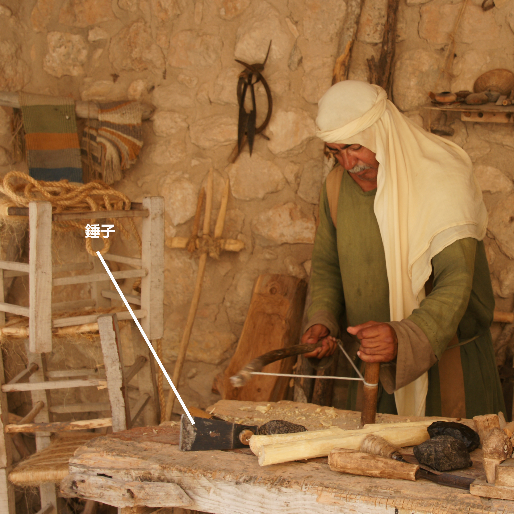

# Human-made Things in the Bible

## License Information

Human-made Things in the Bible © United Bible Societies, 2025. Adapted from: <cite>The Works of Their Hands: Man-made Things in the Bible</cite>, by Ray Pritz © 2009 United Bible Societies. This work is licensed under Creative Commons Attribution-ShareAlike 4.0 International (<a href="https://creativecommons.org/licenses/by-sa/4.0/">https://creativecommons.org/licenses/by-sa/4.0/</a>).

--------------------------------

## 標題：木匠（carpenter） (id: REALIA:1.12)

1\.12 標題：木匠（carpenter）
======================

斧：參[1\.1\.9\.2 叉 (fork)\<REALIA:1\.1\.9\.2\>](#) 。
--------------------------------------------------

## 標題：錘子（hammer） (id: REALIA:1.12.1)

1\.12\.1 標題：錘子（hammer）
======================

經文出處
----

Hebrew 來： הַלְמוּת (音譯： halmuth)

[JDG 5:26](https://ref.ly/Judg5:26)

Hebrew 來： מַקֶּבֶת (音譯： maqavah, maqeveth)

[JDG 4:21](https://ref.ly/Judg4:21), [1KI 6:7](https://ref.ly/1Kgs6:7), [ISA 44:12](https://ref.ly/Isa44:12), [JER 10:4](https://ref.ly/Jer10:4)

Hebrew 來： מִקְשָׁה (音譯： miqshah)

[EXO 25:18](https://ref.ly/Exod25:18), [EXO 25:31](https://ref.ly/Exod25:31), [EXO 25:36](https://ref.ly/Exod25:36), [EXO 37:7](https://ref.ly/Exod37:7), [EXO 37:17](https://ref.ly/Exod37:17), [EXO 37:22](https://ref.ly/Exod37:22), [NUM 8:4](https://ref.ly/Num8:4), [NUM 8:4](https://ref.ly/Num8:4), [NUM 10:2](https://ref.ly/Num10:2)

Hebrew 來： פַּטִּישׁ (音譯： patish)

[ISA 41:7](https://ref.ly/Isa41:7), [JER 23:29](https://ref.ly/Jer23:29), [JER 50:23](https://ref.ly/Jer50:23)

Hebrew 來： רִקֻּעַ (音譯： riqua‘)

[NUM 17:3](https://ref.ly/Num17:3)

Greek 希： ἐλατός (音譯： elatos)

[SIR 50:16](https://ref.ly/Sir50:16)

Greek 希： ὁλοσφύρητος (音譯： olosfurētos)

[SIR 50:9](https://ref.ly/Sir50:9)

Greek 希： σφῦρα (音譯： sfura)

[SIR 38:28](https://ref.ly/Sir38:28)

描述
--

*木錘 (© Giovanni Dall'Orto, Attribution, via Wikimedia Commons)*

錘子是一種工具，長約30厘米（1英呎），有一個通常用木頭做成的手柄，手柄上固定著一個石頭、木頭或金屬（不太常見）的頭。手柄裝在錘頭的孔內。

---

用途
--

*用錘子工作的人 (Elbert Boot © United Bible Societies)*

錘子有多種用途，例如砸碎或修整建築石塊、將釘子或橛子敲到木頭裡面，或將橛子敲入地裡。鐵匠也用錘子來使熱鐵成型。

---

翻譯
--

希伯來文*miqshah* 的意思不太確定。這個詞似乎是指工匠處理金屬物件的成果，即「錘打出來的作品」或「打好的工件」。

* **Associated Passages:** 士師記 5:26; 士師記 4:21; 列王紀上 6:7; 以賽亞書 44:12; 耶利米書 10:4; 出埃及記 25:18; 出埃及記 25:31; 出埃及記 25:36; 出埃及記 37:7; 出埃及記 37:17; 出埃及記 37:22; 民數記 8:4; 民數記 10:2; 以賽亞書 41:7; 耶利米書 23:29; 耶利米書 50:23; 民數記 17:3; 德訓篇 50:16; 德訓篇 50:9; 德訓篇 38:28

* **Associated ACAI Concepts:** Hammer (ID: `realia:Hammer`)

## 標題：釘子、長釘（nail, spike） (id: REALIA:1.12.2)

1\.12\.2 標題：釘子、長釘（nail, spike）
==============================

經文出處
----

Hebrew 來： מַסְמֵר (音譯： masmer)

[1CH 22:3](https://ref.ly/1Chr22:3), [2CH 3:9](https://ref.ly/2Chr3:9), [ISA 41:7](https://ref.ly/Isa41:7), [JER 10:4](https://ref.ly/Jer10:4)

Hebrew 來： מַשְׂמֵרָה (音譯： masmerah)

[ECC 12:11](https://ref.ly/Eccl12:11)

Greek 希： ἧλος (音譯： hēlos)

[JHN 20:25](https://ref.ly/John20:25), [JHN 20:25](https://ref.ly/John20:25)

描述
--

*踝骨上的釘子 (Gary Todd, Israel Museum, CC0, via Wikimedia Commons)*

釘子是一個細金屬件（通常是鐵的），一頭非常尖銳。它與現代釘子的作用大致相同，可以把木頭固定在一起或者固定到地上。

釘十字架所用的長釘是一個非常粗的尖頭鐵釘，長約20厘米（8英吋），大約有男子的手指那麼粗。1968年，考古發掘出土了一個被釘十字架的人的遺骸，仍有一個金屬長釘嵌在踝關節處，從側面橫穿而過。

---

翻譯
--

有些語言區分了相對較小的釘子和較大的長釘。在談到釘十字架時，所用的詞語應是後者，另外[1CH 22:3](https://ref.ly/1Chr22:3) 所記大門上使用的釘子也應該用後面這個詞。譯詞所指的長釘應該要足夠堅固，兩三個這種釘子就能夠承受一個人的體重。

*羅馬時期的鐵釘 (© Takkk, CC BY\-SA 3\.0, via Wikimedia Commons)*

[2CH 3:9](https://ref.ly/2Chr3:9) 中提到的釘子是用金子製成，大小差別很大。

* **Associated Passages:** 歷代志上 22:3; 歷代志下 3:9; 以賽亞書 41:7; 耶利米書 10:4; 傳道書 12:11; 約翰福音 20:25

* **Associated ACAI Concepts:** Nail (ID: `realia:Nail`)

## 標題：鑿子、鉋子（chisel, plane） (id: REALIA:1.12.3)

1\.12\.3 標題：鑿子、鉋子（chisel, plane）
================================

經文出處
----

Hebrew 來： מַקְצוּעָה (音譯： maqtsu‘a)

[ISA 44:13](https://ref.ly/Isa44:13)

描述和用途
-----

*用鑿子在一塊木頭上雕刻的人 (Image generated by ChatGPT using OpenAI technology)*

鑿子或鉋子是一種金屬工具，有一條鋒利的邊，用來塑造木料的形狀。

---

翻譯
--

[ISA 44:13](https://ref.ly/Isa44:13) ：這節經文提到了木匠用一塊木頭製作偶像時使用的三種工具。這三種工具僅在聖經此處出現一次，主要依據上下文和詞源來確定詞的意思。其中兩種工具，即*sered* （參[1\.12\.6 鐵筆、記號筆 (stylus, marker)\<REALIA:1\.12\.6\>](#) ）和*mchugah* （參[1\.12\.7 圓規、畫圓工具 (compass, circle instrument)\<REALIA:1\.12\.7\>](#) ），用來在雕刻木料之前做出標記，而*maqtsu‘a* 則用來切割木料並將其塑造成想要的形狀。

GNT (Good News Translation (1992)) 將*maqtsu‘a* 和*mchugah* 合譯為“tools”（「工具」）。如果當地文化不知道鑿子或鉋子，則可以採用這種譯法。另外，也可以將*maqtsu‘a* 譯為「刀」。

* **Associated Passages:** 以賽亞書 44:13

* **Associated ACAI Concepts:** Chisel (ID: `realia:Chisel`); House (ID: `realia:House`)

## 標題：錐子（awl） (id: REALIA:1.12.4)

1\.12\.4 標題：錐子（awl）
===================

經文出處
----

Hebrew 來： מַרְצֵעַ (音譯： martsea‘)

[EXO 21:6](https://ref.ly/Exod21:6), [DEU 15:17](https://ref.ly/Deut15:17)

描述和用途
-----

*羅馬時期的鐵製縫合錐（維迪古羅馬博物館（Vidy Roman Museum），洛桑（Lausanne），瑞士） (© Rama, CC BY\-SA 2\.0 FR, CeCILL or CC BY\-SA 2\.0 FR, via Wikimedia Commons)*

錐子是一種手工工具，帶有尖頭，用來在木頭、皮革或其他材料上鑽孔。尖頭的材質可能是金屬、骨頭或石頭。有時，錐子會有一個由木頭或骨頭做成的手柄。

---

翻譯
--

聖經只提到這種工具一次，用來刺穿奴隸的耳朵，象徵他已經選擇終身跟隨他的主人。主人可能會在穿刺出來的孔中放置一個表示所有權的環或帶子。在翻譯時，說明工具的樣式比指出工具的名稱更加重要。如果沒有「錐子」這個詞，翻譯者可以使用一個表示類似尖頭工具的詞，例如「釘子」或「刀」。

* **Associated Passages:** 出埃及記 21:6; 申命記 15:17

* **Associated ACAI Concepts:** Awl (ID: `realia:Awl`)

## 標題：鋸（saw） (id: REALIA:1.12.5)

1\.12\.5 標題：鋸（saw）
==================

經文出處
----

Greek 希： πρίζω (音譯： prizō（動詞）)

[HEB 11:37](https://ref.ly/Heb11:37)

描述和用途
-----

*雕刻家内巴蒙（Nebamun）和伊普基（Ipuki）墓室壁畫上的木匠圖像 (Eloquence, Public domain, via Wikimedia Commons)*

鋸是一種帶有鋸齒狀邊緣的扁平工具，用來把物件切成兩半。鋸可以用燧石等硬石，或者用金屬製成，有時配有手柄。

---

翻譯
--

[HEB 11:37](https://ref.ly/Heb11:37) ：可能沒有必要對這種工具做出非常精確的描述。NCV (New Century Version) 的譯詞“cut in half”（「切成兩半」）已經充分表達出了意思。

* **Associated Passages:** 希伯來書 11:37

* **Associated ACAI Concepts:** Saw (ID: `realia:Saw`)

## 標題：鐵筆、記號筆（stylus, marker） (id: REALIA:1.12.6)

1\.12\.6 標題：鐵筆、記號筆（stylus, marker）
==================================

經文出處
----

Hebrew 來： שֶׂרֶד (音譯： sered)

[ISA 44:13](https://ref.ly/Isa44:13)

描述和用途
-----

*(Image generated by ChatGPT using OpenAI technology)*

鐵筆是一種用來在木頭上做出標記的工具。木匠使用鐵筆劃出他想要製作出來的形狀。

---

翻譯
--

[ISA 44:13](https://ref.ly/Isa44:13) ：希伯來文*sered* 可以指兩種不同的工具，不過兩者的功能相同。一種可能是在木頭上刻出標記的尖頭工具（“stylus”「鐵筆」，NRSV (New Revised Standard Version (1989)) ）；另一種可能是紅色的軟石頭，類似於粉筆，木匠可以用它在木頭上做標記（“chalk”「粉筆」，GNT (Good News Translation (1992)) ；“red chalk”「紅色粉筆」，NASB (New American Standard Bible) ；“marker”「記號筆」，NIV (New International Version (1984)) ）。CEV (Contemporary English Version) 譯作“then draws an outline”（「然後劃出一個輪廓」），雖然沒有明確提到這種工具，但卻清楚地表達出本節第二個分句的意思。另參[1\.12\.3 鑿子、鉋子 (chisel, plane)\<REALIA:1\.12\.3\>](#) 中的註解。

* **Associated Passages:** 以賽亞書 44:13

* **Associated ACAI Concepts:** Stylus (ID: `realia:Stylus.2`); Compass (ID: `realia:Compass`); Measuring Reed (ID: `realia:MeasuringReed`)

## 標題：圓規、畫圓工具（compass, circle instrument） (id: REALIA:1.12.7)

1\.12\.7 標題：圓規、畫圓工具（compass, circle instrument）
===============================================

經文出處
----

Hebrew 來： מְחוּגָה (音譯： mchugah)

[ISA 44:13](https://ref.ly/Isa44:13)

描述和用途
-----

*羅馬指南針（公元1至3世紀） (© Bullenwächter / Andreas Franzkowiak, Halstenbek, CC BY\-SA 3\.0, via Wikimedia Commons; cropped)*

圓規是繪製或標記圓形所用的工具。另外，這種工具也可用於測量。

---

翻譯
--

參[1\.12\.3 鑿子、鉋子 (chisel, plane)\<REALIA:1\.12\.3\>](#) 中的註解

* **Associated Passages:** 以賽亞書 44:13

* **Associated ACAI Concepts:** Compass (ID: `realia:Compass`); Measuring Reed (ID: `realia:MeasuringReed`)
