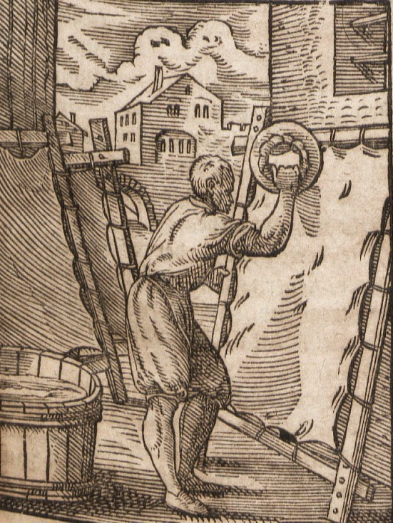

# Human-made Things in the Bible

## License Information

Human-made Things in the Bible © United Bible Societies, 2025. Adapted from: <cite>The Works of Their Hands: Man-made Things in the Bible</cite>, by Ray Pritz © 2009 United Bible Societies. This work is licensed under Creative Commons Attribution-ShareAlike 4.0 International (<a href="https://creativecommons.org/licenses/by-sa/4.0/">https://creativecommons.org/licenses/by-sa/4.0/</a>).

--------------------------------

## 標題：皮革（leather） (id: REALIA:1.13)

1\.13 標題：皮革（leather）
====================

經文出處
----

Hebrew 來： עוֹר (音譯： ‘or)

[GEN 3:21](https://ref.ly/Gen3:21), [GEN 27:16](https://ref.ly/Gen27:16), [EXO 22:26](https://ref.ly/Exod22:26), [EXO 25:5](https://ref.ly/Exod25:5), [EXO 25:5](https://ref.ly/Exod25:5), [EXO 26:14](https://ref.ly/Exod26:14), [EXO 26:14](https://ref.ly/Exod26:14), [EXO 29:14](https://ref.ly/Exod29:14), [EXO 34:29](https://ref.ly/Exod34:29), [EXO 34:30](https://ref.ly/Exod34:30), [EXO 34:35](https://ref.ly/Exod34:35), [EXO 35:7](https://ref.ly/Exod35:7), [EXO 35:7](https://ref.ly/Exod35:7), [EXO 35:23](https://ref.ly/Exod35:23), [EXO 35:23](https://ref.ly/Exod35:23), [EXO 36:19](https://ref.ly/Exod36:19), [EXO 36:19](https://ref.ly/Exod36:19), [EXO 39:34](https://ref.ly/Exod39:34), [EXO 39:34](https://ref.ly/Exod39:34), [LEV 4:11](https://ref.ly/Lev4:11), [LEV 7:8](https://ref.ly/Lev7:8), [LEV 8:17](https://ref.ly/Lev8:17), [LEV 9:11](https://ref.ly/Lev9:11), [LEV 11:32](https://ref.ly/Lev11:32), [LEV 13:2](https://ref.ly/Lev13:2), [LEV 13:2](https://ref.ly/Lev13:2), [LEV 13:3](https://ref.ly/Lev13:3), [LEV 13:3](https://ref.ly/Lev13:3), [LEV 13:4](https://ref.ly/Lev13:4), [LEV 13:4](https://ref.ly/Lev13:4), [LEV 13:5](https://ref.ly/Lev13:5), [LEV 13:6](https://ref.ly/Lev13:6), [LEV 13:7](https://ref.ly/Lev13:7), [LEV 13:8](https://ref.ly/Lev13:8), [LEV 13:10](https://ref.ly/Lev13:10), [LEV 13:11](https://ref.ly/Lev13:11), [LEV 13:12](https://ref.ly/Lev13:12), [LEV 13:12](https://ref.ly/Lev13:12), [LEV 13:18](https://ref.ly/Lev13:18), [LEV 13:20](https://ref.ly/Lev13:20), [LEV 13:21](https://ref.ly/Lev13:21), [LEV 13:22](https://ref.ly/Lev13:22), [LEV 13:24](https://ref.ly/Lev13:24), [LEV 13:25](https://ref.ly/Lev13:25), [LEV 13:26](https://ref.ly/Lev13:26), [LEV 13:27](https://ref.ly/Lev13:27), [LEV 13:28](https://ref.ly/Lev13:28), [LEV 13:30](https://ref.ly/Lev13:30), [LEV 13:31](https://ref.ly/Lev13:31), [LEV 13:32](https://ref.ly/Lev13:32), [LEV 13:34](https://ref.ly/Lev13:34), [LEV 13:34](https://ref.ly/Lev13:34), [LEV 13:35](https://ref.ly/Lev13:35), [LEV 13:36](https://ref.ly/Lev13:36), [LEV 13:38](https://ref.ly/Lev13:38), [LEV 13:39](https://ref.ly/Lev13:39), [LEV 13:39](https://ref.ly/Lev13:39), [LEV 13:43](https://ref.ly/Lev13:43), [LEV 13:48](https://ref.ly/Lev13:48), [LEV 13:48](https://ref.ly/Lev13:48), [LEV 13:49](https://ref.ly/Lev13:49), [LEV 13:49](https://ref.ly/Lev13:49), [LEV 13:51](https://ref.ly/Lev13:51), [LEV 13:51](https://ref.ly/Lev13:51), [LEV 13:52](https://ref.ly/Lev13:52), [LEV 13:53](https://ref.ly/Lev13:53), [LEV 13:56](https://ref.ly/Lev13:56), [LEV 13:57](https://ref.ly/Lev13:57), [LEV 13:58](https://ref.ly/Lev13:58), [LEV 13:59](https://ref.ly/Lev13:59), [LEV 15:17](https://ref.ly/Lev15:17), [LEV 16:27](https://ref.ly/Lev16:27), [NUM 4:6](https://ref.ly/Num4:6), [NUM 4:8](https://ref.ly/Num4:8), [NUM 4:10](https://ref.ly/Num4:10), [NUM 4:11](https://ref.ly/Num4:11), [NUM 4:12](https://ref.ly/Num4:12), [NUM 4:14](https://ref.ly/Num4:14), [NUM 19:5](https://ref.ly/Num19:5), [NUM 31:20](https://ref.ly/Num31:20), [2KI 1:8](https://ref.ly/2Kgs1:8), [JOB 2:4](https://ref.ly/Job2:4), [JOB 2:4](https://ref.ly/Job2:4), [JOB 7:5](https://ref.ly/Job7:5), [JOB 10:11](https://ref.ly/Job10:11), [JOB 18:13](https://ref.ly/Job18:13), [JOB 19:20](https://ref.ly/Job19:20), [JOB 19:20](https://ref.ly/Job19:20), [JOB 19:26](https://ref.ly/Job19:26), [JOB 30:30](https://ref.ly/Job30:30), [JOB 40:31](https://ref.ly/Job40:31), [JER 13:23](https://ref.ly/Jer13:23), [LAM 3:4](https://ref.ly/Lam3:4), [LAM 4:8](https://ref.ly/Lam4:8), [LAM 5:10](https://ref.ly/Lam5:10), [EZK 37:6](https://ref.ly/Ezek37:6), [EZK 37:8](https://ref.ly/Ezek37:8), [MIC 3:2](https://ref.ly/Mic3:2), [MIC 3:3](https://ref.ly/Mic3:3)

Hebrew 來： תַּחַשׁ (音譯： tachash)

[EZK 16:10](https://ref.ly/Ezek16:10)

Greek 希： βυρσεύς (音譯： burseus)

[ACT 9:43](https://ref.ly/Acts9:43), [ACT 10:6](https://ref.ly/Acts10:6), [ACT 10:32](https://ref.ly/Acts10:32)

Greek 希： δερμάτινος (音譯： dermatinos)

[MAT 3:4](https://ref.ly/Matt3:4), [MRK 1:6](https://ref.ly/Mark1:6)

描述
--

*製革匠在加工皮革 (Deutsche Fotothek, Public domain, via Wikimedia Commons)*

皮革是按照特殊工藝來處理的動物皮，目的是去除皮上的毛和防止皮革腐爛或變脆。製作皮革的人稱為皮匠或硝皮匠。

---

用途
--

皮革有很多用途，包括製作皮帶和涼鞋等服飾，做成裝水和葡萄酒等液體的容器，有時也用來製作牲畜的挽具和其他繩索。

---

翻譯
--

有些語言會有一個專門表示「皮革」的詞語，但許多語言會使用與動物的「皮」相同的詞。

希伯來文*tachash* 指的是水生動物儒艮（參*All Creatures Great and Small* ，第42—43頁）。聖經只在提到儒艮皮的時候才提到這種動物，所以牠通常與希伯來文*‘or* 同時出現。[EZK 16:10](https://ref.ly/Ezek16:10) 省略了*‘or* ，但是*tachash* 在該處表示用這種動物的皮製成的精鞣皮革。

* **Associated Passages:** 創世記 3:21; 創世記 27:16; 出埃及記 22:26; 出埃及記 25:5; 出埃及記 26:14; 出埃及記 29:14; 出埃及記 34:29; 出埃及記 34:30; 出埃及記 34:35; 出埃及記 35:7; 出埃及記 35:23; 出埃及記 36:19; 出埃及記 39:34; 利未記 4:11; 利未記 7:8; 利未記 8:17; 利未記 9:11; 利未記 11:32; 利未記 13:2; 利未記 13:3; 利未記 13:4; 利未記 13:5; 利未記 13:6; 利未記 13:7; 利未記 13:8; 利未記 13:10; 利未記 13:11; 利未記 13:12; 利未記 13:18; 利未記 13:20; 利未記 13:21; 利未記 13:22; 利未記 13:24; 利未記 13:25; 利未記 13:26; 利未記 13:27; 利未記 13:28; 利未記 13:30; 利未記 13:31; 利未記 13:32; 利未記 13:34; 利未記 13:35; 利未記 13:36; 利未記 13:38; 利未記 13:39; 利未記 13:43; 利未記 13:48; 利未記 13:49; 利未記 13:51; 利未記 13:52; 利未記 13:53; 利未記 13:56; 利未記 13:57; 利未記 13:58; 利未記 13:59; 利未記 15:17; 利未記 16:27; 民數記 4:6; 民數記 4:8; 民數記 4:10; 民數記 4:11; 民數記 4:12; 民數記 4:14; 民數記 19:5; 民數記 31:20; 列王紀下 1:8; 約伯記 2:4; 約伯記 7:5; 約伯記 10:11; 約伯記 18:13; 約伯記 19:20; 約伯記 19:26; 約伯記 30:30; 約伯記 40:31; 耶利米書 13:23; 耶利米哀歌 3:4; 耶利米哀歌 4:8; 耶利米哀歌 5:10; 以西結書 37:6; 以西結書 37:8; 彌迦書 3:2; 彌迦書 3:3; 以西結書 16:10; 使徒行傳 9:43; 使徒行傳 10:6; 使徒行傳 10:32; 馬太福音 3:4; 馬可福音 1:6

