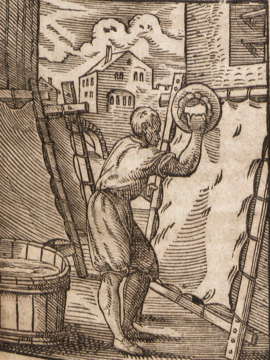

# Human-made Things in the Bible

## License Information

Human-made Things in the Bible © United Bible Societies, 2025. Adapted from: <cite>The Works of Their Hands: Man-made Things in the Bible</cite>, by Ray Pritz © 2009 United Bible Societies. This work is licensed under Creative Commons Attribution-ShareAlike 4.0 International (<a href="https://creativecommons.org/licenses/by-sa/4.0/">https://creativecommons.org/licenses/by-sa/4.0/</a>).

--------------------------------

## 標題：皮革（leather） (id: REALIA:1.13)

1\.13 標題：皮革（leather）
====================

經文出處
----

Hebrew 來： עוֹר (音譯： ‘or)

GEN 3:21, GEN 27:16, EXO 22:26, EXO 25:5, EXO 25:5, EXO 26:14, EXO 26:14, EXO 29:14, EXO 34:29, EXO 34:30, EXO 34:35, EXO 35:7, EXO 35:7, EXO 35:23, EXO 35:23, EXO 36:19, EXO 36:19, EXO 39:34, EXO 39:34, LEV 4:11, LEV 7:8, LEV 8:17, LEV 9:11, LEV 11:32, LEV 13:2, LEV 13:2, LEV 13:3, LEV 13:3, LEV 13:4, LEV 13:4, LEV 13:5, LEV 13:6, LEV 13:7, LEV 13:8, LEV 13:10, LEV 13:11, LEV 13:12, LEV 13:12, LEV 13:18, LEV 13:20, LEV 13:21, LEV 13:22, LEV 13:24, LEV 13:25, LEV 13:26, LEV 13:27, LEV 13:28, LEV 13:30, LEV 13:31, LEV 13:32, LEV 13:34, LEV 13:34, LEV 13:35, LEV 13:36, LEV 13:38, LEV 13:39, LEV 13:39, LEV 13:43, LEV 13:48, LEV 13:48, LEV 13:49, LEV 13:49, LEV 13:51, LEV 13:51, LEV 13:52, LEV 13:53, LEV 13:56, LEV 13:57, LEV 13:58, LEV 13:59, LEV 15:17, LEV 16:27, NUM 4:6, NUM 4:8, NUM 4:10, NUM 4:11, NUM 4:12, NUM 4:14, NUM 19:5, NUM 31:20, 2KI 1:8, JOB 2:4, JOB 2:4, JOB 7:5, JOB 10:11, JOB 18:13, JOB 19:20, JOB 19:20, JOB 19:26, JOB 30:30, JOB 40:31, JER 13:23, LAM 3:4, LAM 4:8, LAM 5:10, EZK 37:6, EZK 37:8, MIC 3:2, MIC 3:3

Hebrew 來： תַּחַשׁ (音譯： tachash)

EZK 16:10

Greek 希： βυρσεύς (音譯： burseus)

ACT 9:43, ACT 10:6, ACT 10:32

Greek 希： δερμάτινος (音譯： dermatinos)

MAT 3:4, MRK 1:6

描述
--

*製革匠在加工皮革 (Deutsche Fotothek, Public domain, via Wikimedia Commons)*

皮革是按照特殊工藝來處理的動物皮，目的是去除皮上的毛和防止皮革腐爛或變脆。製作皮革的人稱為皮匠或硝皮匠。

---

用途
--

皮革有很多用途，包括製作皮帶和涼鞋等服飾，做成裝水和葡萄酒等液體的容器，有時也用來製作牲畜的挽具和其他繩索。

---

翻譯
--

有些語言會有一個專門表示「皮革」的詞語，但許多語言會使用與動物的「皮」相同的詞。

希伯來文*tachash* 指的是水生動物儒艮（參*All Creatures Great and Small* ，第42—43頁）。聖經只在提到儒艮皮的時候才提到這種動物，所以牠通常與希伯來文*‘or* 同時出現。EZK 16:10 省略了*‘or* ，但是*tachash* 在該處表示用這種動物的皮製成的精鞣皮革。

* **Associated Passages:** 創世記 3:21; 創世記 27:16; 出埃及記 22:26; 出埃及記 25:5; 出埃及記 26:14; 出埃及記 29:14; 出埃及記 34:29; 出埃及記 34:30; 出埃及記 34:35; 出埃及記 35:7; 出埃及記 35:23; 出埃及記 36:19; 出埃及記 39:34; 利未記 4:11; 利未記 7:8; 利未記 8:17; 利未記 9:11; 利未記 11:32; 利未記 13:2; 利未記 13:3; 利未記 13:4; 利未記 13:5; 利未記 13:6; 利未記 13:7; 利未記 13:8; 利未記 13:10; 利未記 13:11; 利未記 13:12; 利未記 13:18; 利未記 13:20; 利未記 13:21; 利未記 13:22; 利未記 13:24; 利未記 13:25; 利未記 13:26; 利未記 13:27; 利未記 13:28; 利未記 13:30; 利未記 13:31; 利未記 13:32; 利未記 13:34; 利未記 13:35; 利未記 13:36; 利未記 13:38; 利未記 13:39; 利未記 13:43; 利未記 13:48; 利未記 13:49; 利未記 13:51; 利未記 13:52; 利未記 13:53; 利未記 13:56; 利未記 13:57; 利未記 13:58; 利未記 13:59; 利未記 15:17; 利未記 16:27; 民數記 4:6; 民數記 4:8; 民數記 4:10; 民數記 4:11; 民數記 4:12; 民數記 4:14; 民數記 19:5; 民數記 31:20; 列王紀下 1:8; 約伯記 2:4; 約伯記 7:5; 約伯記 10:11; 約伯記 18:13; 約伯記 19:20; 約伯記 19:26; 約伯記 30:30; 約伯記 40:31; 耶利米書 13:23; 耶利米哀歌 3:4; 耶利米哀歌 4:8; 耶利米哀歌 5:10; 以西結書 37:6; 以西結書 37:8; 彌迦書 3:2; 彌迦書 3:3; 以西結書 16:10; 使徒行傳 9:43; 使徒行傳 10:6; 使徒行傳 10:32; 馬太福音 3:4; 馬可福音 1:6

* **Associated ACAI Concepts:** Leather (ID: `realia:Leather`)
