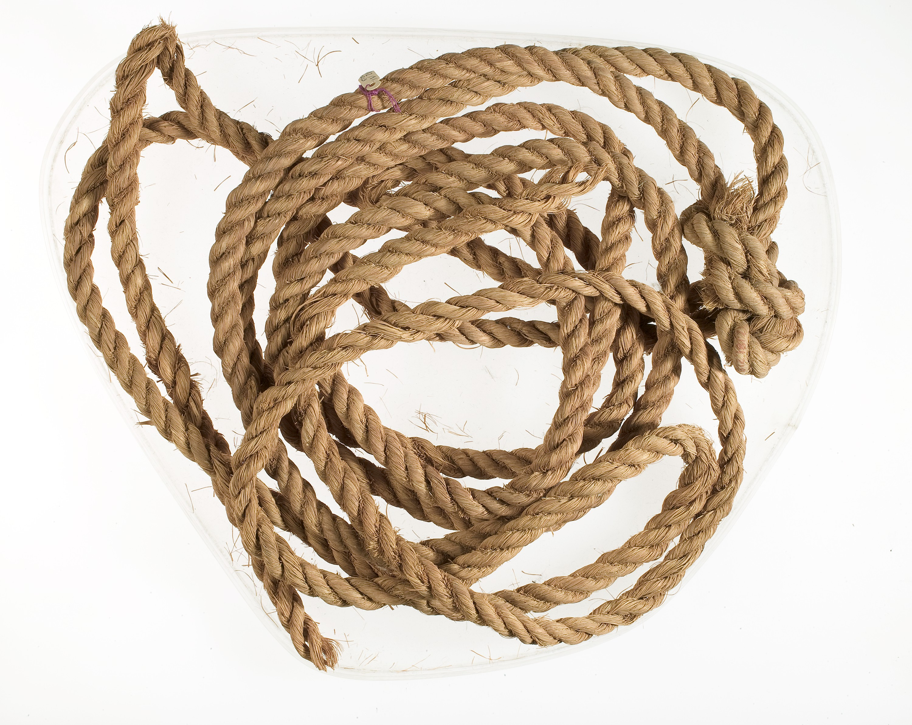

# Human-made Things in the Bible

## License Information

Human-made Things in the Bible © United Bible Societies, 2025. Adapted from: <cite>The Works of Their Hands: Man-made Things in the Bible</cite>, by Ray Pritz © 2009 United Bible Societies. This work is licensed under Creative Commons Attribution-ShareAlike 4.0 International (<a href="https://creativecommons.org/licenses/by-sa/4.0/">https://creativecommons.org/licenses/by-sa/4.0/</a>).

--------------------------------

## 標題：繩、帶（rope, cord） (id: REALIA:1.14)

1\.14 標題：繩、帶（rope, cord）
========================

經文出處
----

Hebrew 來： אַגְמוֹן (音譯： ’agmon)

[JOB 40:26](https://ref.ly/Job40:26)

Hebrew 來： חֶבֶל (音譯： chevel)

[JOS 2:15](https://ref.ly/Josh2:15), [2SA 8:2](https://ref.ly/2Sam8:2), [2SA 8:2](https://ref.ly/2Sam8:2), [2SA 8:2](https://ref.ly/2Sam8:2), [2SA 17:13](https://ref.ly/2Sam17:13), [2SA 22:6](https://ref.ly/2Sam22:6), [1KI 20:31](https://ref.ly/1Kgs20:31), [1KI 20:32](https://ref.ly/1Kgs20:32), [EST 1:6](https://ref.ly/Esth1:6), [JOB 36:8](https://ref.ly/Job36:8), [JOB 40:25](https://ref.ly/Job40:25), [PSA 18:5](https://ref.ly/Ps18:5), [PSA 18:6](https://ref.ly/Ps18:6), [PSA 116:3](https://ref.ly/Ps116:3), [PSA 119:61](https://ref.ly/Ps119:61), [PRO 5:22](https://ref.ly/Prov5:22), [ECC 12:6](https://ref.ly/Eccl12:6), [ISA 5:18](https://ref.ly/Isa5:18), [ISA 33:20](https://ref.ly/Isa33:20), [ISA 33:23](https://ref.ly/Isa33:23), [JER 38:6](https://ref.ly/Jer38:6), [JER 38:11](https://ref.ly/Jer38:11), [JER 38:12](https://ref.ly/Jer38:12), [JER 38:13](https://ref.ly/Jer38:13), [EZK 27:24](https://ref.ly/Ezek27:24), [HOS 11:4](https://ref.ly/Hos11:4)

Hebrew 來： מֵיתָר (音譯： meythar)

[EXO 35:18](https://ref.ly/Exod35:18), [EXO 39:40](https://ref.ly/Exod39:40), [NUM 3:26](https://ref.ly/Num3:26), [NUM 3:37](https://ref.ly/Num3:37), [NUM 4:26](https://ref.ly/Num4:26), [NUM 4:32](https://ref.ly/Num4:32), [ISA 54:2](https://ref.ly/Isa54:2), [JER 10:20](https://ref.ly/Jer10:20)

Hebrew 來： מֹשְׁכוֹת (音譯： moshkoth)

[JOB 38:31](https://ref.ly/Job38:31)

Hebrew 來： נִקְפָּה (音譯： niqfah)

[ISA 3:24](https://ref.ly/Isa3:24)

Hebrew 來： עֲבֹת (音譯： ‘avoth)

[EXO 28:14](https://ref.ly/Exod28:14), [EXO 28:14](https://ref.ly/Exod28:14), [EXO 28:22](https://ref.ly/Exod28:22), [EXO 28:24](https://ref.ly/Exod28:24), [EXO 28:25](https://ref.ly/Exod28:25), [EXO 39:15](https://ref.ly/Exod39:15), [EXO 39:17](https://ref.ly/Exod39:17), [EXO 39:18](https://ref.ly/Exod39:18), [JDG 15:13](https://ref.ly/Judg15:13), [JDG 15:14](https://ref.ly/Judg15:14), [JDG 16:11](https://ref.ly/Judg16:11), [JDG 16:12](https://ref.ly/Judg16:12), [JOB 39:10](https://ref.ly/Job39:10), [PSA 2:3](https://ref.ly/Ps2:3), [PSA 118:27](https://ref.ly/Ps118:27), [PSA 129:4](https://ref.ly/Ps129:4), [ISA 5:18](https://ref.ly/Isa5:18), [EZK 3:25](https://ref.ly/Ezek3:25), [EZK 4:8](https://ref.ly/Ezek4:8), [HOS 11:4](https://ref.ly/Hos11:4)

Greek 希： ζευκτηρία (音譯： zeuktēria)

[ACT 27:40](https://ref.ly/Acts27:40)

Greek 希： κλῶσμα (音譯： klōsma)

[SIR 6:30](https://ref.ly/Sir6:30)

Greek 希： νευρά (音譯： neura)

[2MA 7:1](https://ref.ly/2Macc7:1)

Greek 希： σχοινίον (音譯： schoinion)

[JHN 2:15](https://ref.ly/John2:15), [ACT 27:32](https://ref.ly/Acts27:32), [LJE 1:43](https://ref.ly/EpJer1:43)

描述
--

*繩索，可能由棕櫚纖維製成（約公元前1550–1295年，新王國時期（New Kingdom），埃及，底比斯（Thebes），德拉\-阿布\-埃爾\-納加（Dra Abu el\-Naga）） (Rogers Fund, 1912, Metropolitan Museum of Art, CC0\)*

繩子是一條相當粗的帶子，用幾股線扭繞或編織而成。繩子可由多種材料製成，包括棕櫚纖維、亞麻線、蘆葦等。

---

用途
--

繩子有多種用途，例如把東西捆綁在一起，把役畜套到農具或車上，把人綁起來，甚至測量長度。

---

翻譯
--

在《出埃及記》中，希伯來文*‘avoth* 指的是在以弗得和肩帶之間，像繩子一樣的短連接物。經文指出這些連接物是由純金製成。學者將其解作由多個鏈節組成的鏈子，或是由金絲編織而成的繩子。各譯本的譯法不一，但都沒能讓讀者真正清晰地理解（也由此反映出希伯來文本的含糊）；例如，在[EXO 28:14](https://ref.ly/Exod28:14) 中，「純金擰成的鏈條」（CEV (Contemporary English Version) 、NIV (New International Version (1984)) 直譯），「像繩一樣撚成的純金鏈」（GNT (Good News Translation (1992)) 直譯），「做成繩索樣式的純金鏈」（REB (Revised English Bible (1989)) 直譯），「純金鏈；像編繩一樣進行編繞」（NJPSV (New Jewish Publication Society Version) 直譯）。《〈出埃及記〉手冊》（*A Handbook on Exodus* ，第656頁）提供的另一種翻譯方式是：「他們像編繩一樣編繞（或譯：擰繞）的金索。」

在許多語言中，[JOB 36:8](https://ref.ly/Job36:8) 中的短語「苦難的繩索」（“cords of affliction”，RSV (Revised Standard Version (1952)) 、NIV (New International Version (1984)) ；比較[2SA 22:6](https://ref.ly/2Sam22:6); [PSA 18:5](https://ref.ly/Ps18:5); [PSA 18:5](https://ref.ly/Ps18:5); [PSA 116:3](https://ref.ly/Ps116:3); [PSA 119:61](https://ref.ly/Ps119:61); [PSA 129:4](https://ref.ly/Ps129:4); [HOS 11:4](https://ref.ly/Hos11:4) 中的類似表達）聽起來很奇怪，在英文中也是很奇怪的表達。翻譯者應該採用功能對等的譯詞；例如，[JOB 36:8](https://ref.ly/Job36:8) b譯作「為他們所做的事而受苦」（GNT (Good News Translation (1992)) 直譯）。NCV (New Century Version) 保留了繩子的比喻，同時採用了英文的慣用語：“or if trouble, like ropes, ties them up”（直譯：「或者，如果苦難像繩索一樣捆綁住他們」）。

[PSA 118:27](https://ref.ly/Ps118:27) 的希伯來文本意思不確定。大多數英文譯本（RSV (Revised Standard Version (1952)) 、GNT (Good News Translation (1992)) 、NIV (New International Version (1984)) 、CEV (Contemporary English Version) ），以及《〈詩篇〉手冊》（*A Handbook on Psalms* ），將*‘avoth* 一詞解作葉子茂盛的樹枝，也許與住棚節時的一個習俗有關。有些譯本（REB (Revised English Bible (1989)) 、NJPSV (New Jewish Publication Society Version) 、NASB (New American Standard Bible) 、NKJV (New King James Version (1982)) ）和拉比解經家認為，這個詞指的是把祭牲綁到祭壇上的粗繩。

[ACT 27:32](https://ref.ly/Acts27:32) 中提到的繩索顯然是相當粗的，然而[JHN 2:15](https://ref.ly/John2:15) 所記耶穌在驅趕牲畜和商人離開聖殿時所做的鞭子，可能是由結實的帶子做成。

在[ACT 27:40](https://ref.ly/Acts27:40) ，希臘文*zeuktēria* 指的是連接船的兩個舵槳的繩子（參[8\.1\.8 舵槳、船舵(steering oar, rudder)\<REALIA:8\.1\.8\>](#) 中的插圖）。在大多數語言中，翻譯者只需要使用一個表示「繩子」的詞語。

* **Associated Passages:** 約伯記 40:26; 約書亞記 2:15; 撒母耳記下 8:2; 撒母耳記下 17:13; 撒母耳記下 22:6; 列王紀上 20:31; 列王紀上 20:32; 以斯帖記 1:6; 約伯記 36:8; 約伯記 40:25; 詩篇 18:5; 詩篇 18:6; 詩篇 116:3; 詩篇 119:61; 箴言 5:22; 傳道書 12:6; 以賽亞書 5:18; 以賽亞書 33:20; 以賽亞書 33:23; 耶利米書 38:6; 耶利米書 38:11; 耶利米書 38:12; 耶利米書 38:13; 以西結書 27:24; 何西阿書 11:4; 出埃及記 35:18; 出埃及記 39:40; 民數記 3:26; 民數記 3:37; 民數記 4:26; 民數記 4:32; 以賽亞書 54:2; 耶利米書 10:20; 約伯記 38:31; 以賽亞書 3:24; 出埃及記 28:14; 出埃及記 28:22; 出埃及記 28:24; 出埃及記 28:25; 出埃及記 39:15; 出埃及記 39:17; 出埃及記 39:18; 士師記 15:13; 士師記 15:14; 士師記 16:11; 士師記 16:12; 約伯記 39:10; 詩篇 2:3; 詩篇 118:27; 詩篇 129:4; 以西結書 3:25; 以西結書 4:8; 使徒行傳 27:40; 德訓篇 6:30; 瑪加伯下 7:1; 約翰福音 2:15; 使徒行傳 27:32; 耶利米書信 1:43

* **Associated ACAI Concepts:** Rope (ID: `realia:Rope`)
