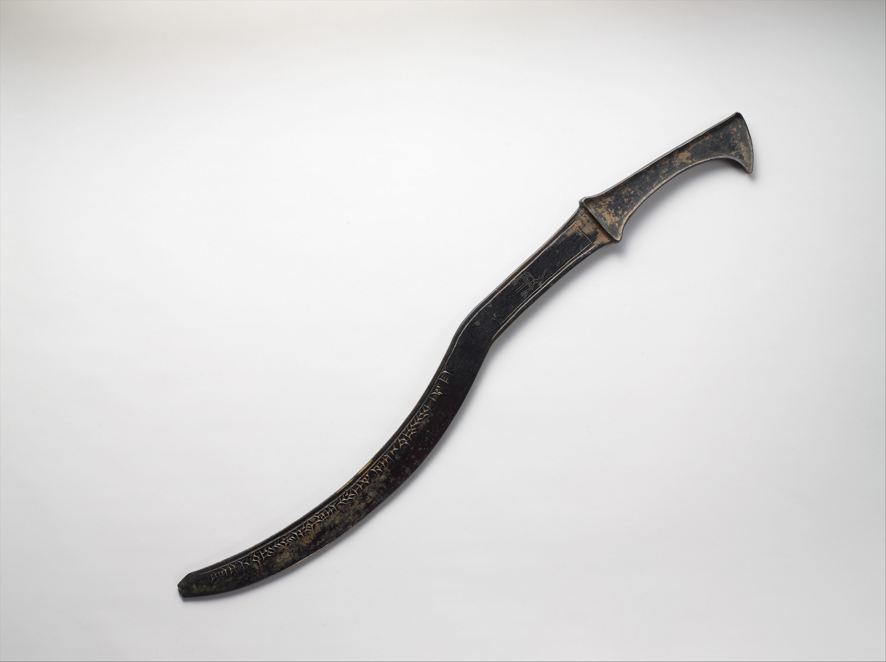

# Human-made Things in the Bible

## License Information

Human-made Things in the Bible © United Bible Societies, 2025. Adapted from: <cite>The Works of Their Hands: Man-made Things in the Bible</cite>, by Ray Pritz © 2009 United Bible Societies. This work is licensed under Creative Commons Attribution-ShareAlike 4.0 International (<a href="https://creativecommons.org/licenses/by-sa/4.0/">https://creativecommons.org/licenses/by-sa/4.0/</a>).

--------------------------------

## 標題：刀劍（sword） (id: REALIA:2.3)

2\.3 標題：刀劍（sword）
=================

經文出處
----

Hebrew 來： חֶרֶב (音譯： cherev)

[GEN 3:24](https://ref.ly/Gen3:24), [GEN 27:40](https://ref.ly/Gen27:40), [GEN 31:26](https://ref.ly/Gen31:26), [GEN 34:25](https://ref.ly/Gen34:25), [GEN 34:26](https://ref.ly/Gen34:26), [GEN 48:22](https://ref.ly/Gen48:22), [EXO 5:3](https://ref.ly/Exod5:3), [EXO 5:21](https://ref.ly/Exod5:21), [EXO 15:9](https://ref.ly/Exod15:9), [EXO 17:13](https://ref.ly/Exod17:13), [EXO 18:4](https://ref.ly/Exod18:4), [EXO 20:25](https://ref.ly/Exod20:25), [EXO 22:23](https://ref.ly/Exod22:23), [EXO 32:27](https://ref.ly/Exod32:27), [LEV 26:6](https://ref.ly/Lev26:6), [LEV 26:7](https://ref.ly/Lev26:7), [LEV 26:8](https://ref.ly/Lev26:8), [LEV 26:25](https://ref.ly/Lev26:25), [LEV 26:33](https://ref.ly/Lev26:33), [LEV 26:36](https://ref.ly/Lev26:36), [LEV 26:37](https://ref.ly/Lev26:37), [NUM 14:3](https://ref.ly/Num14:3), [NUM 14:43](https://ref.ly/Num14:43), [NUM 19:16](https://ref.ly/Num19:16), [NUM 20:18](https://ref.ly/Num20:18), [NUM 21:24](https://ref.ly/Num21:24), [NUM 22:23](https://ref.ly/Num22:23), [NUM 22:29](https://ref.ly/Num22:29), [NUM 22:31](https://ref.ly/Num22:31), [NUM 31:8](https://ref.ly/Num31:8), [DEU 13:16](https://ref.ly/Deut13:16), [DEU 13:16](https://ref.ly/Deut13:16), [DEU 20:13](https://ref.ly/Deut20:13), [DEU 28:22](https://ref.ly/Deut28:22), [DEU 32:25](https://ref.ly/Deut32:25), [DEU 32:41](https://ref.ly/Deut32:41), [DEU 32:42](https://ref.ly/Deut32:42), [DEU 33:29](https://ref.ly/Deut33:29), [JOS 5:2](https://ref.ly/Josh5:2), [JOS 5:3](https://ref.ly/Josh5:3), [JOS 5:13](https://ref.ly/Josh5:13), [JOS 6:21](https://ref.ly/Josh6:21), [JOS 8:24](https://ref.ly/Josh8:24), [JOS 8:24](https://ref.ly/Josh8:24), [JOS 10:11](https://ref.ly/Josh10:11), [JOS 10:28](https://ref.ly/Josh10:28), [JOS 10:30](https://ref.ly/Josh10:30), [JOS 10:32](https://ref.ly/Josh10:32), [JOS 10:35](https://ref.ly/Josh10:35), [JOS 10:37](https://ref.ly/Josh10:37), [JOS 10:39](https://ref.ly/Josh10:39), [JOS 11:10](https://ref.ly/Josh11:10), [JOS 11:11](https://ref.ly/Josh11:11), [JOS 11:12](https://ref.ly/Josh11:12), [JOS 11:14](https://ref.ly/Josh11:14), [JOS 13:22](https://ref.ly/Josh13:22), [JOS 19:47](https://ref.ly/Josh19:47), [JOS 24:12](https://ref.ly/Josh24:12), [JDG 1:8](https://ref.ly/Judg1:8), [JDG 1:25](https://ref.ly/Judg1:25), [JDG 3:16](https://ref.ly/Judg3:16), [JDG 3:21](https://ref.ly/Judg3:21), [JDG 3:22](https://ref.ly/Judg3:22), [JDG 4:15](https://ref.ly/Judg4:15), [JDG 4:16](https://ref.ly/Judg4:16), [JDG 7:14](https://ref.ly/Judg7:14), [JDG 7:20](https://ref.ly/Judg7:20), [JDG 7:22](https://ref.ly/Judg7:22), [JDG 8:10](https://ref.ly/Judg8:10), [JDG 8:20](https://ref.ly/Judg8:20), [JDG 9:54](https://ref.ly/Judg9:54), [JDG 18:27](https://ref.ly/Judg18:27), [JDG 20:2](https://ref.ly/Judg20:2), [JDG 20:15](https://ref.ly/Judg20:15), [JDG 20:17](https://ref.ly/Judg20:17), [JDG 20:25](https://ref.ly/Judg20:25), [JDG 20:35](https://ref.ly/Judg20:35), [JDG 20:37](https://ref.ly/Judg20:37), [JDG 20:46](https://ref.ly/Judg20:46), [JDG 20:48](https://ref.ly/Judg20:48), [JDG 21:10](https://ref.ly/Judg21:10), [1SA 13:19](https://ref.ly/1Sam13:19), [1SA 13:22](https://ref.ly/1Sam13:22), [1SA 14:20](https://ref.ly/1Sam14:20), [1SA 15:8](https://ref.ly/1Sam15:8), [1SA 15:33](https://ref.ly/1Sam15:33), [1SA 17:39](https://ref.ly/1Sam17:39), [1SA 17:45](https://ref.ly/1Sam17:45), [1SA 17:47](https://ref.ly/1Sam17:47), [1SA 17:50](https://ref.ly/1Sam17:50), [1SA 17:51](https://ref.ly/1Sam17:51), [1SA 18:4](https://ref.ly/1Sam18:4), [1SA 21:9](https://ref.ly/1Sam21:9), [1SA 21:9](https://ref.ly/1Sam21:9), [1SA 21:10](https://ref.ly/1Sam21:10), [1SA 22:10](https://ref.ly/1Sam22:10), [1SA 22:13](https://ref.ly/1Sam22:13), [1SA 22:19](https://ref.ly/1Sam22:19), [1SA 22:19](https://ref.ly/1Sam22:19), [1SA 25:13](https://ref.ly/1Sam25:13), [1SA 25:13](https://ref.ly/1Sam25:13), [1SA 25:13](https://ref.ly/1Sam25:13), [1SA 31:4](https://ref.ly/1Sam31:4), [1SA 31:4](https://ref.ly/1Sam31:4), [1SA 31:5](https://ref.ly/1Sam31:5), [2SA 1:12](https://ref.ly/2Sam1:12), [2SA 1:22](https://ref.ly/2Sam1:22), [2SA 2:16](https://ref.ly/2Sam2:16), [2SA 2:26](https://ref.ly/2Sam2:26), [2SA 3:29](https://ref.ly/2Sam3:29), [2SA 11:25](https://ref.ly/2Sam11:25), [2SA 12:9](https://ref.ly/2Sam12:9), [2SA 12:9](https://ref.ly/2Sam12:9), [2SA 12:10](https://ref.ly/2Sam12:10), [2SA 15:14](https://ref.ly/2Sam15:14), [2SA 18:8](https://ref.ly/2Sam18:8), [2SA 20:8](https://ref.ly/2Sam20:8), [2SA 20:10](https://ref.ly/2Sam20:10), [2SA 23:10](https://ref.ly/2Sam23:10), [2SA 24:9](https://ref.ly/2Sam24:9), [1KI 1:51](https://ref.ly/1Kgs1:51), [1KI 2:8](https://ref.ly/1Kgs2:8), [1KI 2:32](https://ref.ly/1Kgs2:32), [1KI 3:24](https://ref.ly/1Kgs3:24), [1KI 3:24](https://ref.ly/1Kgs3:24), [1KI 18:28](https://ref.ly/1Kgs18:28), [1KI 19:1](https://ref.ly/1Kgs19:1), [1KI 19:10](https://ref.ly/1Kgs19:10), [1KI 19:14](https://ref.ly/1Kgs19:14), [1KI 19:17](https://ref.ly/1Kgs19:17), [1KI 19:17](https://ref.ly/1Kgs19:17), [2KI 3:26](https://ref.ly/2Kgs3:26), [2KI 6:22](https://ref.ly/2Kgs6:22), [2KI 8:12](https://ref.ly/2Kgs8:12), [2KI 10:25](https://ref.ly/2Kgs10:25), [2KI 11:15](https://ref.ly/2Kgs11:15), [2KI 11:20](https://ref.ly/2Kgs11:20), [2KI 19:7](https://ref.ly/2Kgs19:7), [2KI 19:37](https://ref.ly/2Kgs19:37), [1CH 5:18](https://ref.ly/1Chr5:18), [1CH 10:4](https://ref.ly/1Chr10:4), [1CH 10:4](https://ref.ly/1Chr10:4), [1CH 10:5](https://ref.ly/1Chr10:5), [1CH 21:5](https://ref.ly/1Chr21:5), [1CH 21:5](https://ref.ly/1Chr21:5), [1CH 21:12](https://ref.ly/1Chr21:12), [1CH 21:12](https://ref.ly/1Chr21:12), [1CH 21:16](https://ref.ly/1Chr21:16), [1CH 21:27](https://ref.ly/1Chr21:27), [1CH 21:30](https://ref.ly/1Chr21:30), [2CH 20:9](https://ref.ly/2Chr20:9), [2CH 21:4](https://ref.ly/2Chr21:4), [2CH 23:14](https://ref.ly/2Chr23:14), [2CH 23:21](https://ref.ly/2Chr23:21), [2CH 29:9](https://ref.ly/2Chr29:9), [2CH 32:21](https://ref.ly/2Chr32:21), [2CH 34:6](https://ref.ly/2Chr34:6), [2CH 36:17](https://ref.ly/2Chr36:17), [2CH 36:20](https://ref.ly/2Chr36:20), [EZR 9:7](https://ref.ly/Ezra9:7), [NEH 4:7](https://ref.ly/Neh4:7), [NEH 4:12](https://ref.ly/Neh4:12), [EST 9:5](https://ref.ly/Esth9:5), [JOB 1:15](https://ref.ly/Job1:15), [JOB 1:17](https://ref.ly/Job1:17), [JOB 5:15](https://ref.ly/Job5:15), [JOB 5:20](https://ref.ly/Job5:20), [JOB 15:22](https://ref.ly/Job15:22), [JOB 19:29](https://ref.ly/Job19:29), [JOB 19:29](https://ref.ly/Job19:29), [JOB 27:14](https://ref.ly/Job27:14), [JOB 39:22](https://ref.ly/Job39:22), [JOB 40:19](https://ref.ly/Job40:19), [JOB 41:18](https://ref.ly/Job41:18), [PSA 7:13](https://ref.ly/Ps7:13), [PSA 17:13](https://ref.ly/Ps17:13), [PSA 22:21](https://ref.ly/Ps22:21), [PSA 37:14](https://ref.ly/Ps37:14), [PSA 37:15](https://ref.ly/Ps37:15), [PSA 44:4](https://ref.ly/Ps44:4), [PSA 44:7](https://ref.ly/Ps44:7), [PSA 45:4](https://ref.ly/Ps45:4), [PSA 57:5](https://ref.ly/Ps57:5), [PSA 59:8](https://ref.ly/Ps59:8), [PSA 63:11](https://ref.ly/Ps63:11), [PSA 64:4](https://ref.ly/Ps64:4), [PSA 76:4](https://ref.ly/Ps76:4), [PSA 78:62](https://ref.ly/Ps78:62), [PSA 78:64](https://ref.ly/Ps78:64), [PSA 89:44](https://ref.ly/Ps89:44), [PSA 144:10](https://ref.ly/Ps144:10), [PSA 149:6](https://ref.ly/Ps149:6), [PRO 5:4](https://ref.ly/Prov5:4), [PRO 12:18](https://ref.ly/Prov12:18), [PRO 25:18](https://ref.ly/Prov25:18), [PRO 30:14](https://ref.ly/Prov30:14), [SNG 3:8](https://ref.ly/Song3:8), [SNG 3:8](https://ref.ly/Song3:8), [ISA 1:20](https://ref.ly/Isa1:20), [ISA 2:4](https://ref.ly/Isa2:4), [ISA 2:4](https://ref.ly/Isa2:4), [ISA 3:25](https://ref.ly/Isa3:25), [ISA 13:15](https://ref.ly/Isa13:15), [ISA 14:19](https://ref.ly/Isa14:19), [ISA 21:15](https://ref.ly/Isa21:15), [ISA 21:15](https://ref.ly/Isa21:15), [ISA 22:2](https://ref.ly/Isa22:2), [ISA 27:1](https://ref.ly/Isa27:1), [ISA 31:8](https://ref.ly/Isa31:8), [ISA 31:8](https://ref.ly/Isa31:8), [ISA 31:8](https://ref.ly/Isa31:8), [ISA 34:5](https://ref.ly/Isa34:5), [ISA 34:6](https://ref.ly/Isa34:6), [ISA 37:7](https://ref.ly/Isa37:7), [ISA 37:38](https://ref.ly/Isa37:38), [ISA 41:2](https://ref.ly/Isa41:2), [ISA 49:2](https://ref.ly/Isa49:2), [ISA 51:19](https://ref.ly/Isa51:19), [ISA 65:12](https://ref.ly/Isa65:12), [ISA 66:16](https://ref.ly/Isa66:16), [JER 2:30](https://ref.ly/Jer2:30), [JER 4:10](https://ref.ly/Jer4:10), [JER 5:12](https://ref.ly/Jer5:12), [JER 5:17](https://ref.ly/Jer5:17), [JER 6:25](https://ref.ly/Jer6:25), [JER 9:15](https://ref.ly/Jer9:15), [JER 11:22](https://ref.ly/Jer11:22), [JER 12:12](https://ref.ly/Jer12:12), [JER 14:12](https://ref.ly/Jer14:12), [JER 14:13](https://ref.ly/Jer14:13), [JER 14:15](https://ref.ly/Jer14:15), [JER 14:15](https://ref.ly/Jer14:15), [JER 14:16](https://ref.ly/Jer14:16), [JER 14:18](https://ref.ly/Jer14:18), [JER 15:2](https://ref.ly/Jer15:2), [JER 15:2](https://ref.ly/Jer15:2), [JER 15:3](https://ref.ly/Jer15:3), [JER 15:9](https://ref.ly/Jer15:9), [JER 16:4](https://ref.ly/Jer16:4), [JER 18:21](https://ref.ly/Jer18:21), [JER 18:21](https://ref.ly/Jer18:21), [JER 19:7](https://ref.ly/Jer19:7), [JER 20:4](https://ref.ly/Jer20:4), [JER 20:4](https://ref.ly/Jer20:4), [JER 21:7](https://ref.ly/Jer21:7), [JER 21:7](https://ref.ly/Jer21:7), [JER 21:9](https://ref.ly/Jer21:9), [JER 24:10](https://ref.ly/Jer24:10), [JER 25:16](https://ref.ly/Jer25:16), [JER 25:27](https://ref.ly/Jer25:27), [JER 25:29](https://ref.ly/Jer25:29), [JER 25:31](https://ref.ly/Jer25:31), [JER 26:23](https://ref.ly/Jer26:23), [JER 27:8](https://ref.ly/Jer27:8), [JER 27:13](https://ref.ly/Jer27:13), [JER 29:17](https://ref.ly/Jer29:17), [JER 29:18](https://ref.ly/Jer29:18), [JER 31:2](https://ref.ly/Jer31:2), [JER 32:24](https://ref.ly/Jer32:24), [JER 32:36](https://ref.ly/Jer32:36), [JER 33:4](https://ref.ly/Jer33:4), [JER 34:4](https://ref.ly/Jer34:4), [JER 34:17](https://ref.ly/Jer34:17), [JER 38:2](https://ref.ly/Jer38:2), [JER 39:18](https://ref.ly/Jer39:18), [JER 41:2](https://ref.ly/Jer41:2), [JER 42:16](https://ref.ly/Jer42:16), [JER 42:17](https://ref.ly/Jer42:17), [JER 42:22](https://ref.ly/Jer42:22), [JER 43:11](https://ref.ly/Jer43:11), [JER 43:11](https://ref.ly/Jer43:11), [JER 44:12](https://ref.ly/Jer44:12), [JER 44:12](https://ref.ly/Jer44:12), [JER 44:13](https://ref.ly/Jer44:13), [JER 44:18](https://ref.ly/Jer44:18), [JER 44:27](https://ref.ly/Jer44:27), [JER 44:28](https://ref.ly/Jer44:28), [JER 46:10](https://ref.ly/Jer46:10), [JER 46:14](https://ref.ly/Jer46:14), [JER 46:16](https://ref.ly/Jer46:16), [JER 47:6](https://ref.ly/Jer47:6), [JER 48:2](https://ref.ly/Jer48:2), [JER 48:10](https://ref.ly/Jer48:10), [JER 49:37](https://ref.ly/Jer49:37), [JER 50:16](https://ref.ly/Jer50:16), [JER 50:35](https://ref.ly/Jer50:35), [JER 50:36](https://ref.ly/Jer50:36), [JER 50:36](https://ref.ly/Jer50:36), [JER 50:37](https://ref.ly/Jer50:37), [JER 50:37](https://ref.ly/Jer50:37), [JER 51:50](https://ref.ly/Jer51:50), [LAM 1:20](https://ref.ly/Lam1:20), [LAM 2:21](https://ref.ly/Lam2:21), [LAM 4:9](https://ref.ly/Lam4:9), [LAM 5:9](https://ref.ly/Lam5:9), [EZK 5:1](https://ref.ly/Ezek5:1), [EZK 5:2](https://ref.ly/Ezek5:2), [EZK 5:2](https://ref.ly/Ezek5:2), [EZK 5:12](https://ref.ly/Ezek5:12), [EZK 5:12](https://ref.ly/Ezek5:12), [EZK 5:17](https://ref.ly/Ezek5:17), [EZK 6:3](https://ref.ly/Ezek6:3), [EZK 6:8](https://ref.ly/Ezek6:8), [EZK 6:11](https://ref.ly/Ezek6:11), [EZK 6:12](https://ref.ly/Ezek6:12), [EZK 7:15](https://ref.ly/Ezek7:15), [EZK 7:15](https://ref.ly/Ezek7:15), [EZK 11:8](https://ref.ly/Ezek11:8), [EZK 11:8](https://ref.ly/Ezek11:8), [EZK 11:10](https://ref.ly/Ezek11:10), [EZK 12:14](https://ref.ly/Ezek12:14), [EZK 12:16](https://ref.ly/Ezek12:16), [EZK 14:17](https://ref.ly/Ezek14:17), [EZK 14:17](https://ref.ly/Ezek14:17), [EZK 14:21](https://ref.ly/Ezek14:21), [EZK 16:40](https://ref.ly/Ezek16:40), [EZK 17:21](https://ref.ly/Ezek17:21), [EZK 21:8](https://ref.ly/Ezek21:8), [EZK 21:9](https://ref.ly/Ezek21:9), [EZK 21:10](https://ref.ly/Ezek21:10), [EZK 21:14](https://ref.ly/Ezek21:14), [EZK 21:14](https://ref.ly/Ezek21:14), [EZK 21:16](https://ref.ly/Ezek21:16), [EZK 21:17](https://ref.ly/Ezek21:17), [EZK 21:19](https://ref.ly/Ezek21:19), [EZK 21:19](https://ref.ly/Ezek21:19), [EZK 21:19](https://ref.ly/Ezek21:19), [EZK 21:20](https://ref.ly/Ezek21:20), [EZK 21:24](https://ref.ly/Ezek21:24), [EZK 21:25](https://ref.ly/Ezek21:25), [EZK 21:33](https://ref.ly/Ezek21:33), [EZK 21:33](https://ref.ly/Ezek21:33), [EZK 23:10](https://ref.ly/Ezek23:10), [EZK 23:25](https://ref.ly/Ezek23:25), [EZK 23:47](https://ref.ly/Ezek23:47), [EZK 24:21](https://ref.ly/Ezek24:21), [EZK 25:13](https://ref.ly/Ezek25:13), [EZK 26:6](https://ref.ly/Ezek26:6), [EZK 26:8](https://ref.ly/Ezek26:8), [EZK 26:9](https://ref.ly/Ezek26:9), [EZK 26:11](https://ref.ly/Ezek26:11), [EZK 28:7](https://ref.ly/Ezek28:7), [EZK 28:23](https://ref.ly/Ezek28:23), [EZK 29:8](https://ref.ly/Ezek29:8), [EZK 30:4](https://ref.ly/Ezek30:4), [EZK 30:5](https://ref.ly/Ezek30:5), [EZK 30:6](https://ref.ly/Ezek30:6), [EZK 30:11](https://ref.ly/Ezek30:11), [EZK 30:17](https://ref.ly/Ezek30:17), [EZK 30:21](https://ref.ly/Ezek30:21), [EZK 30:22](https://ref.ly/Ezek30:22), [EZK 30:24](https://ref.ly/Ezek30:24), [EZK 30:25](https://ref.ly/Ezek30:25), [EZK 31:17](https://ref.ly/Ezek31:17), [EZK 31:18](https://ref.ly/Ezek31:18), [EZK 32:10](https://ref.ly/Ezek32:10), [EZK 32:11](https://ref.ly/Ezek32:11), [EZK 32:12](https://ref.ly/Ezek32:12), [EZK 32:20](https://ref.ly/Ezek32:20), [EZK 32:20](https://ref.ly/Ezek32:20), [EZK 32:21](https://ref.ly/Ezek32:21), [EZK 32:22](https://ref.ly/Ezek32:22), [EZK 32:23](https://ref.ly/Ezek32:23), [EZK 32:24](https://ref.ly/Ezek32:24), [EZK 32:25](https://ref.ly/Ezek32:25), [EZK 32:26](https://ref.ly/Ezek32:26), [EZK 32:27](https://ref.ly/Ezek32:27), [EZK 32:28](https://ref.ly/Ezek32:28), [EZK 32:29](https://ref.ly/Ezek32:29), [EZK 32:30](https://ref.ly/Ezek32:30), [EZK 32:31](https://ref.ly/Ezek32:31), [EZK 32:32](https://ref.ly/Ezek32:32), [EZK 33:2](https://ref.ly/Ezek33:2), [EZK 33:3](https://ref.ly/Ezek33:3), [EZK 33:4](https://ref.ly/Ezek33:4), [EZK 33:6](https://ref.ly/Ezek33:6), [EZK 33:6](https://ref.ly/Ezek33:6), [EZK 33:26](https://ref.ly/Ezek33:26), [EZK 33:27](https://ref.ly/Ezek33:27), [EZK 35:5](https://ref.ly/Ezek35:5), [EZK 35:8](https://ref.ly/Ezek35:8), [EZK 38:4](https://ref.ly/Ezek38:4), [EZK 38:8](https://ref.ly/Ezek38:8), [EZK 38:21](https://ref.ly/Ezek38:21), [EZK 38:21](https://ref.ly/Ezek38:21), [EZK 39:23](https://ref.ly/Ezek39:23), [DAN 11:33](https://ref.ly/Dan11:33), [HOS 1:7](https://ref.ly/Hos1:7), [HOS 2:20](https://ref.ly/Hos2:20), [HOS 7:16](https://ref.ly/Hos7:16), [HOS 11:6](https://ref.ly/Hos11:6), [HOS 14:1](https://ref.ly/Hos14:1), [JOL 4:10](https://ref.ly/Joel4:10), [AMO 1:11](https://ref.ly/Amos1:11), [AMO 4:10](https://ref.ly/Amos4:10), [AMO 7:9](https://ref.ly/Amos7:9), [AMO 7:11](https://ref.ly/Amos7:11), [AMO 7:17](https://ref.ly/Amos7:17), [AMO 9:1](https://ref.ly/Amos9:1), [AMO 9:4](https://ref.ly/Amos9:4), [AMO 9:10](https://ref.ly/Amos9:10), [MIC 4:3](https://ref.ly/Mic4:3), [MIC 4:3](https://ref.ly/Mic4:3), [MIC 5:5](https://ref.ly/Mic5:5), [MIC 6:14](https://ref.ly/Mic6:14), [NAM 2:14](https://ref.ly/Nah2:14), [NAM 3:3](https://ref.ly/Nah3:3), [NAM 3:15](https://ref.ly/Nah3:15), [ZEP 2:12](https://ref.ly/Zeph2:12), [HAG 2:22](https://ref.ly/Hag2:22), [ZEC 9:13](https://ref.ly/Zech9:13), [ZEC 11:17](https://ref.ly/Zech11:17), [ZEC 13:7](https://ref.ly/Zech13:7)

Hebrew 來： מְכֵרָה (音譯： mkerah)

[GEN 49:5](https://ref.ly/Gen49:5)

Hebrew 來： פְּתִיחָה (音譯： pthichah)

[PSA 55:22](https://ref.ly/Ps55:22)

Greek 希： ἀκινάκης (音譯： akinakēs)

[JDT 13:6](https://ref.ly/Jdt13:6), [JDT 16:9](https://ref.ly/Jdt16:9)

Greek 希： μάχαιρα (音譯： machaira)

[MAT 10:34](https://ref.ly/Matt10:34), [MAT 26:47](https://ref.ly/Matt26:47), [MAT 26:52](https://ref.ly/Matt26:52), [MAT 26:52](https://ref.ly/Matt26:52), [MAT 26:52](https://ref.ly/Matt26:52), [MAT 26:55](https://ref.ly/Matt26:55), [MRK 14:43](https://ref.ly/Mark14:43), [MRK 14:47](https://ref.ly/Mark14:47), [MRK 14:48](https://ref.ly/Mark14:48), [LUK 21:24](https://ref.ly/Luke21:24), [LUK 22:36](https://ref.ly/Luke22:36), [LUK 22:38](https://ref.ly/Luke22:38), [LUK 22:49](https://ref.ly/Luke22:49), [LUK 22:52](https://ref.ly/Luke22:52), [JHN 18:10](https://ref.ly/John18:10), [JHN 18:11](https://ref.ly/John18:11), [ACT 12:2](https://ref.ly/Acts12:2), [ACT 16:27](https://ref.ly/Acts16:27), [ROM 8:35](https://ref.ly/Rom8:35), [ROM 13:4](https://ref.ly/Rom13:4), [GAL 6:17](https://ref.ly/Gal6:17), [HEB 4:12](https://ref.ly/Heb4:12), [HEB 11:34](https://ref.ly/Heb11:34), [HEB 11:37](https://ref.ly/Heb11:37), [REV 6:4](https://ref.ly/Rev6:4), [REV 13:10](https://ref.ly/Rev13:10), [REV 13:10](https://ref.ly/Rev13:10), [REV 13:14](https://ref.ly/Rev13:14), [ESG 3:13](https://ref.ly/EsthGr3:13), [SIR 28:18](https://ref.ly/Sir28:18), [BEL 1:25](https://ref.ly/Bel1:25), [1MA 3:12](https://ref.ly/1Macc3:12), [1MA 4:6](https://ref.ly/1Macc4:6), [1MA 10:85](https://ref.ly/1Macc10:85), [2MA 5:2](https://ref.ly/2Macc5:2), [1ES 3:22](https://ref.ly/1Esd3:22), [ODA 1:9](https://ref.ly/Odes1:9), [ODA 2:25](https://ref.ly/Odes2:25), [ODA 2:41](https://ref.ly/Odes2:41), [ODA 2:42](https://ref.ly/Odes2:42), [PSA 151:7](https://ref.ly/Ps151:7)

Greek 希： ξιφηφόρος (音譯： xifēforos)

[4MA 16:20](https://ref.ly/4Macc16:20)

Greek 希： ξίφος (音譯： xifos)

[WIS 18:15](https://ref.ly/Wis18:15), [2MA 12:22](https://ref.ly/2Macc12:22), [2MA 14:41](https://ref.ly/2Macc14:41)

Greek 希： ῥομφαία (音譯： rhomfaia)

[LUK 2:35](https://ref.ly/Luke2:35), [REV 1:16](https://ref.ly/Rev1:16), [REV 2:12](https://ref.ly/Rev2:12), [REV 2:16](https://ref.ly/Rev2:16), [REV 6:8](https://ref.ly/Rev6:8), [REV 19:15](https://ref.ly/Rev19:15), [REV 19:21](https://ref.ly/Rev19:21), [JDT 1:12](https://ref.ly/Jdt1:12), [JDT 2:27](https://ref.ly/Jdt2:27), [JDT 7:14](https://ref.ly/Jdt7:14), [JDT 8:19](https://ref.ly/Jdt8:19), [JDT 9:2](https://ref.ly/Jdt9:2), [JDT 11:10](https://ref.ly/Jdt11:10), [JDT 16:4](https://ref.ly/Jdt16:4), [WIS 5:20](https://ref.ly/Wis5:20), [SIR 21:3](https://ref.ly/Sir21:3), [SIR 22:21](https://ref.ly/Sir22:21), [SIR 26:28](https://ref.ly/Sir26:28), [SIR 39:30](https://ref.ly/Sir39:30), [SIR 40:9](https://ref.ly/Sir40:9), [SIR 46:2](https://ref.ly/Sir46:2), [BAR 2:25](https://ref.ly/Bar2:25), [SUS 1:59](https://ref.ly/Sus1:59), [1MA 2:9](https://ref.ly/1Macc2:9), [1MA 3:3](https://ref.ly/1Macc3:3), [1MA 4:15](https://ref.ly/1Macc4:15), [1MA 4:33](https://ref.ly/1Macc4:33), [1MA 5:28](https://ref.ly/1Macc5:28), [1MA 5:51](https://ref.ly/1Macc5:51), [1MA 7:38](https://ref.ly/1Macc7:38), [1MA 7:46](https://ref.ly/1Macc7:46), [1MA 8:23](https://ref.ly/1Macc8:23), [1MA 9:73](https://ref.ly/1Macc9:73), [1MA 12:48](https://ref.ly/1Macc12:48), [2MA 15:15](https://ref.ly/2Macc15:15), [2MA 15:16](https://ref.ly/2Macc15:16), [1ES 1:50](https://ref.ly/1Esd1:50), [1ES 1:53](https://ref.ly/1Esd1:53), [1ES 4:23](https://ref.ly/1Esd4:23), [1ES 8:74](https://ref.ly/1Esd8:74), [PSS 13:2](https://ref.ly/PssSol13:2), [PSS 15:7](https://ref.ly/PssSol15:7)

Greek 希： σίδηρος (音譯： sidēros)

[JDT 6:6](https://ref.ly/Jdt6:6), [JDT 9:8](https://ref.ly/Jdt9:8)

Greek 希： συγκεντέω (音譯： sugkenteō（動詞）)

[2MA 12:23](https://ref.ly/2Macc12:23)

Greek 希： συνεκκεντέω (音譯： sunekkenteō（動詞）)

[2MA 5:26](https://ref.ly/2Macc5:26)

Latin 拉： gladius

[2ES 12:27](https://ref.ly/2Esd12:27), [2ES 12:28](https://ref.ly/2Esd12:28), [2ES 15:5](https://ref.ly/2Esd15:5), [2ES 15:15](https://ref.ly/2Esd15:15), [2ES 15:19](https://ref.ly/2Esd15:19), [2ES 15:35](https://ref.ly/2Esd15:35), [2ES 15:49](https://ref.ly/2Esd15:49), [2ES 15:57](https://ref.ly/2Esd15:57), [2ES 16:3](https://ref.ly/2Esd16:3), [2ES 16:22](https://ref.ly/2Esd16:22), [2ES 16:23](https://ref.ly/2Esd16:23)

Latin 拉： romphea

[2ES 15:15](https://ref.ly/2Esd15:15), [2ES 15:22](https://ref.ly/2Esd15:22), [2ES 15:41](https://ref.ly/2Esd15:41), [2ES 15:57](https://ref.ly/2Esd15:57), [2ES 16:32](https://ref.ly/2Esd16:32)

描述和用途
-----

*直劍 (© Rama, Wikimedia Commons, CC BY\-SA 2\.0 FR, via Wikimedia Commons)*

在不同時期和不同國家，劍的長度和形狀差別很大。然而，劍的基本概念保持不變：劍是一柄長而重的刀，用金屬製成，先是用青銅，後來是用鐵等更加堅硬的金屬。在聖經時代的較早期，劍的鋒刃主要用來切割，曲線與鐮刀相似（參[1\.1\.6 鐮刀 (sickle)\<REALIA:1\.1\.6\>](#) ），但鋒利的刃是在外側，而鐮刀的鋒刃是在內側。這種劍（或刀）主要用來劈砍，用於戳刺的劍尖並不被重視。在舊約時代的較晚時候，劍更多是用來戳刺。開始時，這些劍比較短，只有大約30—40厘米（12—16英吋），劍身相對寬闊，兩邊開刃，並且有劍尖。到了以色列王國時期，劍身變得較長和相對較窄。

---

翻譯
--

*亞述彎曲或鐮刀劍（約公元前1307–1275年） (Metropolitan Museum of Art, CC0, MMA)*

在有些語言中，表示「劍」的詞語就是「大的刀」；但在某些地區，「劍」可能被稱為「用來殺戮的大砍刀」或「戰刀」。

希伯來文*cherev* 是一個統稱，沒有特別指明劍的長短。如果目標語言用不同的詞語分別表示長劍和短劍，那麼通常應該譯作「短劍」。在新約中，希臘文*machaira* 指短劍，而*rhomfaia* 則指長劍。短語「用劍的刃」在聖經中出現超過30次，一半以上在《約書亞記》和《士師記》，通常是指較早期的弧形劍，只一面有刃。翻譯者通常不需要直譯這個短語，譯成「用劍」就足夠了。

很多經文出現「被刀殺滅」、「被刀劍滅絕」、「遭刀劍而死」或「死在刀下」這個短語（如[JOB 36:12](https://ref.ly/Job36:12) ；[JER 5:12](https://ref.ly/Jer5:12) ，[JER 21:9](https://ref.ly/Jer21:9) ；[EZK 31:17](https://ref.ly/Ezek31:17) ；[MAT 26:52](https://ref.ly/Matt26:52) ）。這是一個希伯來文慣用語，意思是因暴力而死。這個短語一般（但不是每次；比較[1SA 2:33](https://ref.ly/1Sam2:33) ）表示戰死，翻譯者很多時候可以將其表達為「在戰爭中被殺」（GNT (Good News Translation (1992)) 直譯；[JER 16:4](https://ref.ly/Jer16:4) ），或「在戰鬥中死亡」。在這些情況下，該詞通常不是表示英勇地死亡。如果目標語言有特別的詞語或短語表示「戰士英勇陣亡」，翻譯者只有在經文確實是表達這種意思時，才可使用該詞語或短語。如果經文不是表達戰死的意思，翻譯者可以將之譯成「橫死」或「被殺」。翻譯者不應使用現代武器的名稱來翻譯「刀劍」；例如，「被槍擊斃」這種表達就不符合當時的時代。

在一些經文中，「刀劍」這個詞僅僅代表戰爭（如[JER 5:12](https://ref.ly/Jer5:12) ；[ROM 8:35](https://ref.ly/Rom8:35) ；[REV 6:8](https://ref.ly/Rev6:8) ）。[JOS 24:12](https://ref.ly/Josh24:12) 原文字面意思是：「我派遣大黃蜂在你們前面，將亞摩利人的兩個王從你們面前趕出，［但］不是靠你們的劍或你們的弓」（NASB (New American Standard Bible) 採用了直譯）。在翻譯這節經文的最後一句時，有些語言可能不必提及具體的武器：「你們的武器和力量對戰爭的結果毫無影響。」這句經文也可以用一個肯定陳述句和一個否定陳述句來翻譯：「我為你們打敗他們，這不是你們自己的武器和力量做成的。」

短語「拿刀的」出現在多處經文中（[JDG 8:10](https://ref.ly/Judg8:10); [JDG 8:20](https://ref.ly/Judg8:20) （6次）；[2SA 24:9](https://ref.ly/2Sam24:9) ；[1CH 21:5](https://ref.ly/1Chr21:5) ）。這是一句慣用語，意指「士兵」，GNT (Good News Translation (1992)) 在[JDG 8:10](https://ref.ly/Judg8:10) 把這個短語譯為“soldiers”（「士兵」）。

短語「舉刀」在[ISA 2:4](https://ref.ly/Isa2:4) 和[MIC 4:3](https://ref.ly/Mic4:3) 中出現，意思是「進入戰鬥」或「開戰」。GNT (Good News Translation (1992)) 提供了正確的英文對等表達，把這兩節經文的倒數第二行翻譯為“Nations will never again go to war”（英文直譯：「國家之間從此不再開戰」）。在一些語言中，直譯「舉刀」這個希伯來文慣用語會得到「投降」、「獲勝」等非常不同的含義；這些都不是經文的意思，需要避免產生這樣的誤解。

希伯來文短語*cherev pifiyoth* （[PSA 149:6](https://ref.ly/Ps149:6) ）或*cherev piyoth* （[PRO 5:4](https://ref.ly/Prov5:4) ）指一柄兩邊的鋒刃都磨利了的劍，即「兩刃的劍」或「兩刃的刀」（RSV (Revised Standard Version (1952)) 直譯；比較[HEB 4:12](https://ref.ly/Heb4:12); [REV 1:16](https://ref.ly/Rev1:16); [REV 2:12](https://ref.ly/Rev2:12); [SIR 21:3](https://ref.ly/Sir21:3) ）。這是在舊約較晚時期以及之後所使用的直劍。

在[GEN 49:5](https://ref.ly/Gen49:5) ，希伯來文*mkerah* 的意思並不確定。大部分翻譯者把雅各的話與[GEN 34:25](https://ref.ly/Gen34:25); [GEN 34:26](https://ref.ly/Gen34:26) 描述的事件關聯起來，把*mkerah* 理解為一種武器，很可能與那些經文中的「刀劍」（希伯來文*cherev* ）對應。

在[PSA 55:22](https://ref.ly/Ps55:22) （《和》55:21），希伯來文*pthichoth* 指被「拔出」（直譯「打開」）的刀劍，意即準備使用。因此，這節經文的最後一行可譯成，「他已準備好揮劍攻擊」（CEV (Contemporary English Version) 直譯）。另外也可以採用比喻；例如，「它們（即他的話）像利劍切割」（GNT (Good News Translation (1992)) 直譯），「……像刀切割」（NCV (New Century Version) 直譯）。

在[LUK 2:35](https://ref.ly/Luke2:35) ，「劍」喻指痛楚或極度痛苦，翻譯者一般可以採用字面直譯。有時候，使用明喻比較合適；例如，這節經文的前半節可以譯成：「至於你的心，必如同被劍刺透。」有些情況下，不必出現「劍」字就可實現意思相同的表達，例如「你的心也將被刺透」（NEB (New English Bible (1970)) 直譯）。翻譯者也可以使用非比喻式的表達，例如「你將經歷極度的痛苦」。這節經文完全沒有戰死沙場的含義，翻譯者應該避免使用任何帶有這種含義的詞語。

* **Associated Passages:** 創世記 3:24; 創世記 27:40; 創世記 31:26; 創世記 34:25; 創世記 34:26; 創世記 48:22; 出埃及記 5:3; 出埃及記 5:21; 出埃及記 15:9; 出埃及記 17:13; 出埃及記 18:4; 出埃及記 20:25; 出埃及記 22:23; 出埃及記 32:27; 利未記 26:6; 利未記 26:7; 利未記 26:8; 利未記 26:25; 利未記 26:33; 利未記 26:36; 利未記 26:37; 民數記 14:3; 民數記 14:43; 民數記 19:16; 民數記 20:18; 民數記 21:24; 民數記 22:23; 民數記 22:29; 民數記 22:31; 民數記 31:8; 申命記 13:16; 申命記 20:13; 申命記 28:22; 申命記 32:25; 申命記 32:41; 申命記 32:42; 申命記 33:29; 約書亞記 5:2; 約書亞記 5:3; 約書亞記 5:13; 約書亞記 6:21; 約書亞記 8:24; 約書亞記 10:11; 約書亞記 10:28; 約書亞記 10:30; 約書亞記 10:32; 約書亞記 10:35; 約書亞記 10:37; 約書亞記 10:39; 約書亞記 11:10; 約書亞記 11:11; 約書亞記 11:12; 約書亞記 11:14; 約書亞記 13:22; 約書亞記 19:47; 約書亞記 24:12; 士師記 1:8; 士師記 1:25; 士師記 3:16; 士師記 3:21; 士師記 3:22; 士師記 4:15; 士師記 4:16; 士師記 7:14; 士師記 7:20; 士師記 7:22; 士師記 8:10; 士師記 8:20; 士師記 9:54; 士師記 18:27; 士師記 20:2; 士師記 20:15; 士師記 20:17; 士師記 20:25; 士師記 20:35; 士師記 20:37; 士師記 20:46; 士師記 20:48; 士師記 21:10; 撒母耳記上 13:19; 撒母耳記上 13:22; 撒母耳記上 14:20; 撒母耳記上 15:8; 撒母耳記上 15:33; 撒母耳記上 17:39; 撒母耳記上 17:45; 撒母耳記上 17:47; 撒母耳記上 17:50; 撒母耳記上 17:51; 撒母耳記上 18:4; 撒母耳記上 21:9; 撒母耳記上 21:10; 撒母耳記上 22:10; 撒母耳記上 22:13; 撒母耳記上 22:19; 撒母耳記上 25:13; 撒母耳記上 31:4; 撒母耳記上 31:5; 撒母耳記下 1:12; 撒母耳記下 1:22; 撒母耳記下 2:16; 撒母耳記下 2:26; 撒母耳記下 3:29; 撒母耳記下 11:25; 撒母耳記下 12:9; 撒母耳記下 12:10; 撒母耳記下 15:14; 撒母耳記下 18:8; 撒母耳記下 20:8; 撒母耳記下 20:10; 撒母耳記下 23:10; 撒母耳記下 24:9; 列王紀上 1:51; 列王紀上 2:8; 列王紀上 2:32; 列王紀上 3:24; 列王紀上 18:28; 列王紀上 19:1; 列王紀上 19:10; 列王紀上 19:14; 列王紀上 19:17; 列王紀下 3:26; 列王紀下 6:22; 列王紀下 8:12; 列王紀下 10:25; 列王紀下 11:15; 列王紀下 11:20; 列王紀下 19:7; 列王紀下 19:37; 歷代志上 5:18; 歷代志上 10:4; 歷代志上 10:5; 歷代志上 21:5; 歷代志上 21:12; 歷代志上 21:16; 歷代志上 21:27; 歷代志上 21:30; 歷代志下 20:9; 歷代志下 21:4; 歷代志下 23:14; 歷代志下 23:21; 歷代志下 29:9; 歷代志下 32:21; 歷代志下 34:6; 歷代志下 36:17; 歷代志下 36:20; 以斯拉記 9:7; 尼希米記 4:7; 尼希米記 4:12; 以斯帖記 9:5; 約伯記 1:15; 約伯記 1:17; 約伯記 5:15; 約伯記 5:20; 約伯記 15:22; 約伯記 19:29; 約伯記 27:14; 約伯記 39:22; 約伯記 40:19; 約伯記 41:18; 詩篇 7:13; 詩篇 17:13; 詩篇 22:21; 詩篇 37:14; 詩篇 37:15; 詩篇 44:4; 詩篇 44:7; 詩篇 45:4; 詩篇 57:5; 詩篇 59:8; 詩篇 63:11; 詩篇 64:4; 詩篇 76:4; 詩篇 78:62; 詩篇 78:64; 詩篇 89:44; 詩篇 144:10; 詩篇 149:6; 箴言 5:4; 箴言 12:18; 箴言 25:18; 箴言 30:14; 雅歌 3:8; 以賽亞書 1:20; 以賽亞書 2:4; 以賽亞書 3:25; 以賽亞書 13:15; 以賽亞書 14:19; 以賽亞書 21:15; 以賽亞書 22:2; 以賽亞書 27:1; 以賽亞書 31:8; 以賽亞書 34:5; 以賽亞書 34:6; 以賽亞書 37:7; 以賽亞書 37:38; 以賽亞書 41:2; 以賽亞書 49:2; 以賽亞書 51:19; 以賽亞書 65:12; 以賽亞書 66:16; 耶利米書 2:30; 耶利米書 4:10; 耶利米書 5:12; 耶利米書 5:17; 耶利米書 6:25; 耶利米書 9:15; 耶利米書 11:22; 耶利米書 12:12; 耶利米書 14:12; 耶利米書 14:13; 耶利米書 14:15; 耶利米書 14:16; 耶利米書 14:18; 耶利米書 15:2; 耶利米書 15:3; 耶利米書 15:9; 耶利米書 16:4; 耶利米書 18:21; 耶利米書 19:7; 耶利米書 20:4; 耶利米書 21:7; 耶利米書 21:9; 耶利米書 24:10; 耶利米書 25:16; 耶利米書 25:27; 耶利米書 25:29; 耶利米書 25:31; 耶利米書 26:23; 耶利米書 27:8; 耶利米書 27:13; 耶利米書 29:17; 耶利米書 29:18; 耶利米書 31:2; 耶利米書 32:24; 耶利米書 32:36; 耶利米書 33:4; 耶利米書 34:4; 耶利米書 34:17; 耶利米書 38:2; 耶利米書 39:18; 耶利米書 41:2; 耶利米書 42:16; 耶利米書 42:17; 耶利米書 42:22; 耶利米書 43:11; 耶利米書 44:12; 耶利米書 44:13; 耶利米書 44:18; 耶利米書 44:27; 耶利米書 44:28; 耶利米書 46:10; 耶利米書 46:14; 耶利米書 46:16; 耶利米書 47:6; 耶利米書 48:2; 耶利米書 48:10; 耶利米書 49:37; 耶利米書 50:16; 耶利米書 50:35; 耶利米書 50:36; 耶利米書 50:37; 耶利米書 51:50; 耶利米哀歌 1:20; 耶利米哀歌 2:21; 耶利米哀歌 4:9; 耶利米哀歌 5:9; 以西結書 5:1; 以西結書 5:2; 以西結書 5:12; 以西結書 5:17; 以西結書 6:3; 以西結書 6:8; 以西結書 6:11; 以西結書 6:12; 以西結書 7:15; 以西結書 11:8; 以西結書 11:10; 以西結書 12:14; 以西結書 12:16; 以西結書 14:17; 以西結書 14:21; 以西結書 16:40; 以西結書 17:21; 以西結書 21:8; 以西結書 21:9; 以西結書 21:10; 以西結書 21:14; 以西結書 21:16; 以西結書 21:17; 以西結書 21:19; 以西結書 21:20; 以西結書 21:24; 以西結書 21:25; 以西結書 21:33; 以西結書 23:10; 以西結書 23:25; 以西結書 23:47; 以西結書 24:21; 以西結書 25:13; 以西結書 26:6; 以西結書 26:8; 以西結書 26:9; 以西結書 26:11; 以西結書 28:7; 以西結書 28:23; 以西結書 29:8; 以西結書 30:4; 以西結書 30:5; 以西結書 30:6; 以西結書 30:11; 以西結書 30:17; 以西結書 30:21; 以西結書 30:22; 以西結書 30:24; 以西結書 30:25; 以西結書 31:17; 以西結書 31:18; 以西結書 32:10; 以西結書 32:11; 以西結書 32:12; 以西結書 32:20; 以西結書 32:21; 以西結書 32:22; 以西結書 32:23; 以西結書 32:24; 以西結書 32:25; 以西結書 32:26; 以西結書 32:27; 以西結書 32:28; 以西結書 32:29; 以西結書 32:30; 以西結書 32:31; 以西結書 32:32; 以西結書 33:2; 以西結書 33:3; 以西結書 33:4; 以西結書 33:6; 以西結書 33:26; 以西結書 33:27; 以西結書 35:5; 以西結書 35:8; 以西結書 38:4; 以西結書 38:8; 以西結書 38:21; 以西結書 39:23; 但以理書 11:33; 何西阿書 1:7; 何西阿書 2:20; 何西阿書 7:16; 何西阿書 11:6; 何西阿書 14:1; 約珥書 4:10; 阿摩司書 1:11; 阿摩司書 4:10; 阿摩司書 7:9; 阿摩司書 7:11; 阿摩司書 7:17; 阿摩司書 9:1; 阿摩司書 9:4; 阿摩司書 9:10; 彌迦書 4:3; 彌迦書 5:5; 彌迦書 6:14; 那鴻書 2:14; 那鴻書 3:3; 那鴻書 3:15; 西番雅書 2:12; 哈該書 2:22; 撒迦利亞書 9:13; 撒迦利亞書 11:17; 撒迦利亞書 13:7; 創世記 49:5; 詩篇 55:22; 友弟德傳 13:6; 友弟德傳 16:9; 馬太福音 10:34; 馬太福音 26:47; 馬太福音 26:52; 馬太福音 26:55; 馬可福音 14:43; 馬可福音 14:47; 馬可福音 14:48; 路加福音 21:24; 路加福音 22:36; 路加福音 22:38; 路加福音 22:49; 路加福音 22:52; 約翰福音 18:10; 約翰福音 18:11; 使徒行傳 12:2; 使徒行傳 16:27; 羅馬書 8:35; 羅馬書 13:4; 加拉太書 6:17; 希伯來書 4:12; 希伯來書 11:34; 希伯來書 11:37; 啟示錄 6:4; 啟示錄 13:10; 啟示錄 13:14; 以斯帖記補篇 3:13; 德訓篇 28:18; 彼勒與大龍 1:25; 瑪加伯上 3:12; 瑪加伯上 4:6; 瑪加伯上 10:85; 瑪加伯下 5:2; 厄斯德拉上 3:22; 頌歌 1:9; 頌歌 2:25; 頌歌 2:41; 頌歌 2:42; 詩篇 151:7; 瑪加伯四書 16:20; 智慧篇 18:15; 瑪加伯下 12:22; 瑪加伯下 14:41; 路加福音 2:35; 啟示錄 1:16; 啟示錄 2:12; 啟示錄 2:16; 啟示錄 6:8; 啟示錄 19:15; 啟示錄 19:21; 友弟德傳 1:12; 友弟德傳 2:27; 友弟德傳 7:14; 友弟德傳 8:19; 友弟德傳 9:2; 友弟德傳 11:10; 友弟德傳 16:4; 智慧篇 5:20; 德訓篇 21:3; 德訓篇 22:21; 德訓篇 26:28; 德訓篇 39:30; 德訓篇 40:9; 德訓篇 46:2; 巴路克 2:25; 蘇撒拿傳 1:59; 瑪加伯上 2:9; 瑪加伯上 3:3; 瑪加伯上 4:15; 瑪加伯上 4:33; 瑪加伯上 5:28; 瑪加伯上 5:51; 瑪加伯上 7:38; 瑪加伯上 7:46; 瑪加伯上 8:23; 瑪加伯上 9:73; 瑪加伯上 12:48; 瑪加伯下 15:15; 瑪加伯下 15:16; 厄斯德拉上 1:50; 厄斯德拉上 1:53; 厄斯德拉上 4:23; 厄斯德拉上 8:74; 所羅門詩篇 13:2; 所羅門詩篇 15:7; 友弟德傳 6:6; 友弟德傳 9:8; 瑪加伯下 12:23; 瑪加伯下 5:26; 厄斯德拉下 12:27; 厄斯德拉下 12:28; 厄斯德拉下 15:5; 厄斯德拉下 15:15; 厄斯德拉下 15:19; 厄斯德拉下 15:35; 厄斯德拉下 15:49; 厄斯德拉下 15:57; 厄斯德拉下 16:3; 厄斯德拉下 16:22; 厄斯德拉下 16:23; 厄斯德拉下 15:22; 厄斯德拉下 15:41; 厄斯德拉下 16:32; 約伯記 36:12; 撒母耳記上 2:33

