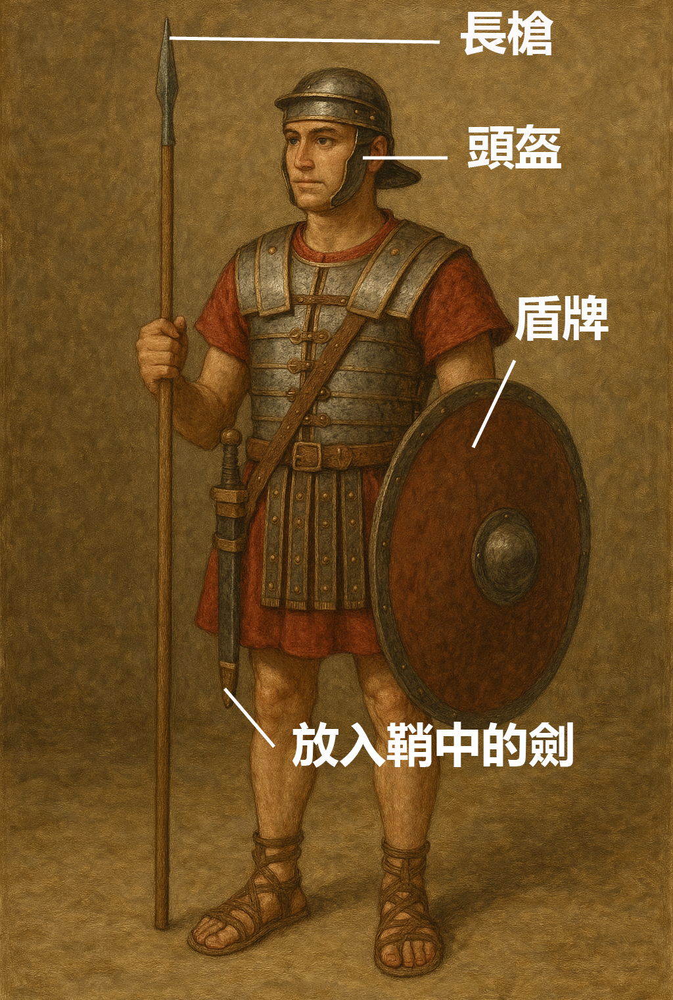

# Human-made Things in the Bible

## License Information

Human-made Things in the Bible © United Bible Societies, 2025. Adapted from: <cite>The Works of Their Hands: Man-made Things in the Bible</cite>, by Ray Pritz © 2009 United Bible Societies. This work is licensed under Creative Commons Attribution-ShareAlike 4.0 International (<a href="https://creativecommons.org/licenses/by-sa/4.0/">https://creativecommons.org/licenses/by-sa/4.0/</a>).

--------------------------------

## 標題：鞘（sheath, scabbard） (id: REALIA:2.3.1)

2\.3\.1 標題：鞘（sheath, scabbard）
==============================

經文出處
----

Hebrew 來： נָדָן (音譯： nadan)

[1CH 21:27](https://ref.ly/1Chr21:27)

Hebrew 來： תַּעַר (音譯： ta‘ar)

[1SA 17:51](https://ref.ly/1Sam17:51), [2SA 20:8](https://ref.ly/2Sam20:8), [JER 47:6](https://ref.ly/Jer47:6), [EZK 21:8](https://ref.ly/Ezek21:8), [EZK 21:9](https://ref.ly/Ezek21:9), [EZK 21:10](https://ref.ly/Ezek21:10), [EZK 21:35](https://ref.ly/Ezek21:35)

Greek 希： θήκη (音譯： thēkē)

[JHN 18:11](https://ref.ly/John18:11)

描述
--

*武裝的士兵 (Image generated by ChatGPT using OpenAI technology)*

鞘是一個護套或袋子，與劍的大小和形狀相近，用來包裹和攜帶劍。鞘通常用皮革製成，但也有用布、金屬，甚至木材製成的。鞘一般會繫在一根皮帶上，然後把皮帶背在肩上或繫在腰間。在舊約較晚時期，只用一根腰帶無法攜帶沉重的鐵劍，因此劍鞘會同時固定在腰帶和肩帶上。

---

用途
--

鞘包裹著劍的鋒刃，除了用來保護鋒刃外，也保護攜劍的人和周圍的人不被意外刺傷。

---

翻譯
--

在有些語言中，「鞘」可以翻譯成「裝劍的皮袋」、「劍的護套」，或「把劍放在裡面以便攜帶的東西」。

* **Associated Passages:** 歷代志上 21:27; 撒母耳記上 17:51; 撒母耳記下 20:8; 耶利米書 47:6; 以西結書 21:8; 以西結書 21:9; 以西結書 21:10; 以西結書 21:35; 約翰福音 18:11

* **Associated ACAI Concepts:** Sheath (ID: `realia:Sheath`)
