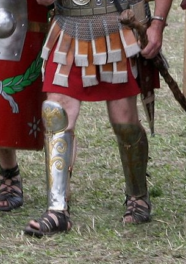

# Human-made Things in the Bible

## License Information

Human-made Things in the Bible © United Bible Societies, 2025. Adapted from: <cite>The Works of Their Hands: Man-made Things in the Bible</cite>, by Ray Pritz © 2009 United Bible Societies. This work is licensed under Creative Commons Attribution-ShareAlike 4.0 International (<a href="https://creativecommons.org/licenses/by-sa/4.0/">https://creativecommons.org/licenses/by-sa/4.0/</a>).

--------------------------------

## 標題：腿甲、護腿（leg armor, leg protectors） (id: REALIA:2.11)

2\.11 標題：腿甲、護腿（leg armor, leg protectors）
=========================================

經文出處
----

Hebrew 來： מִצְחָה (音譯： mitschah)

[1SA 17:6](https://ref.ly/1Sam17:6)

描述和用途
-----

*羅馬盔甲 \- 護腿 (© MatthiasKabel, CC BY\-SA 3\.0, via Wikimedia Commons)*

護腿是保護小腿的盔甲，用皮革或金屬製成，遮蓋小腿的正面，用皮繩在小腿的後面繫牢。歌利亞穿的護腿是青銅做的。

---

翻譯
--

今天，很多社會對護腿的認識僅限於和體育運動有關，例如足球。翻譯者要小心選擇譯詞，避免讀者以為這種護具和娛樂有關（NASB (New American Standard Bible) 在[1SA 17:6](https://ref.ly/1Sam17:6) 的旁註中用了“shin guards”「（運動員戴的）護脛」，就有可能產生這種誤解）。為了避免這種情況發生，並且因為英文“greaves”是一個古英文單詞，現在已鮮為人知，所以現代英文譯本都採用描述性的短語；例如，在[1SA 17:6](https://ref.ly/1Sam17:6) 的開頭，GNT (Good News Translation (1992)) 英文直譯為，「他的雙腿有青銅甲保護」；CEV (Contemporary English Version) 類似。

* **Associated Passages:** 撒母耳記上 17:6

