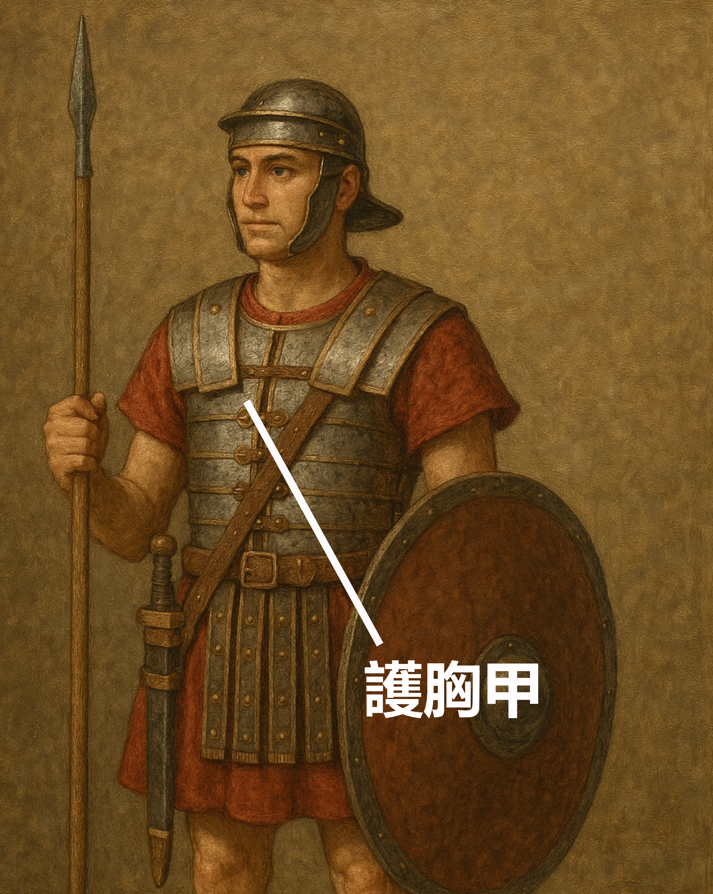

# Human-made Things in the Bible

## License Information

Human-made Things in the Bible © United Bible Societies, 2025. Adapted from: <cite>The Works of Their Hands: Man-made Things in the Bible</cite>, by Ray Pritz © 2009 United Bible Societies. This work is licensed under Creative Commons Attribution-ShareAlike 4.0 International (<a href="https://creativecommons.org/licenses/by-sa/4.0/">https://creativecommons.org/licenses/by-sa/4.0/</a>).

--------------------------------

## 標題：護胸甲（breastplate, chest protector） (id: REALIA:2.12)

2\.12 標題：護胸甲（breastplate, chest protector）
==========================================

經文出處
----

Hebrew 來： שִׁרְיוֹן (音譯： shiryan)

[1KI 22:34](https://ref.ly/1Kgs22:34), [2CH 18:33](https://ref.ly/2Chr18:33), [ISA 59:17](https://ref.ly/Isa59:17)

Greek 希： θώραξ (音譯： thorax)

[EPH 6:14](https://ref.ly/Eph6:14), [1TH 5:8](https://ref.ly/1Thess5:8), [REV 9:9](https://ref.ly/Rev9:9), [REV 9:9](https://ref.ly/Rev9:9), [REV 9:17](https://ref.ly/Rev9:17), [WIS 5:18](https://ref.ly/Wis5:18), [SIR 43:20](https://ref.ly/Sir43:20), [1MA 3:3](https://ref.ly/1Macc3:3), [1MA 6:2](https://ref.ly/1Macc6:2), [1MA 6:43](https://ref.ly/1Macc6:43)

描述和用途
-----

*護胸甲 (Image generated by ChatGPT using OpenAI technology)*

護胸甲是一件遮護胸部的盔甲（有時也遮護背部），保護胸（背）部不受近戰兵器和弓箭所傷。護胸甲一般是用金屬或用金屬加固的厚皮革製成，遮蓋頸部和腰部之間的胸部，用繫帶繞過背部來固定。

---

翻譯
--

在[EPH 6:14](https://ref.ly/Eph6:14) 和[1TH 5:8](https://ref.ly/1Thess5:8) 中，護胸甲是一個比喻，為要指出一些基督徒美德具有保護的能力（比較[WIS 5:18](https://ref.ly/Wis5:18) ）。因此，這種比喻可以譯作：「我們必須用信和愛保護自己，就像穿上盔甲一樣」（SPCL (Spanish Common Language Version (Dios Habla Hoy)) 直譯；[1TH 5:8](https://ref.ly/1Thess5:8) b），或「生活正直如你胸膛上的保護」（NCV (New Century Version) 直譯；[EPH 6:14](https://ref.ly/Eph6:14) c）。

在[REV 9:9](https://ref.ly/Rev9:9) ，護胸甲是給馬戴的。有時，人們會給戰馬戴上護胸甲來保護牠們免受敵人刀槍的傷害。這節經文的前半節可譯為：「牠們有鱗像鐵製的胸甲」（RSV (Revised Standard Version (1952)) 英文直譯），或「牠們穿著甲胄，好像鐵製的胸甲」（NJB (New Jerusalem Bible (1985)) ），或「牠們的身體被一種鐵甲覆蓋」（SPCL (Spanish Common Language Version (Dios Habla Hoy)) ），或「牠們的身體覆蓋著東西，像是保護人胸部的金屬片」。

* **Associated Passages:** 列王紀上 22:34; 歷代志下 18:33; 以賽亞書 59:17; 以弗所書 6:14; 帖撒羅尼迦前書 5:8; 啟示錄 9:9; 啟示錄 9:17; 智慧篇 5:18; 德訓篇 43:20; 瑪加伯上 3:3; 瑪加伯上 6:2; 瑪加伯上 6:43

* **Associated ACAI Concepts:** Breastplate (ID: `realia:Breastplate`)
