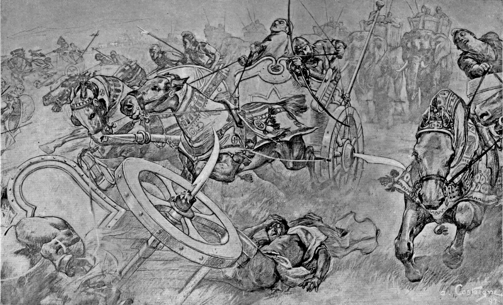

# Human-made Things in the Bible

## License Information

Human-made Things in the Bible © United Bible Societies, 2025. Adapted from: <cite>The Works of Their Hands: Man-made Things in the Bible</cite>, by Ray Pritz © 2009 United Bible Societies. This work is licensed under Creative Commons Attribution-ShareAlike 4.0 International (<a href="https://creativecommons.org/licenses/by-sa/4.0/">https://creativecommons.org/licenses/by-sa/4.0/</a>).

--------------------------------

## 標題：車輪彎刀（戰車武器）（scythe [chariot weapon]） (id: REALIA:2.15.1)

2\.15\.1 標題：車輪彎刀（戰車武器）（scythe \[chariot weapon]）
================================================

經文出處
----

Greek 希： δρεπανηφόρος (音譯： drepanēforos)

[2MA 13:2](https://ref.ly/2Macc13:2)

描述和用途
-----

*鐮刀戰車的輪軸裝上刀片 (André Castaigne (Public domain), Public domain, via Wikimedia Commons)*

車輪彎刀是一個鋒利的弧形刀片，固定在戰車的兩側，可以防止敵兵從戰車的側面進行攻擊。另外，彎刀也可以作為進攻性武器，當戰車迅速駛過敵陣時，刀刃會割斷敵兵的腿。

---

翻譯
--

很少文化知道這種固定在戰車輪子上的武器，因此僅僅採用字面翻譯，例如把[2MA 13:2](https://ref.ly/2Macc13:2) 的最後部分譯作「裝備彎刀的戰車」（NRSV (New Revised Standard Version (1989)) 直譯），很可能不能使讀者充分了解這種武器。GNT (Good News Translation (1992)) 將其擴充，英文直譯為：「在車輪上固定著銳利刀刃的戰車」。

* **Associated Passages:** 瑪加伯下 13:2

