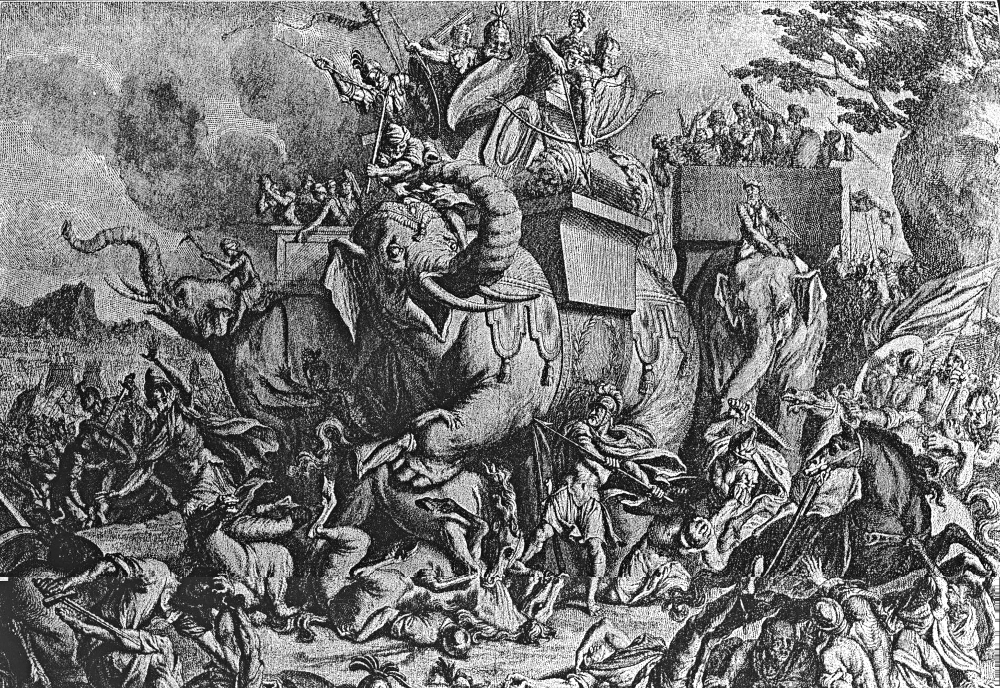

# Human-made Things in the Bible

## License Information

Human-made Things in the Bible © United Bible Societies, 2025. Adapted from: <cite>The Works of Their Hands: Man-made Things in the Bible</cite>, by Ray Pritz © 2009 United Bible Societies. This work is licensed under Creative Commons Attribution-ShareAlike 4.0 International (<a href="https://creativecommons.org/licenses/by-sa/4.0/">https://creativecommons.org/licenses/by-sa/4.0/</a>).

--------------------------------

## 標題：大象背上的木塔（wooden tower on elephant） (id: REALIA:2.16)

2\.16 標題：大象背上的木塔（wooden tower on elephant）
==========================================

經文出處
----

Greek 希： πύργος, ξύλινος (音譯： purgos xulinos)

[1MA 6:37](https://ref.ly/1Macc6:37)

描述和用途
-----

*作戰大象 (Bernard Picart, Public domain, via Wikimedia Commons)*

在古代戰爭中，大象有時會用來作戰，作用就像現代戰爭中的坦克。大象龐大的身軀會讓敵方士兵膽戰心驚，而且對任何單個士兵來說都是無法抵擋的。有時，大象的背上會放置一個木塔或木箱，就像是一個火力制高點。這個沉重的裝置用繩索（這節經文中稱為*mēchanē* ）綁在象背上，繩索從背部向下繞過象的腹部，可能還會繞過象的脖子，甚至繞過象尾下面。NJB (New Jerusalem Bible (1985)) 把這些繩索譯為“girths”（「肚帶」）。

---

翻譯
--

在[1MA 6:37](https://ref.ly/1Macc6:37) ，每個平臺上士兵的實際數目存疑。希臘文本作「三十」或「三十二」，然而這個數目即使對於一頭巨象來說也仍然太多。拉爾夫（Rahlfs）把文本修改為「四」（RSV (Revised Standard Version (1952)) 同），而GNT (Good News Translation (1992)) 、NJB (New Jerusalem Bible (1985)) 和TOB (Traduction Oecuménique de la Bible (French, 1975)) 作「三」，挪威文聖經（NOB ）作「二」。根據查爾斯（Charles）的意見，一頭象背上正常有三或四名士兵，翻譯者可以從這兩個數字中選擇一個，另外可以加上一個腳註。

* **Associated Passages:** 瑪加伯上 6:37

