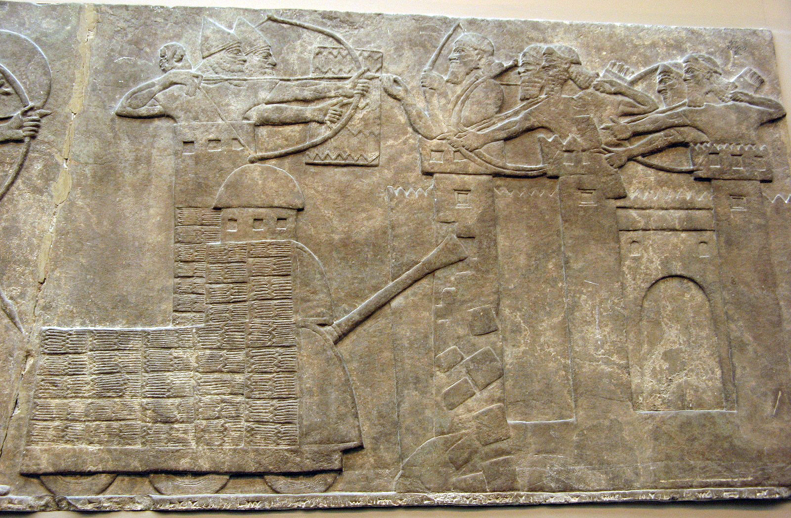

# Human-made Things in the Bible

## License Information

Human-made Things in the Bible © United Bible Societies, 2025. Adapted from: <cite>The Works of Their Hands: Man-made Things in the Bible</cite>, by Ray Pritz © 2009 United Bible Societies. This work is licensed under Creative Commons Attribution-ShareAlike 4.0 International (<a href="https://creativecommons.org/licenses/by-sa/4.0/">https://creativecommons.org/licenses/by-sa/4.0/</a>).

--------------------------------

## 標題：射擊臺、攻城塔（firing platform, siege tower） (id: REALIA:2.19.3)

2\.19\.3 標題：射擊臺、攻城塔（firing platform, siege tower）
=================================================

經文出處
----

Hebrew 來： בַּחוּן (音譯： bachun)

[ISA 23:13](https://ref.ly/Isa23:13)

Hebrew 來： מֻצָּב (音譯： mutsav)

[ISA 29:3](https://ref.ly/Isa29:3)

Hebrew 來： מְצוּרָה (音譯： mtsurah)

[ISA 29:3](https://ref.ly/Isa29:3)

Greek 希： βελόστασις (音譯： belostasis)

[1MA 6:20](https://ref.ly/1Macc6:20), [1MA 6:51](https://ref.ly/1Macc6:51)

描述
--

*摧毀堅固城牆的攻城塔和撞城槌，亞述浮雕 (Capillon, Public domain, via Wikimedia Commons)*

攻城塔是一座很高的木製構築物，攻城軍隊可以從上面向城射箭，投擲石頭和其他武器。攻城塔有時會配備輪子，從而可以推到比較靠近城牆的地方。靠近攻城塔的頂部有一個平臺，士兵站在上面向城牆上的守軍射箭或投擲投槍等物，為己方部隊在城牆下方挖地道或用撞城槌攻城提供掩護。

---

翻譯
--

希伯來文*matsor* 及其派生詞*mtsurah* 既指圍城的行動，又指攻城所用的器械（參[2\.19\.1 攻城營壘 (siege wall)\<REALIA:2\.19\.1\>](#) ）。在其他經文中，這個詞可指一種塔（參[3\.13\.3\.3 瞭望塔、塔樓、塔 (watchtower, tower)\<REALIA:3\.13\.3\.3\>](#) ）。[ISA 29:3](https://ref.ly/Isa29:3) 原文直譯是：「我必築塔來攻擊你。」「塔」在這個上下文中是指攻城塔。這行詩句可以譯為：「我必建造戰鬥塔，從塔上攻擊你。」有些翻譯者會喜歡採用比較一般性的譯法；例如，「我必……從四面八方進行攻擊」（CEV (Contemporary English Version) 直譯），或「我必包圍你…….用多種器械攻擊你」（NCV (New Century Version) 直譯）。

在[ISA 23:13](https://ref.ly/Isa23:13) ，希伯來文*bachun* 一詞是對*bchin* 的校訂。幾乎所有譯本都認為這是某種類型的塔，大部分譯作「攻城塔」（“siege towers”；RSV (Revised Standard Version (1952)) 、GNT (Good News Translation (1992)) 、GECL (German Common Language Version (Gute Nachricht Bibel)) ），有譯為「瞭望塔」（“watchtowers”；NJPSV (New Jewish Publication Society Version) ），還有譯本沒有給出具體類型，只稱其為「塔」（“towers”；NAB (New American Bible (1970)) 、ITCL (Italian Common Language Version) 、《武加大譯本》）。

在[1MA 6:20](https://ref.ly/1Macc6:20) ，希臘文*belostasis* 被翻譯為「攻城塔」（“siege towers”；RSV (Revised Standard Version (1952)) 、NRSV (New Revised Standard Version (1989)) ）、「攻城平臺」（“siege platforms”；GNT (Good News Translation (1992)) ）、「土堤」（ITCL (Italian Common Language Version) ）、「炮臺」（“batteries”；NJB (New Jerusalem Bible (1985)) ）、「弩車」（“ballista”；TOB (Traduction Oecuménique de la Bible (French, 1975)) ）和「投石機」（“catapults”；NAB (New American Bible (1970)) ）。利德爾和斯科特（Liddell \& Scott）把*belostasis* 一詞定義為「戰爭器械群」，因為這是一個比較一般性的術語。翻譯者如果想要表達這種意思，可以譯成「輔助轟擊城邑的器械」。

* **Associated Passages:** 以賽亞書 23:13; 以賽亞書 29:3; 瑪加伯上 6:20; 瑪加伯上 6:51

