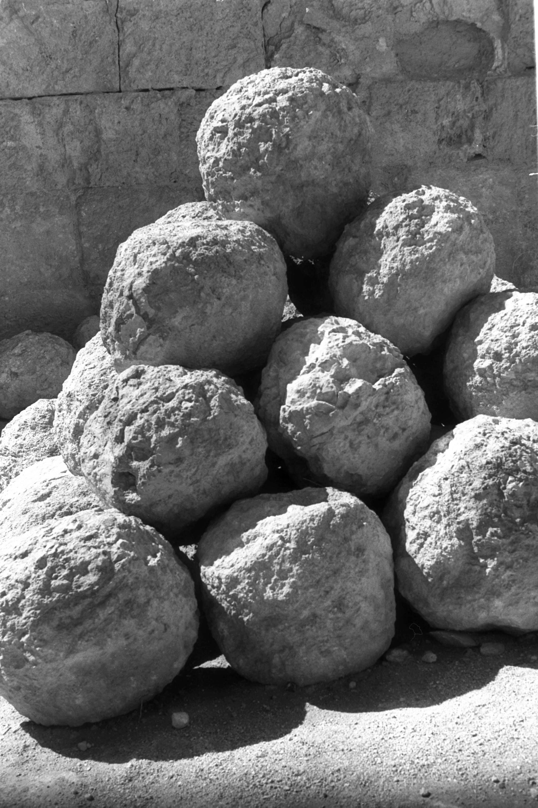

# Human-made Things in the Bible

## License Information

Human-made Things in the Bible © United Bible Societies, 2025. Adapted from: <cite>The Works of Their Hands: Man-made Things in the Bible</cite>, by Ray Pritz © 2009 United Bible Societies. This work is licensed under Creative Commons Attribution-ShareAlike 4.0 International (<a href="https://creativecommons.org/licenses/by-sa/4.0/">https://creativecommons.org/licenses/by-sa/4.0/</a>).

--------------------------------

## 標題：攻城器械（siege instruments） (id: REALIA:2.19)

2\.19 標題：攻城器械（siege instruments）
================================

*攻取設防城的戰術 (ChrisO, Public domain, via Wikimedia Commons)*

很多古代城邑都會環城建造高牆作為保護，因此攻城的軍隊要找出辦法越過城牆進入城內。有五種攻取設防城的方法，全都可以在聖經中找到：（1）從城牆頂部攻入；（2）穿過城牆攻入；（3）從城牆底下攻入；（4）運用策略或詭計進入（[JOS 8:0](https://ref.ly/Josh8:0) ）；（5）圍城。對於從城牆頂部攻入，通常的做法是架起雲梯攀越城牆（[JOL 2:7](https://ref.ly/Joel2:7); [JOL 2:8](https://ref.ly/Joel2:8); [JOL 2:9](https://ref.ly/Joel2:9) ）。穿過城牆攻進，方法可能是用大錘、斧子或其他工具砍砸城牆，或用投石機將城牆擊倒，又或者是打破或燒毀城門（[JER 51:58](https://ref.ly/Jer51:58) ），但最常用的戰術是使用撞城槌（[EZK 21:22](https://ref.ly/Ezek21:22) ［《和》21:27］）。進攻城牆的一方經常會建造攻城塔作為輔助，攻城塔使進攻者與城牆上的防守者處於同一水平，從而更容易用箭和投槍攻擊守軍。從城牆底下攻入通常需要在城牆下方挖掘一條隧道，這個過程要花費相當長的時間。不過，進攻方有時也會利用已有的隧道，例如連接城邑與水源的水道（[2SA 5:8](https://ref.ly/2Sam5:8) ）。

守城方也同樣足智多謀，使用各種方法化解進攻方的戰術。他們推翻雲梯，在第一道城牆快要倒塌時建造第二道城牆，向靠近城牆的攻城軍兵投擲大石塊甚至燒著的東西。進攻方為了保護在城牆附近挖掘、建造或進攻的軍兵，會製作一種大盾牌來保護軍兵不受上方的攻擊。先知那鴻提到了這種防具：「進攻者衝向城牆，架起盾牌保護撞城槌」；（GNT (Good News Translation (1992)) 直譯；[NAM 2:6](https://ref.ly/Nah2:6) b［《和》2:5b］）。

當進攻方沒有上述任何一種攻城工具，或者因為地形原因而無法進攻時，他們可以乾脆封鎖城邑的所有出入口，然後耐心等待，這種做法稱作圍城。圍城的目標是等待城中的人糧水斷絕，最終只得投降（[2KI 25:0](https://ref.ly/2Kgs25:0) ）。

* **Associated Passages:** 約書亞記 8:0; 約珥書 2:7; 約珥書 2:8; 約珥書 2:9; 耶利米書 51:58; 以西結書 21:22; 撒母耳記下 5:8; 那鴻書 2:6; 列王紀下 25:0

## 標題：攻城營壘（siege wall） (id: REALIA:2.19.1)

2\.19\.1 標題：攻城營壘（siege wall）
============================

經文出處
----

Hebrew 來： דָּיֵק (音譯： dayeq)

[2KI 25:1](https://ref.ly/2Kgs25:1), [JER 52:4](https://ref.ly/Jer52:4), [EZK 4:2](https://ref.ly/Ezek4:2), [EZK 17:17](https://ref.ly/Ezek17:17), [EZK 21:27](https://ref.ly/Ezek21:27), [EZK 26:8](https://ref.ly/Ezek26:8)

Hebrew 來： מָצוֹד (音譯： matsod)

[ECC 9:14](https://ref.ly/Eccl9:14)

Hebrew 來： מָצוֹר (音譯： matsor)

[DEU 20:20](https://ref.ly/Deut20:20), [EZK 4:2](https://ref.ly/Ezek4:2), [MIC 4:14](https://ref.ly/Mic4:14)

Hebrew 來： סלל (音譯： salal（動詞）)

[JOB 19:12](https://ref.ly/Job19:12)

Greek 希： χάραξ (音譯： charax)

[LUK 19:43](https://ref.ly/Luke19:43), [4MA 3:12](https://ref.ly/4Macc3:12)

描述
--

攻城營壘是用木杆或木樁構築的一道柵欄，用來加固塹壕。有時，這種營壘會用泥土或石頭加固或建造。

---

用途
--

攻擊部隊在試圖攻佔有城牆的設防城時，有時會用另一道牆包圍該城，以阻止城中的居民逃離或對圍攻方發起攻擊。這樣的一道牆也能阻止城中的人出去求援或把食物和水運進城內。一段時間過後，守軍就會被迫投降（參[DEU 20:20](https://ref.ly/Deut20:20) ）。

---

翻譯
--

上列部分經文中的希伯來文詞語可以譯成「厚牆」或「堅固的柵欄」。

* **Associated Passages:** 列王紀下 25:1; 耶利米書 52:4; 以西結書 4:2; 以西結書 17:17; 以西結書 21:27; 以西結書 26:8; 傳道書 9:14; 申命記 20:20; 彌迦書 4:14; 約伯記 19:12; 路加福音 19:43; 瑪加伯四書 3:12

* **Associated ACAI Concepts:** Siege-Works (ID: `realia:Siege-works`)

## 標題：攻城坡道、攻城土壘（siege ramp, siege mound） (id: REALIA:2.19.2)

2\.19\.2 標題：攻城坡道、攻城土壘（siege ramp, siege mound）
==============================================

經文出處
----

Hebrew 來： סֹלְלָה (音譯： sollah)

[2SA 20:15](https://ref.ly/2Sam20:15), [2KI 19:32](https://ref.ly/2Kgs19:32), [ISA 37:33](https://ref.ly/Isa37:33), [JER 6:6](https://ref.ly/Jer6:6), [JER 32:24](https://ref.ly/Jer32:24), [JER 33:4](https://ref.ly/Jer33:4), [EZK 4:2](https://ref.ly/Ezek4:2), [EZK 17:17](https://ref.ly/Ezek17:17), [EZK 21:27](https://ref.ly/Ezek21:27), [EZK 26:8](https://ref.ly/Ezek26:8), [DAN 11:15](https://ref.ly/Dan11:15)

描述和用途
-----

*馬撒大（Masada）的攻城坡道 (© Andrew Shiva / Wikipedia, via Wikimedia Commons)*

攻城坡道是一條道路，通向被攻擊城邑的城牆。設防城經常建造在高地上，難以靠近，並且撞城槌（參[2\.19\.7 撞城槌 (battering ram)\<REALIA:2\.19\.7\>](#) ）非常沉重，移動困難。在這種情況下，攻擊者可以建築一條斜坡或道路，以便把撞城槌和其他攻城器械運送上去。

---

翻譯
--

根據上下文，翻譯者並不總是能夠確定希伯來文*sollah* 是指攻城營壘還是攻城斜坡。大多數譯本選擇「攻城土丘」之類的表達，但是大部分讀者不能明白這究竟是什麼。在[EZK 4:2](https://ref.ly/Ezek4:2) ，GNT (Good News Translation (1992)) 譯為“earthworks”（「土木工事」），這是比較現代的詞彙，但不能表明構築物的功能。NIV (New International Version (1984)) 比較清楚一些，英文意為「一道直達城邑的斜坡」。

* **Associated Passages:** 撒母耳記下 20:15; 列王紀下 19:32; 以賽亞書 37:33; 耶利米書 6:6; 耶利米書 32:24; 耶利米書 33:4; 以西結書 4:2; 以西結書 17:17; 以西結書 21:27; 以西結書 26:8; 但以理書 11:15

* **Associated ACAI Concepts:** Siege Ramp (ID: `realia:SiegeRamp`)

## 標題：射擊臺、攻城塔（firing platform, siege tower） (id: REALIA:2.19.3)

2\.19\.3 標題：射擊臺、攻城塔（firing platform, siege tower）
=================================================

經文出處
----

Hebrew 來： בַּחוּן (音譯： bachun)

[ISA 23:13](https://ref.ly/Isa23:13)

Hebrew 來： מֻצָּב (音譯： mutsav)

[ISA 29:3](https://ref.ly/Isa29:3)

Hebrew 來： מְצוּרָה (音譯： mtsurah)

[ISA 29:3](https://ref.ly/Isa29:3)

Greek 希： βελόστασις (音譯： belostasis)

[1MA 6:20](https://ref.ly/1Macc6:20), [1MA 6:51](https://ref.ly/1Macc6:51)

描述
--

*摧毀堅固城牆的攻城塔和撞城槌，亞述浮雕 (Capillon, Public domain, via Wikimedia Commons)*

攻城塔是一座很高的木製構築物，攻城軍隊可以從上面向城射箭，投擲石頭和其他武器。攻城塔有時會配備輪子，從而可以推到比較靠近城牆的地方。靠近攻城塔的頂部有一個平臺，士兵站在上面向城牆上的守軍射箭或投擲投槍等物，為己方部隊在城牆下方挖地道或用撞城槌攻城提供掩護。

---

翻譯
--

希伯來文*matsor* 及其派生詞*mtsurah* 既指圍城的行動，又指攻城所用的器械（參[2\.19\.1 攻城營壘 (siege wall)\<REALIA:2\.19\.1\>](#) ）。在其他經文中，這個詞可指一種塔（參[3\.13\.3\.3 瞭望塔、塔樓、塔 (watchtower, tower)\<REALIA:3\.13\.3\.3\>](#) ）。[ISA 29:3](https://ref.ly/Isa29:3) 原文直譯是：「我必築塔來攻擊你。」「塔」在這個上下文中是指攻城塔。這行詩句可以譯為：「我必建造戰鬥塔，從塔上攻擊你。」有些翻譯者會喜歡採用比較一般性的譯法；例如，「我必……從四面八方進行攻擊」（CEV (Contemporary English Version) 直譯），或「我必包圍你…….用多種器械攻擊你」（NCV (New Century Version) 直譯）。

在[ISA 23:13](https://ref.ly/Isa23:13) ，希伯來文*bachun* 一詞是對*bchin* 的校訂。幾乎所有譯本都認為這是某種類型的塔，大部分譯作「攻城塔」（“siege towers”；RSV (Revised Standard Version (1952)) 、GNT (Good News Translation (1992)) 、GECL (German Common Language Version (Gute Nachricht Bibel)) ），有譯為「瞭望塔」（“watchtowers”；NJPSV (New Jewish Publication Society Version) ），還有譯本沒有給出具體類型，只稱其為「塔」（“towers”；NAB (New American Bible (1970)) 、ITCL (Italian Common Language Version) 、《武加大譯本》）。

在[1MA 6:20](https://ref.ly/1Macc6:20) ，希臘文*belostasis* 被翻譯為「攻城塔」（“siege towers”；RSV (Revised Standard Version (1952)) 、NRSV (New Revised Standard Version (1989)) ）、「攻城平臺」（“siege platforms”；GNT (Good News Translation (1992)) ）、「土堤」（ITCL (Italian Common Language Version) ）、「炮臺」（“batteries”；NJB (New Jerusalem Bible (1985)) ）、「弩車」（“ballista”；TOB (Traduction Oecuménique de la Bible (French, 1975)) ）和「投石機」（“catapults”；NAB (New American Bible (1970)) ）。利德爾和斯科特（Liddell \& Scott）把*belostasis* 一詞定義為「戰爭器械群」，因為這是一個比較一般性的術語。翻譯者如果想要表達這種意思，可以譯成「輔助轟擊城邑的器械」。

* **Associated Passages:** 以賽亞書 23:13; 以賽亞書 29:3; 瑪加伯上 6:20; 瑪加伯上 6:51

* **Associated ACAI Concepts:** Siege Tower (ID: `realia:SiegeTower`)

## 標題：梯子、雲梯（ladder） (id: REALIA:2.19.4)

2\.19\.4 標題：梯子、雲梯（ladder）
=========================

經文出處
----

Greek 希： κλῖμαξ (音譯： klimax)

[1MA 5:30](https://ref.ly/1Macc5:30)

描述和用途
-----

*古代木梯的複製品，梯級用繩索固定 (© Ray Pritz by United Bible Societies)*

雲梯是一種攻城器械，使進攻部隊可以翻越城牆或防禦工事。雲梯是用木頭做的，將兩根長杆平行放置，中間用繩索綁住一系列的橫檔。士兵（或敵方俘虜）將雲梯搬運到城牆下方，搭在城牆上，攻城的士兵就緣梯而上，進入城內。

---

翻譯
--

在翻譯時，可能需要說明[1MA 5:30](https://ref.ly/1Macc5:30) 中的「梯子」是相當「長」或相當「高」的。經文說明了使用梯子的目的，「……搬運梯子和戰爭器械去攻佔堡壘，並攻擊裡面的猶太人」（RSV (Revised Standard Version (1952)) 直譯）。有些翻譯者可能覺得有必要略微擴展譯文，以說明梯子的用法，比如「用來攀登城牆的雲梯」。另參[3\.13\.3 堡壘、城市防禦工事 (city fortifications)\<REALIA:3\.13\.3\>](#) 中的討論。

* **Associated Passages:** 瑪加伯上 5:30

## 標題：擲火器（fire thrower） (id: REALIA:2.19.5)

2\.19\.5 標題：擲火器（fire thrower）
=============================

經文出處
----

Greek 希： πυροβόλον (音譯： purobolon)

[1MA 6:51](https://ref.ly/1Macc6:51)

描述和用途
-----

擲火器是一種投擲裝置，把正在燃燒的東西（或許是點著的箭）拋射到城邑裡面。它可能就是一個改裝的投石機（參[2\.19\.6 投石機、弩車 (catapult, ballista)\<REALIA:2\.19\.6\>](#) ），或者也許是一種大型的弩。

---

翻譯
--

在[1MA 6:51](https://ref.ly/1Macc6:51) ，原文字面意為「擲火器」一語可以擴展譯為「投擲火的弩車」（GNT (Good News Translation (1992)) ）。

* **Associated Passages:** 瑪加伯上 6:51

## 標題：投石機、弩車（catapult, ballista） (id: REALIA:2.19.6)

2\.19\.6 標題：投石機、弩車（catapult, ballista）
======================================

經文出處
----

Hebrew 來： חִשָּׁבוֹן (音譯： chishvon)

[2CH 26:15](https://ref.ly/2Chr26:15)

Greek 希： λιθοβόλον (音譯： lithobolon)

[1MA 6:51](https://ref.ly/1Macc6:51)

Greek 希： πετροβόλος (音譯： petrobolos)

[WIS 5:22](https://ref.ly/Wis5:22)

Greek 希： σκορπίδιον (音譯： skorpidion)

[1MA 6:51](https://ref.ly/1Macc6:51)

描述和用途
-----

*用投石機彈射的石塊（猶大曠野中的希律堡壘） (© Moshe Milner, Israel Government Press Office)*

投石機是一種用木頭和繩子（或皮繩）製成的攻城器械，在底座上面連著一根很長的木臂。臂的末端是一個敞口的碗狀容器，用來放置投射物，通常是很重的石頭。使用者把木臂通過機械方式扳得彎下來，就像是繃緊的弓。突然放開之後，木臂快速彈回原位，同時將石頭投向敵城。根據投石器的尺寸不同，石頭的大小會有很大差別。

---

翻譯
--

*投石機的現代仿製版 (© ChrisO, CC BY\-SA 3\.0, via Wikimedia Commons)*

[2CH 26:15](https://ref.ly/2Chr26:15) 似乎是描述一種投石機「用來射箭和投擲大石頭」（NIV (New International Version (1984)) 直譯），大部分譯本都採用這種翻譯方式。不過，這似乎不符合當時的時代。沃克斯（De Vaux）和亞丁（Yadin）提出，希伯來文*chishvon* 在這個上下文中是指投擲物或框架（可能是用石頭製成的，但更有可能是用盾覆蓋的木製框架，在敵人快要進攻時搭建起來的），當城牆上的防守者朝著下面的入侵者射箭投石的時候，會利用這種框架來保護自己。NJB (New Jerusalem Bible (1985)) 在翻譯[2CH 26:15](https://ref.ly/2Chr26:15) a時反映出這種解釋，英文意為，「他為耶路撒冷的城牆塔樓和拐角建造巧妙的防禦設施，從那裡射箭和投擲大石」；同時提供了以下腳註：「從石頭構築物中突出來的防禦性屏障，這不是投石機的平臺，因投石機當時尚未出現。」

[1MA 6:51](https://ref.ly/1Macc6:51) 的希臘文本用了三個詞語來表示投擲武器的器械（參[2\.19\.5 擲火器 (fire thrower)\<REALIA:2\.19\.5\>](#) ），有些翻譯者可能想用一個比較一般性的短語來合稱這三個詞，例如「投擲火彈、投槍和大石頭的武器（或機械）」。GNT (Good News Translation (1992)) 提供了一個很好的翻譯範例，英文意為：「用來投擲火彈和石頭的投石機，以及投擲投槍和大石頭的其他武器。」

* **Associated Passages:** 歷代志下 26:15; 瑪加伯上 6:51; 智慧篇 5:22

## 標題：撞城槌（battering ram） (id: REALIA:2.19.7)

2\.19\.7 標題：撞城槌（battering ram）
==============================

經文出處
----

Hebrew 來： חֶרֶב (音譯： cherev)

[EZK 26:9](https://ref.ly/Ezek26:9)

Hebrew 來： כַּר (音譯： kar)

[EZK 4:2](https://ref.ly/Ezek4:2), [EZK 21:27](https://ref.ly/Ezek21:27), [EZK 21:27](https://ref.ly/Ezek21:27)

Hebrew 來： קְבֹל (音譯： qvol)

[EZK 26:9](https://ref.ly/Ezek26:9)

Greek 希： ἑλεόπολις (音譯： heleopolis)

[1MA 13:43](https://ref.ly/1Macc13:43), [1MA 13:44](https://ref.ly/1Macc13:44)

Greek 希： κριός (音譯： krios)

[2MA 12:15](https://ref.ly/2Macc12:15)

描述和用途
-----

*亞述人用大型有輪撞城槌攻擊敵方城牆，雙方弓箭手互相發箭（尼姆魯德（Nimrud），約公元前865–860年；大英博物館） (Chris0, British Museum, Public domain, via Wikimedia Commons)*

撞城槌是一根原木或者其他長而重的木頭，一端用金屬包裹，士兵用它來對著城牆或城門猛力撞擊。有些撞城槌帶有一個尖頭，為要在城牆上撞出一個洞；其他撞城槌的末端是鈍頭。進攻者通過反覆撞擊城牆，使得城牆逐漸削弱並最終倒塌，或者在牆上撞開一個缺口。在槌頭穿透城牆之後，士兵會將撞城槌來回撬動，直到那部分的城牆倒塌。撞城槌可以由士兵抓住擺動，有時也用繩索吊在一個可以移動的木塔上。

---

翻譯
--

如果目標語言沒有表示「撞城槌」的詞語，翻譯者可以採用一個描述性的短語。[EZK 26:9](https://ref.ly/Ezek26:9) 可譯為「他必帶著粗重的原木來撞穿你的城牆」（NCV (New Century Version) 直譯），或「他必派遣軍兵用大樑木撞倒你的牆」（CEV (Contemporary English Version) 直譯）。不過，如果譯作「他們會使用重型武器猛擊你的城牆」（ITCL (Italian Common Language Version) 直譯），可能會讓現代讀者產生誤解。

[EZK 26:9](https://ref.ly/Ezek26:9) 中出現希伯來文*cherev* ，這個詞通常表示「劍」，然而根據這裡的上下文，這種解釋不太可能。在[EXO 20:25](https://ref.ly/Exod20:25) ，同一個詞語表示「鑿子」（“chisel”；GNT (Good News Translation (1992)) ）之類的東西。在[EZK 26:9](https://ref.ly/Ezek26:9) 這節經文中，該詞似乎是指一件沉重的鐵製工具，可以用來破壞石頭牆。沃克斯提出，這是一種帶尖頭的撞城槌，或者是挖地道工兵使用的一種鎬頭。各個譯本有不同的譯法，例如「斧」（“axes”；RSV (Revised Standard Version (1952)) 、REB (Revised English Bible (1989)) ）、「鐵棒」（“iron rods”；GNT (Good News Translation (1992)) 、NCV (New Century Version) ）、「鐵條」（“iron bars”；GNT (Good News Translation (1992)) 、NCV (New Century Version) ），以及「武器」（“weapons”；NIV (New International Version (1984)) ）。

* **Associated Passages:** 以西結書 26:9; 以西結書 4:2; 以西結書 21:27; 瑪加伯上 13:43; 瑪加伯上 13:44; 瑪加伯下 12:15; 出埃及記 20:25

* **Associated ACAI Concepts:** Battering-Ram (ID: `realia:Battering-ram`)

## 標題：移動防彈盾（mantelet） (id: REALIA:2.19.8)

2\.19\.8 標題：移動防彈盾（mantelet）
===========================

經文出處
----

Hebrew 來： סֹכֵךְ (音譯： sokek)

[NAM 2:6](https://ref.ly/Nah2:6)

描述和用途
-----

*士兵用盾牌組成保護隊形 (© Ziko, CC BY\-SA 3\.0, via Wikimedia Commons)*

操作撞城槌的士兵暴露在防守方從城牆上面實施的攻擊之下。為了保護他們，進攻方會在他們的頭上佈置一塊大型防護盾（稱為移動防彈盾）。有些時候，移動防彈盾是撞城槌結構整體的一個組成部分；還有一些時候，其他士兵各自手持盾牌，在撞城士兵的頭上重疊佈成一道移動防彈盾（參[2\.10\.1 大盾 (large shield)\<REALIA:2\.10\.1\>](#) ）。

---

翻譯
--

很多語言沒有表達這種古代戰術的詞語。然而，即使在有這個詞語的語言（例如英文）中，不熟悉這種戰術的普通讀者仍然不太理解這個詞的含義。因此，翻譯者最好使用一個描述性的短語；例如，[NAM 2:6](https://ref.ly/Nah2:6) b（《和》2:5b）可譯作，「他們急忙立起一個遮蓋物來保護自己，擋住從城牆上拋下來的石頭」（CEV (Contemporary English Version) 直譯），或「敵人對城牆展開攻擊，所有人在盾牌下方緊緊地擠在一起」（ITCL (Italian Common Language Version) 直譯），或「敵人已經為突擊隊建立起防護屏障」（GECL (German Common Language Version (Gute Nachricht Bibel)) 直譯）；然而，讀者可能會誤以為「防護屏障」是某種兵營。在可能的情況下，建議加上腳註來解釋這個詞語。

* **Associated Passages:** 那鴻書 2:6

