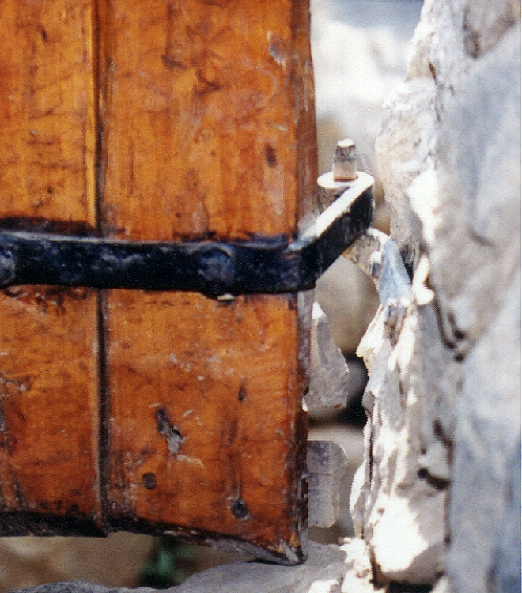
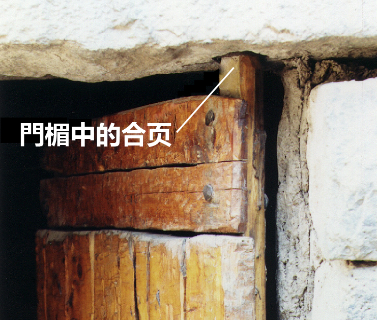

# Human-made Things in the Bible

## License Information

Human-made Things in the Bible © United Bible Societies, 2025. Adapted from: <cite>The Works of Their Hands: Man-made Things in the Bible</cite>, by Ray Pritz © 2009 United Bible Societies. This work is licensed under Creative Commons Attribution-ShareAlike 4.0 International (<a href="https://creativecommons.org/licenses/by-sa/4.0/">https://creativecommons.org/licenses/by-sa/4.0/</a>).

--------------------------------

## 標題：合頁（hinge） (id: REALIA:3.1.2.3)

3\.1\.2\.3 標題：合頁（hinge）
=======================

經文出處
----

Hebrew 來： גָּלִיל (音譯： galil)

[1KI 6:34](https://ref.ly/1Kgs6:34), [1KI 6:34](https://ref.ly/1Kgs6:34)

Hebrew 來： פֹּת (音譯： poth)

[1KI 7:50](https://ref.ly/1Kgs7:50)

Hebrew 來： צִיר (音譯： tsir)

[PRO 26:14](https://ref.ly/Prov26:14)

描述和用途
-----

*房門或閘門上的金屬鉸鏈 (© Ray Pritz by United Bible Societies)*

合頁是連接兩個物件，使其可以自由地相對轉動的裝置。就門這個物件來說，合頁是指門扇在頂部（門楣）和底部（門檻）進行固定的點，或者與門柱（如果有的話）固定的點，這樣門扇就可以轉動打開或關上。對於簡單的住宅，門的合頁通常只是木門一側的上下兩端的突出部分，插在石頭門楣或門檻的凹坑中。比較大的門的合頁是用金屬做的。金屬合頁由三部分組成：兩個頁片，一片固定在門上，另一片固定在牆上或門柱上，兩個頁片由一根金屬插銷固定在一起。

翻譯
--

*木合頁 (© Ray Pritz by United Bible Societies)*

希伯來文*galil* 在[1KI 6:34](https://ref.ly/1Kgs6:34) 中的意思不確定。這個詞與意為「旋轉」的希伯來文動詞有關。REB (Revised English Bible (1989)) 將這個詞語解作“swivel\-pin”（「鉸接銷」），即合頁的一種。許多譯本在翻譯這節令人費解的經文時，並不在譯文中指明*galil* 所表示的物件具體是什麼，例如把整節經文譯為「有兩扇松木折疊門」（GNT (Good News Translation (1992)) 直譯）。

* **Associated Passages:** 列王紀上 6:34; 列王紀上 7:50; 箴言 26:14

