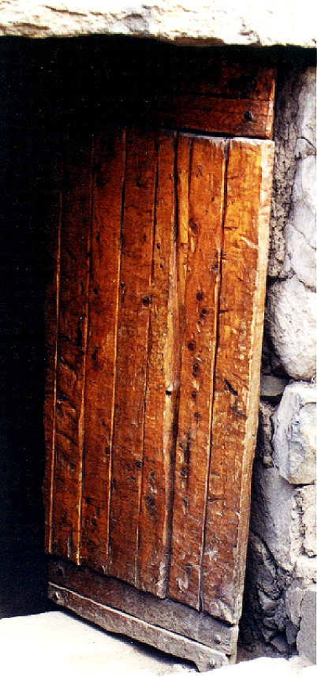

# Human-made Things in the Bible

## License Information

Human-made Things in the Bible © United Bible Societies, 2025. Adapted from: <cite>The Works of Their Hands: Man-made Things in the Bible</cite>, by Ray Pritz © 2009 United Bible Societies. This work is licensed under Creative Commons Attribution-ShareAlike 4.0 International (<a href="https://creativecommons.org/licenses/by-sa/4.0/">https://creativecommons.org/licenses/by-sa/4.0/</a>).

--------------------------------

## 標題：門、門口（door, doorway） (id: REALIA:3.1.2)

3\.1\.2 標題：門、門口（door, doorway）
==============================

經文出處
----

Hebrew 來： דַּל, דֶּלֶת (音譯： dal, dalah, deleth)

[GEN 19:6](https://ref.ly/Gen19:6), [GEN 19:9](https://ref.ly/Gen19:9), [GEN 19:10](https://ref.ly/Gen19:10), [EXO 21:6](https://ref.ly/Exod21:6)

Hebrew 來： סַף (音譯： saf)

[2KI 12:10](https://ref.ly/2Kgs12:10), [2KI 22:4](https://ref.ly/2Kgs22:4), [2KI 23:4](https://ref.ly/2Kgs23:4), [2KI 25:18](https://ref.ly/2Kgs25:18), [1CH 9:19](https://ref.ly/1Chr9:19), [1CH 9:22](https://ref.ly/1Chr9:22), [2CH 23:4](https://ref.ly/2Chr23:4), [2CH 34:9](https://ref.ly/2Chr34:9), [EST 2:21](https://ref.ly/Esth2:21), [EST 6:2](https://ref.ly/Esth6:2), [ISA 6:4](https://ref.ly/Isa6:4), [JER 35:4](https://ref.ly/Jer35:4), [JER 52:24](https://ref.ly/Jer52:24), [EZK 41:16](https://ref.ly/Ezek41:16), [EZK 41:16](https://ref.ly/Ezek41:16)

Hebrew 來： ספף (音譯： safaf（動詞）)

[PSA 84:11](https://ref.ly/Ps84:11)

Hebrew 來： פֶּתַח (音譯： pethach)

[GEN 4:7](https://ref.ly/Gen4:7), [GEN 6:16](https://ref.ly/Gen6:16), [GEN 18:1](https://ref.ly/Gen18:1), [GEN 18:2](https://ref.ly/Gen18:2), [GEN 18:10](https://ref.ly/Gen18:10), [GEN 19:6](https://ref.ly/Gen19:6), [GEN 19:11](https://ref.ly/Gen19:11), [GEN 19:11](https://ref.ly/Gen19:11), [GEN 43:19](https://ref.ly/Gen43:19), [EXO 12:22](https://ref.ly/Exod12:22), [EXO 12:23](https://ref.ly/Exod12:23), [EXO 26:36](https://ref.ly/Exod26:36), [EXO 29:4](https://ref.ly/Exod29:4), [EXO 29:11](https://ref.ly/Exod29:11), [EXO 29:32](https://ref.ly/Exod29:32), [EXO 29:42](https://ref.ly/Exod29:42), [EXO 33:8](https://ref.ly/Exod33:8), [EXO 33:9](https://ref.ly/Exod33:9), [EXO 33:10](https://ref.ly/Exod33:10), [EXO 33:10](https://ref.ly/Exod33:10), [EXO 35:15](https://ref.ly/Exod35:15), [EXO 35:15](https://ref.ly/Exod35:15), [EXO 36:37](https://ref.ly/Exod36:37), [EXO 38:8](https://ref.ly/Exod38:8), [EXO 38:30](https://ref.ly/Exod38:30), [EXO 39:38](https://ref.ly/Exod39:38), [EXO 40:5](https://ref.ly/Exod40:5), [EXO 40:6](https://ref.ly/Exod40:6), [EXO 40:12](https://ref.ly/Exod40:12), [EXO 40:28](https://ref.ly/Exod40:28), [EXO 40:29](https://ref.ly/Exod40:29), [LEV 1:3](https://ref.ly/Lev1:3), [LEV 1:5](https://ref.ly/Lev1:5), [LEV 3:2](https://ref.ly/Lev3:2), [LEV 4:4](https://ref.ly/Lev4:4), [LEV 4:7](https://ref.ly/Lev4:7), [LEV 4:18](https://ref.ly/Lev4:18), [LEV 8:3](https://ref.ly/Lev8:3), [LEV 8:4](https://ref.ly/Lev8:4), [LEV 8:31](https://ref.ly/Lev8:31), [LEV 8:33](https://ref.ly/Lev8:33), [LEV 8:35](https://ref.ly/Lev8:35), [LEV 10:7](https://ref.ly/Lev10:7), [LEV 12:6](https://ref.ly/Lev12:6), [LEV 14:11](https://ref.ly/Lev14:11), [LEV 14:23](https://ref.ly/Lev14:23), [LEV 14:38](https://ref.ly/Lev14:38), [LEV 15:14](https://ref.ly/Lev15:14), [LEV 15:29](https://ref.ly/Lev15:29), [LEV 16:7](https://ref.ly/Lev16:7), [LEV 17:4](https://ref.ly/Lev17:4), [LEV 17:5](https://ref.ly/Lev17:5), [LEV 17:6](https://ref.ly/Lev17:6), [LEV 17:9](https://ref.ly/Lev17:9), [LEV 19:21](https://ref.ly/Lev19:21), [NUM 3:25](https://ref.ly/Num3:25), [NUM 3:26](https://ref.ly/Num3:26), [NUM 4:25](https://ref.ly/Num4:25), [NUM 6:10](https://ref.ly/Num6:10), [NUM 6:13](https://ref.ly/Num6:13), [NUM 6:18](https://ref.ly/Num6:18), [NUM 10:3](https://ref.ly/Num10:3), [NUM 11:10](https://ref.ly/Num11:10), [NUM 12:5](https://ref.ly/Num12:5), [NUM 16:18](https://ref.ly/Num16:18), [NUM 16:19](https://ref.ly/Num16:19), [NUM 16:27](https://ref.ly/Num16:27), [NUM 17:15](https://ref.ly/Num17:15), [NUM 20:6](https://ref.ly/Num20:6), [NUM 25:6](https://ref.ly/Num25:6), [NUM 27:2](https://ref.ly/Num27:2), [DEU 22:21](https://ref.ly/Deut22:21), [DEU 31:15](https://ref.ly/Deut31:15), [JOS 19:51](https://ref.ly/Josh19:51), [JDG 4:20](https://ref.ly/Judg4:20), [JDG 9:52](https://ref.ly/Judg9:52), [JDG 19:26](https://ref.ly/Judg19:26), [JDG 19:27](https://ref.ly/Judg19:27), [1SA 2:22](https://ref.ly/1Sam2:22), [2SA 11:9](https://ref.ly/2Sam11:9), [1KI 6:8](https://ref.ly/1Kgs6:8), [1KI 6:31](https://ref.ly/1Kgs6:31), [1KI 6:33](https://ref.ly/1Kgs6:33), [1KI 7:5](https://ref.ly/1Kgs7:5), [1KI 14:6](https://ref.ly/1Kgs14:6), [1KI 14:27](https://ref.ly/1Kgs14:27), [1KI 19:13](https://ref.ly/1Kgs19:13), [2KI 4:15](https://ref.ly/2Kgs4:15), [2KI 5:9](https://ref.ly/2Kgs5:9), [1CH 9:21](https://ref.ly/1Chr9:21), [2CH 4:22](https://ref.ly/2Chr4:22), [2CH 12:10](https://ref.ly/2Chr12:10), [NEH 3:20](https://ref.ly/Neh3:20), [NEH 3:21](https://ref.ly/Neh3:21), [EST 5:1](https://ref.ly/Esth5:1), [JOB 31:9](https://ref.ly/Job31:9), [JOB 31:34](https://ref.ly/Job31:34), [PSA 24:7](https://ref.ly/Ps24:7), [PSA 24:9](https://ref.ly/Ps24:9), [PRO 5:8](https://ref.ly/Prov5:8), [PRO 8:3](https://ref.ly/Prov8:3), [PRO 8:34](https://ref.ly/Prov8:34), [PRO 9:14](https://ref.ly/Prov9:14), [PRO 17:19](https://ref.ly/Prov17:19), [SNG 7:14](https://ref.ly/Song7:14), [JER 43:9](https://ref.ly/Jer43:9), [EZK 8:7](https://ref.ly/Ezek8:7), [EZK 8:8](https://ref.ly/Ezek8:8), [EZK 8:16](https://ref.ly/Ezek8:16), [EZK 33:30](https://ref.ly/Ezek33:30), [EZK 40:38](https://ref.ly/Ezek40:38), [EZK 41:2](https://ref.ly/Ezek41:2), [EZK 41:2](https://ref.ly/Ezek41:2), [EZK 41:3](https://ref.ly/Ezek41:3), [EZK 41:3](https://ref.ly/Ezek41:3), [EZK 41:3](https://ref.ly/Ezek41:3), [EZK 41:11](https://ref.ly/Ezek41:11), [EZK 41:11](https://ref.ly/Ezek41:11), [EZK 41:11](https://ref.ly/Ezek41:11), [EZK 41:17](https://ref.ly/Ezek41:17), [EZK 41:20](https://ref.ly/Ezek41:20), [EZK 42:2](https://ref.ly/Ezek42:2), [EZK 42:4](https://ref.ly/Ezek42:4), [EZK 42:11](https://ref.ly/Ezek42:11), [EZK 42:12](https://ref.ly/Ezek42:12), [EZK 42:12](https://ref.ly/Ezek42:12), [EZK 47:1](https://ref.ly/Ezek47:1), [HOS 2:17](https://ref.ly/Hos2:17)

Aramaic 蘭：תְּרַע (音譯： tra‘)

[DAN 3:26](https://ref.ly/Dan3:26)

Greek 希： θύρα (音譯： thura)

[MAT 6:6](https://ref.ly/Matt6:6), [MAT 24:33](https://ref.ly/Matt24:33), [MAT 25:10](https://ref.ly/Matt25:10), [MRK 1:33](https://ref.ly/Mark1:33), [MRK 2:2](https://ref.ly/Mark2:2), [MRK 11:4](https://ref.ly/Mark11:4), [MRK 13:29](https://ref.ly/Mark13:29), [LUK 11:7](https://ref.ly/Luke11:7), [LUK 13:24](https://ref.ly/Luke13:24), [LUK 13:25](https://ref.ly/Luke13:25), [LUK 13:25](https://ref.ly/Luke13:25), [JHN 10:1](https://ref.ly/John10:1), [JHN 10:2](https://ref.ly/John10:2), [JHN 10:7](https://ref.ly/John10:7), [JHN 10:9](https://ref.ly/John10:9), [JHN 18:16](https://ref.ly/John18:16), [JHN 20:19](https://ref.ly/John20:19), [JHN 20:26](https://ref.ly/John20:26), [ACT 5:9](https://ref.ly/Acts5:9), [ACT 5:19](https://ref.ly/Acts5:19), [ACT 5:23](https://ref.ly/Acts5:23), [ACT 12:6](https://ref.ly/Acts12:6), [ACT 12:13](https://ref.ly/Acts12:13), [ACT 14:27](https://ref.ly/Acts14:27), [ACT 16:26](https://ref.ly/Acts16:26), [ACT 16:27](https://ref.ly/Acts16:27), [ACT 21:30](https://ref.ly/Acts21:30), [1CO 16:9](https://ref.ly/1Cor16:9), [2CO 2:12](https://ref.ly/2Cor2:12), [COL 4:3](https://ref.ly/Col4:3), [JAS 5:9](https://ref.ly/Jas5:9), [REV 3:8](https://ref.ly/Rev3:8), [REV 3:20](https://ref.ly/Rev3:20), [REV 3:20](https://ref.ly/Rev3:20), [REV 4:1](https://ref.ly/Rev4:1)

Greek 希： θύρωμα (音譯： thurōma)

[SIR 14:23](https://ref.ly/Sir14:23), [LJE 1:17](https://ref.ly/EpJer1:17), [2MA 14:43](https://ref.ly/2Macc14:43)

Greek 希： θυρωρός (音譯： thurōros)

[MRK 13:34](https://ref.ly/Mark13:34), [JHN 18:16](https://ref.ly/John18:16), [JHN 18:17](https://ref.ly/John18:17)

Greek 希： θυρόω (音譯： thuroō（動詞）)

[1MA 4:57](https://ref.ly/1Macc4:57)

描述和用途
-----

*房屋的木質外門 (© Ray Pritz by United Bible Societies)*

門是進入建築物或構築物的入口，或掩蓋入口的板。門通常是木製的。門的一邊固定在一根木槓上，木槓長度略微超出門的頂部和底部，將木槓兩端突出的部分削尖或削成圓形，然後插在石頭門楣和門檻上的凹坑或洞裡，這樣就可以開門或關門了。有時，門扇也會懸掛在皮革或金屬做的合頁上。

---

翻譯
--

在有些經文中，「門」的意思只是「開口」或「門口」，不是指真正的門（參[JOB 3:10](https://ref.ly/Job3:10) ，[JOB 41:6](https://ref.ly/Job41:6) （《和》41:14）；[PSA 78:23](https://ref.ly/Ps78:23) ）。希伯來文*pethach* 一詞尤其是這種用法。

「門」偶爾也用來比喻「被關在外面」；例如，CEV (Contemporary English Version) 在[JOB 38:8](https://ref.ly/Job38:8) 中譯作“boundaries”（「界限」），那裡上帝說要限制海的範圍。同樣地，詩篇作者在[PSA 141:3](https://ref.ly/Ps141:3) 中祈求主「把守我嘴唇的門」（RSV (Revised Standard Version (1952)) 直譯）。在有些語言中，翻譯這一行詩句時最好不要使用比喻；例如，譯作「請幫助我留意我所說的話」（NCV (New Century Version) 直譯）；整節經文可以合宜地譯為，「每當我說話時，請幫助我警戒我的言語」（CEV (Contemporary English Version) 直譯）。

*門 (Image generated by ChatGPT using OpenAI technology)*

[1KI 6:34](https://ref.ly/1Kgs6:34) 似乎有個文本上的問題，這節經文的希伯來文本提到，聖殿中有兩個由兩塊「帷幕」構成的門。學者進行了一個很小的修訂，把「帷幕」改成了「門扇」，這是大多數譯本首選的讀文。然而，即使在這樣修訂之後，文本的意思依然不清楚。許多譯本解決這個難題的方法如下：「有兩扇松木做的折疊門」（GNT (Good News Translation (1992)) 直譯）。也有譯法比較貼近字面意思，作「他還做了兩道松木門，每道都有兩扇，插在凹坑裡面轉動」（NIV (New International Version (1984)) 直譯）。

亞蘭文*tra‘* 在[DAN 3:26](https://ref.ly/Dan3:26) 的意思是「大門」或「門」。有些譯本譯為「門」（“door”；RSV (Revised Standard Version (1952)) 、GNT (Good News Translation (1992)) 、NASB (New American Standard Bible) ），有些譯本譯為「開口」（“opening”；NIV (New International Version (1984)) 、NCV (New Century Version) ）。這個開口有可能位於烈火窰的頂部，但更可能是在烈火窰的側面，作為某種「門口」。

在[JHN 10:7](https://ref.ly/John10:7); [JHN 10:9](https://ref.ly/John10:9) 中，希臘文*thura* 用來喻指耶穌是獲得救恩的途徑。這兩節經文的重點在於「門」是通道，而不在於它是封閉入口的物件。按照原文字面譯成「我是羊的門」（如RSV (Revised Standard Version (1952)) ）常常會導致誤解，因為這個表述指的可能是門板，而不是門口或入口，從而暗示耶穌基督的主要職能是阻止通過，而不是提供進入的通道。翻譯者應該使用類似下文的表達：「我是羊進入羊圈的門／入口。」

* **Associated Passages:** 創世記 19:6; 創世記 19:9; 創世記 19:10; 出埃及記 21:6; 列王紀下 12:10; 列王紀下 22:4; 列王紀下 23:4; 列王紀下 25:18; 歷代志上 9:19; 歷代志上 9:22; 歷代志下 23:4; 歷代志下 34:9; 以斯帖記 2:21; 以斯帖記 6:2; 以賽亞書 6:4; 耶利米書 35:4; 耶利米書 52:24; 以西結書 41:16; 詩篇 84:11; 創世記 4:7; 創世記 6:16; 創世記 18:1; 創世記 18:2; 創世記 18:10; 創世記 19:11; 創世記 43:19; 出埃及記 12:22; 出埃及記 12:23; 出埃及記 26:36; 出埃及記 29:4; 出埃及記 29:11; 出埃及記 29:32; 出埃及記 29:42; 出埃及記 33:8; 出埃及記 33:9; 出埃及記 33:10; 出埃及記 35:15; 出埃及記 36:37; 出埃及記 38:8; 出埃及記 38:30; 出埃及記 39:38; 出埃及記 40:5; 出埃及記 40:6; 出埃及記 40:12; 出埃及記 40:28; 出埃及記 40:29; 利未記 1:3; 利未記 1:5; 利未記 3:2; 利未記 4:4; 利未記 4:7; 利未記 4:18; 利未記 8:3; 利未記 8:4; 利未記 8:31; 利未記 8:33; 利未記 8:35; 利未記 10:7; 利未記 12:6; 利未記 14:11; 利未記 14:23; 利未記 14:38; 利未記 15:14; 利未記 15:29; 利未記 16:7; 利未記 17:4; 利未記 17:5; 利未記 17:6; 利未記 17:9; 利未記 19:21; 民數記 3:25; 民數記 3:26; 民數記 4:25; 民數記 6:10; 民數記 6:13; 民數記 6:18; 民數記 10:3; 民數記 11:10; 民數記 12:5; 民數記 16:18; 民數記 16:19; 民數記 16:27; 民數記 17:15; 民數記 20:6; 民數記 25:6; 民數記 27:2; 申命記 22:21; 申命記 31:15; 約書亞記 19:51; 士師記 4:20; 士師記 9:52; 士師記 19:26; 士師記 19:27; 撒母耳記上 2:22; 撒母耳記下 11:9; 列王紀上 6:8; 列王紀上 6:31; 列王紀上 6:33; 列王紀上 7:5; 列王紀上 14:6; 列王紀上 14:27; 列王紀上 19:13; 列王紀下 4:15; 列王紀下 5:9; 歷代志上 9:21; 歷代志下 4:22; 歷代志下 12:10; 尼希米記 3:20; 尼希米記 3:21; 以斯帖記 5:1; 約伯記 31:9; 約伯記 31:34; 詩篇 24:7; 詩篇 24:9; 箴言 5:8; 箴言 8:3; 箴言 8:34; 箴言 9:14; 箴言 17:19; 雅歌 7:14; 耶利米書 43:9; 以西結書 8:7; 以西結書 8:8; 以西結書 8:16; 以西結書 33:30; 以西結書 40:38; 以西結書 41:2; 以西結書 41:3; 以西結書 41:11; 以西結書 41:17; 以西結書 41:20; 以西結書 42:2; 以西結書 42:4; 以西結書 42:11; 以西結書 42:12; 以西結書 47:1; 何西阿書 2:17; 但以理書 3:26; 馬太福音 6:6; 馬太福音 24:33; 馬太福音 25:10; 馬可福音 1:33; 馬可福音 2:2; 馬可福音 11:4; 馬可福音 13:29; 路加福音 11:7; 路加福音 13:24; 路加福音 13:25; 約翰福音 10:1; 約翰福音 10:2; 約翰福音 10:7; 約翰福音 10:9; 約翰福音 18:16; 約翰福音 20:19; 約翰福音 20:26; 使徒行傳 5:9; 使徒行傳 5:19; 使徒行傳 5:23; 使徒行傳 12:6; 使徒行傳 12:13; 使徒行傳 14:27; 使徒行傳 16:26; 使徒行傳 16:27; 使徒行傳 21:30; 哥林多前書 16:9; 哥林多後書 2:12; 歌羅西書 4:3; 雅各書 5:9; 啟示錄 3:8; 啟示錄 3:20; 啟示錄 4:1; 德訓篇 14:23; 耶利米書信 1:17; 瑪加伯下 14:43; 馬可福音 13:34; 約翰福音 18:17; 瑪加伯上 4:57; 約伯記 3:10; 約伯記 41:6; 詩篇 78:23; 約伯記 38:8; 詩篇 141:3; 列王紀上 6:34

## 標題：鎖（lock） (id: REALIA:3.1.2.1)

3\.1\.2\.1 標題：鎖（lock）
=====================

經文出處
----

Hebrew 來： כַּף, מַנְעוּל (音譯： kaf man‘ul)

[SNG 5:5](https://ref.ly/Song5:5)

Hebrew 來： נעל (音譯： na‘al)

[JDG 3:23](https://ref.ly/Judg3:23), [JDG 3:24](https://ref.ly/Judg3:24), [2SA 13:17](https://ref.ly/2Sam13:17), [2SA 13:18](https://ref.ly/2Sam13:18)

Hebrew 來： סגר (音譯： sagar)

[JDG 9:51](https://ref.ly/Judg9:51)

Greek 希： κλεῖθρον (音譯： kleithron)

[LJE 1:17](https://ref.ly/EpJer1:17)

Greek 希： κλείω (音譯： kleiō)

[MAT 25:10](https://ref.ly/Matt25:10), [LUK 11:7](https://ref.ly/Luke11:7), [JHN 20:19](https://ref.ly/John20:19), [JHN 20:26](https://ref.ly/John20:26), [ACT 5:23](https://ref.ly/Acts5:23), [ACT 21:30](https://ref.ly/Acts21:30), [SIR 42:6](https://ref.ly/Sir42:6), [BEL 1:14](https://ref.ly/Bel1:14)

描述和用途
-----

鎖是一種用來固定門的裝置，只有使用一把特殊的鑰匙才能將鎖打開（參[3\.1\.2\.2 鑰匙 (key)\<REALIA:3\.1\.2\.2\>](#) ）。

---

翻譯
--

在[SNG 5:5](https://ref.ly/Song5:5) 中，希伯來文短語*kaf man‘ul* 可能是指一個木製突起物或一根繩子，用來拉開門閂，使門打開。可以譯為「門的把手」（“handle of the door”；GNT (Good News Translation (1992)) ），或「門閂的把手」（“handles of the bolt”；RSV (Revised Standard Version (1952)) 、NASB (New American Standard Bible) ），或「鎖的把手」（“handles of the lock”；KJV (King James Version (1611)) ），也可以簡單地譯為「門」（“door”；CEV (Contemporary English Version) ）。

*門和門閂 (Image generated by ChatGPT using OpenAI technology)*

[LJE 1:18](https://ref.ly/EpJer1:18) 使用了這個不常見的希臘文，可以指鎖（如RSV (Revised Standard Version (1952)) ），也可以指橫著擋住門的閂（如GNT (Good News Translation (1992)) ）。

* **Associated Passages:** 雅歌 5:5; 士師記 3:23; 士師記 3:24; 撒母耳記下 13:17; 撒母耳記下 13:18; 士師記 9:51; 耶利米書信 1:17; 馬太福音 25:10; 路加福音 11:7; 約翰福音 20:19; 約翰福音 20:26; 使徒行傳 5:23; 使徒行傳 21:30; 德訓篇 42:6; 彼勒與大龍 1:14; 耶利米書信 1:18

## 標題：鑰匙（key） (id: REALIA:3.1.2.2)

3\.1\.2\.2 標題：鑰匙（key）
=====================

經文出處
----

Hebrew 來： מַפְתֵּחַ (音譯： mafteach)

[JDG 3:25](https://ref.ly/Judg3:25), [ISA 22:22](https://ref.ly/Isa22:22)

Greek 希： κλείς (音譯： kleis)

[MAT 16:19](https://ref.ly/Matt16:19), [LUK 11:52](https://ref.ly/Luke11:52), [REV 1:18](https://ref.ly/Rev1:18), [REV 3:7](https://ref.ly/Rev3:7), [REV 9:1](https://ref.ly/Rev9:1), [REV 20:1](https://ref.ly/Rev20:1)

描述和用途
-----

*羅馬時代鑰匙 (© Hermann Junghans, CC BY\-SA 3\.0, via Wikimedia Commons)*

鑰匙是用來鎖門和開門的工具。古代的鑰匙通常比現在的鑰匙要大很多。

---

翻譯
--

*古羅馬鑰匙（魯芬霍芬考古公園（Archaeological park Ruffenhofen）: 利姆塞姆（Limeseum）） (© Wolfgang Sauber, CC BY\-SA 3\.0, via Wikimedia Commons)*

鑰匙並非所有人都熟知，因此，有些翻譯者可能需要使用描述性的短語，例如「控制門開關的物件」。有時可以從鑰匙的功能角度來翻譯，例如「開鎖器」或「打開鎖的工具」。

除了[JDG 3:25](https://ref.ly/Judg3:25) ，上面所有提到「鑰匙」的經文都是象徵性的。然而，我們查閱的所有譯本仍然全部使用了「鑰匙」這個詞。請注意，ITCL (Italian Common Language Version) 在[ISA 22:22](https://ref.ly/Isa22:22) 中擴展了譯文；原文文本的字面意思是「我必將大衛家的鑰匙放在他的肩上」（如RSV (Revised Standard Version (1952)) 的譯法），ITCL (Italian Common Language Version) 的意大利文本意思是：「大衛宮殿中的所有權柄都必賜給他，鑰匙必交給他掌管。」NLT (New Living Translation) 的譯法類似，英文意為：「我必把大衛家的鑰匙——王宮中最高的職位——賜給他。」

有些時候，可能無法採用「某個地方的鑰匙」這種表述，例如[REV 9:1](https://ref.ly/Rev9:1) 中的「深淵」（“the abyss”；GNT (Good News Translation (1992)) ），或[MAT 16:19](https://ref.ly/Matt16:19) 中的「天國」（“the kingdom of heaven”；RSV (Revised Standard Version (1952)) ）。在這些情況下，翻譯者可能需要說「……的入口的鑰匙」，或者「用來打開或關閉……的門的鑰匙」。

* **Associated Passages:** 士師記 3:25; 以賽亞書 22:22; 馬太福音 16:19; 路加福音 11:52; 啟示錄 1:18; 啟示錄 3:7; 啟示錄 9:1; 啟示錄 20:1

## 標題：合頁（hinge） (id: REALIA:3.1.2.3)

3\.1\.2\.3 標題：合頁（hinge）
=======================

經文出處
----

Hebrew 來： גָּלִיל (音譯： galil)

[1KI 6:34](https://ref.ly/1Kgs6:34), [1KI 6:34](https://ref.ly/1Kgs6:34)

Hebrew 來： פֹּת (音譯： poth)

[1KI 7:50](https://ref.ly/1Kgs7:50)

Hebrew 來： צִיר (音譯： tsir)

[PRO 26:14](https://ref.ly/Prov26:14)

描述和用途
-----

*房門或閘門上的金屬鉸鏈 (© Ray Pritz by United Bible Societies)*

合頁是連接兩個物件，使其可以自由地相對轉動的裝置。就門這個物件來說，合頁是指門扇在頂部（門楣）和底部（門檻）進行固定的點，或者與門柱（如果有的話）固定的點，這樣門扇就可以轉動打開或關上。對於簡單的住宅，門的合頁通常只是木門一側的上下兩端的突出部分，插在石頭門楣或門檻的凹坑中。比較大的門的合頁是用金屬做的。金屬合頁由三部分組成：兩個頁片，一片固定在門上，另一片固定在牆上或門柱上，兩個頁片由一根金屬插銷固定在一起。

翻譯
--

*木合頁 (© Ray Pritz by United Bible Societies)*

希伯來文*galil* 在[1KI 6:34](https://ref.ly/1Kgs6:34) 中的意思不確定。這個詞與意為「旋轉」的希伯來文動詞有關。REB (Revised English Bible (1989)) 將這個詞語解作“swivel\-pin”（「鉸接銷」），即合頁的一種。許多譯本在翻譯這節令人費解的經文時，並不在譯文中指明*galil* 所表示的物件具體是什麼，例如把整節經文譯為「有兩扇松木折疊門」（GNT (Good News Translation (1992)) 直譯）。

* **Associated Passages:** 列王紀上 6:34; 列王紀上 7:50; 箴言 26:14

## 標題：門柱（doorpost） (id: REALIA:3.1.2.4)

3\.1\.2\.4 標題：門柱（doorpost）
==========================

經文出處
----

Hebrew 來： אַמָּה (音譯： ’amah)

[ISA 6:4](https://ref.ly/Isa6:4)

Hebrew 來： אֹמְנָה (音譯： ’omnah)

[2KI 18:16](https://ref.ly/2Kgs18:16)

Hebrew 來： מְזוּזָה (音譯： mzuzah)

[EXO 12:7](https://ref.ly/Exod12:7), [EXO 12:22](https://ref.ly/Exod12:22), [EXO 12:23](https://ref.ly/Exod12:23), [EXO 21:6](https://ref.ly/Exod21:6), [DEU 6:9](https://ref.ly/Deut6:9), [DEU 11:20](https://ref.ly/Deut11:20), [JDG 16:3](https://ref.ly/Judg16:3), [1SA 1:9](https://ref.ly/1Sam1:9), [1KI 6:31](https://ref.ly/1Kgs6:31), [1KI 6:33](https://ref.ly/1Kgs6:33), [1KI 7:5](https://ref.ly/1Kgs7:5), [PRO 8:34](https://ref.ly/Prov8:34), [ISA 57:8](https://ref.ly/Isa57:8), [EZK 41:21](https://ref.ly/Ezek41:21), [EZK 43:8](https://ref.ly/Ezek43:8), [EZK 43:8](https://ref.ly/Ezek43:8), [EZK 45:19](https://ref.ly/Ezek45:19), [EZK 45:19](https://ref.ly/Ezek45:19), [EZK 46:2](https://ref.ly/Ezek46:2)

Hebrew 來： סַף (音譯： saf)

[2CH 3:7](https://ref.ly/2Chr3:7)

描述和用途
-----

*(Image generated by ChatGPT using OpenAI technology)*

房門和大門這類入口為長方形。門口的兩側有時會襯上木頭，這樣門的合頁就可以固定在木頭上。門柱就是門口兩側的這些柱子。門柱還可支撐門口上方的結構。

---

翻譯
--

如果目標語言沒有表示門框各個部分的專業詞語，翻譯者可以使用描述性短語，例如，[EXO 12:22](https://ref.ly/Exod12:22) 可譯為「門楣和兩根門柱」（RSV (Revised Standard Version (1952)) 直譯），或「門框的兩側和頂部」（NCV (New Century Version) 直譯）。

[2KI 18:16](https://ref.ly/2Kgs18:16) ：希伯來文*’omnah* 在整本聖經中只出現在這一處，意思不確定。其動詞詞根的意思是「攜帶、支撐」，既可以指一個大房間中的支柱，也可以指支撐門口的柱子。大多數譯本都採用第二種解釋，譯為「門柱」。

* **Associated Passages:** 以賽亞書 6:4; 列王紀下 18:16; 出埃及記 12:7; 出埃及記 12:22; 出埃及記 12:23; 出埃及記 21:6; 申命記 6:9; 申命記 11:20; 士師記 16:3; 撒母耳記上 1:9; 列王紀上 6:31; 列王紀上 6:33; 列王紀上 7:5; 箴言 8:34; 以賽亞書 57:8; 以西結書 41:21; 以西結書 43:8; 以西結書 45:19; 以西結書 46:2; 歷代志下 3:7

## 標題：門楣（lintel） (id: REALIA:3.1.2.5)

3\.1\.2\.5 標題：門楣（lintel）
========================

經文出處
----

Hebrew 來： מַשְׁקוֹף (音譯： mashqof)

[EXO 12:7](https://ref.ly/Exod12:7), [EXO 12:22](https://ref.ly/Exod12:22), [EXO 12:23](https://ref.ly/Exod12:23)

描述
--

門楣是門框的頂梁（參[3\.1\.2 門、門口 (door, doorway)\<REALIA:3\.1\.2\>](#) ）。參[3\.1\.2\.4 門柱 (doorpost)\<REALIA:3\.1\.2\.4\>](#) 中的插圖。

---

翻譯
--

參[3\.1\.2\.4 門柱 (doorpost)\<REALIA:3\.1\.2\.4\>](#) 中的討論。

* **Associated Passages:** 出埃及記 12:7; 出埃及記 12:22; 出埃及記 12:23

## 標題：門檻（threshold, doorsill） (id: REALIA:3.1.2.6)

3\.1\.2\.6 標題：門檻（threshold, doorsill）
=====================================

經文出處
----

Hebrew 來： סַף (音譯： saf)

[JDG 19:27](https://ref.ly/Judg19:27), [1KI 14:17](https://ref.ly/1Kgs14:17), [EZK 40:6](https://ref.ly/Ezek40:6), [EZK 40:6](https://ref.ly/Ezek40:6), [EZK 40:7](https://ref.ly/Ezek40:7), [EZK 41:16](https://ref.ly/Ezek41:16), [EZK 41:16](https://ref.ly/Ezek41:16), [EZK 43:8](https://ref.ly/Ezek43:8), [EZK 43:8](https://ref.ly/Ezek43:8), [ZEP 2:14](https://ref.ly/Zeph2:14)

Hebrew 來： מִפְתָּן (音譯： miftan)

[1SA 5:4](https://ref.ly/1Sam5:4), [1SA 5:5](https://ref.ly/1Sam5:5), [EZK 9:3](https://ref.ly/Ezek9:3), [EZK 10:4](https://ref.ly/Ezek10:4), [EZK 10:18](https://ref.ly/Ezek10:18), [EZK 46:2](https://ref.ly/Ezek46:2), [EZK 47:1](https://ref.ly/Ezek47:1), [ZEP 1:9](https://ref.ly/Zeph1:9)

Greek 希： χελώνις (音譯： chelōnis)

[JDT 14:15](https://ref.ly/Jdt14:15)

描述
--

*門檻 (© Dietmar Rabich, CC BY\-SA 4\.0, via Wikimedia Commons)*

門檻位於門框的底部（參[3\.1\.2 門、門口 (door, doorway)\<REALIA:3\.1\.2\>](#) ），水平放置在地面上，通常用石頭做成。

---

翻譯
--

如果沒有「門檻」的專用名稱，或者人們一般不理解這個詞，翻譯者可能需要使用一個描述性短語；例如，[EZK 9:3](https://ref.ly/Ezek9:3) 可譯為「門打開的地方」（NCV (New Century Version) 直譯）。

[ZEP 1:9](https://ref.ly/Zeph1:9) ：在這節經文中，原文字面意為「所有跳過（或譯：跳上）門檻的人」的短語有些含糊，並且在不同譯本中的譯法也很不同。該詞可能是指非利士人的宗教習俗，[1SA 5:4](https://ref.ly/1Sam5:4); [1SA 5:5](https://ref.ly/1Sam5:5) 敘述了這個習俗的起源。為了反映這一點，CEV (Contemporary English Version) 譯為“worshipers of pagan gods”（「敬拜異教神明的人」），並添加了一個腳註。NCV (New Century Version) 更加具體，譯為“those who worship Dagon”（「那些敬拜大袞的人」），但沒有添加腳註。FRCL (French Common Language Version (Bible en français courant)) 提供了另一種處理方法，將其擴展譯為：「所有像異教徒一樣跳過聖殿門檻的人。」FRCL (French Common Language Version (Bible en français courant)) 在腳註中包含了另一種譯法：「所有登上（神聖的）平臺的人。」另參《〈那鴻書〉、〈哈巴谷書〉和〈西番雅書〉手冊》（*A Handbook on The Books of Nahum, Habakkuk, and Zephaniah* ）第152—153頁的討論。

*門柱和門楣 (Image generated by ChatGPT using OpenAI technology)*

[JDT 14:15](https://ref.ly/Jdt14:15) 中的希臘文*chelōnis* 意思比較模糊。NJB (New Jerusalem Bible (1985)) 譯作“threshold”（「門檻」），這也是利德爾—斯科特（Liddell\&Scott）給出的定義。我們從[JDT 13:9](https://ref.ly/Jdt13:9) 中知道，友弟德把敖羅斐乃的屍體從床上翻下來，也就是說屍體是躺在地上的。因此，許多譯本在《次經‧猶滴傳》14:15（《思》《友弟德傳》）中把*chelōnis* 譯為「地板」（“floor”；ITCL (Italian Common Language Version) 、NAB (New American Bible (1970)) ），這種譯法似乎更可取。

* **Associated Passages:** 士師記 19:27; 列王紀上 14:17; 以西結書 40:6; 以西結書 40:7; 以西結書 41:16; 以西結書 43:8; 西番雅書 2:14; 撒母耳記上 5:4; 撒母耳記上 5:5; 以西結書 9:3; 以西結書 10:4; 以西結書 10:18; 以西結書 46:2; 以西結書 47:1; 西番雅書 1:9; 友弟德傳 14:15; 友弟德傳 13:9

