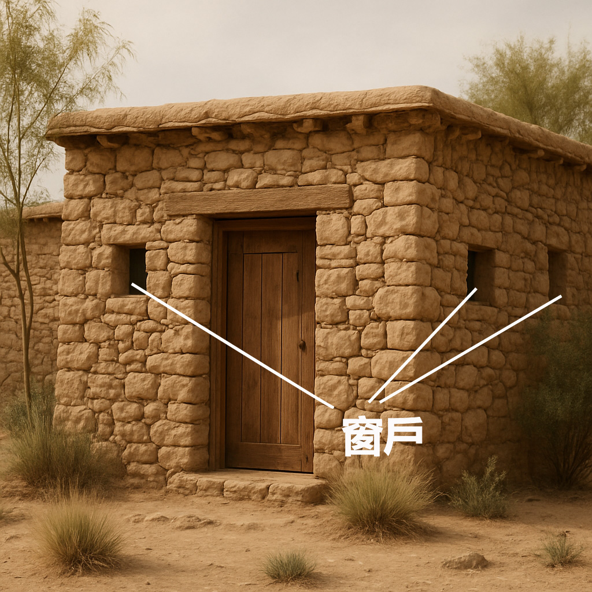

# Human-made Things in the Bible

## License Information

Human-made Things in the Bible © United Bible Societies, 2025. Adapted from: <cite>The Works of Their Hands: Man-made Things in the Bible</cite>, by Ray Pritz © 2009 United Bible Societies. This work is licensed under Creative Commons Attribution-ShareAlike 4.0 International (<a href="https://creativecommons.org/licenses/by-sa/4.0/">https://creativecommons.org/licenses/by-sa/4.0/</a>).

--------------------------------

## 標題：窗戶（window） (id: REALIA:3.1.4)

3\.1\.4 標題：窗戶（window）
=====================

經文出處
----

Hebrew 來： אֲרֻבָּה (音譯： ’arubah)

[GEN 7:11](https://ref.ly/Gen7:11), [GEN 8:2](https://ref.ly/Gen8:2), [2KI 7:2](https://ref.ly/2Kgs7:2), [2KI 7:19](https://ref.ly/2Kgs7:19), [ECC 12:3](https://ref.ly/Eccl12:3), [ISA 24:18](https://ref.ly/Isa24:18), [ISA 60:8](https://ref.ly/Isa60:8), [HOS 13:3](https://ref.ly/Hos13:3), [MAL 3:10](https://ref.ly/Mal3:10)

Hebrew 來： חַלּוֹן (音譯： chalon)

[GEN 8:6](https://ref.ly/Gen8:6), [GEN 26:8](https://ref.ly/Gen26:8), [JOS 2:15](https://ref.ly/Josh2:15), [JOS 2:18](https://ref.ly/Josh2:18), [JOS 2:21](https://ref.ly/Josh2:21)

Aramaic 蘭：כַּוָּה (音譯： kawah)

[DAN 6:11](https://ref.ly/Dan6:11)

Hebrew 來： צֹהַר (音譯： tsohar)

[GEN 6:16](https://ref.ly/Gen6:16)

Hebrew 來： שֶׁקֶף, שְׁקֻפִים (音譯： sheqef, shqufim)

[1KI 6:4](https://ref.ly/1Kgs6:4), [1KI 7:4](https://ref.ly/1Kgs7:4), [1KI 7:5](https://ref.ly/1Kgs7:5)

Greek 希： θυρίς (音譯： thuris)

[ACT 20:9](https://ref.ly/Acts20:9), [2CO 11:33](https://ref.ly/2Cor11:33), [TOB 3:11](https://ref.ly/Tob3:11), [SIR 14:23](https://ref.ly/Sir14:23), [2MA 3:19](https://ref.ly/2Macc3:19), [DAG 6:11](https://ref.ly/INVALID)

描述和用途
-----

*窗戶 (Image generated by ChatGPT using OpenAI technology)*

窗戶是牆上的一個開口，可以讓光和空氣進來，也可以讓人看到裡面或外面。

---

翻譯
--

在有些語言中，那些可以用玻璃或百葉窗關上的窗戶，與那些只是作為開口的窗戶是有區別的。[HOS 13:3](https://ref.ly/Hos13:3) 、[ACT 20:9](https://ref.ly/Acts20:9) 和[2CO 11:33](https://ref.ly/2Cor11:33) 中提到的可能是後者，而[GEN 6:16](https://ref.ly/Gen6:16); [GEN 8:6](https://ref.ly/Gen8:6) 和[DAN 6:11](https://ref.ly/Dan6:11) （《和》6:10）顯然是指前者。一般來說，翻譯者應該避免使用表示用玻璃做成的「窗戶」的詞語，因為古代世界的窗戶不是玻璃做的。

希伯來文*’arubah* 出現在短語“windows of heaven”（「天的窗戶」；[GEN 7:11](https://ref.ly/Gen7:11); [GEN 8:2](https://ref.ly/Gen8:2); [ISA 24:18](https://ref.ly/Isa24:18); [MAL 3:10](https://ref.ly/Mal3:10) ）和“windows in heaven”（「天上的窗戶」；[2KI 7:2](https://ref.ly/2Kgs7:2); [2KI 7:19](https://ref.ly/2Kgs7:19) ）中。GNT (Good News Translation (1992)) 對這些短語採用了字面直譯，但翻譯者不一定要這樣。在[GEN 7:11](https://ref.ly/Gen7:11); [GEN 8:2](https://ref.ly/Gen8:2) 中，GNT (Good News Translation (1992)) 把第一個短語譯為“floodgates of the sky”（「天空的閘門」），在[ISA 24:18](https://ref.ly/Isa24:18) 中譯為“Torrents of rain …… from the sky”（「從天而降的瓢潑大雨」）。對於[2KI 7:2](https://ref.ly/2Kgs7:2) 中字面意思為「耶和華若親自在天上打開窗戶」的短語，GNT (Good News Translation (1992)) 譯為“even if the LORD himself were to send grain”（「即使耶和華親自送來糧食」）。

關於[2KI 7:2](https://ref.ly/2Kgs7:2) 中*’arubah* 的意思，學者意見不一。有些譯本按照原文字面翻譯為「那些從窗戶往外看的（女）人」（如SPCL (Spanish Common Language Version (Dios Habla Hoy)) 、TOB (Traduction Oecuménique de la Bible (French, 1975)) 、NIV (New International Version (1984)) ），而其他譯本則認為該詞是指眼睛（CEV (Contemporary English Version) 直譯「你的視線」；GNT (Good News Translation (1992)) 、NCV (New Century Version) 、GECL (German Common Language Version (Gute Nachricht Bibel)) 直譯「你的眼睛」）。

[1KI 6:4](https://ref.ly/1Kgs6:4) 中的希伯來文短語*chalone shqufim ’atumim* 有多種理解。有些譯本使用了表示某種特定建築特徵的專業術語；例如，把整節經文譯為「他為殿做了漏斗狀的斜面牆」（REB (Revised English Bible (1989)) 直譯），或「他在殿裡做了窄天窗」（NIV (New International Version (1984)) 直譯）。從建築學角度來說，這兩個例子使用的詞語是正確的，但對讀者來說晦澀難懂，因此通俗譯本應該避免這種譯法。音譯希伯來文詞語也會是差不多的結果。有些譯本認為這些窗戶上覆蓋著某種「格子」、「網格」或「格栅」（比較SPCL (Spanish Common Language Version (Dios Habla Hoy)) ）。還有譯本認為這個短語描述的是牆上窗戶的結構；例如，「殿的牆上有開口，開口的外面比裡面窄」（GNT (Good News Translation (1992)) 直譯），或「窗戶的外面窄、裡面寬」（CEV (Contemporary English Version) 直譯）。有譯本認為這裡描述的是窗戶的某種「框架」：「他為聖殿的窗戶做了嵌入式框架」（RSV (Revised Standard Version (1952)) 直譯）。NJB (New Jerusalem Bible (1985)) 把上述兩種元素結合起來，英文意為「他給聖殿窗戶做了框架和格子」。翻譯者要記住，這些開口的目的是讓聖殿內部更亮一些，否則裡面會比較昏暗。許多譯本添加了腳註，指出這裡的希伯來文意思不確定。

* **Associated Passages:** 創世記 7:11; 創世記 8:2; 列王紀下 7:2; 列王紀下 7:19; 傳道書 12:3; 以賽亞書 24:18; 以賽亞書 60:8; 何西阿書 13:3; 瑪拉基書 3:10; 創世記 8:6; 創世記 26:8; 約書亞記 2:15; 約書亞記 2:18; 約書亞記 2:21; 但以理書 6:11; 創世記 6:16; 列王紀上 6:4; 列王紀上 7:4; 列王紀上 7:5; 使徒行傳 20:9; 哥林多後書 11:33; 多俾亞傳 3:11; 德訓篇 14:23; 瑪加伯下 3:19; 但以理書（希臘文） 6:11

