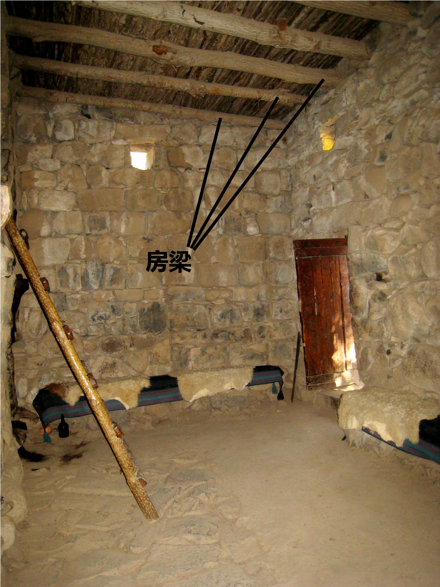

# Human-made Things in the Bible

## License Information

Human-made Things in the Bible © United Bible Societies, 2025. Adapted from: <cite>The Works of Their Hands: Man-made Things in the Bible</cite>, by Ray Pritz © 2009 United Bible Societies. This work is licensed under Creative Commons Attribution-ShareAlike 4.0 International (<a href="https://creativecommons.org/licenses/by-sa/4.0/">https://creativecommons.org/licenses/by-sa/4.0/</a>).

--------------------------------

## 標題：大梁、樑木、椽子（crossbeam, rafter） (id: REALIA:3.1.5.3)

3\.1\.5\.3 標題：大梁、樑木、椽子（crossbeam, rafter）
=========================================

經文出處
----

Aramaic 蘭：אָע (音譯： ’a‘)

[EZR 6:11](https://ref.ly/Ezra6:11)

Hebrew 來： גֵּב (音譯： gev)

[1KI 6:9](https://ref.ly/1Kgs6:9)

Hebrew 來： כָּפִיס (音譯： kafis)

[HAB 2:11](https://ref.ly/Hab2:11)

Hebrew 來： קרה, קוֹרָה (音譯： qarah（動詞）, qorah)

[2CH 3:7](https://ref.ly/2Chr3:7), [SNG 1:17](https://ref.ly/Song1:17), [2CH 34:11](https://ref.ly/2Chr34:11)

Hebrew 來： רָהִיט (音譯： rachit)

[SNG 1:17](https://ref.ly/Song1:17)

Hebrew 來： שְׂדֵרָה (音譯： sderah)

[1KI 6:9](https://ref.ly/1Kgs6:9)

Greek 希： δοκός (音譯： dokos)

[SIR 29:22](https://ref.ly/Sir29:22), [LJE 1:19](https://ref.ly/EpJer1:19), [LJE 1:54](https://ref.ly/EpJer1:54)

Greek 希： ἱμάντωσις (音譯： himantōsis)

[SIR 22:16](https://ref.ly/Sir22:16)

Greek 希： ξύλον (音譯： xulon)

[1ES 6:31](https://ref.ly/1Esd6:31)

描述和用途
-----

*房梁 (© Hagit Baldar, CC BY, via Wikimedia Commons)*

以色列人房屋的屋頂由三四層材料組成。首先，在兩面牆之間鋪上粗木樑。這些木樑插入到牆的頂部，是牆結構的一部分。如果木樑被取出，牆就會嚴重毀壞。這些「樑木」或「椽子」的間距約有一個人的前臂那麼長。在橫梁上面垂直鋪放一層較細的木條，木條的直徑約3—4厘米（1—2英吋）。木條並排放在一起，形成一個平面。這些木條可能就是[1KI 6:9](https://ref.ly/1Kgs6:9) 中提到的*sderoth* （*sderah* 的複數）。細木條上面再鋪撒一層土，有時土上面會鋪一層瓦。

---

翻譯
--

雖然希伯來文*gev* 在[1KI 6:9](https://ref.ly/1Kgs6:9) 中的意思不確定，但我們查閱的所有譯本都把它譯為「樑木」。另參[3\.1\.6 房間 (room)\<REALIA:3\.1\.6\>](#) 關於該詞的討論。

在[SNG 1:17](https://ref.ly/Song1:17) 中，希伯來文*rachit* 是比喻用法，這裡也有一個文本問題。參《〈雅歌〉手冊》（*A Handbook on Song of Songs* ）第49頁關於這節經文的討論。

[HAB 2:11](https://ref.ly/Hab2:11) ：希伯來文*kafis* 在整本聖經中僅出現在此處。但大多數譯本都認為它指的是房子裡面的一根椽子或橫梁。但是，也有譯本把這節經文的最後一行譯為：「灰泥必從木構件上回應」（NRSV (New Revised Standard Version (1989)) 直譯）。巴比倫人的房屋通常是用磚而不是石頭建造的，在這節經文中，先知是用他熟悉的、以色列地的建築材料，來描寫巴比倫人的房屋。有些翻譯者可能也要採取類似的做法，用他們所在地區的常用建築材料（例如黏土和木頭，或木頭和茅草）來翻譯，而不是試圖對「橫梁」或「椽子」進行描述。例如，他們可以譯成：「房頂上的木頭（或茅草／黏土）必呼喊著回應（或譯：應和這呼叫）。」有些語言不能說建築材料像人一樣呼叫。在這種情況下，翻譯者可以使用比喻，把整節經文譯為，「甚至你們房屋的石頭和木頭也要來作證控告你們的惡行。」

橫梁為建築物提供必不可少的支撐。在[EZR 6:11](https://ref.ly/Ezra6:11) 和[1ES 6:31](https://ref.ly/1Esd6:31) 中，把某人房屋的橫梁拔掉肯定會導致房屋倒塌。因此，這節經文的中間部分也可以譯成，「他的房屋必被拆毀，其中一根橫梁必穿過他的身體。」

* **Associated Passages:** 以斯拉記 6:11; 列王紀上 6:9; 哈巴谷書 2:11; 歷代志下 3:7; 雅歌 1:17; 歷代志下 34:11; 德訓篇 29:22; 耶利米書信 1:19; 耶利米書信 1:54; 德訓篇 22:16; 厄斯德拉上 6:31

