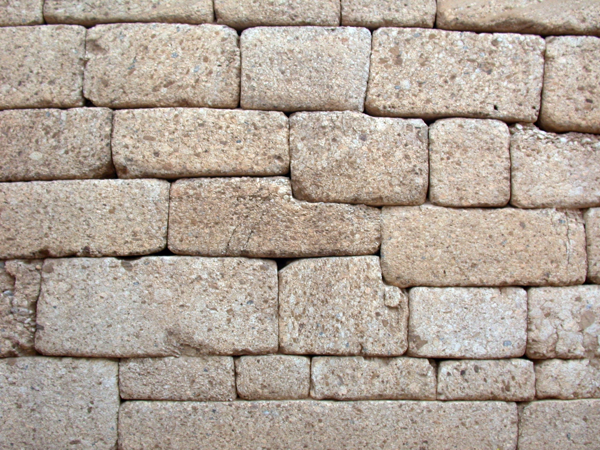

# Human-made Things in the Bible

## License Information

Human-made Things in the Bible © United Bible Societies, 2025. Adapted from: <cite>The Works of Their Hands: Man-made Things in the Bible</cite>, by Ray Pritz © 2009 United Bible Societies. This work is licensed under Creative Commons Attribution-ShareAlike 4.0 International (<a href="https://creativecommons.org/licenses/by-sa/4.0/">https://creativecommons.org/licenses/by-sa/4.0/</a>).

--------------------------------

## 標題：房間（room） (id: REALIA:3.1.6)

3\.1\.6 標題：房間（room）
===================

經文出處
----

Hebrew 來： בַּיִת (音譯： bayith)

[1CH 28:11](https://ref.ly/1Chr28:11), [1CH 28:11](https://ref.ly/1Chr28:11), [EZK 41:17](https://ref.ly/Ezek41:17)

Hebrew 來： גַּב (音譯： gev)

[EZK 16:24](https://ref.ly/Ezek16:24), [EZK 16:31](https://ref.ly/Ezek16:31), [EZK 16:39](https://ref.ly/Ezek16:39)

Hebrew 來： חֶדֶר (音譯： cheder)

[GEN 43:30](https://ref.ly/Gen43:30), [DEU 32:25](https://ref.ly/Deut32:25), [JDG 15:1](https://ref.ly/Judg15:1), [JDG 16:9](https://ref.ly/Judg16:9), [JDG 16:12](https://ref.ly/Judg16:12), [2SA 13:10](https://ref.ly/2Sam13:10), [2SA 13:10](https://ref.ly/2Sam13:10), [1KI 1:15](https://ref.ly/1Kgs1:15), [PSA 105:30](https://ref.ly/Ps105:30), [PRO 7:27](https://ref.ly/Prov7:27), [PRO 24:4](https://ref.ly/Prov24:4), [SNG 1:4](https://ref.ly/Song1:4), [SNG 3:4](https://ref.ly/Song3:4), [ISA 26:20](https://ref.ly/Isa26:20), [EZK 8:12](https://ref.ly/Ezek8:12), [JOL 2:16](https://ref.ly/Joel2:16)

Hebrew 來： יָצוּעַ, יָצִיעַ (音譯： yatsu‘a, yatsi‘a)

[1KI 6:6](https://ref.ly/1Kgs6:6), [1KI 6:6](https://ref.ly/1Kgs6:6), [1KI 6:10](https://ref.ly/1Kgs6:10), [1KI 6:10](https://ref.ly/1Kgs6:10)

Hebrew 來： לִשְׁכָּה (音譯： lishkah)

[1SA 9:22](https://ref.ly/1Sam9:22), [2KI 23:11](https://ref.ly/2Kgs23:11), [1CH 9:26](https://ref.ly/1Chr9:26), [1CH 9:33](https://ref.ly/1Chr9:33), [1CH 23:28](https://ref.ly/1Chr23:28), [1CH 28:12](https://ref.ly/1Chr28:12), [2CH 31:11](https://ref.ly/2Chr31:11), [EZR 8:29](https://ref.ly/Ezra8:29), [EZR 10:6](https://ref.ly/Ezra10:6), [NEH 10:38](https://ref.ly/Neh10:38), [NEH 10:39](https://ref.ly/Neh10:39), [NEH 10:40](https://ref.ly/Neh10:40), [NEH 13:4](https://ref.ly/Neh13:4), [NEH 13:5](https://ref.ly/Neh13:5), [NEH 13:8](https://ref.ly/Neh13:8), [NEH 13:9](https://ref.ly/Neh13:9), [JER 35:2](https://ref.ly/Jer35:2), [JER 35:4](https://ref.ly/Jer35:4), [JER 35:4](https://ref.ly/Jer35:4), [JER 35:4](https://ref.ly/Jer35:4), [JER 36:10](https://ref.ly/Jer36:10), [JER 36:12](https://ref.ly/Jer36:12), [JER 36:20](https://ref.ly/Jer36:20), [JER 36:21](https://ref.ly/Jer36:21), [EZK 40:17](https://ref.ly/Ezek40:17), [EZK 40:17](https://ref.ly/Ezek40:17), [EZK 40:38](https://ref.ly/Ezek40:38), [EZK 40:44](https://ref.ly/Ezek40:44), [EZK 40:45](https://ref.ly/Ezek40:45), [EZK 40:46](https://ref.ly/Ezek40:46), [EZK 41:10](https://ref.ly/Ezek41:10), [EZK 42:1](https://ref.ly/Ezek42:1), [EZK 42:4](https://ref.ly/Ezek42:4), [EZK 42:5](https://ref.ly/Ezek42:5), [EZK 42:7](https://ref.ly/Ezek42:7), [EZK 42:7](https://ref.ly/Ezek42:7), [EZK 42:8](https://ref.ly/Ezek42:8), [EZK 42:9](https://ref.ly/Ezek42:9), [EZK 42:9](https://ref.ly/Ezek42:9), [EZK 42:10](https://ref.ly/Ezek42:10), [EZK 42:11](https://ref.ly/Ezek42:11), [EZK 42:12](https://ref.ly/Ezek42:12), [EZK 42:13](https://ref.ly/Ezek42:13), [EZK 42:13](https://ref.ly/Ezek42:13), [EZK 42:13](https://ref.ly/Ezek42:13), [EZK 44:19](https://ref.ly/Ezek44:19), [EZK 45:5](https://ref.ly/Ezek45:5), [EZK 46:19](https://ref.ly/Ezek46:19)

Hebrew 來： נִשְׁכָּה (音譯： nishkah)

[NEH 3:30](https://ref.ly/Neh3:30), [NEH 12:44](https://ref.ly/Neh12:44), [NEH 13:7](https://ref.ly/Neh13:7)

Hebrew 來： צֵלָע (音譯： tsela‘)

[1KI 6:5](https://ref.ly/1Kgs6:5), [1KI 6:8](https://ref.ly/1Kgs6:8), [1KI 7:3](https://ref.ly/1Kgs7:3), [EZK 41:9](https://ref.ly/Ezek41:9), [EZK 41:9](https://ref.ly/Ezek41:9), [EZK 41:11](https://ref.ly/Ezek41:11), [EZK 41:26](https://ref.ly/Ezek41:26)

Greek 希： θάλαμος (音譯： thalamos)

[3MA 1:18](https://ref.ly/3Macc1:18)

Greek 希： παστοφόριον (音譯： pastoforion)

[1MA 4:38](https://ref.ly/1Macc4:38), [1MA 4:57](https://ref.ly/1Macc4:57), [1ES 8:58](https://ref.ly/1Esd8:58), [1ES 9:1](https://ref.ly/1Esd9:1)

描述
--

房間是房子或其他建築結構中的一個子單元。

---

翻譯
--

在[EZK 16:24](https://ref.ly/Ezek16:24) 中，希伯來文*gev* 的意思不確定。RSV (Revised Standard Version (1952)) 將這個詞譯為“vaulted chamber”（「有拱頂的房間」），然而大多數譯本認為這個詞是指敬拜別神的地方，因而譯成“shrine\[s]”（「神廟」；NKJV (New King James Version (1982)) 、REB (Revised English Bible (1989)) 、NASB (New American Standard Bible) ）、“place to worship gods”（「拜偶像的地方」；NCV (New Century Version) ）、“mound”（「土丘」；NIV (New International Version (1984)) ）等。

希伯來文*tsela‘* 最早出現在[GEN 2:22](https://ref.ly/Gen2:22) 中，指亞當的肋骨。在所羅門聖殿和以西結所描述的理想聖殿中，有一些房間建在聖殿兩側，可能因為它們與人的胸腔有一些相似，所以也叫做*tsela‘* 。參《〈列王紀上下〉手冊》（*A Handbook on 1–2 Kings* ）中關於[1KI 6:5](https://ref.ly/1Kgs6:5) 的討論。

* **Associated Passages:** 歷代志上 28:11; 以西結書 41:17; 以西結書 16:24; 以西結書 16:31; 以西結書 16:39; 創世記 43:30; 申命記 32:25; 士師記 15:1; 士師記 16:9; 士師記 16:12; 撒母耳記下 13:10; 列王紀上 1:15; 詩篇 105:30; 箴言 7:27; 箴言 24:4; 雅歌 1:4; 雅歌 3:4; 以賽亞書 26:20; 以西結書 8:12; 約珥書 2:16; 列王紀上 6:6; 列王紀上 6:10; 撒母耳記上 9:22; 列王紀下 23:11; 歷代志上 9:26; 歷代志上 9:33; 歷代志上 23:28; 歷代志上 28:12; 歷代志下 31:11; 以斯拉記 8:29; 以斯拉記 10:6; 尼希米記 10:38; 尼希米記 10:39; 尼希米記 10:40; 尼希米記 13:4; 尼希米記 13:5; 尼希米記 13:8; 尼希米記 13:9; 耶利米書 35:2; 耶利米書 35:4; 耶利米書 36:10; 耶利米書 36:12; 耶利米書 36:20; 耶利米書 36:21; 以西結書 40:17; 以西結書 40:38; 以西結書 40:44; 以西結書 40:45; 以西結書 40:46; 以西結書 41:10; 以西結書 42:1; 以西結書 42:4; 以西結書 42:5; 以西結書 42:7; 以西結書 42:8; 以西結書 42:9; 以西結書 42:10; 以西結書 42:11; 以西結書 42:12; 以西結書 42:13; 以西結書 44:19; 以西結書 45:5; 以西結書 46:19; 尼希米記 3:30; 尼希米記 12:44; 尼希米記 13:7; 列王紀上 6:5; 列王紀上 6:8; 列王紀上 7:3; 以西結書 41:9; 以西結書 41:11; 以西結書 41:26; 瑪加伯三書 1:18; 瑪加伯上 4:38; 瑪加伯上 4:57; 厄斯德拉上 8:58; 厄斯德拉上 9:1; 創世記 2:22

* **Associated ACAI Concepts:** Room (ID: `realia:Room`)

## 標題：天花板（ceiling） (id: REALIA:3.1.6.1)

3\.1\.6\.1 標題：天花板（ceiling）
==========================

經文出處
----

Hebrew 來： סִפֻּן (音譯： sipun)

[1KI 6:15](https://ref.ly/1Kgs6:15)

Greek 希： φάτνωμα (音譯： fatnōma)

[2MA 1:16](https://ref.ly/2Macc1:16)

描述和用途
-----

天花板是房間內部的頂，將上下兩個房間分開，或者將房間與外面分開，在後一種情況中，天花板是屋頂的內表面。參[3\.1\.5\.3 大梁、樑木、椽子 (crossbeam, rafter)\<REALIA:3\.1\.5\.3\>](#) 中的插圖。

---

翻譯
--

在[2MA 1:16](https://ref.ly/2Macc1:16) 中，有些翻譯者可能會認為在天花板上有扇暗門很奇怪，所以有必要擴展譯文，甚至添加腳註來解釋祭司實際上是在天花板上方的一個空間裡。他們是通過暗門進入到該空間去的。

* **Associated Passages:** 列王紀上 6:15; 瑪加伯下 1:16

## 標題：地板、地面（floor） (id: REALIA:3.1.6.2)

3\.1\.6\.2 標題：地板、地面（floor）
==========================

經文出處
----

Hebrew 來： קַרְקַע (音譯： qarqa‘)

[NUM 5:17](https://ref.ly/Num5:17), [1KI 6:16](https://ref.ly/1Kgs6:16), [1KI 6:30](https://ref.ly/1Kgs6:30), [1KI 7:7](https://ref.ly/1Kgs7:7), [1KI 7:7](https://ref.ly/1Kgs7:7)

---

翻譯
--

在[NUM 5:17](https://ref.ly/Num5:17) 中，希伯來文*qarqa‘* 描述的是帳幕裡面未鋪砌的泥土地面。經文沒有告訴我們所羅門聖殿的地面是否進行了鋪砌，但因為[1KI 6:30](https://ref.ly/1Kgs6:30) 說他在地板上貼了金子，所以我們可以假定上面已經先鋪了一層木頭或石頭。

* **Associated Passages:** 民數記 5:17; 列王紀上 6:16; 列王紀上 6:30; 列王紀上 7:7

* **Associated ACAI Concepts:** Floor (ID: `realia:Floor`)

## 標題：牆（wall） (id: REALIA:3.1.6.3)

3\.1\.6\.3 標題：牆（wall）
=====================

經文出處
----

Hebrew 來： כֹּתֶל (音譯： kothel)

[SNG 2:9](https://ref.ly/Song2:9)

Aramaic 蘭：כְּתַל (音譯： kethal)

[EZR 5:8](https://ref.ly/Ezra5:8), [DAN 5:5](https://ref.ly/Dan5:5)

Hebrew 來： קִיר (音譯： qir)

[LEV 14:37](https://ref.ly/Lev14:37), [LEV 14:37](https://ref.ly/Lev14:37), [LEV 14:39](https://ref.ly/Lev14:39), [1SA 18:11](https://ref.ly/1Sam18:11), [1SA 19:10](https://ref.ly/1Sam19:10), [1SA 19:10](https://ref.ly/1Sam19:10), [1SA 20:25](https://ref.ly/1Sam20:25), [1SA 25:22](https://ref.ly/1Sam25:22), [1SA 25:34](https://ref.ly/1Sam25:34), [2SA 5:11](https://ref.ly/2Sam5:11), [1KI 5:13](https://ref.ly/1Kgs5:13), [1KI 6:6](https://ref.ly/1Kgs6:6), [1KI 6:15](https://ref.ly/1Kgs6:15), [1KI 6:15](https://ref.ly/1Kgs6:15), [1KI 6:27](https://ref.ly/1Kgs6:27), [1KI 6:27](https://ref.ly/1Kgs6:27), [1KI 6:29](https://ref.ly/1Kgs6:29), [1KI 14:10](https://ref.ly/1Kgs14:10), [1KI 16:11](https://ref.ly/1Kgs16:11), [1KI 21:21](https://ref.ly/1Kgs21:21), [2KI 4:10](https://ref.ly/2Kgs4:10), [2KI 9:8](https://ref.ly/2Kgs9:8), [2KI 9:33](https://ref.ly/2Kgs9:33), [2KI 20:2](https://ref.ly/2Kgs20:2), [1CH 14:1](https://ref.ly/1Chr14:1)

描述
--

*安裝在牆上的石塊 (MM, Public domain, via Wikimedia Commons)*

牆是構成建築物或房間一側的立面。牆支撐著房間的天花板或建築物的屋頂。這裡的討論會區分建築物中的這種牆和城牆（参[3\.13\.3\.1 城牆、外郭、城垛 (city wall, rampart, battlement)\<REALIA:3\.13\.3\.1\>](#) ）或邊界牆（参[3\.6 邊界牆、圍牆、圍欄、柵欄 (boundary wall, fence)\<REALIA:3\.6\>](#) ）。

---

翻譯
--

希伯來文*qir* 既可以指建築物的外牆，也可以指內牆。如果目標語言有詞語分別表示這兩種不同的牆，翻譯者要留意上下文，以選擇合宜的用詞。例如，[1KI 5:13](https://ref.ly/1Kgs5:13) （《和》4:33）提到「在牆上長出的牛膝草」（RSV (Revised Standard Version (1952)) 直譯），那裡的「牆」更有可能是指房子的外牆，而不是內牆。

在[1SA 25:22](https://ref.ly/1Sam25:22); [1SA 25:34](https://ref.ly/1Sam25:34); [1KI 14:10](https://ref.ly/1Kgs14:10); [1KI 16:11](https://ref.ly/1Kgs16:11); [1KI 21:21](https://ref.ly/1Kgs21:21) 和[2KI 9:8](https://ref.ly/2Kgs9:8) 中，有一個希伯來文短語直譯作「對著牆小便的人」。這個短語意指男子，因此大多數譯本都譯為「男子」或「男性」。

[2SA 5:11](https://ref.ly/2Sam5:11) 和[1CH 14:1](https://ref.ly/1Chr14:1) 記載，推羅王希蘭派「石匠」（“masons”；RSV (Revised Standard Version (1952)) ）到所羅門那裡，該詞在希伯來文中的字面意思為「牆石工／牆石切割工」。這些匠人塑造石頭的形狀，使其能夠嚴密地、整齊地堆砌成一面牆。GNT (Good News Translation (1992)) 譯為“stone masons”（「石頭匠人」），CEV (Contemporary English Version) 譯為“stone workers”（「石頭工人」）。

* **Associated Passages:** 雅歌 2:9; 以斯拉記 5:8; 但以理書 5:5; 利未記 14:37; 利未記 14:39; 撒母耳記上 18:11; 撒母耳記上 19:10; 撒母耳記上 20:25; 撒母耳記上 25:22; 撒母耳記上 25:34; 撒母耳記下 5:11; 列王紀上 5:13; 列王紀上 6:6; 列王紀上 6:15; 列王紀上 6:27; 列王紀上 6:29; 列王紀上 14:10; 列王紀上 16:11; 列王紀上 21:21; 列王紀下 4:10; 列王紀下 9:8; 列王紀下 9:33; 列王紀下 20:2; 歷代志上 14:1

## 標題：樓上的房間、樓房、屋頂的房間（upper room, roof chamber） (id: REALIA:3.1.6.4)

3\.1\.6\.4 標題：樓上的房間、樓房、屋頂的房間（upper room, roof chamber）
======================================================

經文出處
----

Hebrew 來： עֲלִיָּה (音譯： ‘aliyah)

[JDG 3:20](https://ref.ly/Judg3:20), [JDG 3:23](https://ref.ly/Judg3:23), [JDG 3:24](https://ref.ly/Judg3:24), [JDG 3:25](https://ref.ly/Judg3:25), [2SA 19:1](https://ref.ly/2Sam19:1), [1KI 17:19](https://ref.ly/1Kgs17:19), [1KI 17:23](https://ref.ly/1Kgs17:23), [2KI 1:2](https://ref.ly/2Kgs1:2), [2KI 4:10](https://ref.ly/2Kgs4:10), [2KI 4:11](https://ref.ly/2Kgs4:11), [2KI 23:12](https://ref.ly/2Kgs23:12), [1CH 28:11](https://ref.ly/1Chr28:11), [2CH 3:9](https://ref.ly/2Chr3:9), [NEH 3:31](https://ref.ly/Neh3:31), [NEH 3:32](https://ref.ly/Neh3:32), [PSA 104:3](https://ref.ly/Ps104:3), [PSA 104:13](https://ref.ly/Ps104:13), [JER 22:13](https://ref.ly/Jer22:13), [JER 22:14](https://ref.ly/Jer22:14)

Aramaic 蘭：עִלִּי (音譯： ‘ili)

[DAN 6:11](https://ref.ly/Dan6:11)

Hebrew 來： מַעֲלָה (音譯： ma‘alah)

[AMO 9:6](https://ref.ly/Amos9:6)

Greek 希： ἀνάγαιον (音譯： anagaion)

[MRK 14:15](https://ref.ly/Mark14:15), [LUK 22:12](https://ref.ly/Luke22:12)

Greek 希： ὑπερῷον (音譯： huperōion)

[ACT 1:13](https://ref.ly/Acts1:13), [ACT 9:37](https://ref.ly/Acts9:37), [ACT 9:39](https://ref.ly/Acts9:39), [ACT 20:8](https://ref.ly/Acts20:8), [TOB 3:10](https://ref.ly/Tob3:10), [TOB 3:17](https://ref.ly/Tob3:17)

描述
--

*帶上層房間的房子 (Image generated by ChatGPT using OpenAI technology)*

樓上的房間是指在底層（地面層）上面一層的房間（該層在美式英語中為第二層，在其他大多數語言中為第一層）。樓上房間通常不會占整個樓層的面積，而是只占屋頂的一部分。

---

翻譯
--

在[JDG 3:20](https://ref.ly/Judg3:20) 中，希伯來文短語*‘aliyath mqerah* （在[JDG 3:24](https://ref.ly/Judg3:24) 中也叫做*cheder mqerah* ）指專門為乘涼而建造的一間樓房。由於位置比較高，所以風相對較大，而且可能是朝北的，因此受到的日曬較少。

[1KI 6:6](https://ref.ly/1Kgs6:6); [1KI 6:8](https://ref.ly/1Kgs6:8) 提到圍繞聖殿外側建造的二樓和三樓（美式英語）。[1KI 6:8](https://ref.ly/1Kgs6:8) 指的是「中間層的入口」（NRSV (New Revised Standard Version (1989)) 直譯）。HOTTP (Hebrew Old Testament Text Project (UBS)) 對此提出以下註解：「這些樓層可能是\|u開放式\|u\*的拱廊或走廊。因此，經文可以不必提到開放式的地面層的入口，但有必要提到第一（或中間）和第二（或最高）層的入口。」這個註解是根據希伯來文本得出的結論，因為經文清楚提到中間層有入口，並且有樓梯通向中間層，又從中間層上到頂層。然而，《七十士譯本》和一個古老的猶太亞蘭文譯本（《他爾根》）都認為，在第8節末尾出現了兩次的希伯來文形容詞*tikonah* （「中間」）都是指中間層；但是，第一次其實是指最下面一層。NJB (New Jerusalem Bible (1985)) 贊同這個意見，英文意為：「通往最下層的入口是在殿的右邊轉角；通過一條螺旋樓梯上到中間層，再從中間層上到第三層。」

[PSA 104:3](https://ref.ly/Ps104:3); [PSA 104:13](https://ref.ly/Ps104:13) ：希伯來文*‘aliyoth* 在這些經文中指上帝的居所。許多譯本都沒有按字面翻譯。CEV (Contemporary English Version) 在兩處都譯為“home”（「家」），而GNT (Good News Translation (1992)) 在第3節譯為“home”（「家」），在第13節譯為“the sky”（「天」）。NJB (New Jerusalem Bible (1985)) 分別譯為“palace”（「宮殿」）和“halls”（「大廳」）。

* **Associated Passages:** 士師記 3:20; 士師記 3:23; 士師記 3:24; 士師記 3:25; 撒母耳記下 19:1; 列王紀上 17:19; 列王紀上 17:23; 列王紀下 1:2; 列王紀下 4:10; 列王紀下 4:11; 列王紀下 23:12; 歷代志上 28:11; 歷代志下 3:9; 尼希米記 3:31; 尼希米記 3:32; 詩篇 104:3; 詩篇 104:13; 耶利米書 22:13; 耶利米書 22:14; 但以理書 6:11; 阿摩司書 9:6; 馬可福音 14:15; 路加福音 22:12; 使徒行傳 1:13; 使徒行傳 9:37; 使徒行傳 9:39; 使徒行傳 20:8; 多俾亞傳 3:10; 多俾亞傳 3:17; 列王紀上 6:6; 列王紀上 6:8

## 標題：第三層（third floor） (id: REALIA:3.1.6.5)

3\.1\.6\.5 標題：第三層（third floor）
==============================

經文出處
----

Greek 希： τρίστεγον (音譯： tristegon)

[ACT 20:9](https://ref.ly/Acts20:9)

描述
--

第三層是一棟建築的第三個樓層，即底層之上的第二層，是英式英語中的「二樓」和美式英語中的「三樓」。

---

翻譯
--

翻譯者在表述[ACT 20:9](https://ref.ly/Acts20:9) 中猶推古發生的意外時，需要謹慎用詞。有些語言會把他掉下來的房間稱為「二樓」，但他們應該說他是從「三層樓的高度」掉下來的。稱呼樓層時應說是二樓，但他掉下來的高度也包括地面層，所以他掉下來的高度有三層樓那麼高。

* **Associated Passages:** 使徒行傳 20:9

* **Associated ACAI Concepts:** Second Story (ID: `realia:SecondStory`)

## 標題：內室（inner room） (id: REALIA:3.1.6.6)

3\.1\.6\.6 標題：內室（inner room）
============================

經文出處
----

Hebrew 來： חֶדֶר (音譯： cheder bcheder)

[1KI 20:30](https://ref.ly/1Kgs20:30), [1KI 22:25](https://ref.ly/1Kgs22:25), [2KI 9:2](https://ref.ly/2Kgs9:2), [2CH 18:24](https://ref.ly/2Chr18:24)

Hebrew 來： חֶדֶר, פְּנִימִי (音譯： cheder pnimi)

[1CH 28:11](https://ref.ly/1Chr28:11)

Greek 希： μυχός (音譯： muchos)

[WIS 17:4](https://ref.ly/Wis17:4)

Greek 希： ταμεῖον (音譯： tameion)

[MAT 6:6](https://ref.ly/Matt6:6), [MAT 24:26](https://ref.ly/Matt24:26), [LUK 12:3](https://ref.ly/Luke12:3)

描述
--

內室是房子內部的一個房間，通常沒有通向室外的窗戶。

---

翻譯
--

[LUK 12:3](https://ref.ly/Luke12:3) 的重點是：內室處於完全私密的位置。在這樣的語境中，翻譯者可以譯為：「一間完全私密的房間」，或「在房子最裡面的一個小房間」。

* **Associated Passages:** 列王紀上 20:30; 列王紀上 22:25; 列王紀下 9:2; 歷代志下 18:24; 歷代志上 28:11; 智慧篇 17:4; 馬太福音 6:6; 馬太福音 24:26; 路加福音 12:3

* **Associated ACAI Concepts:** Inner Room (ID: `realia:InnerRoom`)

## 標題：臥室（bedroom） (id: REALIA:3.1.6.7)

3\.1\.6\.7 標題：臥室（bedroom）
=========================

經文出處
----

Hebrew 來： חֶדֶר, מִטָּה (音譯： cheder mitah)

[2KI 11:2](https://ref.ly/2Kgs11:2), [2CH 22:11](https://ref.ly/2Chr22:11)

Hebrew 來： חֶדֶר, מִשְׁכָּב (音譯： cheder mishkav)

[EXO 7:28](https://ref.ly/Exod7:28), [2SA 4:7](https://ref.ly/2Sam4:7), [2KI 6:12](https://ref.ly/2Kgs6:12), [ECC 10:20](https://ref.ly/Eccl10:20)

Greek 希： κοιτών (音譯： koitōn)

[ACT 12:20](https://ref.ly/Acts12:20), [JDT 13:3](https://ref.ly/Jdt13:3), [JDT 13:4](https://ref.ly/Jdt13:4), [JDT 14:15](https://ref.ly/Jdt14:15), [JDT 16:19](https://ref.ly/Jdt16:19), [1ES 3:3](https://ref.ly/1Esd3:3)

描述和用途
-----

臥室是住宅中用來睡覺的房間。

---

翻譯
--

[ACT 12:20](https://ref.ly/Acts12:20) ：在這節經文中，伯拉斯都字面上被稱為「管理王臥室的那個人」。這裡的重點不是臥室的用法，而是伯拉斯都的地位，他是一個非常受敬重的人，承擔著管理王的寢宮和私人事務的重任。因此，伯拉斯都可以稱為「王的大臣」。

在《次經‧猶滴傳》（《思》《友弟德傳》）中，希臘文*koitōn* 每次出現都是指帳棚，而不是永久性建築中的一間臥室。如果目標語言有專門用詞表示這種在帳棚中的隔間，可在此處使用。

* **Associated Passages:** 列王紀下 11:2; 歷代志下 22:11; 出埃及記 7:28; 撒母耳記下 4:7; 列王紀下 6:12; 傳道書 10:20; 使徒行傳 12:20; 友弟德傳 13:3; 友弟德傳 13:4; 友弟德傳 14:15; 友弟德傳 16:19; 厄斯德拉上 3:3

* **Associated ACAI Concepts:** Bedroom (ID: `realia:Bedroom`)

## 標題：新房、洞房、內室（婚床）（bridal chamber [marriage bed]） (id: REALIA:3.1.6.8)

3\.1\.6\.8 標題：新房、洞房、內室（婚床）（bridal chamber \[marriage bed]）
==========================================================

經文出處
----

Hebrew 來： חֶדֶר (音譯： cheder)

[JDG 15:1](https://ref.ly/Judg15:1), [JOL 2:16](https://ref.ly/Joel2:16)

Hebrew 來： חֻפָּה (音譯： chupah)

[PSA 19:6](https://ref.ly/Ps19:6), [JOL 2:16](https://ref.ly/Joel2:16)

Greek 希： νυμφών (音譯： numfōn)

[TOB 6:14](https://ref.ly/Tob6:14), [TOB 6:17](https://ref.ly/Tob6:17)

Greek 希： παστός (音譯： pastos)

[1MA 1:27](https://ref.ly/1Macc1:27), [3MA 1:19](https://ref.ly/3Macc1:19), [3MA 4:6](https://ref.ly/3Macc4:6)

描述和用途
-----

新房是新婚夫婦在婚禮後用來休息的房間。

---

翻譯
--

在[1MA 1:27](https://ref.ly/1Macc1:27) 中，希臘文*pastos* 可能有多種含義。除了上述定義，該詞還指新婚夫婦圓房時的床，因此可譯為「婚床」（如NJB (New Jerusalem Bible (1985)) ）。

* **Associated Passages:** 士師記 15:1; 約珥書 2:16; 詩篇 19:6; 多俾亞傳 6:14; 多俾亞傳 6:17; 瑪加伯上 1:27; 瑪加伯三書 1:19; 瑪加伯三書 4:6

## 標題：客房（guest room） (id: REALIA:3.1.6.9)

3\.1\.6\.9 標題：客房（guest room）
============================

經文出處
----

Greek 希： κατάλυμα (音譯： kataluma)

[MRK 14:14](https://ref.ly/Mark14:14), [LUK 22:11](https://ref.ly/Luke22:11)

Greek 希： ξενία (音譯： xenia)

[ACT 28:23](https://ref.ly/Acts28:23), [PHM 1:22](https://ref.ly/Phlm1:22)

描述和用途
-----

客房是一個人離開家時臨時居住的地方，通常是在另一個人的家裡。

---

翻譯
--

在[MRK 14:14](https://ref.ly/Mark14:14) 和[LUK 22:11](https://ref.ly/Luke22:11) 中，希臘文*kataluma* 指的是一個可以用作餐廳的大房間。許多譯本譯為「客房」（“guest room”；RSV (Revised Standard Version (1952)) 、NCV (New Century Version) ），其他譯本簡單地譯為「房間」（“room”；GNT (Good News Translation (1992)) ），或「地方」。翻譯者也可以把耶穌的問題放到這節經文的末尾：「我要在哪裡和我的門徒吃逾越節的筵席呢？」這兩節經文的下一節都描述了該房間。

在新約這兩節經文中，希臘文*xenia* 也有可能是一個抽象名詞，指好客或者接待客人的活動。這是*xenia* 一詞更為常見的意思，但是不太適合這兩節經文的語境。

* **Associated Passages:** 馬可福音 14:14; 路加福音 22:11; 使徒行傳 28:23; 腓利門書 1:22

* **Associated ACAI Concepts:** Guest Room (ID: `realia:GuestRoom`)
