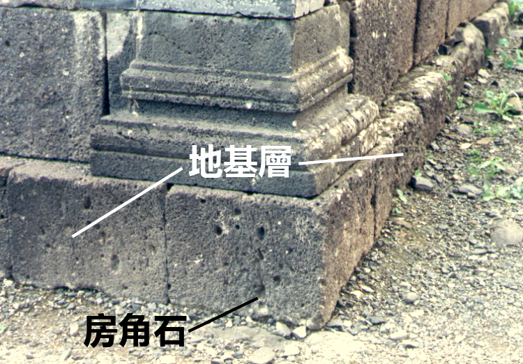
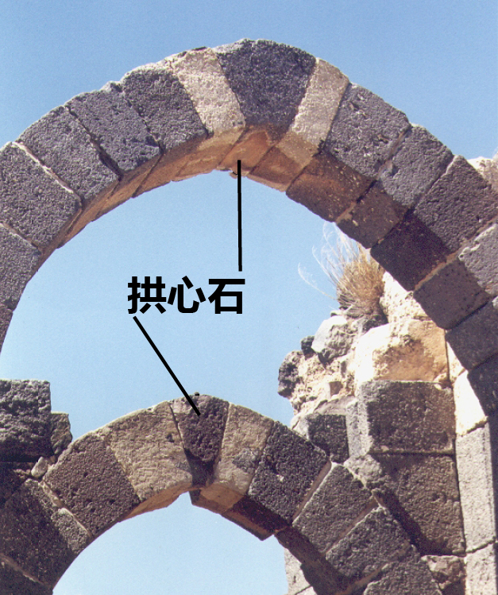
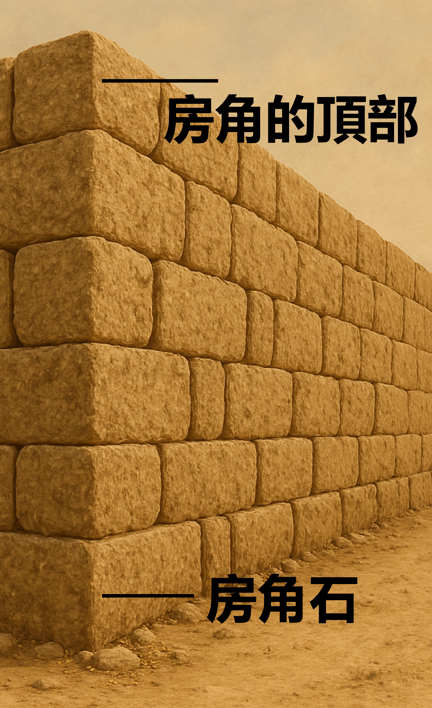
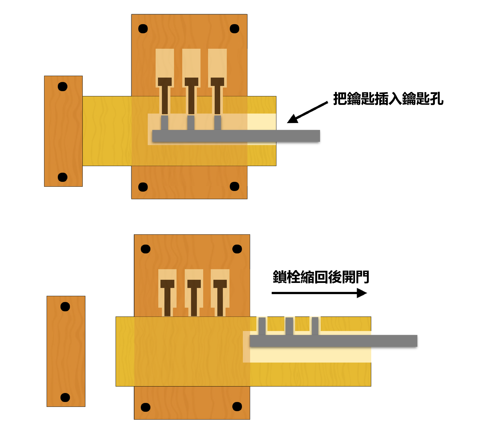

# Human-made Things in the Bible

## License Information

Human-made Things in the Bible © United Bible Societies, 2025. Adapted from: <cite>The Works of Their Hands: Man-made Things in the Bible</cite>, by Ray Pritz © 2009 United Bible Societies. This work is licensed under Creative Commons Attribution-ShareAlike 4.0 International (<a href="https://creativecommons.org/licenses/by-sa/4.0/">https://creativecommons.org/licenses/by-sa/4.0/</a>).

--------------------------------

## 標題：房子、永久性住所（house, permanent dwelling） (id: REALIA:3.1)

3\.1 標題：房子、永久性住所（house, permanent dwelling）
===========================================

經文出處
----

Hebrew 來： בַּיִת (音譯： bayith)

[GEN 7:1](https://ref.ly/Gen7:1), [GEN 12:1](https://ref.ly/Gen12:1), [GEN 14:14](https://ref.ly/Gen14:14), [GEN 15:2](https://ref.ly/Gen15:2), [GEN 15:3](https://ref.ly/Gen15:3), [GEN 17:13](https://ref.ly/Gen17:13), [GEN 17:13](https://ref.ly/Gen17:13), [GEN 17:23](https://ref.ly/Gen17:23), [GEN 17:23](https://ref.ly/Gen17:23), [GEN 17:27](https://ref.ly/Gen17:27), [GEN 17:27](https://ref.ly/Gen17:27), [GEN 18:19](https://ref.ly/Gen18:19), [GEN 19:4](https://ref.ly/Gen19:4), [GEN 19:10](https://ref.ly/Gen19:10), [GEN 19:11](https://ref.ly/Gen19:11)

Greek 希： οἰκία, οἶκος (音譯： oikia, oikos)

[MAT 2:11](https://ref.ly/Matt2:11), [MAT 5:15](https://ref.ly/Matt5:15), [MAT 7:24](https://ref.ly/Matt7:24), [MAT 7:25](https://ref.ly/Matt7:25), [MAT 7:26](https://ref.ly/Matt7:26), [MAT 7:27](https://ref.ly/Matt7:27), [MAT 8:6](https://ref.ly/Matt8:6), [MAT 8:14](https://ref.ly/Matt8:14), [MAT 9:6](https://ref.ly/Matt9:6), [MAT 9:7](https://ref.ly/Matt9:7)

Latin 拉： domus

[2ES 1:7](https://ref.ly/2Esd1:7), [2ES 1:35](https://ref.ly/2Esd1:35), [2ES 9:24](https://ref.ly/2Esd9:24), [2ES 10:51](https://ref.ly/2Esd10:51), [2ES 12:46](https://ref.ly/2Esd12:46), [2ES 12:49](https://ref.ly/2Esd12:49), [2ES 14:13](https://ref.ly/2Esd14:13)

描述和用途
-----

*房屋 (Image generated by ChatGPT using OpenAI technology)*

聖經時期的普通家庭住宅都很小，可能不超過40—50平方米（400—500平方英呎）。隨著地點和時代的不同，房子的形狀和建造材料也不同。例如，以色列人出埃及之前，在埃及的房子就不同於後來先知時期在美索不達米亞的房子，而後者又不同於新約時期在加利利的房子。如果當地有一個通稱表示獨戶住宅，那麼該詞可以在整本聖經中使用。如果某種語言必須要對房屋進行具體的說明，例如，房子是用什麼材料建造的，形狀是什麼樣的，下面的討論可以提供一些幫助。

在族長時期，埃及和迦南的房子是用泥磚建造的。這些房子是長方形的，只有一層，通常只有一個房間。地面就是夯實的乾土。美索不達米亞地區的人也使用泥磚來建造房屋，一直使用到聖經時期的晚期。有時，泥磚牆會建造在石頭地基上。

在王國時期，以色列人不再使用泥土建造房屋，而是改用當地的石頭；不過可能在很早之前，石頭就是丘陵地區的主要建築材料。這些石頭都很粗糙，沒有進行加工，即未經切割或人工塑形；人們把石頭一塊塊堆砌起來，然後用泥漿將其固定在一起。有些時候，居住區房屋的內牆會塗上灰泥，但外牆通常不做處理。

---

翻譯
--

有些語言會根據住房的大小和重要性，在用詞上進行明確的區分。因此，在翻譯上述希伯來文、希臘文和拉丁文統稱時，有必要使用一些基本等同於以下中英文單詞的不同詞語：「村舍」（“cottage”）、「房屋」（“house”）、「官邸」（“official residence”）、「宮殿」（“palace”）和「神廟」（“temple”）等。另參[3\.4 宮殿 (palace)\<REALIA:3\.4\>](#) 和[3\.14\.1 猶太人的聖殿 (Jewish Temple)\<REALIA:3\.14\.1\>](#) 。

在有些語言中，翻譯者必須仔細區分房屋和家。「房屋」可以用來指任何居住用的建築物，而「家」是指某人比較固定的住所。例如，在[MRK 2:1](https://ref.ly/Mark2:1) 中，癱子被人從房頂縋下來的那所房子就是耶穌當時住的地方；也就是說，耶穌那時是「在家裡」（“at home”；RSV (Revised Standard Version (1952)) 、GNT (Good News Translation (1992)) ），翻譯者需要指出這一點。

下文所述的一些條目（例如地基、門楣、樓梯）是永久性私人住宅和其他建築物的一些常見結構特徵。為了方便起見，我們將其統一放在「地基、根基、基礎」這個標題下面。

* **Associated Passages:** 創世記 7:1; 創世記 12:1; 創世記 14:14; 創世記 15:2; 創世記 15:3; 創世記 17:13; 創世記 17:23; 創世記 17:27; 創世記 18:19; 創世記 19:4; 創世記 19:10; 創世記 19:11; 馬太福音 2:11; 馬太福音 5:15; 馬太福音 7:24; 馬太福音 7:25; 馬太福音 7:26; 馬太福音 7:27; 馬太福音 8:6; 馬太福音 8:14; 馬太福音 9:6; 馬太福音 9:7; 厄斯德拉下 1:7; 厄斯德拉下 1:35; 厄斯德拉下 9:24; 厄斯德拉下 10:51; 厄斯德拉下 12:46; 厄斯德拉下 12:49; 厄斯德拉下 14:13; 馬可福音 2:1

* **Associated ACAI Concepts:** House (ID: `realia:House`)

## 標題：地基、根基、基礎（foundation） (id: REALIA:3.1.1)

3\.1\.1 標題：地基、根基、基礎（foundation）
===============================

經文出處
----

Aramaic 蘭：אֹשׁ (音譯： ’osh)

[EZR 4:12](https://ref.ly/Ezra4:12), [EZR 5:16](https://ref.ly/Ezra5:16), [EZR 6:3](https://ref.ly/Ezra6:3)

Hebrew 來： אָשְׁיָה (音譯： ’oshyah)

[JER 50:15](https://ref.ly/Jer50:15)

Hebrew 來： יסד, יְסוֹד, יְסוּדָה, מוֹסָד, מוֹסָדָה, מוּסָדָה, מַסָּד (音譯： yasad（動詞）, ysod, ysudah, mosad, musad, mosadah, musadah, masad)

[DEU 32:22](https://ref.ly/Deut32:22), [JOS 6:26](https://ref.ly/Josh6:26), [2SA 22:8](https://ref.ly/2Sam22:8), [2SA 22:16](https://ref.ly/2Sam22:16), [1KI 5:31](https://ref.ly/1Kgs5:31), [1KI 6:37](https://ref.ly/1Kgs6:37), [1KI 7:9](https://ref.ly/1Kgs7:9), [1KI 7:10](https://ref.ly/1Kgs7:10), [1KI 16:34](https://ref.ly/1Kgs16:34)

Hebrew 來： מָכוֹן (音譯： makon)

[PSA 104:5](https://ref.ly/Ps104:5)

Hebrew 來： סַף (音譯： saf)

[AMO 9:1](https://ref.ly/Amos9:1)

Greek 希： θεμέλιον, θεμέλιος, θεμελιόω (音譯： themelion, themelios, themelioō（動詞）)

[MAT 7:25](https://ref.ly/Matt7:25), [LUK 6:48](https://ref.ly/Luke6:48), [LUK 6:49](https://ref.ly/Luke6:49), [LUK 14:29](https://ref.ly/Luke14:29)

Greek 希： ὑποβάλλω (音譯： hupoballō（動詞）)

[1ES 2:14](https://ref.ly/1Esd2:14)

Latin 拉： fundamentum

\\ref 參照：
 V08201601200008V08200601500026V08201002700030V08201005300022V0820150120008
 V08201502300018V08201601200008描述
-----------------------------------------------------------------------------------------------------------------------

*地基的房角石 (© Ray Pritz by United Bible Societies)*

地基是一個堅固的支撐層，建築物的牆或整個建築物就在其上建造起來。地基是由並排安放的大石頭所建成。

---

翻譯
--

在有些語言中，可以把古代典型的「地基」描述為「牆下面的大石頭」。然而，在其他一些語言中，這種表述可能毫無意義，因為只有把樁子深深打入地下才能使地基穩固。在這些語言中，翻譯者最好從功能的角度來描述地基，比如「使牆穩固的東西」、「使牆不移動的東西」或「在牆下面的東西」。

在世界上的許多地方，人們在建造房屋時，通常並不奠定地基，也不使用石頭或磚。因此，在翻譯新約中「根基」的比喻時，可能會遇到一些困難。在這些情況下，「根基」可以譯為「在其上建造房屋的堅固（或牢固）基礎」、「人們在建造石頭房子前打好的基礎」或「房屋的根基」。

[JER 50:15](https://ref.ly/Jer50:15) ：這節經文中的希伯來文*’ashwiyoth* 可以譯為「堡壘」（“bulwarks”；RSV (Revised Standard Version (1952)) 、NRSV (New Revised Standard Version (1989)) ）、「塔樓」（“towers”；NCV (New Century Version) 、NIV (New International Version (1984)) 、CEV (Contemporary English Version) ）。GNT (Good News Translation (1992)) 未譯出該詞，而是在腳註中說明該希伯來文詞語的意思不確定。關於這個詞語的意思，解經家們有不同的意見。一些解經家建議使用「地基」一詞，並把它與[EZR 4:12](https://ref.ly/Ezra4:12) 、[EZR 5:16](https://ref.ly/Ezra5:16) 中的相關亞蘭文詞語進行比較。其他解經家則指出，說地基會「坍塌」是不正確的。這些解經家認為，最好把*’ashwiyoth* 看作一個泛指城市「防禦工事」的詞語。

[AMO 9:1](https://ref.ly/Amos9:1) ：這節經文中的希伯來文*sipim* 意思不確定。在希伯來文本中，這裡明顯是指某個東西因為受到擊打而震動，但被震動的東西到底是什麼，不同譯本的理解非常不同：「門檻」（“thresholds”；RSV (Revised Standard Version (1952)) 、AT (American Translation (Goodspeed, 1935)) ）、「門楣」（“lintels”；TOT ）、「門柱」（“doorjambs”；NAB (New American Bible (1970)) ）、「天花板」（“ceiling”；Mft (Moffatt Translation (1926)) ）、「整個門廊」（“whole porch”；NEB (New English Bible (1970)) ），以及「地基」（“foundation”；GNT (Good News Translation (1992)) ）。這個希伯來文詞語可能是指地基或屋頂結構。然而，這節經文描繪了整棟建築從屋頂到地基都在震動直至倒塌的情景。翻譯者必須清楚表達這一點，具體的措辭則取決於後續經文的翻譯。

* **Associated Passages:** 以斯拉記 4:12; 以斯拉記 5:16; 以斯拉記 6:3; 耶利米書 50:15; 申命記 32:22; 約書亞記 6:26; 撒母耳記下 22:8; 撒母耳記下 22:16; 列王紀上 5:31; 列王紀上 6:37; 列王紀上 7:9; 列王紀上 7:10; 列王紀上 16:34; 詩篇 104:5; 阿摩司書 9:1; 馬太福音 7:25; 路加福音 6:48; 路加福音 6:49; 路加福音 14:29; 厄斯德拉上 2:14; 厄斯德拉下 16:12; 厄斯德拉下 6:15; 厄斯德拉下 10:27; 厄斯德拉下 10:53; 厄斯德拉下 15:23

* **Associated ACAI Concepts:** Foundation (ID: `realia:Foundation`)

## 標題：房角石、拱心石、壓頂石（cornerstone, keystone, capstone） (id: REALIA:3.1.1.1)

3\.1\.1\.1 標題：房角石、拱心石、壓頂石（cornerstone, keystone, capstone）
==========================================================

經文出處
----

Hebrew 來： אֶבֶן, פִנָּה (音譯： ’even pinah)

[JOB 38:6](https://ref.ly/Job38:6)

Hebrew 來： אֶבֶן, רֹאשָׁה (音譯： ’even ro’shah)

[ZEC 4:7](https://ref.ly/Zech4:7)

Hebrew 來： פִנָּה (音譯： pinah)

[ISA 28:16](https://ref.ly/Isa28:16), [ZEC 10:4](https://ref.ly/Zech10:4)

Hebrew 來： רֹאשׁ פִּנָּה (音譯： ro’sh pinah)

[PSA 118:22](https://ref.ly/Ps118:22)

Greek 希： ἀκρογωνιαῖος (音譯： akrogōniaios)

[EPH 2:20](https://ref.ly/Eph2:20), [1PE 2:6](https://ref.ly/1Pet2:6)

Greek 希： κεφαλή, γωνία (音譯： kefalē gōnias)

[MAT 21:42](https://ref.ly/Matt21:42), [MRK 12:10](https://ref.ly/Mark12:10), [LUK 20:17](https://ref.ly/Luke20:17), [ACT 4:11](https://ref.ly/Acts4:11), [1PE 2:7](https://ref.ly/1Pet2:7)

描述和用途
-----

*拱心石 (© Ray Pritz by United Bible Societies)*

在石頭建築物中，房角石是奠基的第一塊石頭（參[3\.1\.1 地基、根基、基礎 (foundation)\<REALIA:3\.1\.1\>](#) 中的插圖）。它的朝向決定了整個建築的方向，而它在地基中的位置則意味著它為整個建築物提供支撐。

拱心石或壓頂石是拱門等建築結構最後放置的一塊石頭。曾經有一個時期，建築物的石頭並不是靠砂漿或其他材料粘結在一起的，放置在關鍵位置的拱心石使整個建築結構成為一個穩固的整體。

---

翻譯
--

在大多數情況下，我們很難準確說明以上所列希伯來文和希臘文詞語指的是哪種石頭。所論石頭可能是指古代建築中，延伸到建築物拐角轉角的大石頭。還有些人認為這些詞語指的是「拱心石」，即拱門頂端的那塊石頭。（事實上，這些詞語很可能是指耶路撒冷聖殿所用的那種石頭，因此它們更有可能是指房角石，而不是尖頂或拱門上的壓頂石。）

*房角石，房角的頂部 (Image generated by ChatGPT using OpenAI technology)*

新約中的希臘文*kefalē gōnias* 引自舊約中的[PSA 118:22](https://ref.ly/Ps118:22) ，無論這個短語的確切含義是什麼，它的基本意思都是毫無疑問的；基督被比作建築物中最重要的那塊石頭，為整座建築提供凝聚力和支撐。因此在大多數語言中，最好把這個短語譯為「最重要的石頭」或「使整座建築穩固的石頭」。這些譯法描述了*kefalē gōnias* 的功能和意義，而又沒有試圖指明具體的位置和形式。

當翻譯者使用這種擴展譯法時，用隱喻或明喻來進行翻譯會容易得多，因為比喻能清楚表明比較的內容。[EPH 2:20](https://ref.ly/Eph2:20) 可以譯為，「你們也是建築物的一部分。使徒和先知奠定了建築物的根基，而使建築物穩固的石頭就是基督耶穌自己。」或者譯為，「你們也好像是使徒和先知立定根基的建築物的一部分，而基督耶穌是保證建築物穩固的那塊重要石頭。」

[JOB 38:6](https://ref.ly/Job38:6) ：在房角石不為人知的地方，可以把這節經文的第二行譯為，「誰把它放在了合適的位置？」或「誰預備好了該放置它的地方？」

[ZEC 10:4](https://ref.ly/Zech10:4) ：有人認為希伯來文*pinah* （字面意為「角落」）在這裡指的是城牆上的角樓或碉堡（比較[2CH 26:15](https://ref.ly/2Chr26:15) ；[NEH 3:24](https://ref.ly/Neh3:24) ）。但在我們查閱的譯本中，沒有任何一個譯本依循這種解釋。有些譯本（如DUCL (Dutch Common Language Version) ）認為該詞是指軍事領袖，並據此進行翻譯。在很早以前，人們就認為這節經文是預表彌賽亞。有些英文譯本試圖通過首字母大寫（Cornerstone，「房角石」）來反映這一點。這種視覺上的暗示對大多數讀者來說都是不明顯的，而且對於聆聽經文的聽者來說，這種視覺暗示毫無作用。如果按照字面意思來翻譯這節經文開頭的兩個希伯來文詞語（「房角石必從他們而出」；如RSV (Revised Standard Version (1952)) 的譯法），這在有些語言中是無法理解的。譯文最好能夠表明，該預言與一個領袖有關。可以譯為「統治者、領袖和官長必從他們而出，治理我的百姓」（GNT (Good News Translation (1992)) 直譯）、「必有領袖從這群羊而出，他們必如房角石、帳棚橛和爭戰的兵器那樣堅強有力」（CEV (Contemporary English Version) 直譯），兩者都是這節經文的翻譯範例。

* **Associated Passages:** 約伯記 38:6; 撒迦利亞書 4:7; 以賽亞書 28:16; 撒迦利亞書 10:4; 詩篇 118:22; 以弗所書 2:20; 彼得前書 2:6; 馬太福音 21:42; 馬可福音 12:10; 路加福音 20:17; 使徒行傳 4:11; 彼得前書 2:7; 歷代志下 26:15; 尼希米記 3:24

* **Associated ACAI Concepts:** Cornerstone (ID: `realia:Cornerstone`)

## 標題：門、門口（door, doorway） (id: REALIA:3.1.2)

3\.1\.2 標題：門、門口（door, doorway）
==============================

經文出處
----

Hebrew 來： דַּל, דֶּלֶת (音譯： dal, dalah, deleth)

[GEN 19:6](https://ref.ly/Gen19:6), [GEN 19:9](https://ref.ly/Gen19:9), [GEN 19:10](https://ref.ly/Gen19:10), [EXO 21:6](https://ref.ly/Exod21:6)

Hebrew 來： סַף (音譯： saf)

[2KI 12:10](https://ref.ly/2Kgs12:10), [2KI 22:4](https://ref.ly/2Kgs22:4), [2KI 23:4](https://ref.ly/2Kgs23:4), [2KI 25:18](https://ref.ly/2Kgs25:18), [1CH 9:19](https://ref.ly/1Chr9:19), [1CH 9:22](https://ref.ly/1Chr9:22), [2CH 23:4](https://ref.ly/2Chr23:4), [2CH 34:9](https://ref.ly/2Chr34:9), [EST 2:21](https://ref.ly/Esth2:21), [EST 6:2](https://ref.ly/Esth6:2), [ISA 6:4](https://ref.ly/Isa6:4), [JER 35:4](https://ref.ly/Jer35:4), [JER 52:24](https://ref.ly/Jer52:24), [EZK 41:16](https://ref.ly/Ezek41:16), [EZK 41:16](https://ref.ly/Ezek41:16)

Hebrew 來： ספף (音譯： safaf（動詞）)

[PSA 84:11](https://ref.ly/Ps84:11)

Hebrew 來： פֶּתַח (音譯： pethach)

[GEN 4:7](https://ref.ly/Gen4:7), [GEN 6:16](https://ref.ly/Gen6:16), [GEN 18:1](https://ref.ly/Gen18:1), [GEN 18:2](https://ref.ly/Gen18:2), [GEN 18:10](https://ref.ly/Gen18:10), [GEN 19:6](https://ref.ly/Gen19:6), [GEN 19:11](https://ref.ly/Gen19:11), [GEN 19:11](https://ref.ly/Gen19:11), [GEN 43:19](https://ref.ly/Gen43:19), [EXO 12:22](https://ref.ly/Exod12:22), [EXO 12:23](https://ref.ly/Exod12:23), [EXO 26:36](https://ref.ly/Exod26:36), [EXO 29:4](https://ref.ly/Exod29:4), [EXO 29:11](https://ref.ly/Exod29:11), [EXO 29:32](https://ref.ly/Exod29:32), [EXO 29:42](https://ref.ly/Exod29:42), [EXO 33:8](https://ref.ly/Exod33:8), [EXO 33:9](https://ref.ly/Exod33:9), [EXO 33:10](https://ref.ly/Exod33:10), [EXO 33:10](https://ref.ly/Exod33:10), [EXO 35:15](https://ref.ly/Exod35:15), [EXO 35:15](https://ref.ly/Exod35:15), [EXO 36:37](https://ref.ly/Exod36:37), [EXO 38:8](https://ref.ly/Exod38:8), [EXO 38:30](https://ref.ly/Exod38:30), [EXO 39:38](https://ref.ly/Exod39:38), [EXO 40:5](https://ref.ly/Exod40:5), [EXO 40:6](https://ref.ly/Exod40:6), [EXO 40:12](https://ref.ly/Exod40:12), [EXO 40:28](https://ref.ly/Exod40:28), [EXO 40:29](https://ref.ly/Exod40:29), [LEV 1:3](https://ref.ly/Lev1:3), [LEV 1:5](https://ref.ly/Lev1:5), [LEV 3:2](https://ref.ly/Lev3:2), [LEV 4:4](https://ref.ly/Lev4:4), [LEV 4:7](https://ref.ly/Lev4:7), [LEV 4:18](https://ref.ly/Lev4:18), [LEV 8:3](https://ref.ly/Lev8:3), [LEV 8:4](https://ref.ly/Lev8:4), [LEV 8:31](https://ref.ly/Lev8:31), [LEV 8:33](https://ref.ly/Lev8:33), [LEV 8:35](https://ref.ly/Lev8:35), [LEV 10:7](https://ref.ly/Lev10:7), [LEV 12:6](https://ref.ly/Lev12:6), [LEV 14:11](https://ref.ly/Lev14:11), [LEV 14:23](https://ref.ly/Lev14:23), [LEV 14:38](https://ref.ly/Lev14:38), [LEV 15:14](https://ref.ly/Lev15:14), [LEV 15:29](https://ref.ly/Lev15:29), [LEV 16:7](https://ref.ly/Lev16:7), [LEV 17:4](https://ref.ly/Lev17:4), [LEV 17:5](https://ref.ly/Lev17:5), [LEV 17:6](https://ref.ly/Lev17:6), [LEV 17:9](https://ref.ly/Lev17:9), [LEV 19:21](https://ref.ly/Lev19:21), [NUM 3:25](https://ref.ly/Num3:25), [NUM 3:26](https://ref.ly/Num3:26), [NUM 4:25](https://ref.ly/Num4:25), [NUM 6:10](https://ref.ly/Num6:10), [NUM 6:13](https://ref.ly/Num6:13), [NUM 6:18](https://ref.ly/Num6:18), [NUM 10:3](https://ref.ly/Num10:3), [NUM 11:10](https://ref.ly/Num11:10), [NUM 12:5](https://ref.ly/Num12:5), [NUM 16:18](https://ref.ly/Num16:18), [NUM 16:19](https://ref.ly/Num16:19), [NUM 16:27](https://ref.ly/Num16:27), [NUM 17:15](https://ref.ly/Num17:15), [NUM 20:6](https://ref.ly/Num20:6), [NUM 25:6](https://ref.ly/Num25:6), [NUM 27:2](https://ref.ly/Num27:2), [DEU 22:21](https://ref.ly/Deut22:21), [DEU 31:15](https://ref.ly/Deut31:15), [JOS 19:51](https://ref.ly/Josh19:51), [JDG 4:20](https://ref.ly/Judg4:20), [JDG 9:52](https://ref.ly/Judg9:52), [JDG 19:26](https://ref.ly/Judg19:26), [JDG 19:27](https://ref.ly/Judg19:27), [1SA 2:22](https://ref.ly/1Sam2:22), [2SA 11:9](https://ref.ly/2Sam11:9), [1KI 6:8](https://ref.ly/1Kgs6:8), [1KI 6:31](https://ref.ly/1Kgs6:31), [1KI 6:33](https://ref.ly/1Kgs6:33), [1KI 7:5](https://ref.ly/1Kgs7:5), [1KI 14:6](https://ref.ly/1Kgs14:6), [1KI 14:27](https://ref.ly/1Kgs14:27), [1KI 19:13](https://ref.ly/1Kgs19:13), [2KI 4:15](https://ref.ly/2Kgs4:15), [2KI 5:9](https://ref.ly/2Kgs5:9), [1CH 9:21](https://ref.ly/1Chr9:21), [2CH 4:22](https://ref.ly/2Chr4:22), [2CH 12:10](https://ref.ly/2Chr12:10), [NEH 3:20](https://ref.ly/Neh3:20), [NEH 3:21](https://ref.ly/Neh3:21), [EST 5:1](https://ref.ly/Esth5:1), [JOB 31:9](https://ref.ly/Job31:9), [JOB 31:34](https://ref.ly/Job31:34), [PSA 24:7](https://ref.ly/Ps24:7), [PSA 24:9](https://ref.ly/Ps24:9), [PRO 5:8](https://ref.ly/Prov5:8), [PRO 8:3](https://ref.ly/Prov8:3), [PRO 8:34](https://ref.ly/Prov8:34), [PRO 9:14](https://ref.ly/Prov9:14), [PRO 17:19](https://ref.ly/Prov17:19), [SNG 7:14](https://ref.ly/Song7:14), [JER 43:9](https://ref.ly/Jer43:9), [EZK 8:7](https://ref.ly/Ezek8:7), [EZK 8:8](https://ref.ly/Ezek8:8), [EZK 8:16](https://ref.ly/Ezek8:16), [EZK 33:30](https://ref.ly/Ezek33:30), [EZK 40:38](https://ref.ly/Ezek40:38), [EZK 41:2](https://ref.ly/Ezek41:2), [EZK 41:2](https://ref.ly/Ezek41:2), [EZK 41:3](https://ref.ly/Ezek41:3), [EZK 41:3](https://ref.ly/Ezek41:3), [EZK 41:3](https://ref.ly/Ezek41:3), [EZK 41:11](https://ref.ly/Ezek41:11), [EZK 41:11](https://ref.ly/Ezek41:11), [EZK 41:11](https://ref.ly/Ezek41:11), [EZK 41:17](https://ref.ly/Ezek41:17), [EZK 41:20](https://ref.ly/Ezek41:20), [EZK 42:2](https://ref.ly/Ezek42:2), [EZK 42:4](https://ref.ly/Ezek42:4), [EZK 42:11](https://ref.ly/Ezek42:11), [EZK 42:12](https://ref.ly/Ezek42:12), [EZK 42:12](https://ref.ly/Ezek42:12), [EZK 47:1](https://ref.ly/Ezek47:1), [HOS 2:17](https://ref.ly/Hos2:17)

Aramaic 蘭：תְּרַע (音譯： tra‘)

[DAN 3:26](https://ref.ly/Dan3:26)

Greek 希： θύρα (音譯： thura)

[MAT 6:6](https://ref.ly/Matt6:6), [MAT 24:33](https://ref.ly/Matt24:33), [MAT 25:10](https://ref.ly/Matt25:10), [MRK 1:33](https://ref.ly/Mark1:33), [MRK 2:2](https://ref.ly/Mark2:2), [MRK 11:4](https://ref.ly/Mark11:4), [MRK 13:29](https://ref.ly/Mark13:29), [LUK 11:7](https://ref.ly/Luke11:7), [LUK 13:24](https://ref.ly/Luke13:24), [LUK 13:25](https://ref.ly/Luke13:25), [LUK 13:25](https://ref.ly/Luke13:25), [JHN 10:1](https://ref.ly/John10:1), [JHN 10:2](https://ref.ly/John10:2), [JHN 10:7](https://ref.ly/John10:7), [JHN 10:9](https://ref.ly/John10:9), [JHN 18:16](https://ref.ly/John18:16), [JHN 20:19](https://ref.ly/John20:19), [JHN 20:26](https://ref.ly/John20:26), [ACT 5:9](https://ref.ly/Acts5:9), [ACT 5:19](https://ref.ly/Acts5:19), [ACT 5:23](https://ref.ly/Acts5:23), [ACT 12:6](https://ref.ly/Acts12:6), [ACT 12:13](https://ref.ly/Acts12:13), [ACT 14:27](https://ref.ly/Acts14:27), [ACT 16:26](https://ref.ly/Acts16:26), [ACT 16:27](https://ref.ly/Acts16:27), [ACT 21:30](https://ref.ly/Acts21:30), [1CO 16:9](https://ref.ly/1Cor16:9), [2CO 2:12](https://ref.ly/2Cor2:12), [COL 4:3](https://ref.ly/Col4:3), [JAS 5:9](https://ref.ly/Jas5:9), [REV 3:8](https://ref.ly/Rev3:8), [REV 3:20](https://ref.ly/Rev3:20), [REV 3:20](https://ref.ly/Rev3:20), [REV 4:1](https://ref.ly/Rev4:1)

Greek 希： θύρωμα (音譯： thurōma)

[SIR 14:23](https://ref.ly/Sir14:23), [LJE 1:17](https://ref.ly/EpJer1:17), [2MA 14:43](https://ref.ly/2Macc14:43)

Greek 希： θυρωρός (音譯： thurōros)

[MRK 13:34](https://ref.ly/Mark13:34), [JHN 18:16](https://ref.ly/John18:16), [JHN 18:17](https://ref.ly/John18:17)

Greek 希： θυρόω (音譯： thuroō（動詞）)

[1MA 4:57](https://ref.ly/1Macc4:57)

描述和用途
-----

*房屋的木質外門 (© Ray Pritz by United Bible Societies)*

門是進入建築物或構築物的入口，或掩蓋入口的板。門通常是木製的。門的一邊固定在一根木槓上，木槓長度略微超出門的頂部和底部，將木槓兩端突出的部分削尖或削成圓形，然後插在石頭門楣和門檻上的凹坑或洞裡，這樣就可以開門或關門了。有時，門扇也會懸掛在皮革或金屬做的合頁上。

---

翻譯
--

在有些經文中，「門」的意思只是「開口」或「門口」，不是指真正的門（參[JOB 3:10](https://ref.ly/Job3:10) ，[JOB 41:6](https://ref.ly/Job41:6) （《和》41:14）；[PSA 78:23](https://ref.ly/Ps78:23) ）。希伯來文*pethach* 一詞尤其是這種用法。

「門」偶爾也用來比喻「被關在外面」；例如，CEV (Contemporary English Version) 在[JOB 38:8](https://ref.ly/Job38:8) 中譯作“boundaries”（「界限」），那裡上帝說要限制海的範圍。同樣地，詩篇作者在[PSA 141:3](https://ref.ly/Ps141:3) 中祈求主「把守我嘴唇的門」（RSV (Revised Standard Version (1952)) 直譯）。在有些語言中，翻譯這一行詩句時最好不要使用比喻；例如，譯作「請幫助我留意我所說的話」（NCV (New Century Version) 直譯）；整節經文可以合宜地譯為，「每當我說話時，請幫助我警戒我的言語」（CEV (Contemporary English Version) 直譯）。

*門 (Image generated by ChatGPT using OpenAI technology)*

[1KI 6:34](https://ref.ly/1Kgs6:34) 似乎有個文本上的問題，這節經文的希伯來文本提到，聖殿中有兩個由兩塊「帷幕」構成的門。學者進行了一個很小的修訂，把「帷幕」改成了「門扇」，這是大多數譯本首選的讀文。然而，即使在這樣修訂之後，文本的意思依然不清楚。許多譯本解決這個難題的方法如下：「有兩扇松木做的折疊門」（GNT (Good News Translation (1992)) 直譯）。也有譯法比較貼近字面意思，作「他還做了兩道松木門，每道都有兩扇，插在凹坑裡面轉動」（NIV (New International Version (1984)) 直譯）。

亞蘭文*tra‘* 在[DAN 3:26](https://ref.ly/Dan3:26) 的意思是「大門」或「門」。有些譯本譯為「門」（“door”；RSV (Revised Standard Version (1952)) 、GNT (Good News Translation (1992)) 、NASB (New American Standard Bible) ），有些譯本譯為「開口」（“opening”；NIV (New International Version (1984)) 、NCV (New Century Version) ）。這個開口有可能位於烈火窰的頂部，但更可能是在烈火窰的側面，作為某種「門口」。

在[JHN 10:7](https://ref.ly/John10:7); [JHN 10:9](https://ref.ly/John10:9) 中，希臘文*thura* 用來喻指耶穌是獲得救恩的途徑。這兩節經文的重點在於「門」是通道，而不在於它是封閉入口的物件。按照原文字面譯成「我是羊的門」（如RSV (Revised Standard Version (1952)) ）常常會導致誤解，因為這個表述指的可能是門板，而不是門口或入口，從而暗示耶穌基督的主要職能是阻止通過，而不是提供進入的通道。翻譯者應該使用類似下文的表達：「我是羊進入羊圈的門／入口。」

* **Associated Passages:** 創世記 19:6; 創世記 19:9; 創世記 19:10; 出埃及記 21:6; 列王紀下 12:10; 列王紀下 22:4; 列王紀下 23:4; 列王紀下 25:18; 歷代志上 9:19; 歷代志上 9:22; 歷代志下 23:4; 歷代志下 34:9; 以斯帖記 2:21; 以斯帖記 6:2; 以賽亞書 6:4; 耶利米書 35:4; 耶利米書 52:24; 以西結書 41:16; 詩篇 84:11; 創世記 4:7; 創世記 6:16; 創世記 18:1; 創世記 18:2; 創世記 18:10; 創世記 19:11; 創世記 43:19; 出埃及記 12:22; 出埃及記 12:23; 出埃及記 26:36; 出埃及記 29:4; 出埃及記 29:11; 出埃及記 29:32; 出埃及記 29:42; 出埃及記 33:8; 出埃及記 33:9; 出埃及記 33:10; 出埃及記 35:15; 出埃及記 36:37; 出埃及記 38:8; 出埃及記 38:30; 出埃及記 39:38; 出埃及記 40:5; 出埃及記 40:6; 出埃及記 40:12; 出埃及記 40:28; 出埃及記 40:29; 利未記 1:3; 利未記 1:5; 利未記 3:2; 利未記 4:4; 利未記 4:7; 利未記 4:18; 利未記 8:3; 利未記 8:4; 利未記 8:31; 利未記 8:33; 利未記 8:35; 利未記 10:7; 利未記 12:6; 利未記 14:11; 利未記 14:23; 利未記 14:38; 利未記 15:14; 利未記 15:29; 利未記 16:7; 利未記 17:4; 利未記 17:5; 利未記 17:6; 利未記 17:9; 利未記 19:21; 民數記 3:25; 民數記 3:26; 民數記 4:25; 民數記 6:10; 民數記 6:13; 民數記 6:18; 民數記 10:3; 民數記 11:10; 民數記 12:5; 民數記 16:18; 民數記 16:19; 民數記 16:27; 民數記 17:15; 民數記 20:6; 民數記 25:6; 民數記 27:2; 申命記 22:21; 申命記 31:15; 約書亞記 19:51; 士師記 4:20; 士師記 9:52; 士師記 19:26; 士師記 19:27; 撒母耳記上 2:22; 撒母耳記下 11:9; 列王紀上 6:8; 列王紀上 6:31; 列王紀上 6:33; 列王紀上 7:5; 列王紀上 14:6; 列王紀上 14:27; 列王紀上 19:13; 列王紀下 4:15; 列王紀下 5:9; 歷代志上 9:21; 歷代志下 4:22; 歷代志下 12:10; 尼希米記 3:20; 尼希米記 3:21; 以斯帖記 5:1; 約伯記 31:9; 約伯記 31:34; 詩篇 24:7; 詩篇 24:9; 箴言 5:8; 箴言 8:3; 箴言 8:34; 箴言 9:14; 箴言 17:19; 雅歌 7:14; 耶利米書 43:9; 以西結書 8:7; 以西結書 8:8; 以西結書 8:16; 以西結書 33:30; 以西結書 40:38; 以西結書 41:2; 以西結書 41:3; 以西結書 41:11; 以西結書 41:17; 以西結書 41:20; 以西結書 42:2; 以西結書 42:4; 以西結書 42:11; 以西結書 42:12; 以西結書 47:1; 何西阿書 2:17; 但以理書 3:26; 馬太福音 6:6; 馬太福音 24:33; 馬太福音 25:10; 馬可福音 1:33; 馬可福音 2:2; 馬可福音 11:4; 馬可福音 13:29; 路加福音 11:7; 路加福音 13:24; 路加福音 13:25; 約翰福音 10:1; 約翰福音 10:2; 約翰福音 10:7; 約翰福音 10:9; 約翰福音 18:16; 約翰福音 20:19; 約翰福音 20:26; 使徒行傳 5:9; 使徒行傳 5:19; 使徒行傳 5:23; 使徒行傳 12:6; 使徒行傳 12:13; 使徒行傳 14:27; 使徒行傳 16:26; 使徒行傳 16:27; 使徒行傳 21:30; 哥林多前書 16:9; 哥林多後書 2:12; 歌羅西書 4:3; 雅各書 5:9; 啟示錄 3:8; 啟示錄 3:20; 啟示錄 4:1; 德訓篇 14:23; 耶利米書信 1:17; 瑪加伯下 14:43; 馬可福音 13:34; 約翰福音 18:17; 瑪加伯上 4:57; 約伯記 3:10; 約伯記 41:6; 詩篇 78:23; 約伯記 38:8; 詩篇 141:3; 列王紀上 6:34

## 標題：鎖（lock） (id: REALIA:3.1.2.1)

3\.1\.2\.1 標題：鎖（lock）
=====================

經文出處
----

Hebrew 來： כַּף, מַנְעוּל (音譯： kaf man‘ul)

[SNG 5:5](https://ref.ly/Song5:5)

Hebrew 來： נעל (音譯： na‘al)

[JDG 3:23](https://ref.ly/Judg3:23), [JDG 3:24](https://ref.ly/Judg3:24), [2SA 13:17](https://ref.ly/2Sam13:17), [2SA 13:18](https://ref.ly/2Sam13:18)

Hebrew 來： סגר (音譯： sagar)

[JDG 9:51](https://ref.ly/Judg9:51)

Greek 希： κλεῖθρον (音譯： kleithron)

[LJE 1:17](https://ref.ly/EpJer1:17)

Greek 希： κλείω (音譯： kleiō)

[MAT 25:10](https://ref.ly/Matt25:10), [LUK 11:7](https://ref.ly/Luke11:7), [JHN 20:19](https://ref.ly/John20:19), [JHN 20:26](https://ref.ly/John20:26), [ACT 5:23](https://ref.ly/Acts5:23), [ACT 21:30](https://ref.ly/Acts21:30), [SIR 42:6](https://ref.ly/Sir42:6), [BEL 1:14](https://ref.ly/Bel1:14)

描述和用途
-----

鎖是一種用來固定門的裝置，只有使用一把特殊的鑰匙才能將鎖打開（參[3\.1\.2\.2 鑰匙 (key)\<REALIA:3\.1\.2\.2\>](#) ）。

---

翻譯
--

在[SNG 5:5](https://ref.ly/Song5:5) 中，希伯來文短語*kaf man‘ul* 可能是指一個木製突起物或一根繩子，用來拉開門閂，使門打開。可以譯為「門的把手」（“handle of the door”；GNT (Good News Translation (1992)) ），或「門閂的把手」（“handles of the bolt”；RSV (Revised Standard Version (1952)) 、NASB (New American Standard Bible) ），或「鎖的把手」（“handles of the lock”；KJV (King James Version (1611)) ），也可以簡單地譯為「門」（“door”；CEV (Contemporary English Version) ）。

*門和門閂 (Image generated by ChatGPT using OpenAI technology)*

[LJE 1:18](https://ref.ly/EpJer1:18) 使用了這個不常見的希臘文，可以指鎖（如RSV (Revised Standard Version (1952)) ），也可以指橫著擋住門的閂（如GNT (Good News Translation (1992)) ）。

* **Associated Passages:** 雅歌 5:5; 士師記 3:23; 士師記 3:24; 撒母耳記下 13:17; 撒母耳記下 13:18; 士師記 9:51; 耶利米書信 1:17; 馬太福音 25:10; 路加福音 11:7; 約翰福音 20:19; 約翰福音 20:26; 使徒行傳 5:23; 使徒行傳 21:30; 德訓篇 42:6; 彼勒與大龍 1:14; 耶利米書信 1:18

## 標題：鑰匙（key） (id: REALIA:3.1.2.2)

3\.1\.2\.2 標題：鑰匙（key）
=====================

經文出處
----

Hebrew 來： מַפְתֵּחַ (音譯： mafteach)

[JDG 3:25](https://ref.ly/Judg3:25), [ISA 22:22](https://ref.ly/Isa22:22)

Greek 希： κλείς (音譯： kleis)

[MAT 16:19](https://ref.ly/Matt16:19), [LUK 11:52](https://ref.ly/Luke11:52), [REV 1:18](https://ref.ly/Rev1:18), [REV 3:7](https://ref.ly/Rev3:7), [REV 9:1](https://ref.ly/Rev9:1), [REV 20:1](https://ref.ly/Rev20:1)

描述和用途
-----

*羅馬時代鑰匙 (© Hermann Junghans, CC BY\-SA 3\.0, via Wikimedia Commons)*

鑰匙是用來鎖門和開門的工具。古代的鑰匙通常比現在的鑰匙要大很多。

---

翻譯
--

*古羅馬鑰匙（魯芬霍芬考古公園（Archaeological park Ruffenhofen）: 利姆塞姆（Limeseum）） (© Wolfgang Sauber, CC BY\-SA 3\.0, via Wikimedia Commons)*

鑰匙並非所有人都熟知，因此，有些翻譯者可能需要使用描述性的短語，例如「控制門開關的物件」。有時可以從鑰匙的功能角度來翻譯，例如「開鎖器」或「打開鎖的工具」。

除了[JDG 3:25](https://ref.ly/Judg3:25) ，上面所有提到「鑰匙」的經文都是象徵性的。然而，我們查閱的所有譯本仍然全部使用了「鑰匙」這個詞。請注意，ITCL (Italian Common Language Version) 在[ISA 22:22](https://ref.ly/Isa22:22) 中擴展了譯文；原文文本的字面意思是「我必將大衛家的鑰匙放在他的肩上」（如RSV (Revised Standard Version (1952)) 的譯法），ITCL (Italian Common Language Version) 的意大利文本意思是：「大衛宮殿中的所有權柄都必賜給他，鑰匙必交給他掌管。」NLT (New Living Translation) 的譯法類似，英文意為：「我必把大衛家的鑰匙——王宮中最高的職位——賜給他。」

有些時候，可能無法採用「某個地方的鑰匙」這種表述，例如[REV 9:1](https://ref.ly/Rev9:1) 中的「深淵」（“the abyss”；GNT (Good News Translation (1992)) ），或[MAT 16:19](https://ref.ly/Matt16:19) 中的「天國」（“the kingdom of heaven”；RSV (Revised Standard Version (1952)) ）。在這些情況下，翻譯者可能需要說「……的入口的鑰匙」，或者「用來打開或關閉……的門的鑰匙」。

* **Associated Passages:** 士師記 3:25; 以賽亞書 22:22; 馬太福音 16:19; 路加福音 11:52; 啟示錄 1:18; 啟示錄 3:7; 啟示錄 9:1; 啟示錄 20:1

* **Associated ACAI Concepts:** Key (ID: `realia:Key`)

## 標題：合頁（hinge） (id: REALIA:3.1.2.3)

3\.1\.2\.3 標題：合頁（hinge）
=======================

經文出處
----

Hebrew 來： גָּלִיל (音譯： galil)

[1KI 6:34](https://ref.ly/1Kgs6:34), [1KI 6:34](https://ref.ly/1Kgs6:34)

Hebrew 來： פֹּת (音譯： poth)

[1KI 7:50](https://ref.ly/1Kgs7:50)

Hebrew 來： צִיר (音譯： tsir)

[PRO 26:14](https://ref.ly/Prov26:14)

描述和用途
-----

*房門或閘門上的金屬鉸鏈 (© Ray Pritz by United Bible Societies)*

合頁是連接兩個物件，使其可以自由地相對轉動的裝置。就門這個物件來說，合頁是指門扇在頂部（門楣）和底部（門檻）進行固定的點，或者與門柱（如果有的話）固定的點，這樣門扇就可以轉動打開或關上。對於簡單的住宅，門的合頁通常只是木門一側的上下兩端的突出部分，插在石頭門楣或門檻的凹坑中。比較大的門的合頁是用金屬做的。金屬合頁由三部分組成：兩個頁片，一片固定在門上，另一片固定在牆上或門柱上，兩個頁片由一根金屬插銷固定在一起。

翻譯
--

*木合頁 (© Ray Pritz by United Bible Societies)*

希伯來文*galil* 在[1KI 6:34](https://ref.ly/1Kgs6:34) 中的意思不確定。這個詞與意為「旋轉」的希伯來文動詞有關。REB (Revised English Bible (1989)) 將這個詞語解作“swivel\-pin”（「鉸接銷」），即合頁的一種。許多譯本在翻譯這節令人費解的經文時，並不在譯文中指明*galil* 所表示的物件具體是什麼，例如把整節經文譯為「有兩扇松木折疊門」（GNT (Good News Translation (1992)) 直譯）。

* **Associated Passages:** 列王紀上 6:34; 列王紀上 7:50; 箴言 26:14

* **Associated ACAI Concepts:** Hinge (ID: `realia:Hinge`)

## 標題：門柱（doorpost） (id: REALIA:3.1.2.4)

3\.1\.2\.4 標題：門柱（doorpost）
==========================

經文出處
----

Hebrew 來： אַמָּה (音譯： ’amah)

[ISA 6:4](https://ref.ly/Isa6:4)

Hebrew 來： אֹמְנָה (音譯： ’omnah)

[2KI 18:16](https://ref.ly/2Kgs18:16)

Hebrew 來： מְזוּזָה (音譯： mzuzah)

[EXO 12:7](https://ref.ly/Exod12:7), [EXO 12:22](https://ref.ly/Exod12:22), [EXO 12:23](https://ref.ly/Exod12:23), [EXO 21:6](https://ref.ly/Exod21:6), [DEU 6:9](https://ref.ly/Deut6:9), [DEU 11:20](https://ref.ly/Deut11:20), [JDG 16:3](https://ref.ly/Judg16:3), [1SA 1:9](https://ref.ly/1Sam1:9), [1KI 6:31](https://ref.ly/1Kgs6:31), [1KI 6:33](https://ref.ly/1Kgs6:33), [1KI 7:5](https://ref.ly/1Kgs7:5), [PRO 8:34](https://ref.ly/Prov8:34), [ISA 57:8](https://ref.ly/Isa57:8), [EZK 41:21](https://ref.ly/Ezek41:21), [EZK 43:8](https://ref.ly/Ezek43:8), [EZK 43:8](https://ref.ly/Ezek43:8), [EZK 45:19](https://ref.ly/Ezek45:19), [EZK 45:19](https://ref.ly/Ezek45:19), [EZK 46:2](https://ref.ly/Ezek46:2)

Hebrew 來： סַף (音譯： saf)

[2CH 3:7](https://ref.ly/2Chr3:7)

描述和用途
-----

*(Image generated by ChatGPT using OpenAI technology)*

房門和大門這類入口為長方形。門口的兩側有時會襯上木頭，這樣門的合頁就可以固定在木頭上。門柱就是門口兩側的這些柱子。門柱還可支撐門口上方的結構。

---

翻譯
--

如果目標語言沒有表示門框各個部分的專業詞語，翻譯者可以使用描述性短語，例如，[EXO 12:22](https://ref.ly/Exod12:22) 可譯為「門楣和兩根門柱」（RSV (Revised Standard Version (1952)) 直譯），或「門框的兩側和頂部」（NCV (New Century Version) 直譯）。

[2KI 18:16](https://ref.ly/2Kgs18:16) ：希伯來文*’omnah* 在整本聖經中只出現在這一處，意思不確定。其動詞詞根的意思是「攜帶、支撐」，既可以指一個大房間中的支柱，也可以指支撐門口的柱子。大多數譯本都採用第二種解釋，譯為「門柱」。

* **Associated Passages:** 以賽亞書 6:4; 列王紀下 18:16; 出埃及記 12:7; 出埃及記 12:22; 出埃及記 12:23; 出埃及記 21:6; 申命記 6:9; 申命記 11:20; 士師記 16:3; 撒母耳記上 1:9; 列王紀上 6:31; 列王紀上 6:33; 列王紀上 7:5; 箴言 8:34; 以賽亞書 57:8; 以西結書 41:21; 以西結書 43:8; 以西結書 45:19; 以西結書 46:2; 歷代志下 3:7

* **Associated ACAI Concepts:** Doorpost (ID: `realia:Doorpost`)

## 標題：門楣（lintel） (id: REALIA:3.1.2.5)

3\.1\.2\.5 標題：門楣（lintel）
========================

經文出處
----

Hebrew 來： מַשְׁקוֹף (音譯： mashqof)

[EXO 12:7](https://ref.ly/Exod12:7), [EXO 12:22](https://ref.ly/Exod12:22), [EXO 12:23](https://ref.ly/Exod12:23)

描述
--

門楣是門框的頂梁（參[3\.1\.2 門、門口 (door, doorway)\<REALIA:3\.1\.2\>](#) ）。參[3\.1\.2\.4 門柱 (doorpost)\<REALIA:3\.1\.2\.4\>](#) 中的插圖。

---

翻譯
--

參[3\.1\.2\.4 門柱 (doorpost)\<REALIA:3\.1\.2\.4\>](#) 中的討論。

* **Associated Passages:** 出埃及記 12:7; 出埃及記 12:22; 出埃及記 12:23

## 標題：門檻（threshold, doorsill） (id: REALIA:3.1.2.6)

3\.1\.2\.6 標題：門檻（threshold, doorsill）
=====================================

經文出處
----

Hebrew 來： סַף (音譯： saf)

[JDG 19:27](https://ref.ly/Judg19:27), [1KI 14:17](https://ref.ly/1Kgs14:17), [EZK 40:6](https://ref.ly/Ezek40:6), [EZK 40:6](https://ref.ly/Ezek40:6), [EZK 40:7](https://ref.ly/Ezek40:7), [EZK 41:16](https://ref.ly/Ezek41:16), [EZK 41:16](https://ref.ly/Ezek41:16), [EZK 43:8](https://ref.ly/Ezek43:8), [EZK 43:8](https://ref.ly/Ezek43:8), [ZEP 2:14](https://ref.ly/Zeph2:14)

Hebrew 來： מִפְתָּן (音譯： miftan)

[1SA 5:4](https://ref.ly/1Sam5:4), [1SA 5:5](https://ref.ly/1Sam5:5), [EZK 9:3](https://ref.ly/Ezek9:3), [EZK 10:4](https://ref.ly/Ezek10:4), [EZK 10:18](https://ref.ly/Ezek10:18), [EZK 46:2](https://ref.ly/Ezek46:2), [EZK 47:1](https://ref.ly/Ezek47:1), [ZEP 1:9](https://ref.ly/Zeph1:9)

Greek 希： χελώνις (音譯： chelōnis)

[JDT 14:15](https://ref.ly/Jdt14:15)

描述
--

*門檻 (© Dietmar Rabich, CC BY\-SA 4\.0, via Wikimedia Commons)*

門檻位於門框的底部（參[3\.1\.2 門、門口 (door, doorway)\<REALIA:3\.1\.2\>](#) ），水平放置在地面上，通常用石頭做成。

---

翻譯
--

如果沒有「門檻」的專用名稱，或者人們一般不理解這個詞，翻譯者可能需要使用一個描述性短語；例如，[EZK 9:3](https://ref.ly/Ezek9:3) 可譯為「門打開的地方」（NCV (New Century Version) 直譯）。

[ZEP 1:9](https://ref.ly/Zeph1:9) ：在這節經文中，原文字面意為「所有跳過（或譯：跳上）門檻的人」的短語有些含糊，並且在不同譯本中的譯法也很不同。該詞可能是指非利士人的宗教習俗，[1SA 5:4](https://ref.ly/1Sam5:4); [1SA 5:5](https://ref.ly/1Sam5:5) 敘述了這個習俗的起源。為了反映這一點，CEV (Contemporary English Version) 譯為“worshipers of pagan gods”（「敬拜異教神明的人」），並添加了一個腳註。NCV (New Century Version) 更加具體，譯為“those who worship Dagon”（「那些敬拜大袞的人」），但沒有添加腳註。FRCL (French Common Language Version (Bible en français courant)) 提供了另一種處理方法，將其擴展譯為：「所有像異教徒一樣跳過聖殿門檻的人。」FRCL (French Common Language Version (Bible en français courant)) 在腳註中包含了另一種譯法：「所有登上（神聖的）平臺的人。」另參《〈那鴻書〉、〈哈巴谷書〉和〈西番雅書〉手冊》（*A Handbook on The Books of Nahum, Habakkuk, and Zephaniah* ）第152—153頁的討論。

*門柱和門楣 (Image generated by ChatGPT using OpenAI technology)*

[JDT 14:15](https://ref.ly/Jdt14:15) 中的希臘文*chelōnis* 意思比較模糊。NJB (New Jerusalem Bible (1985)) 譯作“threshold”（「門檻」），這也是利德爾—斯科特（Liddell\&Scott）給出的定義。我們從[JDT 13:9](https://ref.ly/Jdt13:9) 中知道，友弟德把敖羅斐乃的屍體從床上翻下來，也就是說屍體是躺在地上的。因此，許多譯本在《次經‧猶滴傳》14:15（《思》《友弟德傳》）中把*chelōnis* 譯為「地板」（“floor”；ITCL (Italian Common Language Version) 、NAB (New American Bible (1970)) ），這種譯法似乎更可取。

* **Associated Passages:** 士師記 19:27; 列王紀上 14:17; 以西結書 40:6; 以西結書 40:7; 以西結書 41:16; 以西結書 43:8; 西番雅書 2:14; 撒母耳記上 5:4; 撒母耳記上 5:5; 以西結書 9:3; 以西結書 10:4; 以西結書 10:18; 以西結書 46:2; 以西結書 47:1; 西番雅書 1:9; 友弟德傳 14:15; 友弟德傳 13:9

## 標題：房屋或建築群的大門或大門入口（gate or gateway to house or building complex） (id: REALIA:3.1.3)

3\.1\.3 標題：房屋或建築群的大門或大門入口（gate or gateway to house or building complex）
=======================================================================

經文出處
----

Hebrew 來： אַיִל (音譯： ’ayil)

[1KI 6:31](https://ref.ly/1Kgs6:31), [EZK 40:9](https://ref.ly/Ezek40:9), [EZK 40:9](https://ref.ly/Ezek40:9), [EZK 40:10](https://ref.ly/Ezek40:10), [EZK 40:14](https://ref.ly/Ezek40:14), [EZK 40:14](https://ref.ly/Ezek40:14), [EZK 40:16](https://ref.ly/Ezek40:16), [EZK 40:16](https://ref.ly/Ezek40:16), [EZK 40:21](https://ref.ly/Ezek40:21), [EZK 40:21](https://ref.ly/Ezek40:21), [EZK 40:24](https://ref.ly/Ezek40:24), [EZK 40:24](https://ref.ly/Ezek40:24), [EZK 40:26](https://ref.ly/Ezek40:26), [EZK 40:26](https://ref.ly/Ezek40:26), [EZK 40:29](https://ref.ly/Ezek40:29), [EZK 40:29](https://ref.ly/Ezek40:29), [EZK 40:31](https://ref.ly/Ezek40:31), [EZK 40:31](https://ref.ly/Ezek40:31), [EZK 40:33](https://ref.ly/Ezek40:33), [EZK 40:34](https://ref.ly/Ezek40:34), [EZK 40:34](https://ref.ly/Ezek40:34), [EZK 40:36](https://ref.ly/Ezek40:36), [EZK 40:36](https://ref.ly/Ezek40:36), [EZK 40:37](https://ref.ly/Ezek40:37), [EZK 40:37](https://ref.ly/Ezek40:37), [EZK 40:37](https://ref.ly/Ezek40:37), [EZK 40:37](https://ref.ly/Ezek40:37), [EZK 40:38](https://ref.ly/Ezek40:38), [EZK 40:48](https://ref.ly/Ezek40:48), [EZK 40:49](https://ref.ly/Ezek40:49), [EZK 41:1](https://ref.ly/Ezek41:1), [EZK 41:3](https://ref.ly/Ezek41:3)

Hebrew 來： פֶּתַח (音譯： pethach)

[2SA 11:9](https://ref.ly/2Sam11:9), [1KI 14:27](https://ref.ly/1Kgs14:27), [2CH 12:10](https://ref.ly/2Chr12:10), [JER 43:9](https://ref.ly/Jer43:9), [EZK 8:7](https://ref.ly/Ezek8:7)

Hebrew 來： פֶּתֶח, שַׁעַר (音譯： pethach sha‘ar)

[JDG 18:16](https://ref.ly/Judg18:16), [JDG 18:17](https://ref.ly/Judg18:17), [JER 36:10](https://ref.ly/Jer36:10), [EZK 8:3](https://ref.ly/Ezek8:3), [EZK 8:14](https://ref.ly/Ezek8:14), [EZK 10:19](https://ref.ly/Ezek10:19), [EZK 11:1](https://ref.ly/Ezek11:1), [EZK 40:11](https://ref.ly/Ezek40:11), [EZK 40:40](https://ref.ly/Ezek40:40), [EZK 46:3](https://ref.ly/Ezek46:3)

Hebrew 來： שַׁעַר (音譯： sha‘ar)

[EST 2:19](https://ref.ly/Esth2:19), [EST 2:21](https://ref.ly/Esth2:21), [EST 3:2](https://ref.ly/Esth3:2), [EST 3:3](https://ref.ly/Esth3:3), [EST 4:2](https://ref.ly/Esth4:2), [EST 4:2](https://ref.ly/Esth4:2), [EST 4:6](https://ref.ly/Esth4:6), [EST 5:9](https://ref.ly/Esth5:9), [EST 5:13](https://ref.ly/Esth5:13), [EST 6:10](https://ref.ly/Esth6:10), [EST 6:12](https://ref.ly/Esth6:12), [EZK 40:3](https://ref.ly/Ezek40:3), [EZK 40:6](https://ref.ly/Ezek40:6), [EZK 40:6](https://ref.ly/Ezek40:6), [EZK 40:8](https://ref.ly/Ezek40:8), [EZK 40:11](https://ref.ly/Ezek40:11), [EZK 40:11](https://ref.ly/Ezek40:11), [EZK 40:14](https://ref.ly/Ezek40:14)

Hebrew 來： שַׁעַר, אִיתוֹן (音譯： sha‘ar ’iton)

[EZK 40:15](https://ref.ly/Ezek40:15)

Greek 希： προαύλιον (音譯： proaulion)

[MRK 14:68](https://ref.ly/Mark14:68)

Greek 希： πυλών (音譯： pulōn)

[MAT 26:71](https://ref.ly/Matt26:71), [LUK 16:20](https://ref.ly/Luke16:20), [ACT 10:17](https://ref.ly/Acts10:17), [ACT 12:13](https://ref.ly/Acts12:13), [ACT 12:14](https://ref.ly/Acts12:14), [ACT 12:14](https://ref.ly/Acts12:14)

描述
--

大門入口是指進入房屋或其他建築物庭院的入口區域。

---

翻譯
--

[EZK 40:0](https://ref.ly/Ezek40:0) —[EZK 41:0](https://ref.ly/Ezek41:0) ：這兩章經文詳細描述了在以西結的異象中，進入聖殿的一個很大的入口建築群。這個入口建築群由9到10個不同的房間或區域組成，其中一些房間或區域用了不止一個詞語來描述。如果沒有圖表的幫助，讀者可能很難理解作者對入口建築群和整座聖殿的敘事性描述。翻譯者應考慮使用類似本手冊提供的以西結聖殿的示意圖（參[3\.14\.1 猶太人的聖殿 (Jewish Temple)\<REALIA:3\.14\.1\>](#) ）。

希伯來文*’ayil* 在[EZK 40:0](https://ref.ly/Ezek40:0) —[EZK 41:0](https://ref.ly/Ezek41:0) 中的意思存在爭議。有些譯本把它理解為與牆或入口兩邊齊平的一根柱子；例如，RSV (Revised Standard Version (1952)) 譯為“jambs”（「門的側柱」；參[3\.1\.2\.4 門柱 (doorpost)\<REALIA:3\.1\.2\.4\>](#) ）。在這種情況下，它只構成入口的一部分，但可以理解為它代表整個入口。

在[MAT 26:71](https://ref.ly/Matt26:71) 中，RSV (Revised Standard Version (1952)) 把希臘文*pulōn* 譯為“porch”（「門廊」）。對於美式英語的讀者來說，這種譯法可能會讓讀者產生誤解。GNT (Good News Translation (1992)) 譯為“entrance of the courtyard”（「庭院入口」）是更好的。此外也可以譯成「入口」或「通道」。

[ACT 12:13](https://ref.ly/Acts12:13) ：在這節經文中，彼得敲「*pulōn* 門」，然後在外面等人把門打開。這個門或者是從街道進入內院的門，或者是大門主門旁邊的一道小門，從而不需要打開主門便可進去。NASB (New American Standard Bible) 譯成“the door of the gate”（「大門的門」）雖然準確，但不太清楚。大多數譯本將這個詞譯為「外門」或「外面的門」。有些語言可能有專門稱呼這種特殊的門的詞語，例如，GECL (German Common Language Version (Gute Nachricht Bibel)) 使用了一個意為「庭院門」的德文詞語。SPCL (Spanish Common Language Version (Dios Habla Hoy)) 的「街道入口」也可以作為翻譯範例。

* **Associated Passages:** 列王紀上 6:31; 以西結書 40:9; 以西結書 40:10; 以西結書 40:14; 以西結書 40:16; 以西結書 40:21; 以西結書 40:24; 以西結書 40:26; 以西結書 40:29; 以西結書 40:31; 以西結書 40:33; 以西結書 40:34; 以西結書 40:36; 以西結書 40:37; 以西結書 40:38; 以西結書 40:48; 以西結書 40:49; 以西結書 41:1; 以西結書 41:3; 撒母耳記下 11:9; 列王紀上 14:27; 歷代志下 12:10; 耶利米書 43:9; 以西結書 8:7; 士師記 18:16; 士師記 18:17; 耶利米書 36:10; 以西結書 8:3; 以西結書 8:14; 以西結書 10:19; 以西結書 11:1; 以西結書 40:11; 以西結書 40:40; 以西結書 46:3; 以斯帖記 2:19; 以斯帖記 2:21; 以斯帖記 3:2; 以斯帖記 3:3; 以斯帖記 4:2; 以斯帖記 4:6; 以斯帖記 5:9; 以斯帖記 5:13; 以斯帖記 6:10; 以斯帖記 6:12; 以西結書 40:3; 以西結書 40:6; 以西結書 40:8; 以西結書 40:15; 馬可福音 14:68; 馬太福音 26:71; 路加福音 16:20; 使徒行傳 10:17; 使徒行傳 12:13; 使徒行傳 12:14; 以西結書 40:0; 以西結書 41:0

## 標題：窗戶（window） (id: REALIA:3.1.4)

3\.1\.4 標題：窗戶（window）
=====================

經文出處
----

Hebrew 來： אֲרֻבָּה (音譯： ’arubah)

[GEN 7:11](https://ref.ly/Gen7:11), [GEN 8:2](https://ref.ly/Gen8:2), [2KI 7:2](https://ref.ly/2Kgs7:2), [2KI 7:19](https://ref.ly/2Kgs7:19), [ECC 12:3](https://ref.ly/Eccl12:3), [ISA 24:18](https://ref.ly/Isa24:18), [ISA 60:8](https://ref.ly/Isa60:8), [HOS 13:3](https://ref.ly/Hos13:3), [MAL 3:10](https://ref.ly/Mal3:10)

Hebrew 來： חַלּוֹן (音譯： chalon)

[GEN 8:6](https://ref.ly/Gen8:6), [GEN 26:8](https://ref.ly/Gen26:8), [JOS 2:15](https://ref.ly/Josh2:15), [JOS 2:18](https://ref.ly/Josh2:18), [JOS 2:21](https://ref.ly/Josh2:21)

Aramaic 蘭：כַּוָּה (音譯： kawah)

[DAN 6:11](https://ref.ly/Dan6:11)

Hebrew 來： צֹהַר (音譯： tsohar)

[GEN 6:16](https://ref.ly/Gen6:16)

Hebrew 來： שֶׁקֶף, שְׁקֻפִים (音譯： sheqef, shqufim)

[1KI 6:4](https://ref.ly/1Kgs6:4), [1KI 7:4](https://ref.ly/1Kgs7:4), [1KI 7:5](https://ref.ly/1Kgs7:5)

Greek 希： θυρίς (音譯： thuris)

[ACT 20:9](https://ref.ly/Acts20:9), [2CO 11:33](https://ref.ly/2Cor11:33), [TOB 3:11](https://ref.ly/Tob3:11), [SIR 14:23](https://ref.ly/Sir14:23), [2MA 3:19](https://ref.ly/2Macc3:19), [DAG 6:11](https://ref.ly/INVALID)

描述和用途
-----

*窗戶 (Image generated by ChatGPT using OpenAI technology)*

窗戶是牆上的一個開口，可以讓光和空氣進來，也可以讓人看到裡面或外面。

---

翻譯
--

在有些語言中，那些可以用玻璃或百葉窗關上的窗戶，與那些只是作為開口的窗戶是有區別的。[HOS 13:3](https://ref.ly/Hos13:3) 、[ACT 20:9](https://ref.ly/Acts20:9) 和[2CO 11:33](https://ref.ly/2Cor11:33) 中提到的可能是後者，而[GEN 6:16](https://ref.ly/Gen6:16); [GEN 8:6](https://ref.ly/Gen8:6) 和[DAN 6:11](https://ref.ly/Dan6:11) （《和》6:10）顯然是指前者。一般來說，翻譯者應該避免使用表示用玻璃做成的「窗戶」的詞語，因為古代世界的窗戶不是玻璃做的。

希伯來文*’arubah* 出現在短語“windows of heaven”（「天的窗戶」；[GEN 7:11](https://ref.ly/Gen7:11); [GEN 8:2](https://ref.ly/Gen8:2); [ISA 24:18](https://ref.ly/Isa24:18); [MAL 3:10](https://ref.ly/Mal3:10) ）和“windows in heaven”（「天上的窗戶」；[2KI 7:2](https://ref.ly/2Kgs7:2); [2KI 7:19](https://ref.ly/2Kgs7:19) ）中。GNT (Good News Translation (1992)) 對這些短語採用了字面直譯，但翻譯者不一定要這樣。在[GEN 7:11](https://ref.ly/Gen7:11); [GEN 8:2](https://ref.ly/Gen8:2) 中，GNT (Good News Translation (1992)) 把第一個短語譯為“floodgates of the sky”（「天空的閘門」），在[ISA 24:18](https://ref.ly/Isa24:18) 中譯為“Torrents of rain …… from the sky”（「從天而降的瓢潑大雨」）。對於[2KI 7:2](https://ref.ly/2Kgs7:2) 中字面意思為「耶和華若親自在天上打開窗戶」的短語，GNT (Good News Translation (1992)) 譯為“even if the LORD himself were to send grain”（「即使耶和華親自送來糧食」）。

關於[2KI 7:2](https://ref.ly/2Kgs7:2) 中*’arubah* 的意思，學者意見不一。有些譯本按照原文字面翻譯為「那些從窗戶往外看的（女）人」（如SPCL (Spanish Common Language Version (Dios Habla Hoy)) 、TOB (Traduction Oecuménique de la Bible (French, 1975)) 、NIV (New International Version (1984)) ），而其他譯本則認為該詞是指眼睛（CEV (Contemporary English Version) 直譯「你的視線」；GNT (Good News Translation (1992)) 、NCV (New Century Version) 、GECL (German Common Language Version (Gute Nachricht Bibel)) 直譯「你的眼睛」）。

[1KI 6:4](https://ref.ly/1Kgs6:4) 中的希伯來文短語*chalone shqufim ’atumim* 有多種理解。有些譯本使用了表示某種特定建築特徵的專業術語；例如，把整節經文譯為「他為殿做了漏斗狀的斜面牆」（REB (Revised English Bible (1989)) 直譯），或「他在殿裡做了窄天窗」（NIV (New International Version (1984)) 直譯）。從建築學角度來說，這兩個例子使用的詞語是正確的，但對讀者來說晦澀難懂，因此通俗譯本應該避免這種譯法。音譯希伯來文詞語也會是差不多的結果。有些譯本認為這些窗戶上覆蓋著某種「格子」、「網格」或「格栅」（比較SPCL (Spanish Common Language Version (Dios Habla Hoy)) ）。還有譯本認為這個短語描述的是牆上窗戶的結構；例如，「殿的牆上有開口，開口的外面比裡面窄」（GNT (Good News Translation (1992)) 直譯），或「窗戶的外面窄、裡面寬」（CEV (Contemporary English Version) 直譯）。有譯本認為這裡描述的是窗戶的某種「框架」：「他為聖殿的窗戶做了嵌入式框架」（RSV (Revised Standard Version (1952)) 直譯）。NJB (New Jerusalem Bible (1985)) 把上述兩種元素結合起來，英文意為「他給聖殿窗戶做了框架和格子」。翻譯者要記住，這些開口的目的是讓聖殿內部更亮一些，否則裡面會比較昏暗。許多譯本添加了腳註，指出這裡的希伯來文意思不確定。

* **Associated Passages:** 創世記 7:11; 創世記 8:2; 列王紀下 7:2; 列王紀下 7:19; 傳道書 12:3; 以賽亞書 24:18; 以賽亞書 60:8; 何西阿書 13:3; 瑪拉基書 3:10; 創世記 8:6; 創世記 26:8; 約書亞記 2:15; 約書亞記 2:18; 約書亞記 2:21; 但以理書 6:11; 創世記 6:16; 列王紀上 6:4; 列王紀上 7:4; 列王紀上 7:5; 使徒行傳 20:9; 哥林多後書 11:33; 多俾亞傳 3:11; 德訓篇 14:23; 瑪加伯下 3:19; 但以理書（希臘文） 6:11

* **Associated ACAI Concepts:** Window (ID: `realia:Window`)

## 標題：屋頂、房頂（roof, housetop） (id: REALIA:3.1.5)

3\.1\.5 標題：屋頂、房頂（roof, housetop）
================================

經文出處
----

Hebrew 來： גָּג (音譯： gag)

[DEU 22:8](https://ref.ly/Deut22:8), [JOS 2:6](https://ref.ly/Josh2:6), [JOS 2:6](https://ref.ly/Josh2:6), [JOS 2:8](https://ref.ly/Josh2:8), [JDG 9:51](https://ref.ly/Judg9:51), [JDG 16:27](https://ref.ly/Judg16:27), [1SA 9:25](https://ref.ly/1Sam9:25), [1SA 9:26](https://ref.ly/1Sam9:26), [2SA 11:2](https://ref.ly/2Sam11:2), [2SA 11:2](https://ref.ly/2Sam11:2), [2SA 16:22](https://ref.ly/2Sam16:22), [2SA 18:24](https://ref.ly/2Sam18:24), [2KI 19:26](https://ref.ly/2Kgs19:26), [2KI 23:12](https://ref.ly/2Kgs23:12), [NEH 8:16](https://ref.ly/Neh8:16), [PSA 102:8](https://ref.ly/Ps102:8), [PSA 129:6](https://ref.ly/Ps129:6), [PRO 21:9](https://ref.ly/Prov21:9), [PRO 25:24](https://ref.ly/Prov25:24), [ISA 15:3](https://ref.ly/Isa15:3), [ISA 22:1](https://ref.ly/Isa22:1), [ISA 37:27](https://ref.ly/Isa37:27), [JER 19:13](https://ref.ly/Jer19:13), [JER 32:29](https://ref.ly/Jer32:29), [JER 48:38](https://ref.ly/Jer48:38), [EZK 40:13](https://ref.ly/Ezek40:13), [EZK 40:13](https://ref.ly/Ezek40:13), [ZEP 1:5](https://ref.ly/Zeph1:5)

Hebrew 來： מְקָרֶה (音譯： mqareh)

[ECC 10:18](https://ref.ly/Eccl10:18)

Hebrew 來： קוֹרָה (音譯： qorah)

[GEN 19:8](https://ref.ly/Gen19:8)

Greek 希： δῶμα (音譯： dōma)

[MAT 10:27](https://ref.ly/Matt10:27), [MAT 24:17](https://ref.ly/Matt24:17), [MRK 13:15](https://ref.ly/Mark13:15), [LUK 5:19](https://ref.ly/Luke5:19), [LUK 12:3](https://ref.ly/Luke12:3), [LUK 17:31](https://ref.ly/Luke17:31), [ACT 10:9](https://ref.ly/Acts10:9), [JDT 8:5](https://ref.ly/Jdt8:5)

Greek 希： ὄροφος (音譯： orofos)

[WIS 17:2](https://ref.ly/Wis17:2)

Greek 希： στέγη (音譯： stegē)

[MAT 8:8](https://ref.ly/Matt8:8), [MRK 2:4](https://ref.ly/Mark2:4), [LUK 7:6](https://ref.ly/Luke7:6), [4MA 17:3](https://ref.ly/4Macc17:3), [1ES 6:4](https://ref.ly/1Esd6:4)

描述
--

聖經時期的房屋屋頂是平的。為防止人或東西掉落，屋頂通常會用矮牆或女兒牆圍起來（參[3\.1\.5\.1 女兒牆、擋土牆 (parapet, retaining wall)\<REALIA:3\.1\.5\.1\>](#) ）。屋頂的基礎是粗重的木樑。在這些木樑上面擺放樹枝或草，然後再鋪上泥土，有時會在泥土中混入石灰或碎石，然後把泥土夯平或用重石輥壓平。通常，房子外牆上面會有階梯，可以通到屋頂。參[3\.1 房子、永久性住所 (house, permanent dwelling)\<REALIA:3\.1\>](#) 和[3\.1\.5\.3 大梁、樑木、椽子 (crossbeam, rafter)\<REALIA:3\.1\.5\.3\>](#) 中的插圖。

---

用途
--

屋頂有幾個用途。太陽好的時候，可以在屋頂上晾曬一些農產品。晚上，人們有時會坐在屋頂上，在炎熱的一天快結束時享受涼爽的微風。屋頂還可以用來存放東西。在今天的許多文化中，屋頂也經常是舉行活動的地方，然而使用的頻率遠遠比不上聖經時期的巴勒斯坦。

---

翻譯
--

由於聖經提到人們在屋頂上進行多種活動，在有些語言中，翻譯者可能要在文本或腳註中指出這些屋頂是平的，而且通常很容易就可以上去。尤其是在以下經文中：[JOS 2:6](https://ref.ly/Josh2:6); [JOS 2:8](https://ref.ly/Josh2:8); [JDG 16:27](https://ref.ly/Judg16:27); [2SA 11:2](https://ref.ly/2Sam11:2); [2SA 16:22](https://ref.ly/2Sam16:22); [JER 19:13](https://ref.ly/Jer19:13); [JER 32:29](https://ref.ly/Jer32:29); [MAT 24:17](https://ref.ly/Matt24:17); [MRK 13:15](https://ref.ly/Mark13:15); [LUK 17:31](https://ref.ly/Luke17:31); [ACT 10:9](https://ref.ly/Acts10:9) 。

在一些地方，「屋頂」一詞通常是指傾斜的屋頂，此時翻譯者需要採用描述性的短語，例如「房子的頂部」或「平的屋頂」。

[GEN 19:8](https://ref.ly/Gen19:8) ：讀者可能不理解這節經文結尾處「他們已經來到我屋梁的影子之下」的含意。這句話的含意是：作為羅得的客人，他們都在他的保護之下。在有些語言中，即使譯為「他們已經來到我屋頂的遮蔽（或保護）之下」（如RSV (Revised Standard Version (1952)) ），可能也不太清楚，或者說沒有充分表達出原文的意思。GNT (Good News Translation (1992)) 把這個希伯來文短語進行了擴展翻譯，英文意為：「他們是我家的客人，我必須保護他們。」

在舊約中，有幾節經文提到在屋頂上生長的草。為了方便讀者理解，翻譯者可能要在腳註中解釋屋頂是如何建造的。有三段舊約經文把人比作「屋頂上的草」（[2KI 19:26](https://ref.ly/2Kgs19:26); [PSA 129:6](https://ref.ly/Ps129:6); [ISA 37:27](https://ref.ly/Isa37:27) ），以此表示人的生命稍縱即逝。然而，在許多文化中，草是蓋屋頂的材料，這種茅草屋頂選用的正是那些壽命長、非常堅韌的草。在有些語言中，如果按照字面翻譯會使某些讀者難以理解，翻譯者應設法找到一個不含「屋頂」一詞、更為自然的表達方式，例如，「簷溝裡的草」或「牆上長的草」。

[MAT 10:27](https://ref.ly/Matt10:27); [LUK 12:3](https://ref.ly/Luke12:3) ：「在屋頂上宣揚出來」（[MAT 10:27](https://ref.ly/Matt10:27) ）是一個慣用語，意思是「公開宣告」。比較《〈馬太福音〉手冊》（*A Handbook on The Gospel of Matthew* ，第306頁）中的下述例子：「你必須向全世界宣告。」

關於如何翻譯「房頂」或「屋頂」的更多討論，參約翰·埃林頓（John Ellington）的文章《屋頂之上》（“Up on the Housetop”）。

* **Associated Passages:** 申命記 22:8; 約書亞記 2:6; 約書亞記 2:8; 士師記 9:51; 士師記 16:27; 撒母耳記上 9:25; 撒母耳記上 9:26; 撒母耳記下 11:2; 撒母耳記下 16:22; 撒母耳記下 18:24; 列王紀下 19:26; 列王紀下 23:12; 尼希米記 8:16; 詩篇 102:8; 詩篇 129:6; 箴言 21:9; 箴言 25:24; 以賽亞書 15:3; 以賽亞書 22:1; 以賽亞書 37:27; 耶利米書 19:13; 耶利米書 32:29; 耶利米書 48:38; 以西結書 40:13; 西番雅書 1:5; 傳道書 10:18; 創世記 19:8; 馬太福音 10:27; 馬太福音 24:17; 馬可福音 13:15; 路加福音 5:19; 路加福音 12:3; 路加福音 17:31; 使徒行傳 10:9; 友弟德傳 8:5; 智慧篇 17:2; 馬太福音 8:8; 馬可福音 2:4; 路加福音 7:6; 瑪加伯四書 17:3; 厄斯德拉上 6:4

* **Associated ACAI Concepts:** Housetop (ID: `realia:Housetop`)

## 標題：女兒牆、擋土牆（parapet, retaining wall） (id: REALIA:3.1.5.1)

3\.1\.5\.1 標題：女兒牆、擋土牆（parapet, retaining wall）
==============================================

經文出處
----

Hebrew 來： מַעֲקֶה (音譯： ma‘aqeh)

[DEU 22:8](https://ref.ly/Deut22:8)

描述和用途
-----

女兒牆是繞著房屋的平頂一圈建造的低矮石牆，用來防止人或物品從上面掉下來。參[3\.1 房子、永久性住所 (house, permanent dwelling)\<REALIA:3\.1\>](#) 中的插圖。

---

翻譯
--

大多數譯本都使用單個詞語來翻譯希伯來文*ma‘aqeh* ，例如「女兒牆」（“parapet”；RSV (Revised Standard Version (1952)) ）和「欄杆」（“railing”；GNT (Good News Translation (1992)) ）。NCV (New Century Version) 、CEV (Contemporary English Version) 的「矮牆」（“low wall”）和SPCL (Spanish Common Language Version (Dios Habla Hoy)) 的「防護牆」都是很好的翻譯。[DEU 22:8](https://ref.ly/Deut22:8) 的上下文清楚說明了女兒牆的目的，正如GNT (Good News Translation (1992)) 的譯法，英文意為：「你建造新房子時，要確保在屋頂的邊緣一周安上欄杆。這樣，即使有人摔下來死了，你也不用負責任。」在可能和必要的情況下，最好添加一個腳註，說明以色列人屋頂的樣式和用途（參[3\.1\.5 屋頂、房頂 (roof, housetop)\<REALIA:3\.1\.5\>](#) ）。

* **Associated Passages:** 申命記 22:8

## 標題：屋瓦（roof tile） (id: REALIA:3.1.5.2)

3\.1\.5\.2 標題：屋瓦（roof tile）
===========================

經文出處
----

Greek 希： κέραμος (音譯： keramos)

[LUK 5:19](https://ref.ly/Luke5:19)

描述和用途
-----

*黏土屋頂瓦片 (© Arivumathi, CC BY\-SA 4\.0, via Wikimedia Commons)*

屋瓦是用黏土燒製而成的薄板或弧形片，用來覆蓋斜屋頂。[LUK 5:19](https://ref.ly/Luke5:19) 也有可能是指薄而平的石頭片。

---

翻譯
--

*屋頂上的黏土瓦 (© Ray Pritz by United Bible Societies)*

一般來說，以色列人的房屋不鋪瓦片，但[LUK 5:19](https://ref.ly/Luke5:19) 特別提到了屋瓦。瓦雖然是希臘人先使用的，但是到了新約時期，在以色列地也已經廣為人知了。關於經文中此一不尋常的現象，人們提出了許多種說法來解釋，但翻譯者應該按照文本的原樣來進行翻譯。

「屋瓦」可譯為「扁平的石頭」，或者是更籠統的「覆蓋物」或「屋頂覆蓋物」。如果有些地方的人更熟悉其他鋪屋面材料，翻譯者可能需要調整「穿過瓦片，他們用床把他縋下去」這句話，例如譯成，「他們扒開（竹片做的）屋頂，用床把他放下去」，或者不必提到覆蓋屋頂所用的材料，譯為「他們弄開了屋頂，用床把他放下去」。NCV (New Century Version) 沒有提到挖洞，英文意為：「他們……用墊子把那個人從房頂放下去。」

* **Associated Passages:** 路加福音 5:19

* **Associated ACAI Concepts:** Tile (ID: `realia:Tile`); Housetop (ID: `realia:Housetop`)

## 標題：大梁、樑木、椽子（crossbeam, rafter） (id: REALIA:3.1.5.3)

3\.1\.5\.3 標題：大梁、樑木、椽子（crossbeam, rafter）
=========================================

經文出處
----

Aramaic 蘭：אָע (音譯： ’a‘)

[EZR 6:11](https://ref.ly/Ezra6:11)

Hebrew 來： גֵּב (音譯： gev)

[1KI 6:9](https://ref.ly/1Kgs6:9)

Hebrew 來： כָּפִיס (音譯： kafis)

[HAB 2:11](https://ref.ly/Hab2:11)

Hebrew 來： קרה, קוֹרָה (音譯： qarah（動詞）, qorah)

[2CH 3:7](https://ref.ly/2Chr3:7), [SNG 1:17](https://ref.ly/Song1:17), [2CH 34:11](https://ref.ly/2Chr34:11)

Hebrew 來： רָהִיט (音譯： rachit)

[SNG 1:17](https://ref.ly/Song1:17)

Hebrew 來： שְׂדֵרָה (音譯： sderah)

[1KI 6:9](https://ref.ly/1Kgs6:9)

Greek 希： δοκός (音譯： dokos)

[SIR 29:22](https://ref.ly/Sir29:22), [LJE 1:19](https://ref.ly/EpJer1:19), [LJE 1:54](https://ref.ly/EpJer1:54)

Greek 希： ἱμάντωσις (音譯： himantōsis)

[SIR 22:16](https://ref.ly/Sir22:16)

Greek 希： ξύλον (音譯： xulon)

[1ES 6:31](https://ref.ly/1Esd6:31)

描述和用途
-----

*房梁 (© Hagit Baldar, CC BY, via Wikimedia Commons)*

以色列人房屋的屋頂由三四層材料組成。首先，在兩面牆之間鋪上粗木樑。這些木樑插入到牆的頂部，是牆結構的一部分。如果木樑被取出，牆就會嚴重毀壞。這些「樑木」或「椽子」的間距約有一個人的前臂那麼長。在橫梁上面垂直鋪放一層較細的木條，木條的直徑約3—4厘米（1—2英吋）。木條並排放在一起，形成一個平面。這些木條可能就是[1KI 6:9](https://ref.ly/1Kgs6:9) 中提到的*sderoth* （*sderah* 的複數）。細木條上面再鋪撒一層土，有時土上面會鋪一層瓦。

---

翻譯
--

雖然希伯來文*gev* 在[1KI 6:9](https://ref.ly/1Kgs6:9) 中的意思不確定，但我們查閱的所有譯本都把它譯為「樑木」。另參[3\.1\.6 房間 (room)\<REALIA:3\.1\.6\>](#) 關於該詞的討論。

在[SNG 1:17](https://ref.ly/Song1:17) 中，希伯來文*rachit* 是比喻用法，這裡也有一個文本問題。參《〈雅歌〉手冊》（*A Handbook on Song of Songs* ）第49頁關於這節經文的討論。

[HAB 2:11](https://ref.ly/Hab2:11) ：希伯來文*kafis* 在整本聖經中僅出現在此處。但大多數譯本都認為它指的是房子裡面的一根椽子或橫梁。但是，也有譯本把這節經文的最後一行譯為：「灰泥必從木構件上回應」（NRSV (New Revised Standard Version (1989)) 直譯）。巴比倫人的房屋通常是用磚而不是石頭建造的，在這節經文中，先知是用他熟悉的、以色列地的建築材料，來描寫巴比倫人的房屋。有些翻譯者可能也要採取類似的做法，用他們所在地區的常用建築材料（例如黏土和木頭，或木頭和茅草）來翻譯，而不是試圖對「橫梁」或「椽子」進行描述。例如，他們可以譯成：「房頂上的木頭（或茅草／黏土）必呼喊著回應（或譯：應和這呼叫）。」有些語言不能說建築材料像人一樣呼叫。在這種情況下，翻譯者可以使用比喻，把整節經文譯為，「甚至你們房屋的石頭和木頭也要來作證控告你們的惡行。」

橫梁為建築物提供必不可少的支撐。在[EZR 6:11](https://ref.ly/Ezra6:11) 和[1ES 6:31](https://ref.ly/1Esd6:31) 中，把某人房屋的橫梁拔掉肯定會導致房屋倒塌。因此，這節經文的中間部分也可以譯成，「他的房屋必被拆毀，其中一根橫梁必穿過他的身體。」

* **Associated Passages:** 以斯拉記 6:11; 列王紀上 6:9; 哈巴谷書 2:11; 歷代志下 3:7; 雅歌 1:17; 歷代志下 34:11; 德訓篇 29:22; 耶利米書信 1:19; 耶利米書信 1:54; 德訓篇 22:16; 厄斯德拉上 6:31

## 標題：房間（room） (id: REALIA:3.1.6)

3\.1\.6 標題：房間（room）
===================

經文出處
----

Hebrew 來： בַּיִת (音譯： bayith)

[1CH 28:11](https://ref.ly/1Chr28:11), [1CH 28:11](https://ref.ly/1Chr28:11), [EZK 41:17](https://ref.ly/Ezek41:17)

Hebrew 來： גַּב (音譯： gev)

[EZK 16:24](https://ref.ly/Ezek16:24), [EZK 16:31](https://ref.ly/Ezek16:31), [EZK 16:39](https://ref.ly/Ezek16:39)

Hebrew 來： חֶדֶר (音譯： cheder)

[GEN 43:30](https://ref.ly/Gen43:30), [DEU 32:25](https://ref.ly/Deut32:25), [JDG 15:1](https://ref.ly/Judg15:1), [JDG 16:9](https://ref.ly/Judg16:9), [JDG 16:12](https://ref.ly/Judg16:12), [2SA 13:10](https://ref.ly/2Sam13:10), [2SA 13:10](https://ref.ly/2Sam13:10), [1KI 1:15](https://ref.ly/1Kgs1:15), [PSA 105:30](https://ref.ly/Ps105:30), [PRO 7:27](https://ref.ly/Prov7:27), [PRO 24:4](https://ref.ly/Prov24:4), [SNG 1:4](https://ref.ly/Song1:4), [SNG 3:4](https://ref.ly/Song3:4), [ISA 26:20](https://ref.ly/Isa26:20), [EZK 8:12](https://ref.ly/Ezek8:12), [JOL 2:16](https://ref.ly/Joel2:16)

Hebrew 來： יָצוּעַ, יָצִיעַ (音譯： yatsu‘a, yatsi‘a)

[1KI 6:6](https://ref.ly/1Kgs6:6), [1KI 6:6](https://ref.ly/1Kgs6:6), [1KI 6:10](https://ref.ly/1Kgs6:10), [1KI 6:10](https://ref.ly/1Kgs6:10)

Hebrew 來： לִשְׁכָּה (音譯： lishkah)

[1SA 9:22](https://ref.ly/1Sam9:22), [2KI 23:11](https://ref.ly/2Kgs23:11), [1CH 9:26](https://ref.ly/1Chr9:26), [1CH 9:33](https://ref.ly/1Chr9:33), [1CH 23:28](https://ref.ly/1Chr23:28), [1CH 28:12](https://ref.ly/1Chr28:12), [2CH 31:11](https://ref.ly/2Chr31:11), [EZR 8:29](https://ref.ly/Ezra8:29), [EZR 10:6](https://ref.ly/Ezra10:6), [NEH 10:38](https://ref.ly/Neh10:38), [NEH 10:39](https://ref.ly/Neh10:39), [NEH 10:40](https://ref.ly/Neh10:40), [NEH 13:4](https://ref.ly/Neh13:4), [NEH 13:5](https://ref.ly/Neh13:5), [NEH 13:8](https://ref.ly/Neh13:8), [NEH 13:9](https://ref.ly/Neh13:9), [JER 35:2](https://ref.ly/Jer35:2), [JER 35:4](https://ref.ly/Jer35:4), [JER 35:4](https://ref.ly/Jer35:4), [JER 35:4](https://ref.ly/Jer35:4), [JER 36:10](https://ref.ly/Jer36:10), [JER 36:12](https://ref.ly/Jer36:12), [JER 36:20](https://ref.ly/Jer36:20), [JER 36:21](https://ref.ly/Jer36:21), [EZK 40:17](https://ref.ly/Ezek40:17), [EZK 40:17](https://ref.ly/Ezek40:17), [EZK 40:38](https://ref.ly/Ezek40:38), [EZK 40:44](https://ref.ly/Ezek40:44), [EZK 40:45](https://ref.ly/Ezek40:45), [EZK 40:46](https://ref.ly/Ezek40:46), [EZK 41:10](https://ref.ly/Ezek41:10), [EZK 42:1](https://ref.ly/Ezek42:1), [EZK 42:4](https://ref.ly/Ezek42:4), [EZK 42:5](https://ref.ly/Ezek42:5), [EZK 42:7](https://ref.ly/Ezek42:7), [EZK 42:7](https://ref.ly/Ezek42:7), [EZK 42:8](https://ref.ly/Ezek42:8), [EZK 42:9](https://ref.ly/Ezek42:9), [EZK 42:9](https://ref.ly/Ezek42:9), [EZK 42:10](https://ref.ly/Ezek42:10), [EZK 42:11](https://ref.ly/Ezek42:11), [EZK 42:12](https://ref.ly/Ezek42:12), [EZK 42:13](https://ref.ly/Ezek42:13), [EZK 42:13](https://ref.ly/Ezek42:13), [EZK 42:13](https://ref.ly/Ezek42:13), [EZK 44:19](https://ref.ly/Ezek44:19), [EZK 45:5](https://ref.ly/Ezek45:5), [EZK 46:19](https://ref.ly/Ezek46:19)

Hebrew 來： נִשְׁכָּה (音譯： nishkah)

[NEH 3:30](https://ref.ly/Neh3:30), [NEH 12:44](https://ref.ly/Neh12:44), [NEH 13:7](https://ref.ly/Neh13:7)

Hebrew 來： צֵלָע (音譯： tsela‘)

[1KI 6:5](https://ref.ly/1Kgs6:5), [1KI 6:8](https://ref.ly/1Kgs6:8), [1KI 7:3](https://ref.ly/1Kgs7:3), [EZK 41:9](https://ref.ly/Ezek41:9), [EZK 41:9](https://ref.ly/Ezek41:9), [EZK 41:11](https://ref.ly/Ezek41:11), [EZK 41:26](https://ref.ly/Ezek41:26)

Greek 希： θάλαμος (音譯： thalamos)

[3MA 1:18](https://ref.ly/3Macc1:18)

Greek 希： παστοφόριον (音譯： pastoforion)

[1MA 4:38](https://ref.ly/1Macc4:38), [1MA 4:57](https://ref.ly/1Macc4:57), [1ES 8:58](https://ref.ly/1Esd8:58), [1ES 9:1](https://ref.ly/1Esd9:1)

描述
--

房間是房子或其他建築結構中的一個子單元。

---

翻譯
--

在[EZK 16:24](https://ref.ly/Ezek16:24) 中，希伯來文*gev* 的意思不確定。RSV (Revised Standard Version (1952)) 將這個詞譯為“vaulted chamber”（「有拱頂的房間」），然而大多數譯本認為這個詞是指敬拜別神的地方，因而譯成“shrine\[s]”（「神廟」；NKJV (New King James Version (1982)) 、REB (Revised English Bible (1989)) 、NASB (New American Standard Bible) ）、“place to worship gods”（「拜偶像的地方」；NCV (New Century Version) ）、“mound”（「土丘」；NIV (New International Version (1984)) ）等。

希伯來文*tsela‘* 最早出現在[GEN 2:22](https://ref.ly/Gen2:22) 中，指亞當的肋骨。在所羅門聖殿和以西結所描述的理想聖殿中，有一些房間建在聖殿兩側，可能因為它們與人的胸腔有一些相似，所以也叫做*tsela‘* 。參《〈列王紀上下〉手冊》（*A Handbook on 1–2 Kings* ）中關於[1KI 6:5](https://ref.ly/1Kgs6:5) 的討論。

* **Associated Passages:** 歷代志上 28:11; 以西結書 41:17; 以西結書 16:24; 以西結書 16:31; 以西結書 16:39; 創世記 43:30; 申命記 32:25; 士師記 15:1; 士師記 16:9; 士師記 16:12; 撒母耳記下 13:10; 列王紀上 1:15; 詩篇 105:30; 箴言 7:27; 箴言 24:4; 雅歌 1:4; 雅歌 3:4; 以賽亞書 26:20; 以西結書 8:12; 約珥書 2:16; 列王紀上 6:6; 列王紀上 6:10; 撒母耳記上 9:22; 列王紀下 23:11; 歷代志上 9:26; 歷代志上 9:33; 歷代志上 23:28; 歷代志上 28:12; 歷代志下 31:11; 以斯拉記 8:29; 以斯拉記 10:6; 尼希米記 10:38; 尼希米記 10:39; 尼希米記 10:40; 尼希米記 13:4; 尼希米記 13:5; 尼希米記 13:8; 尼希米記 13:9; 耶利米書 35:2; 耶利米書 35:4; 耶利米書 36:10; 耶利米書 36:12; 耶利米書 36:20; 耶利米書 36:21; 以西結書 40:17; 以西結書 40:38; 以西結書 40:44; 以西結書 40:45; 以西結書 40:46; 以西結書 41:10; 以西結書 42:1; 以西結書 42:4; 以西結書 42:5; 以西結書 42:7; 以西結書 42:8; 以西結書 42:9; 以西結書 42:10; 以西結書 42:11; 以西結書 42:12; 以西結書 42:13; 以西結書 44:19; 以西結書 45:5; 以西結書 46:19; 尼希米記 3:30; 尼希米記 12:44; 尼希米記 13:7; 列王紀上 6:5; 列王紀上 6:8; 列王紀上 7:3; 以西結書 41:9; 以西結書 41:11; 以西結書 41:26; 瑪加伯三書 1:18; 瑪加伯上 4:38; 瑪加伯上 4:57; 厄斯德拉上 8:58; 厄斯德拉上 9:1; 創世記 2:22

* **Associated ACAI Concepts:** Room (ID: `realia:Room`)

## 標題：天花板（ceiling） (id: REALIA:3.1.6.1)

3\.1\.6\.1 標題：天花板（ceiling）
==========================

經文出處
----

Hebrew 來： סִפֻּן (音譯： sipun)

[1KI 6:15](https://ref.ly/1Kgs6:15)

Greek 希： φάτνωμα (音譯： fatnōma)

[2MA 1:16](https://ref.ly/2Macc1:16)

描述和用途
-----

天花板是房間內部的頂，將上下兩個房間分開，或者將房間與外面分開，在後一種情況中，天花板是屋頂的內表面。參[3\.1\.5\.3 大梁、樑木、椽子 (crossbeam, rafter)\<REALIA:3\.1\.5\.3\>](#) 中的插圖。

---

翻譯
--

在[2MA 1:16](https://ref.ly/2Macc1:16) 中，有些翻譯者可能會認為在天花板上有扇暗門很奇怪，所以有必要擴展譯文，甚至添加腳註來解釋祭司實際上是在天花板上方的一個空間裡。他們是通過暗門進入到該空間去的。

* **Associated Passages:** 列王紀上 6:15; 瑪加伯下 1:16

## 標題：地板、地面（floor） (id: REALIA:3.1.6.2)

3\.1\.6\.2 標題：地板、地面（floor）
==========================

經文出處
----

Hebrew 來： קַרְקַע (音譯： qarqa‘)

[NUM 5:17](https://ref.ly/Num5:17), [1KI 6:16](https://ref.ly/1Kgs6:16), [1KI 6:30](https://ref.ly/1Kgs6:30), [1KI 7:7](https://ref.ly/1Kgs7:7), [1KI 7:7](https://ref.ly/1Kgs7:7)

---

翻譯
--

在[NUM 5:17](https://ref.ly/Num5:17) 中，希伯來文*qarqa‘* 描述的是帳幕裡面未鋪砌的泥土地面。經文沒有告訴我們所羅門聖殿的地面是否進行了鋪砌，但因為[1KI 6:30](https://ref.ly/1Kgs6:30) 說他在地板上貼了金子，所以我們可以假定上面已經先鋪了一層木頭或石頭。

* **Associated Passages:** 民數記 5:17; 列王紀上 6:16; 列王紀上 6:30; 列王紀上 7:7

* **Associated ACAI Concepts:** Floor (ID: `realia:Floor`)

## 標題：牆（wall） (id: REALIA:3.1.6.3)

3\.1\.6\.3 標題：牆（wall）
=====================

經文出處
----

Hebrew 來： כֹּתֶל (音譯： kothel)

[SNG 2:9](https://ref.ly/Song2:9)

Aramaic 蘭：כְּתַל (音譯： kethal)

[EZR 5:8](https://ref.ly/Ezra5:8), [DAN 5:5](https://ref.ly/Dan5:5)

Hebrew 來： קִיר (音譯： qir)

[LEV 14:37](https://ref.ly/Lev14:37), [LEV 14:37](https://ref.ly/Lev14:37), [LEV 14:39](https://ref.ly/Lev14:39), [1SA 18:11](https://ref.ly/1Sam18:11), [1SA 19:10](https://ref.ly/1Sam19:10), [1SA 19:10](https://ref.ly/1Sam19:10), [1SA 20:25](https://ref.ly/1Sam20:25), [1SA 25:22](https://ref.ly/1Sam25:22), [1SA 25:34](https://ref.ly/1Sam25:34), [2SA 5:11](https://ref.ly/2Sam5:11), [1KI 5:13](https://ref.ly/1Kgs5:13), [1KI 6:6](https://ref.ly/1Kgs6:6), [1KI 6:15](https://ref.ly/1Kgs6:15), [1KI 6:15](https://ref.ly/1Kgs6:15), [1KI 6:27](https://ref.ly/1Kgs6:27), [1KI 6:27](https://ref.ly/1Kgs6:27), [1KI 6:29](https://ref.ly/1Kgs6:29), [1KI 14:10](https://ref.ly/1Kgs14:10), [1KI 16:11](https://ref.ly/1Kgs16:11), [1KI 21:21](https://ref.ly/1Kgs21:21), [2KI 4:10](https://ref.ly/2Kgs4:10), [2KI 9:8](https://ref.ly/2Kgs9:8), [2KI 9:33](https://ref.ly/2Kgs9:33), [2KI 20:2](https://ref.ly/2Kgs20:2), [1CH 14:1](https://ref.ly/1Chr14:1)

描述
--

*安裝在牆上的石塊 (MM, Public domain, via Wikimedia Commons)*

牆是構成建築物或房間一側的立面。牆支撐著房間的天花板或建築物的屋頂。這裡的討論會區分建築物中的這種牆和城牆（参[3\.13\.3\.1 城牆、外郭、城垛 (city wall, rampart, battlement)\<REALIA:3\.13\.3\.1\>](#) ）或邊界牆（参[3\.6 邊界牆、圍牆、圍欄、柵欄 (boundary wall, fence)\<REALIA:3\.6\>](#) ）。

---

翻譯
--

希伯來文*qir* 既可以指建築物的外牆，也可以指內牆。如果目標語言有詞語分別表示這兩種不同的牆，翻譯者要留意上下文，以選擇合宜的用詞。例如，[1KI 5:13](https://ref.ly/1Kgs5:13) （《和》4:33）提到「在牆上長出的牛膝草」（RSV (Revised Standard Version (1952)) 直譯），那裡的「牆」更有可能是指房子的外牆，而不是內牆。

在[1SA 25:22](https://ref.ly/1Sam25:22); [1SA 25:34](https://ref.ly/1Sam25:34); [1KI 14:10](https://ref.ly/1Kgs14:10); [1KI 16:11](https://ref.ly/1Kgs16:11); [1KI 21:21](https://ref.ly/1Kgs21:21) 和[2KI 9:8](https://ref.ly/2Kgs9:8) 中，有一個希伯來文短語直譯作「對著牆小便的人」。這個短語意指男子，因此大多數譯本都譯為「男子」或「男性」。

[2SA 5:11](https://ref.ly/2Sam5:11) 和[1CH 14:1](https://ref.ly/1Chr14:1) 記載，推羅王希蘭派「石匠」（“masons”；RSV (Revised Standard Version (1952)) ）到所羅門那裡，該詞在希伯來文中的字面意思為「牆石工／牆石切割工」。這些匠人塑造石頭的形狀，使其能夠嚴密地、整齊地堆砌成一面牆。GNT (Good News Translation (1992)) 譯為“stone masons”（「石頭匠人」），CEV (Contemporary English Version) 譯為“stone workers”（「石頭工人」）。

* **Associated Passages:** 雅歌 2:9; 以斯拉記 5:8; 但以理書 5:5; 利未記 14:37; 利未記 14:39; 撒母耳記上 18:11; 撒母耳記上 19:10; 撒母耳記上 20:25; 撒母耳記上 25:22; 撒母耳記上 25:34; 撒母耳記下 5:11; 列王紀上 5:13; 列王紀上 6:6; 列王紀上 6:15; 列王紀上 6:27; 列王紀上 6:29; 列王紀上 14:10; 列王紀上 16:11; 列王紀上 21:21; 列王紀下 4:10; 列王紀下 9:8; 列王紀下 9:33; 列王紀下 20:2; 歷代志上 14:1

## 標題：樓上的房間、樓房、屋頂的房間（upper room, roof chamber） (id: REALIA:3.1.6.4)

3\.1\.6\.4 標題：樓上的房間、樓房、屋頂的房間（upper room, roof chamber）
======================================================

經文出處
----

Hebrew 來： עֲלִיָּה (音譯： ‘aliyah)

[JDG 3:20](https://ref.ly/Judg3:20), [JDG 3:23](https://ref.ly/Judg3:23), [JDG 3:24](https://ref.ly/Judg3:24), [JDG 3:25](https://ref.ly/Judg3:25), [2SA 19:1](https://ref.ly/2Sam19:1), [1KI 17:19](https://ref.ly/1Kgs17:19), [1KI 17:23](https://ref.ly/1Kgs17:23), [2KI 1:2](https://ref.ly/2Kgs1:2), [2KI 4:10](https://ref.ly/2Kgs4:10), [2KI 4:11](https://ref.ly/2Kgs4:11), [2KI 23:12](https://ref.ly/2Kgs23:12), [1CH 28:11](https://ref.ly/1Chr28:11), [2CH 3:9](https://ref.ly/2Chr3:9), [NEH 3:31](https://ref.ly/Neh3:31), [NEH 3:32](https://ref.ly/Neh3:32), [PSA 104:3](https://ref.ly/Ps104:3), [PSA 104:13](https://ref.ly/Ps104:13), [JER 22:13](https://ref.ly/Jer22:13), [JER 22:14](https://ref.ly/Jer22:14)

Aramaic 蘭：עִלִּי (音譯： ‘ili)

[DAN 6:11](https://ref.ly/Dan6:11)

Hebrew 來： מַעֲלָה (音譯： ma‘alah)

[AMO 9:6](https://ref.ly/Amos9:6)

Greek 希： ἀνάγαιον (音譯： anagaion)

[MRK 14:15](https://ref.ly/Mark14:15), [LUK 22:12](https://ref.ly/Luke22:12)

Greek 希： ὑπερῷον (音譯： huperōion)

[ACT 1:13](https://ref.ly/Acts1:13), [ACT 9:37](https://ref.ly/Acts9:37), [ACT 9:39](https://ref.ly/Acts9:39), [ACT 20:8](https://ref.ly/Acts20:8), [TOB 3:10](https://ref.ly/Tob3:10), [TOB 3:17](https://ref.ly/Tob3:17)

描述
--

*帶上層房間的房子 (Image generated by ChatGPT using OpenAI technology)*

樓上的房間是指在底層（地面層）上面一層的房間（該層在美式英語中為第二層，在其他大多數語言中為第一層）。樓上房間通常不會占整個樓層的面積，而是只占屋頂的一部分。

---

翻譯
--

在[JDG 3:20](https://ref.ly/Judg3:20) 中，希伯來文短語*‘aliyath mqerah* （在[JDG 3:24](https://ref.ly/Judg3:24) 中也叫做*cheder mqerah* ）指專門為乘涼而建造的一間樓房。由於位置比較高，所以風相對較大，而且可能是朝北的，因此受到的日曬較少。

[1KI 6:6](https://ref.ly/1Kgs6:6); [1KI 6:8](https://ref.ly/1Kgs6:8) 提到圍繞聖殿外側建造的二樓和三樓（美式英語）。[1KI 6:8](https://ref.ly/1Kgs6:8) 指的是「中間層的入口」（NRSV (New Revised Standard Version (1989)) 直譯）。HOTTP (Hebrew Old Testament Text Project (UBS)) 對此提出以下註解：「這些樓層可能是\|u開放式\|u\*的拱廊或走廊。因此，經文可以不必提到開放式的地面層的入口，但有必要提到第一（或中間）和第二（或最高）層的入口。」這個註解是根據希伯來文本得出的結論，因為經文清楚提到中間層有入口，並且有樓梯通向中間層，又從中間層上到頂層。然而，《七十士譯本》和一個古老的猶太亞蘭文譯本（《他爾根》）都認為，在第8節末尾出現了兩次的希伯來文形容詞*tikonah* （「中間」）都是指中間層；但是，第一次其實是指最下面一層。NJB (New Jerusalem Bible (1985)) 贊同這個意見，英文意為：「通往最下層的入口是在殿的右邊轉角；通過一條螺旋樓梯上到中間層，再從中間層上到第三層。」

[PSA 104:3](https://ref.ly/Ps104:3); [PSA 104:13](https://ref.ly/Ps104:13) ：希伯來文*‘aliyoth* 在這些經文中指上帝的居所。許多譯本都沒有按字面翻譯。CEV (Contemporary English Version) 在兩處都譯為“home”（「家」），而GNT (Good News Translation (1992)) 在第3節譯為“home”（「家」），在第13節譯為“the sky”（「天」）。NJB (New Jerusalem Bible (1985)) 分別譯為“palace”（「宮殿」）和“halls”（「大廳」）。

* **Associated Passages:** 士師記 3:20; 士師記 3:23; 士師記 3:24; 士師記 3:25; 撒母耳記下 19:1; 列王紀上 17:19; 列王紀上 17:23; 列王紀下 1:2; 列王紀下 4:10; 列王紀下 4:11; 列王紀下 23:12; 歷代志上 28:11; 歷代志下 3:9; 尼希米記 3:31; 尼希米記 3:32; 詩篇 104:3; 詩篇 104:13; 耶利米書 22:13; 耶利米書 22:14; 但以理書 6:11; 阿摩司書 9:6; 馬可福音 14:15; 路加福音 22:12; 使徒行傳 1:13; 使徒行傳 9:37; 使徒行傳 9:39; 使徒行傳 20:8; 多俾亞傳 3:10; 多俾亞傳 3:17; 列王紀上 6:6; 列王紀上 6:8

## 標題：第三層（third floor） (id: REALIA:3.1.6.5)

3\.1\.6\.5 標題：第三層（third floor）
==============================

經文出處
----

Greek 希： τρίστεγον (音譯： tristegon)

[ACT 20:9](https://ref.ly/Acts20:9)

描述
--

第三層是一棟建築的第三個樓層，即底層之上的第二層，是英式英語中的「二樓」和美式英語中的「三樓」。

---

翻譯
--

翻譯者在表述[ACT 20:9](https://ref.ly/Acts20:9) 中猶推古發生的意外時，需要謹慎用詞。有些語言會把他掉下來的房間稱為「二樓」，但他們應該說他是從「三層樓的高度」掉下來的。稱呼樓層時應說是二樓，但他掉下來的高度也包括地面層，所以他掉下來的高度有三層樓那麼高。

* **Associated Passages:** 使徒行傳 20:9

* **Associated ACAI Concepts:** Second Story (ID: `realia:SecondStory`)

## 標題：內室（inner room） (id: REALIA:3.1.6.6)

3\.1\.6\.6 標題：內室（inner room）
============================

經文出處
----

Hebrew 來： חֶדֶר (音譯： cheder bcheder)

[1KI 20:30](https://ref.ly/1Kgs20:30), [1KI 22:25](https://ref.ly/1Kgs22:25), [2KI 9:2](https://ref.ly/2Kgs9:2), [2CH 18:24](https://ref.ly/2Chr18:24)

Hebrew 來： חֶדֶר, פְּנִימִי (音譯： cheder pnimi)

[1CH 28:11](https://ref.ly/1Chr28:11)

Greek 希： μυχός (音譯： muchos)

[WIS 17:4](https://ref.ly/Wis17:4)

Greek 希： ταμεῖον (音譯： tameion)

[MAT 6:6](https://ref.ly/Matt6:6), [MAT 24:26](https://ref.ly/Matt24:26), [LUK 12:3](https://ref.ly/Luke12:3)

描述
--

內室是房子內部的一個房間，通常沒有通向室外的窗戶。

---

翻譯
--

[LUK 12:3](https://ref.ly/Luke12:3) 的重點是：內室處於完全私密的位置。在這樣的語境中，翻譯者可以譯為：「一間完全私密的房間」，或「在房子最裡面的一個小房間」。

* **Associated Passages:** 列王紀上 20:30; 列王紀上 22:25; 列王紀下 9:2; 歷代志下 18:24; 歷代志上 28:11; 智慧篇 17:4; 馬太福音 6:6; 馬太福音 24:26; 路加福音 12:3

* **Associated ACAI Concepts:** Inner Room (ID: `realia:InnerRoom`)

## 標題：臥室（bedroom） (id: REALIA:3.1.6.7)

3\.1\.6\.7 標題：臥室（bedroom）
=========================

經文出處
----

Hebrew 來： חֶדֶר, מִטָּה (音譯： cheder mitah)

[2KI 11:2](https://ref.ly/2Kgs11:2), [2CH 22:11](https://ref.ly/2Chr22:11)

Hebrew 來： חֶדֶר, מִשְׁכָּב (音譯： cheder mishkav)

[EXO 7:28](https://ref.ly/Exod7:28), [2SA 4:7](https://ref.ly/2Sam4:7), [2KI 6:12](https://ref.ly/2Kgs6:12), [ECC 10:20](https://ref.ly/Eccl10:20)

Greek 希： κοιτών (音譯： koitōn)

[ACT 12:20](https://ref.ly/Acts12:20), [JDT 13:3](https://ref.ly/Jdt13:3), [JDT 13:4](https://ref.ly/Jdt13:4), [JDT 14:15](https://ref.ly/Jdt14:15), [JDT 16:19](https://ref.ly/Jdt16:19), [1ES 3:3](https://ref.ly/1Esd3:3)

描述和用途
-----

臥室是住宅中用來睡覺的房間。

---

翻譯
--

[ACT 12:20](https://ref.ly/Acts12:20) ：在這節經文中，伯拉斯都字面上被稱為「管理王臥室的那個人」。這裡的重點不是臥室的用法，而是伯拉斯都的地位，他是一個非常受敬重的人，承擔著管理王的寢宮和私人事務的重任。因此，伯拉斯都可以稱為「王的大臣」。

在《次經‧猶滴傳》（《思》《友弟德傳》）中，希臘文*koitōn* 每次出現都是指帳棚，而不是永久性建築中的一間臥室。如果目標語言有專門用詞表示這種在帳棚中的隔間，可在此處使用。

* **Associated Passages:** 列王紀下 11:2; 歷代志下 22:11; 出埃及記 7:28; 撒母耳記下 4:7; 列王紀下 6:12; 傳道書 10:20; 使徒行傳 12:20; 友弟德傳 13:3; 友弟德傳 13:4; 友弟德傳 14:15; 友弟德傳 16:19; 厄斯德拉上 3:3

* **Associated ACAI Concepts:** Bedroom (ID: `realia:Bedroom`)

## 標題：新房、洞房、內室（婚床）（bridal chamber [marriage bed]） (id: REALIA:3.1.6.8)

3\.1\.6\.8 標題：新房、洞房、內室（婚床）（bridal chamber \[marriage bed]）
==========================================================

經文出處
----

Hebrew 來： חֶדֶר (音譯： cheder)

[JDG 15:1](https://ref.ly/Judg15:1), [JOL 2:16](https://ref.ly/Joel2:16)

Hebrew 來： חֻפָּה (音譯： chupah)

[PSA 19:6](https://ref.ly/Ps19:6), [JOL 2:16](https://ref.ly/Joel2:16)

Greek 希： νυμφών (音譯： numfōn)

[TOB 6:14](https://ref.ly/Tob6:14), [TOB 6:17](https://ref.ly/Tob6:17)

Greek 希： παστός (音譯： pastos)

[1MA 1:27](https://ref.ly/1Macc1:27), [3MA 1:19](https://ref.ly/3Macc1:19), [3MA 4:6](https://ref.ly/3Macc4:6)

描述和用途
-----

新房是新婚夫婦在婚禮後用來休息的房間。

---

翻譯
--

在[1MA 1:27](https://ref.ly/1Macc1:27) 中，希臘文*pastos* 可能有多種含義。除了上述定義，該詞還指新婚夫婦圓房時的床，因此可譯為「婚床」（如NJB (New Jerusalem Bible (1985)) ）。

* **Associated Passages:** 士師記 15:1; 約珥書 2:16; 詩篇 19:6; 多俾亞傳 6:14; 多俾亞傳 6:17; 瑪加伯上 1:27; 瑪加伯三書 1:19; 瑪加伯三書 4:6

## 標題：客房（guest room） (id: REALIA:3.1.6.9)

3\.1\.6\.9 標題：客房（guest room）
============================

經文出處
----

Greek 希： κατάλυμα (音譯： kataluma)

[MRK 14:14](https://ref.ly/Mark14:14), [LUK 22:11](https://ref.ly/Luke22:11)

Greek 希： ξενία (音譯： xenia)

[ACT 28:23](https://ref.ly/Acts28:23), [PHM 1:22](https://ref.ly/Phlm1:22)

描述和用途
-----

客房是一個人離開家時臨時居住的地方，通常是在另一個人的家裡。

---

翻譯
--

在[MRK 14:14](https://ref.ly/Mark14:14) 和[LUK 22:11](https://ref.ly/Luke22:11) 中，希臘文*kataluma* 指的是一個可以用作餐廳的大房間。許多譯本譯為「客房」（“guest room”；RSV (Revised Standard Version (1952)) 、NCV (New Century Version) ），其他譯本簡單地譯為「房間」（“room”；GNT (Good News Translation (1992)) ），或「地方」。翻譯者也可以把耶穌的問題放到這節經文的末尾：「我要在哪裡和我的門徒吃逾越節的筵席呢？」這兩節經文的下一節都描述了該房間。

在新約這兩節經文中，希臘文*xenia* 也有可能是一個抽象名詞，指好客或者接待客人的活動。這是*xenia* 一詞更為常見的意思，但是不太適合這兩節經文的語境。

* **Associated Passages:** 馬可福音 14:14; 路加福音 22:11; 使徒行傳 28:23; 腓利門書 1:22

* **Associated ACAI Concepts:** Guest Room (ID: `realia:GuestRoom`)

## 標題：樓梯、臺階、階梯（stairs, steps） (id: REALIA:3.1.7)

3\.1\.7 標題：樓梯、臺階、階梯（stairs, steps）
==================================

經文出處
----

Hebrew 來： לוּל (音譯： lul)

[1KI 6:8](https://ref.ly/1Kgs6:8)

Hebrew 來： מַעֲלָה, מַעֲלֶה (音譯： ma‘alah, ma‘aleh)

[EXO 20:26](https://ref.ly/Exod20:26), [1KI 10:19](https://ref.ly/1Kgs10:19), [1KI 10:20](https://ref.ly/1Kgs10:20), [2KI 9:13](https://ref.ly/2Kgs9:13), [2KI 20:9](https://ref.ly/2Kgs20:9), [2KI 20:9](https://ref.ly/2Kgs20:9), [2KI 20:10](https://ref.ly/2Kgs20:10), [2KI 20:10](https://ref.ly/2Kgs20:10), [2KI 20:11](https://ref.ly/2Kgs20:11), [2KI 20:11](https://ref.ly/2Kgs20:11), [2KI 20:11](https://ref.ly/2Kgs20:11), [2CH 9:18](https://ref.ly/2Chr9:18), [2CH 9:19](https://ref.ly/2Chr9:19), [NEH 3:15](https://ref.ly/Neh3:15), [NEH 9:4](https://ref.ly/Neh9:4), [NEH 12:37](https://ref.ly/Neh12:37), [NEH 12:37](https://ref.ly/Neh12:37), [PSA 120:1](https://ref.ly/Ps120:1), [PSA 121:1](https://ref.ly/Ps121:1), [PSA 122:1](https://ref.ly/Ps122:1), [PSA 123:1](https://ref.ly/Ps123:1), [PSA 124:1](https://ref.ly/Ps124:1), [PSA 125:1](https://ref.ly/Ps125:1), [PSA 126:1](https://ref.ly/Ps126:1), [PSA 127:1](https://ref.ly/Ps127:1), [PSA 128:1](https://ref.ly/Ps128:1), [PSA 129:1](https://ref.ly/Ps129:1), [PSA 130:1](https://ref.ly/Ps130:1), [PSA 131:1](https://ref.ly/Ps131:1), [PSA 132:1](https://ref.ly/Ps132:1), [PSA 133:1](https://ref.ly/Ps133:1), [PSA 134:1](https://ref.ly/Ps134:1), [ISA 38:8](https://ref.ly/Isa38:8), [ISA 38:8](https://ref.ly/Isa38:8), [ISA 38:8](https://ref.ly/Isa38:8), [ISA 38:8](https://ref.ly/Isa38:8), [ISA 38:8](https://ref.ly/Isa38:8), [EZK 40:6](https://ref.ly/Ezek40:6), [EZK 40:22](https://ref.ly/Ezek40:22), [EZK 40:26](https://ref.ly/Ezek40:26), [EZK 40:31](https://ref.ly/Ezek40:31), [EZK 40:31](https://ref.ly/Ezek40:31), [EZK 40:34](https://ref.ly/Ezek40:34), [EZK 40:34](https://ref.ly/Ezek40:34), [EZK 40:37](https://ref.ly/Ezek40:37), [EZK 40:37](https://ref.ly/Ezek40:37), [EZK 40:49](https://ref.ly/Ezek40:49), [EZK 43:17](https://ref.ly/Ezek43:17)

Hebrew 來： סֻלָּם (音譯： sulam)

[GEN 28:12](https://ref.ly/Gen28:12)

Greek 希： ἀναβαθμός (音譯： anabathmos)

[ACT 21:35](https://ref.ly/Acts21:35), [ACT 21:40](https://ref.ly/Acts21:40)

Greek 希： κρηπίς (音譯： krēpis)

[2MA 10:26](https://ref.ly/2Macc10:26)

描述和用途
-----

*石階 (© Ray Pritz by United Bible Societies)*

臺階是一系列的階梯平面，可以通過它們步行到上方或下方的某處。臺階把建築物的不同樓層連接起來。臺階可能是用石塊砌成的，也有可能是在土地或基岩上鑿出來的。

---

翻譯
--

[GEN 28:12](https://ref.ly/Gen28:12) ：希伯來文*sulam* 在整本聖經中僅出現在此處，指的是一種用石頭堆砌而成的階梯或坡道。在比較早的譯本中，這個詞被誤譯為「梯子」（如RSV (Revised Standard Version (1952)) ）。有些學者認為這裡指的是金字形廟塔（參[3\.14\.3 塔、金字形廟塔 (tower, ziggurat)\<REALIA:3\.14\.3\>](#) ）。TOB (Traduction Oecuménique de la Bible (French, 1975)) 在腳註中給出「坡道、斜坡」作為另一個可能的譯法，表明它與上到金字形廟塔頂部的臺階類似。翻譯者在選擇譯詞時，所指物體應該允許多人同時上去或下來。

[1KI 6:8](https://ref.ly/1Kgs6:8) ：希伯來文*lulim* 指的是螺旋上升的樓梯。有些語言區分了直樓梯和螺旋樓梯；例如，REB (Revised English Bible (1989)) 譯為“spiral stairway”（「螺旋樓梯」），NRSV (New Revised Standard Version (1989)) 將RSV (Revised Standard Version (1952)) 中的“stairs”（「樓梯」）改為“winding stairs”（「旋梯」）。然而，我們查閱的大多數譯本並沒有指明這些臺階的螺旋形式。

在[1KI 10:19](https://ref.ly/1Kgs10:19); [1KI 10:20](https://ref.ly/1Kgs10:20) 和[2CH 9:18](https://ref.ly/2Chr9:18); [2CH 9:19](https://ref.ly/2Chr9:19) 中，希伯來文*ma‘alah* 表示通往高高在上的所羅門寶座的臺階（另參[1\.10\.1 寶座 (throne)\<REALIA:1\.10\.1\>](#) ）。

[NEH 9:4](https://ref.ly/Neh9:4) ：有些譯本認為希伯來文*ma‘aleh* 在這段經文中指的是[NEH 8:4](https://ref.ly/Neh8:4) 中的「木臺」（“wooden platform”；GNT (Good News Translation (1992)) 、CEV (Contemporary English Version) 、NASB (New American Standard Bible) ），是為了對百姓講話而專門修建的。還有譯本將這個詞譯為「樓梯」（“stairs”；RSV (Revised Standard Version (1952)) 、NIV (New International Version (1984)) 、NCV (New Century Version) 直譯），這可能是因為翻譯者認為它是從聖殿中的一個庭院通往另一個庭院的臺階。在希律重建的聖殿中，有一個供利未人站在上面唱歌的臺階。這節經文的重點是：他們站在一個較高的位置，這樣百姓就可以看到和聽到他們。關於[PSA 120:1](https://ref.ly/Ps120:1) —[PSA 134:1](https://ref.ly/Ps134:1) 的標題，《〈詩篇〉手冊》（*A Handbook on Psalms* ，第1047頁）指出：「在希伯來文本中，《詩篇》120—134篇都有一個標題，RSV (Revised Standard Version (1952)) 將其譯作**A Song of Ascents** （**上行之歌** ；TEV (Today's English Version (Good News Bible)) ，即GNT (Good News Translation (1992)) ，則不包含該標題）。這份詩集也被稱為《朝聖者歌集》（The Book of Pilgrim Songs）。譯為「上行」的希伯來文源自意為「上升」的動詞，但除此之外，人們對於這個短語的意思並沒有一致的看法。有些人認為該短語是指被擄的希伯來人從巴比倫歸回；還有些人認為它是指部分詩篇呈現出的一種文學特徵，即主題鋪陳的順序像臺階一樣從一節經文進到另一節經文；還有一些人認為它是指聖殿區域內，從一個庭院到另一個庭院的臺階；大多數人認為它是指聖殿所在的那座山（摩利亞山，又名錫安山）的上坡路。按照此理解，這些詩篇是朝聖者來耶路撒冷參加每年三大節日時所唱的歌（參GECL (German Common Language Version (Gute Nachricht Bibel)) ）。」

希臘文*krēpis* 出現在[2MA 10:26](https://ref.ly/2Macc10:26) 中，字面意思是建築物的「根基」、「基礎」，甚至是「腳」或「邊緣」。這個詞用來指河岸或圓形劇場中一層層的座位。可能因為這個原因，RSV (Revised Standard Version (1952)) 和GNT (Good News Translation (1992)) 在這節經文中將這個詞譯為“steps”（「臺階」），即「祭壇（前）的臺階」。同樣地，NJB (New Jerusalem Bible (1985)) 譯為“the terrace before the altar”（「祭壇前的階梯」）。NAB (New American Bible (1970)) 用了一個很好的慣用語，譯為“the foot of the altar”（「祭壇的腳」），這在其他語言中也可以使用，或者也可以比較籠統地譯為「在祭壇前面」。

* **Associated Passages:** 列王紀上 6:8; 出埃及記 20:26; 列王紀上 10:19; 列王紀上 10:20; 列王紀下 9:13; 列王紀下 20:9; 列王紀下 20:10; 列王紀下 20:11; 歷代志下 9:18; 歷代志下 9:19; 尼希米記 3:15; 尼希米記 9:4; 尼希米記 12:37; 詩篇 120:1; 詩篇 121:1; 詩篇 122:1; 詩篇 123:1; 詩篇 124:1; 詩篇 125:1; 詩篇 126:1; 詩篇 127:1; 詩篇 128:1; 詩篇 129:1; 詩篇 130:1; 詩篇 131:1; 詩篇 132:1; 詩篇 133:1; 詩篇 134:1; 以賽亞書 38:8; 以西結書 40:6; 以西結書 40:22; 以西結書 40:26; 以西結書 40:31; 以西結書 40:34; 以西結書 40:37; 以西結書 40:49; 以西結書 43:17; 創世記 28:12; 使徒行傳 21:35; 使徒行傳 21:40; 瑪加伯下 10:26; 尼希米記 8:4

